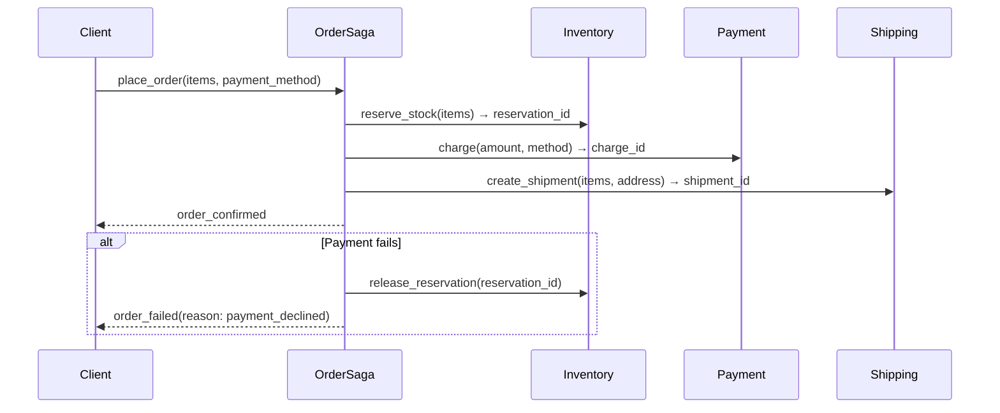

# ADR-006: Use Orchestration-Based Saga for Distributed Order Transactions

| Field | Value |
|---|---|
| **Status** | Accepted |
| **Date** | 2026-05-16 |
| **Author** | Thanh Tran |
| **Reviewers** | Backend Guild |
| **Review date** | 2027-05-16 |

---

## Context

Our e-commerce checkout flow spans three microservices: **Inventory** (reserve stock), **Payment** (charge customer), and **Shipping** (create shipment). A successful order requires all three to succeed. A failure in any step must roll back the preceding steps.

In a monolith, this would be a single database transaction. Across three services with three databases, ACID guarantees do not span service boundaries. We need a pattern that provides eventual consistency with compensating rollback.

**Scale**: ~500 orders/minute peak. Each order involves 3 service calls in sequence.

**Team constraints**: 8 engineers, three service owners. Debugging distributed failures is already a pain point.

---

## Decision

We will implement a **Saga** using an **orchestrator** (a dedicated Order Saga service) rather than choreography (event-driven, no central coordinator).

The Order Saga service:
1. Calls Inventory → reserve stock
2. Calls Payment → charge customer
3. Calls Shipping → create shipment
4. If any step fails: issues compensating calls to all completed steps in reverse order

The saga's state is persisted in a database (PostgreSQL) at each step transition. If the saga service crashes mid-saga, it recovers by reading its state and resuming or compensating from the last known step.

---

## Consequences

### Positive

- **Explicit, auditable failure handling**: the compensation logic is in one place (the orchestrator). Debugging a failed order means looking at one service's logs and state.
- **Easy to add steps**: adding a loyalty points step means adding it to the orchestrator, not publishing a new event and updating three services.
- **Clear saga state**: the order record shows exactly which step it is in. Support team can inspect and understand order status without cross-referencing multiple service logs.

### Negative

- **Orchestrator is a new service**: additional deployment and operational burden.
- **Coupling via API**: the orchestrator must call each service's API; adding a service to the saga requires changing the orchestrator.
- **Not truly atomic**: between step 1 (stock reserved) and step 3 (payment charged), there is a window where stock is reserved but not paid. Compensating calls can fail — this requires idempotency on all compensating endpoints.

### Neutral

- **Eventual consistency accepted**: a customer may see "processing" for 1-3 seconds while the saga runs. This is acceptable for checkout; real-time consistency is not required.
- **Compensating transactions must be idempotent**: each service's compensating endpoint (release_reservation, refund_charge) must handle duplicate calls safely. This is a design constraint, not a failure.

---

## Alternatives Considered

### 2PC (Two-Phase Commit)

A distributed transaction coordinator locks all participants until commit or rollback.

**Rejected because**: 2PC requires all participants to hold locks for the duration of the transaction. Across three services with network calls, this means 100-500ms of lock hold time. At 500 orders/min, this creates contention on each service's database. 2PC is also not supported by most managed databases and message queues. It doesn't compose across async boundaries.

### Choreography-based Saga (event-driven, no orchestrator)

Each service publishes events, and downstream services react. No central coordinator. Example: Inventory publishes `StockReserved` → Payment subscribes and charges → Payment publishes `ChargeCaptured` → Shipping subscribes and creates shipment.

**Rejected because**: with 3 services and 3 compensating flows, the event topology has 12+ event types and 6+ event handlers. When an order fails, the failure path is spread across 3 services' logs. Debugging requires correlating events by order ID across three systems. Our team found this unacceptable for a support-facing workflow where "why did this order fail?" must be answerable quickly. Choreography scales better for loosely coupled flows; it is harder to reason about for tightly sequenced flows like checkout.

### Synchronous chained calls without saga (no compensation)

The API gateway calls Inventory, Payment, Shipping in sequence. On failure, it returns an error. No explicit compensation.

**Rejected because**: this leaves orphaned state. A network timeout after Payment succeeds but before Shipping is called means the customer is charged but gets no shipment. Manual remediation at this scale (500 orders/min × 0.1% failure rate = 43 manual fixes/day) is not acceptable.

---

## Open Questions

- What is the retry policy for compensating calls? If `release_reservation` fails, does the saga retry indefinitely? Currently: 5 retries with exponential backoff, then alert and require manual intervention.
- How long should the saga persist state? Currently: 90 days. Orders older than 90 days are archived.
- Should the orchestrator be a separate microservice or a library embedded in the Order service? Currently: separate service, for operational clarity.

---

## References

- "Microservices Patterns" by Chris Richardson, Chapter 4 (Saga pattern)
- ADR-002: Outbox Pattern — used by Inventory, Payment, Shipping to reliably publish events to Kafka during their own compensating operations
- RFC-003: Distributed transaction strategy (archived)
