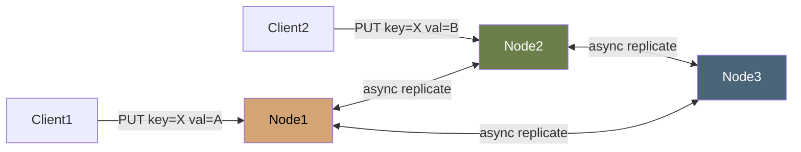

# Vector-Clock KV Store

A 3-node distributed key-value store demonstrating **vector clocks**, **conflict detection**, and **last-write-wins fallback** — the core ideas from Module 02.

## What This Demonstrates

The point isn't to build a production database. It's to make distributed-systems concepts you've read about visible and runnable.

You can:

- Write to any node — replication happens async to peers
- Observe **concurrent writes** to the same key from different nodes
- Get back both conflicting versions when reads detect concurrent writes
- See the vector clock advancing on each write

## Architecture



Each node maintains:

- A local KV store
- A vector clock per key
- A peer list and an async replication loop

## Running

```bash
docker compose up
# Three nodes running on ports 8001, 8002, 8003
```

## Demo

### Sequential writes (no conflict)

```bash
# Write to node 1
curl -X PUT http://localhost:8001/kv/greeting \
    -H 'Content-Type: application/json' \
    -d '{"value": "hello"}'

# Wait a moment for replication
sleep 1

# Read from node 2 — sees the replicated value
curl http://localhost:8002/kv/greeting
```

Response:

```json
{
  "key": "greeting",
  "values": [{ "value": "hello", "clock": { "node-1": 1 } }],
  "concurrent": false
}
```

### Concurrent writes (conflict detected)

```bash
# Write to node 1 (don't wait for replication)
curl -X PUT http://localhost:8001/kv/score \
    -d '{"value": "100"}' &

# Simultaneously write to node 2
curl -X PUT http://localhost:8002/kv/score \
    -d '{"value": "200"}' &

wait
sleep 1

# Read from node 3 — sees BOTH concurrent versions
curl http://localhost:8003/kv/score
```

Response:

```json
{
  "key": "score",
  "values": [
    { "value": "100", "clock": { "node-1": 1 } },
    { "value": "200", "clock": { "node-2": 1 } }
  ],
  "concurrent": true
}
```

The two writes have **incomparable** vector clocks. Neither happened-before the other. The store keeps both and the client must resolve.

### Sequential resolution

```bash
# Client decides: combine the two
curl -X PUT http://localhost:8003/kv/score \
    -d '{"value": "300", "based_on_clocks": [{"node-1": 1}, {"node-2": 1}]}'
```

By providing `based_on_clocks`, the client asserts "I'm reconciling these two versions." The new write supersedes both.

## What This Project Is Not

- Production-grade (no persistence, no auth, no metrics, no rate limiting)
- A complete Riak/Dynamo (we don't do anti-entropy, sloppy quorum, hinted handoff)
- Scalable beyond 3-5 nodes (no consistent hashing or sharding)

It IS a clean, readable implementation of the concepts. ~600 lines of Go.

## Vector Clock Operations Used

| Operation               | Code                      |
| ----------------------- | ------------------------- |
| Increment own node      | `clock.Increment(nodeID)` |
| Merge with peer's clock | `clock.Merge(peerClock)`  |
| Happens-before check    | `a.HappensBefore(b) bool` |
| Concurrent detection    | `a.Concurrent(b) bool`    |

## Tests

```bash
go test -v ./...
```

Tests include:

- Vector clock comparison (concurrent vs causal)
- KV merge semantics
- Replication convergence (eventual consistency)
- Concurrent write conflict detection
