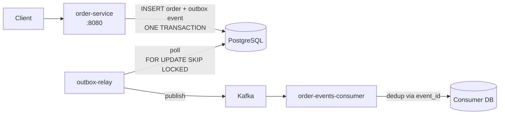

# Outbox Pattern — Postgres + Kafka

A complete implementation of the **Transactional Outbox pattern** as described in Module 05. Solves the dual-write problem when an application needs to update its database AND publish an event to Kafka atomically.

## What This Demonstrates

The dual-write problem:

```
1. App writes to PostgreSQL (success)
2. App publishes to Kafka (FAILS — network blip)
   → DB has the new state, Kafka doesn't. Drift. Pain.
```

The outbox pattern fixes this:

```
1. App writes business data AND an event to `outbox` table in ONE transaction
2. A relay (this project's "outbox-relay") polls the outbox and publishes to Kafka
3. After Kafka ack, mark the outbox row as "published"
4. Consumers must be idempotent (handle duplicates)
```

This project contains:

- **order-service**: a tiny HTTP service that creates orders + writes outbox rows in one tx
- **outbox-relay**: a separate process that polls outbox → publishes to Kafka
- **order-events-consumer**: an idempotent consumer that demonstrates the at-least-once + dedup contract
- **integration tests**: that simulate network failures and verify no events are lost

## Run

```bash
docker compose up
# Wait ~30s for Kafka to be healthy

# In another terminal:
curl -X POST http://localhost:8080/orders \
    -d '{"customer_id": "c1", "amount_cents": 9999}'

# Watch the relay logs
docker compose logs -f outbox-relay
```

## Architecture



## Key Implementation Details

### Schema

```sql
CREATE TABLE orders (
    id UUID PRIMARY KEY,
    customer_id TEXT NOT NULL,
    amount_cents BIGINT NOT NULL,
    created_at TIMESTAMPTZ NOT NULL DEFAULT NOW()
);

CREATE TABLE outbox (
    id UUID PRIMARY KEY,
    aggregate_id UUID NOT NULL,
    event_type TEXT NOT NULL,
    payload JSONB NOT NULL,
    created_at TIMESTAMPTZ NOT NULL DEFAULT NOW(),
    published_at TIMESTAMPTZ
);

CREATE INDEX idx_outbox_unpublished
    ON outbox (created_at)
    WHERE published_at IS NULL;
```

The partial index on unpublished rows keeps the polling query fast even as the outbox table grows.

### The Critical Query

```sql
SELECT id, aggregate_id, event_type, payload
FROM outbox
WHERE published_at IS NULL
ORDER BY created_at
LIMIT 100
FOR UPDATE SKIP LOCKED;
```

`FOR UPDATE SKIP LOCKED` allows multiple relay instances to poll concurrently without contention. Each grabs a different batch.

### Consumer Idempotency

```sql
INSERT INTO processed_events (event_id, processed_at)
VALUES ($1, NOW())
ON CONFLICT (event_id) DO NOTHING
RETURNING event_id;
```

If the INSERT returns a row, this is a new event — process it. If it returns no rows, it's a duplicate — skip silently.

## Tests

```bash
go test -v ./...                  # unit tests
docker compose up -d
go test -v -tags=integration ./integration/...   # integration tests
```

Integration tests use [testcontainers](https://golang.testcontainers.org/) to spin up real Postgres + Kafka for each test.

## What To Look For When Reading

1. The order-service handler writes order + outbox in **one transaction** (`tx.Commit()` is the atomic point)
2. The relay uses `FOR UPDATE SKIP LOCKED` — multiple relays scale horizontally
3. The relay publishes to Kafka **before** marking published — if marking fails, the next iteration re-publishes (at-least-once)
4. The consumer's dedup table keeps events for 7 days — long enough to cover any retry storm

## Common Variations (not in this project)

- **Debezium** instead of polling — CDC from Postgres WAL directly to Kafka. Less DB load, more ops complexity.
- **Outbox cleanup** — separate job deletes old `published_at IS NOT NULL` rows after N days.
- **Schema registry** — for evolving event schemas. Out of scope here.
