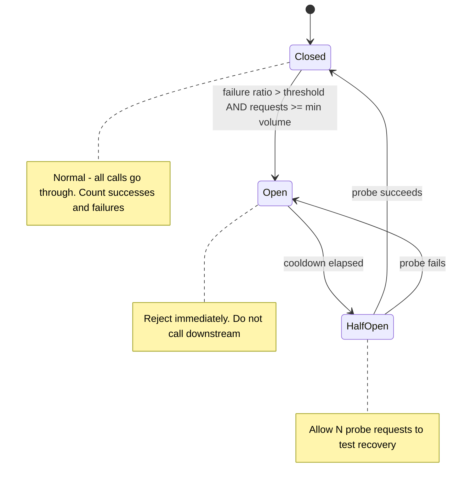

# Circuit Breaker

A production-grade circuit breaker library in Go, with chaos tests proving it works.

## What This Demonstrates

Module 06 explains why circuit breakers matter: **fail fast when downstream is broken**, rather than holding threads waiting for timeouts. This project implements the classic three-state circuit breaker:



## Library Usage

```go
breaker := circuitbreaker.New(circuitbreaker.Config{
    Name:                 "users-api",
    MinRequestThreshold:  20,                // need 20+ samples before tripping
    FailureRatioThreshold: 0.5,              // open if >=50% fail
    OpenStateDuration:    30 * time.Second,  // stay open this long
    HalfOpenMaxProbes:    3,                 // try 3 probes before closing
    WindowSize:           10 * time.Second,  // rolling window for stats
})

result, err := breaker.Do(ctx, func(ctx context.Context) (any, error) {
    return httpClient.GetUsers(ctx)
})
if errors.Is(err, circuitbreaker.ErrOpen) {
    // breaker is open — fallback fast
    return cachedUsers, nil
}
```

## Project Layout

- `circuitbreaker/` — the library itself
- `circuitbreaker/breaker_test.go` — unit tests (table-driven)
- `cmd/chaos/` — a chaos test that simulates downstream failures
- `examples/proxy/` — a tiny HTTP proxy that demonstrates real-world use

## Run

```bash
go test ./...           # unit tests
make chaos              # chaos test (~2 min)
make demo               # run the demo proxy + simulated downstream
```

## Chaos Test

The chaos test launches a fake downstream that:

1. Works for 30s (breaker should stay closed)
2. Fails 100% for 30s (breaker should open quickly)
3. Recovers (breaker should detect via half-open probes)
4. Goes flaky 30% (breaker should NOT flip — failure rate below threshold)

The test asserts the breaker's state transitions match these phases.

```
[00:00] Phase 1: healthy
[00:00] Breaker: CLOSED
[00:25] Throughput: 1230 req/s, errors: 0
[00:30] Phase 2: 100% errors
[00:31] Breaker: OPEN (tripped at 0.93 failure ratio)
[00:32] Throughput: 0 actual calls; 2400 req/s fast-failed
[01:00] Phase 3: recovered
[01:30] Breaker: HALF_OPEN (probing)
[01:31] Breaker: CLOSED (probe succeeded)
[01:31] Throughput: 1180 req/s, errors: 0
...
```

## Key Implementation Choices

### 1. Rolling window, not fixed bucket

Naive: count failures per minute. Resets every minute → spike-and-recover patterns can be missed.

This implementation: rolling window of N seconds, sub-second buckets, count both successes and failures. State decision uses ratio over the window.

### 2. Half-open probes are concurrent-safe

In half-open state, we allow up to `HalfOpenMaxProbes` concurrent probe requests. Atomic counter ensures we don't admit more than the limit. First failure → back to OPEN. All successes → CLOSED.

### 3. Min request threshold

Without a minimum sample size, even 1 failure could trip the breaker. We require `MinRequestThreshold` requests in the window before evaluating the failure ratio. Avoids flapping during low traffic.

### 4. Caller's context is respected

The `Do` method takes a context. If the context is cancelled or its deadline expires while the breaker is OPEN, you get the context's error, not `ErrOpen`. This matters for graceful shutdown.

## What's NOT in This Library

- Per-endpoint breakers (you'd wrap multiple breakers in a map)
- Hystrix-style isolation pools (that's the bulkhead pattern — separate library)
- Metrics export (add Prometheus instrumentation as you would for any pkg)
- Adaptive thresholds (interesting research area, not necessary for 95% of uses)

## Tuning Cheat Sheet

| Setting                 | Conservative | Aggressive |
| ----------------------- | ------------ | ---------- |
| `MinRequestThreshold`   | 50           | 10         |
| `FailureRatioThreshold` | 0.7          | 0.3        |
| `OpenStateDuration`     | 60s          | 5s         |
| `WindowSize`            | 30s          | 5s         |

Conservative = breaker rarely trips. Aggressive = breaker trips fast, recovers fast.

Start conservative. Tighten if downstream incidents leave you holding too many in-flight requests.
