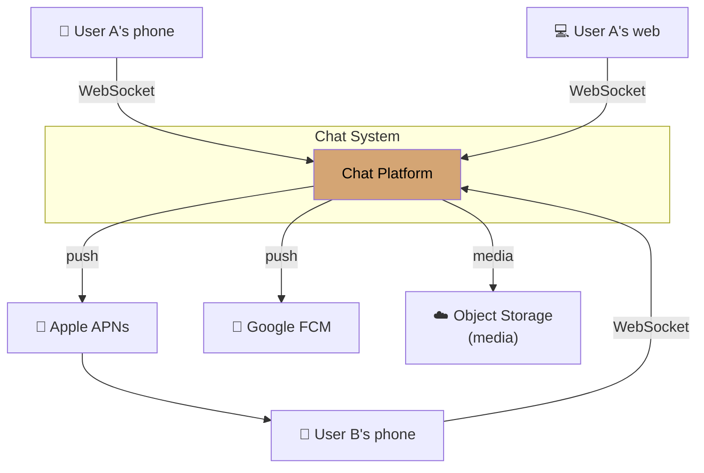
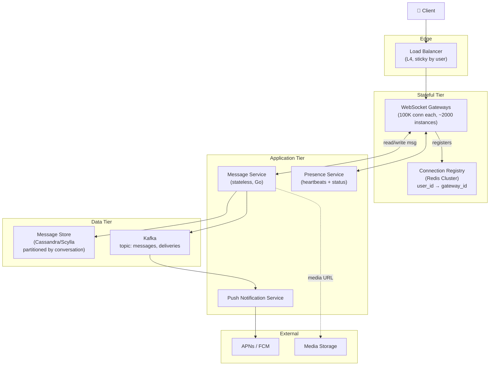
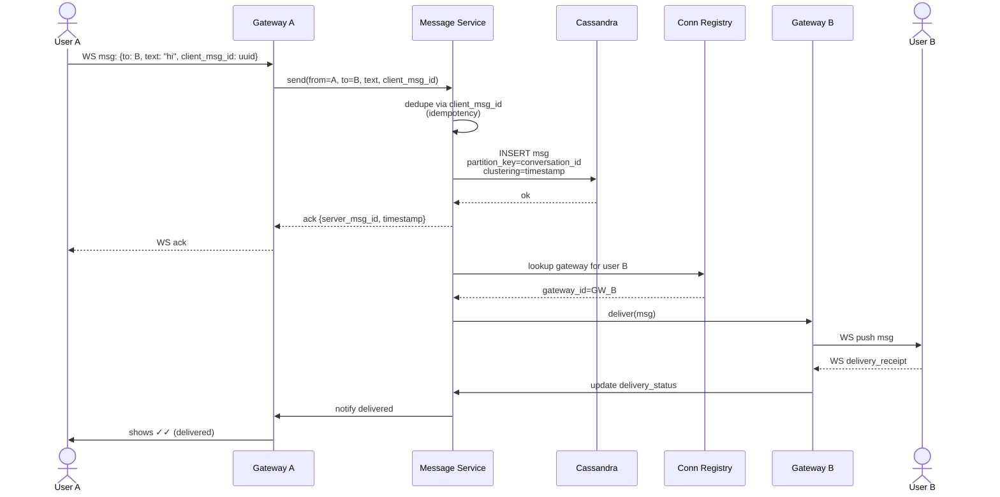
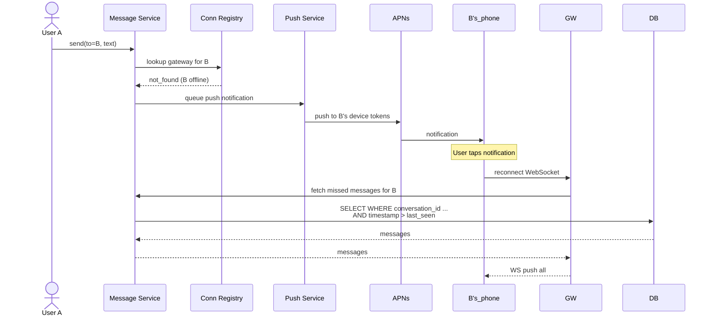
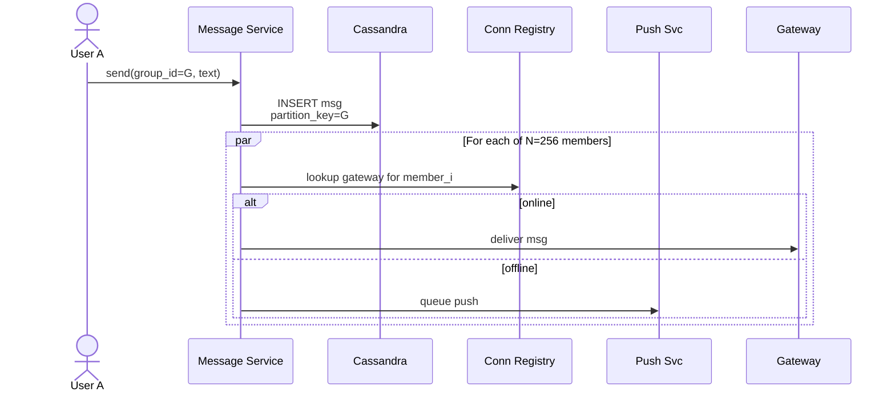

# Worked Design — Real-Time Chat System

> WhatsApp-lite. Billions of users, persistent connections, ordering matters, end-to-end encryption optional.
>
> Author: Thanh Tran · v1.0 · 2026-04-22

---

## 1. Executive Summary

We propose a multi-tier chat architecture: **WebSocket gateways** for persistent connections, **Cassandra/Scylla** for message storage (write-heavy, ordered, partitioned by conversation), **Redis** for connection state and online presence, **Kafka** for message delivery to offline-targets and analytics. Targets: 1B DAU, 1.2M messages/sec average, ~5M peak, p99 message delivery < 200ms within region.

**Key architectural decisions**:

- **Connection state distributed**: each user pinned to one gateway; central Redis map of user→gateway
- **Per-conversation ordering via partition key** (not global ordering — impossible at scale)
- **Push notifications for offline recipients** via APNs/FCM with rate-limited deduplication

---

## 2. Requirements

### 2.1 Functional

- 1:1 messages (text + media)
- Group chats up to 256 members
- Delivery receipts (sent / delivered / read)
- Online/offline status (presence)
- Multi-device sync (read on phone, read on web)
- Push notifications when recipient offline
- Message history

### 2.2 Non-functional

| Quality attribute                    | Target                              |
| ------------------------------------ | ----------------------------------- |
| **Availability**                     | 99.99% — chat is product-critical   |
| **Latency (delivery within region)** | p99 < 200ms                         |
| **Latency (cross-region)**           | p99 < 800ms                         |
| **Durability**                       | No message loss after server ack    |
| **Ordering**                         | Per-conversation ordering preserved |
| **Scale**                            | 1B DAU, 200M concurrent connections |

### 2.3 Quality Attributes Ranked

1. **Availability** — chat unavailability = product failure
2. **Latency** — sub-200ms is the magic threshold for "instant" feel
3. **Durability** — losing messages is unacceptable
4. **Cost** — at this scale, every architectural choice matters

### 2.4 Out of Scope (for v1)

- Voice/video calls (separate WebRTC stack)
- End-to-end encryption (a major design shift, addressed in v2)
- Stories/status (separate feature domain)
- Bot framework
- Anti-spam (separate platform service)

---

## 3. Capacity Estimates

| Input                         | Value                                  |
| ----------------------------- | -------------------------------------- |
| DAU                           | 1,000,000,000                          |
| Messages per user per day     | 100                                    |
| Avg message size              | 200 bytes                              |
| Read:write ratio              | ~1:1 (each message read at least once) |
| Concurrent connections (peak) | 200,000,000                            |
| Peak multiplier               | 3×                                     |

Derived:

| Metric                              | Value                            |
| ----------------------------------- | -------------------------------- |
| Total messages/day                  | 100 billion                      |
| Avg messages/sec                    | 100B / 86400 ≈ **1.2M msgs/sec** |
| Peak messages/sec                   | ~5M msgs/sec                     |
| Avg storage/day                     | 100B × 200B = **20 TB/day**      |
| Storage/year (1 copy)               | ~7.3 PB                          |
| Storage/year (with replication ×3)  | ~22 PB                           |
| Concurrent WebSocket connections    | 200M                             |
| Per gateway server (100K conn each) | 2000 gateway servers             |

**This is genuinely massive scale.** Architectural choices must reflect this.

---

## 4. System Context



---

## 5. Container View



---

## 6. Critical Flows

### 6.1 Sending a message (1:1, both online)



End-to-end latency target: p99 < 200ms. Achievable in single region; cross-region adds 80-150ms RTT.

### 6.2 Recipient offline



### 6.3 Group message (256 members)



Fanout O(256) per message — acceptable. Above 256 members (broadcast lists, channels), use different model (fan-out on read).

---

## 7. The Three Key Decisions

### 7.1 Connection State

Each user → one gateway, tracked centrally.

**Why**:

- Gateways are stateful (hold WebSocket); making them stateless adds too much per-message coordination
- "User pinned to gateway" lets us efficiently push to that user
- Central registry adds one Redis lookup but allows global routing

**Trade-off**: gateway failure forces reconnect of its users. With 2000 gateways and good balancing, blast radius per failure is ~0.05% of users.

### 7.2 Message Storage: Cassandra/Scylla, partitioned by conversation

**Schema**:

```sql
CREATE TABLE messages (
    conversation_id text,
    timestamp timeuuid,
    server_msg_id uuid,
    sender_id text,
    body text,
    PRIMARY KEY (conversation_id, timestamp)
) WITH CLUSTERING ORDER BY (timestamp DESC);
```

- **Partition key**: `conversation_id` — keeps a conversation's messages co-located, supports efficient "get last 50 messages" queries
- **Clustering key**: `timestamp` — natural per-conversation ordering
- **Use ScyllaDB** for the no-GC operational benefit at this scale (cf. [ADR-005](../adrs/adr-005-scylladb.md))

### 7.3 Ordering Guarantee

**Per-conversation ordering, not global.**

Server assigns timestamp (HLC — hybrid logical clock) on receipt. Within a conversation, messages are strictly ordered. Across conversations, no guarantee — and not needed.

Trying to globally order across all conversations would require coordination at the throughput of every user's every message — infeasible. **Choosing the right boundary is the architectural win.**

---

## 8. Multi-Device Sync

Each user can be logged in on multiple devices. Messages must reach all of them.

**Approach**: each user has a list of _device tokens_. The connection registry maps `user_id → {gateway_id_per_device}`. Message delivery iterates over all devices.

Read receipts are also multi-device: marking a message "read" on phone must update web. Achieved via the same delivery mechanism.

Storage growth: each message-delivery state is now per-device, not per-user. Manageable.

---

## 9. Failure Modes

| Failure                               | Blast radius                  | Mitigation                                                          |
| ------------------------------------- | ----------------------------- | ------------------------------------------------------------------- |
| Gateway dies                          | Its 100K users disconnect     | Auto-reconnect via LB; new gateway picks them up                    |
| Connection registry (Redis) outage    | New connections can't route   | Redis Cluster with 3+ replicas; brief degradation acceptable        |
| Cassandra/Scylla node down            | Slight write latency          | Replication factor 3; quorum writes survive 1 node loss             |
| Kafka partition outage                | Push notifications delayed    | Acceptable: messages still delivered via WebSocket; pushes catch up |
| Cross-region partition                | Cross-region delivery delayed | Buffer + retry; users in same region unaffected                     |
| Push service rate-limited by APNs/FCM | Some users miss pushes        | Retry with backoff; deduplication by message ID prevents storms     |

---

## 10. Capacity Detail

### Gateway tier

- Target: 100K WebSocket connections per gateway instance
- 200M concurrent / 100K per = **2000 instances**
- Each instance: c7g.2xlarge (8 vCPU, 16 GB RAM) — plenty of memory for connection state
- Cost: 2000 × ~$120/mo ≈ $240K/mo

### Message store (Scylla)

- Storage: 22 PB over 5 years (with replication ×3)
- Per-node: 64 TB (i4i.16xlarge with 30 TB NVMe — would need multiple)
- Cluster: ~500 nodes for 5-year retention
- Cost: ~$300K/mo

### Connection registry (Redis Cluster)

- 200M entries × ~200 bytes = 40 GB working set
- Replicated 3×, cluster of ~6 nodes
- Cost: ~$3K/mo

### Total

- Gateway + Storage + Registry + Kafka + Push + LB ≈ ~$700K/mo at this scale
- Per-user cost: ~$0.0007/mo = essentially free per user

The economics work because messaging is high-volume but low-cost-per-event.

---

## 11. What's Not Built

- **End-to-end encryption** — would require client-side key management, no server-side search, no server-side ML. Major architectural shift. Address in v2.
- **Voice / video** — different stack (WebRTC, SFU/MCU). Separate worked design.
- **Search across messages** — would need an index (Meilisearch or OpenSearch) fed from CDC. Defer until product needs it.
- **End-to-end backup** — backups must respect E2E if added; complicates iCloud/GDrive backup. Out of scope.

---

## 12. Related Material

- Module 02 (consistency, ordering, vector clocks)
- Module 03 (Cassandra/Scylla, partitioning)
- Module 05 (Kafka, delivery patterns)
- Module 06 (failure isolation, reconnection)
- Module 07 (interview classic walk-through)
- [Discord case study](../../practice/case-studies/discord-2022.md) — real-world Cassandra→Scylla
- [ADR-005](../adrs/adr-005-scylladb.md) — same migration pattern
