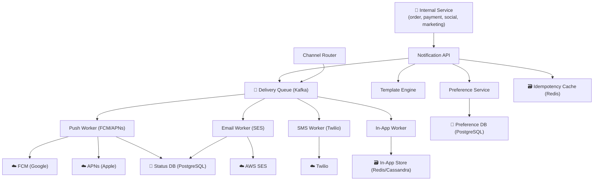
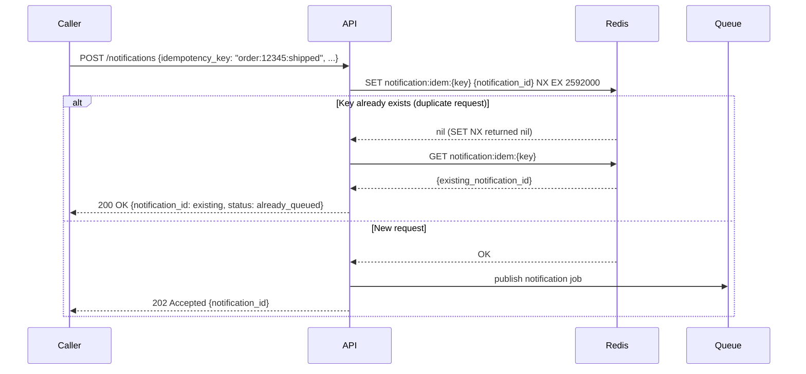
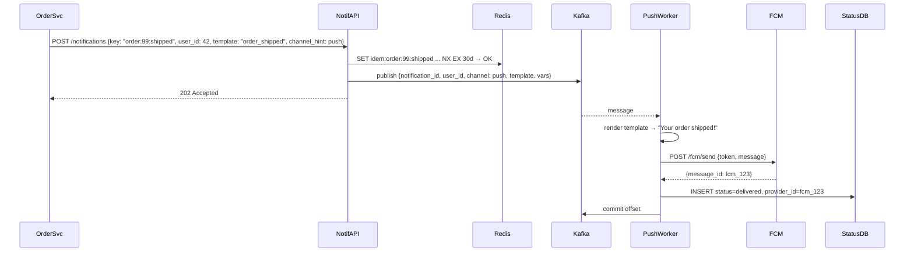
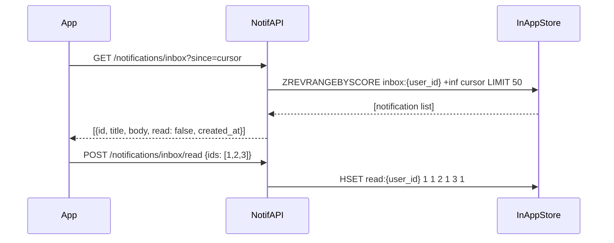

# Worked Design — Notification Service

> Multi-channel notification service (push, email, SMS, in-app). 50M notifications/day, fan-out to multiple channels. Idempotency is the crux.
>
> Author: Thanh Tran · v1.0 · 2026-05-16

---

## 1. Executive Summary

We design a notification service that routes messages from any internal system to end users across multiple channels: mobile push (FCM/APNs), email, SMS, and in-app. The service must be reliable (at-least-once delivery), idempotent (no duplicate notifications), and respect user preferences (opt-outs, channel preferences, quiet hours).

**The non-obvious insight**: the hard part is not sending a notification — any library can do that. The hard part is **idempotency at scale**: ensuring a notification is delivered exactly once even when upstream systems retry, downstream channels fail, and the service itself crashes and recovers. At-least-once delivery is the realistic guarantee; deduplication is what makes it feel like exactly-once to the user.

---

## 2. Requirements

### 2.1 Functional

- Internal services can request notifications via API: `POST /notifications` with recipient, template, channel hints, idempotency key
- Service routes to appropriate channel(s) based on user preferences
- Supports: push (FCM, APNs), email (SMTP/SES), SMS (Twilio/SNS), in-app (stored, retrieved on app open)
- User preference management: opt-out per channel, per notification category, quiet hours
- Delivery status tracking: delivered, failed, bounced, opened
- Retry with backoff for failed deliveries
- Template rendering (variable substitution, localization)

### 2.2 Non-functional

| Quality attribute | Target | Why |
|---|---|---|
| **Delivery latency** | < 5s for push; < 30s for email | Push is near-real-time; email has different expectations |
| **Reliability** | At-least-once delivery | A missed notification is worse than a delayed one |
| **Deduplication** | No visible duplicates to user | Duplicate push notifications are a trust-breaker |
| **Throughput** | 50M notifications/day, 10K burst/sec | Typical for large app; marketing campaigns cause spikes |
| **Availability** | 99.9% | Non-critical path for most apps; brief outage acceptable |

Deprioritized: real-time delivery receipts at the message level (coarse tracking is fine), multi-variate notification A/B testing.

### 2.3 Out of Scope

- Marketing campaign management / scheduling
- Notification analytics dashboard
- Rich media in push (delegated to FCM/APNs rich notification spec)
- In-app messaging / banners (separate UI concern)

---

## 3. Capacity Estimates

| Input | Value |
|---|---|
| Notifications/day | 50M |
| Peak burst (marketing campaign) | 10K/sec |
| Channel mix | 60% push, 30% email, 8% in-app, 2% SMS |
| Average template size | 2 KB rendered |
| Delivery status events/day | 50M × 3 events = 150M |

Derived:

| Metric | Value |
|---|---|
| Avg notifications/sec | 50M / 86400 ≈ **580/sec** |
| Peak burst | **10K/sec** |
| Push notifications/day | 30M → ~350/sec avg |
| Email/day | 15M → ~175/sec avg |
| Status event writes/day | 150M → **1750/sec avg** |
| Idempotency key storage (30-day window, 50 bytes/key) | 50M/day × 30 × 50B ≈ **75 GB** |

**Surprise**: the burst ratio is 10K/580 ≈ **17×**. Marketing campaigns trigger sudden spikes. The service must queue and dequeue, not process inline. A synchronous request handler that calls FCM directly will fail under campaign load.

---

## 4. System Context (C4 Level 1)



---

## 5. Component Deep-Dives

### 5.1 Idempotency Layer

Every `POST /notifications` carries a caller-supplied `idempotency_key` (e.g., `order:12345:shipped`). The API layer checks Redis before processing:



`NX EX 2592000` = set-if-not-exists, 30-day TTL. Atomic. No race condition. The 30-day window covers all reasonable retry scenarios.

### 5.2 Channel Router and User Preferences

Preference lookup happens before queuing:

```
user preferences (per user, per category):
  - push: enabled/disabled
  - email: enabled/disabled
  - sms: enabled/disabled
  - quiet_hours: {start: "22:00", end: "08:00", tz: "Asia/Singapore"}
  - categories: {transactional: all, marketing: push_only, social: email+push}
```

The router:
1. Resolves which channels are eligible given user preferences + notification category
2. Applies quiet hours (delays non-urgent notifications)
3. Publishes one Kafka message per channel (not one message for all channels)

**Why separate Kafka messages per channel**: each channel has different retry characteristics. Email bounces need different handling than FCM token expiry. Separate messages allow independent retry policies per channel.

### 5.3 Delivery Workers and Retry

Each worker (push, email, SMS) is a Kafka consumer group:

```
for each message:
  1. Render template with variables
  2. Call external provider (FCM, SES, Twilio)
  3. On success: write status=delivered to StatusDB, commit Kafka offset
  4. On retryable failure (rate limit, provider 5xx): 
       - exponential backoff (2s, 4s, 8s, 16s, max 5 retries)
       - re-publish to retry topic with attempt count + next_attempt_at
  5. On permanent failure (invalid token, hard bounce):
       - write status=failed to StatusDB
       - update user preference (disable channel if hard bounce)
       - commit offset (don't retry)
```

**Retry topic pattern**: instead of relying on Kafka consumer group offset reset (which re-processes all messages), failed messages are re-published to `notifications.push.retry` with a `deliver_after` timestamp. A separate scheduler reads this topic and re-publishes to the main topic when `deliver_after` passes. This avoids blocking the main consumer on retries.

---

## 6. Key Flows

### 6.1 Transactional Push Notification (Happy Path)



### 6.2 In-App Notification Retrieval



---

## 7. Trade-off Analysis

| Decision | Chosen | Alternative | Why |
|---|---|---|---|
| **Delivery guarantee** | At-least-once + client-side idempotency | Exactly-once | True exactly-once requires distributed transactions across Kafka + provider API + DB. Impossible with external providers (FCM has no idempotency). Deduplication window in Redis makes it appear exactly-once to users. |
| **Retry mechanism** | Separate retry topic with delay | Kafka consumer offset reset | Offset reset re-processes all messages, blocking new notifications. Retry topic allows normal messages to flow while retries are delayed. |
| **Preference storage** | PostgreSQL | Redis | Preferences change rarely (100 writes/sec), need complex queries (category + quiet hours + channel). PostgreSQL is the right fit; Redis is not needed here. |
| **In-app store** | Redis sorted set | Cassandra | In-app notifications are recent (last 30 days), per-user, high-read. Redis sorted set with score=timestamp is natural. Cassandra would add operational complexity for this access pattern. |
| **Template rendering** | Server-side | Client-side (send variables) | Server-side allows centralised template management, A/B testing, locale support. Client-side requires all clients to have current templates — version skew is a problem. |

---

## 8. Failure Modes

| Failure | Impact | Mitigation |
|---|---|---|
| FCM / APNs unavailable | Push notifications delayed | Retry with backoff; max 5 attempts over ~2 min; after that, mark failed. User sees notification on next app open via in-app fallback. |
| Redis (idempotency) unavailable | Duplicate notifications possible | Graceful degradation: allow through without idempotency check; prefer duplicates over message loss for transactional notifications |
| Kafka consumer lag spike | Notifications delayed | Scale consumer group horizontally; monitor lag with alerting at >30s |
| Invalid FCM token | Push fails permanently | FCM returns `InvalidRegistration`; worker marks token invalid, disables push for that device |
| Email hard bounce | Email fails permanently | SES bounce webhook → disable email channel for user; write to preference DB |
| Template rendering failure | Notification skipped | Catch rendering errors; fall back to default template; log for fixing |

---

## 9. Rollout Strategy

1. **Phase 1**: Push-only for transactional notifications. Prove idempotency and retry logic.
2. **Phase 2**: Add email channel. Implement preference service.
3. **Phase 3**: In-app notifications. Add quiet hours logic.
4. **Phase 4**: SMS channel (highest cost per message; add last).
5. **Phase 5**: Marketing campaign support (bulk send, rate limiting per campaign to stay within provider rate limits).

---

## 10. Open Questions

- What is the deduplication window? 30 days chosen — is that too long for Redis memory? At 75 GB it's manageable.
- How do we handle users with multiple devices? FCM has per-device tokens — should we send to all devices or just the most recently active?
- Quiet hours: what about urgent notifications (security alerts)? Need a `priority` field that bypasses quiet hours.
- Unsubscribe links in email: how do we handle one-click unsubscribe (RFC 8058)? Required for high-volume senders since 2024.

---

## 11. ADR References

- ADR-002 (Outbox Pattern) → used by callers to guarantee they publish notifications even on crash
- ADR-001 (PostgreSQL) → preference store and status DB
- ADR-008 (Caching Strategy) → cache-aside for user preferences (cache TTL 5 min)
