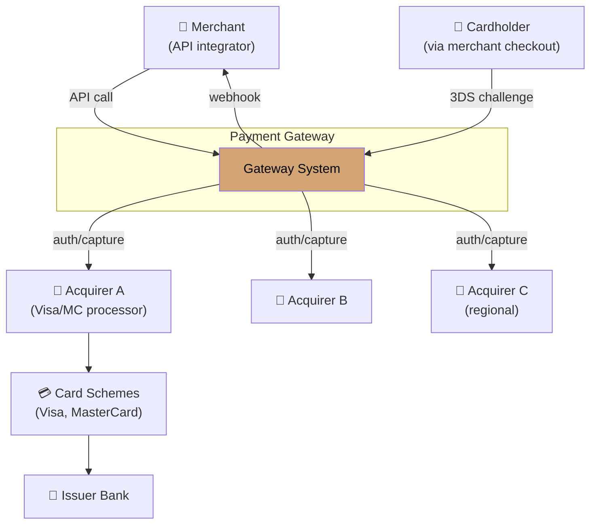
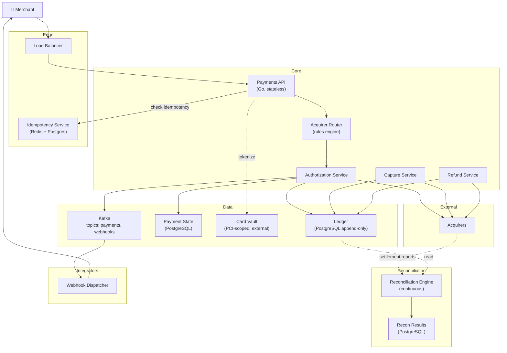
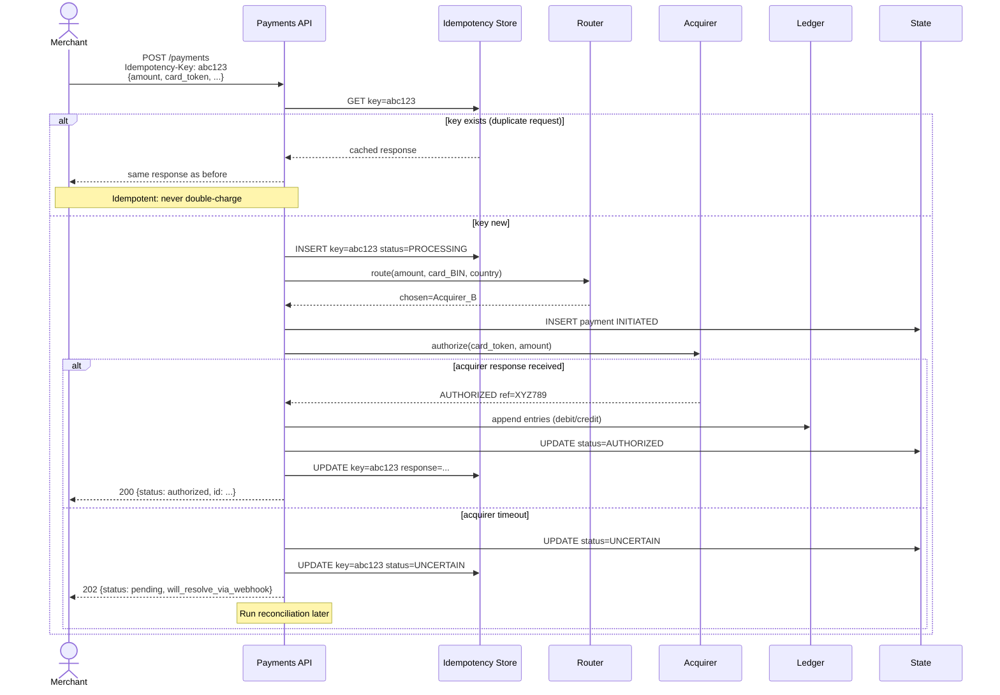
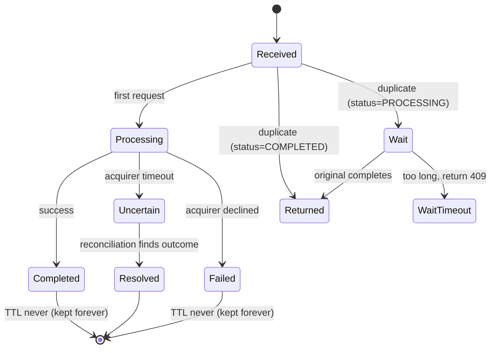
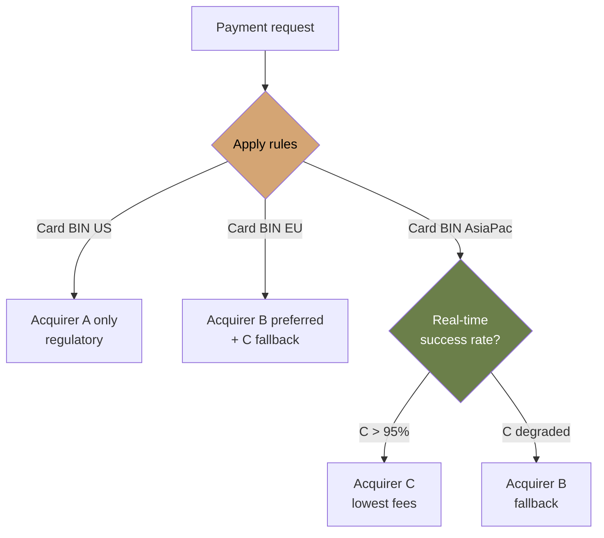
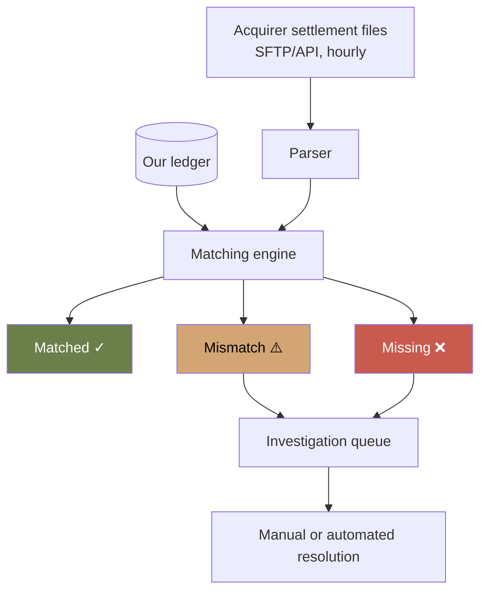

# Worked Design — Payment Gateway

> Multi-acquirer payment processing with idempotent end-to-end semantics. Inspired by Stripe, Adyen, and the painful reality of money systems.
>
> Author: Thanh Tran · v1.0 · 2026-04-24

---

## 1. Executive Summary

We propose a payment gateway that routes transactions across multiple acquirer banks based on cost, success rate, and geography. Critical properties: **end-to-end idempotency** (network retries never double-charge), **double-entry ledger** as source of truth, **reconciliation** as a first-class architectural concern.

**Key architectural decisions**:

- **Idempotency key required on every payment request** — stored, never expired
- **Ledger is append-only** with double-entry bookkeeping; balances are derived
- **Acquirer routing** based on real-time success rates, fees, BIN-level rules
- **Reconciliation engine** as continuous, not batch-end-of-day

This is the system where **getting the boring parts right matters more than novelty.** Money systems fail loudly; the cost of a single duplicate charge can exceed a month of engineering salary.

---

## 2. Requirements

### 2.1 Functional

- Accept card payments (credit/debit) via API
- Route to one of N acquirer banks based on rules
- Handle authorization, capture, refund, void
- 3D Secure (SCA) flow when required
- Webhook callbacks to merchants
- Settlement reports
- Reconciliation between internal ledger and acquirer reports

### 2.2 Non-functional

| Quality attribute         | Target                                                         |
| ------------------------- | -------------------------------------------------------------- |
| **Correctness**           | Zero double-charges, zero lost charges. This is THE attribute. |
| **Availability**          | 99.99%                                                         |
| **Authorization latency** | p99 < 1s (constrained by acquirer)                             |
| **Auditability**          | Every state change traceable, indefinite retention             |
| **Regulatory compliance** | PCI-DSS, SCA (PSD2), GDPR                                      |

Note: latency is _not_ the top concern. **Correctness is.** A payment that's 200ms slower but never wrong is better than 50ms but occasionally wrong.

### 2.3 Quality Attributes Ranked

1. **Correctness** — money correctness is non-negotiable
2. **Auditability** — required for compliance + dispute resolution
3. **Availability** — merchants depend on us
4. **Latency** — affects conversion but acquirers dominate
5. **Throughput** — modest by absolute terms

### 2.4 Out of Scope

- Card storage (separate PCI-scoped vault service)
- Fraud detection (separate service with ML pipeline)
- Currency conversion (handled at acquirer or upstream)
- Customer dashboard (separate web service)

---

## 3. Capacity Estimates

| Input                       | Value             |
| --------------------------- | ----------------- |
| Transactions/day (mature)   | 50 million        |
| Peak multiplier             | 4× (Black Friday) |
| Average value               | $50               |
| Refund rate                 | ~3%               |
| Authorization → capture lag | minutes to days   |

Derived:

| Metric                    | Value                       |
| ------------------------- | --------------------------- |
| Avg transactions/sec      | ~580/sec                    |
| Peak transactions/sec     | ~2300/sec                   |
| Total ledger entries/year | ~36B (each tx = ~4 entries) |
| Annual ledger storage     | ~10TB                       |

**Modest scale by absolute numbers.** What makes this hard isn't scale — it's correctness invariants.

---

## 4. System Context



---

## 5. Container View



---

## 6. Critical Flows

### 6.1 Authorization with Idempotency



**The "uncertain" state is critical.** If the acquirer times out, **we don't know** whether the authorization succeeded on their side. We do NOT retry blindly. We mark uncertain, return 202, and let reconciliation discover the truth.

### 6.2 Idempotency Key Lifecycle



**Key never expires.** Storing the result forever is cheaper than the cost of a single double-charge.

### 6.3 Acquirer Routing



Routing inputs:

- **Card BIN** (first 6 digits → issuer country)
- **Merchant region**
- **Real-time success rate** (sliding window per acquirer)
- **Fee schedule** per acquirer
- **Hard rules** (regulatory: e.g., domestic cards must route to domestic acquirer)

The routing engine pulls from a configuration service (updated hourly) plus real-time metrics from authorization service.

---

## 7. The Ledger

The ledger is the source of truth. Everything else (status fields, balances, reports) is derived.

### 7.1 Schema (simplified)

```sql
CREATE TABLE ledger_entries (
    id BIGSERIAL PRIMARY KEY,
    transaction_id UUID NOT NULL,        -- groups entries of one tx
    account_id TEXT NOT NULL,            -- e.g., "merchant:M-123", "acquirer:A", "fees"
    direction VARCHAR(6) NOT NULL,       -- 'DEBIT' or 'CREDIT'
    amount_cents BIGINT NOT NULL,
    currency CHAR(3) NOT NULL,
    occurred_at TIMESTAMPTZ NOT NULL,
    created_at TIMESTAMPTZ NOT NULL DEFAULT NOW(),
    metadata JSONB,
    -- NO UPDATE, NO DELETE — append only
    -- Enforced by absence of UPDATE/DELETE permissions on this table
);

CREATE INDEX idx_ledger_account ON ledger_entries (account_id, occurred_at DESC);
CREATE INDEX idx_ledger_tx ON ledger_entries (transaction_id);
```

### 7.2 Double-Entry Bookkeeping

Every transaction has at least 2 entries summing to zero:

```
Authorization $100 from Cardholder C to Merchant M:
- DEBIT  C  100  (cardholder owes us)
- CREDIT M  100  (we owe merchant)
Total: 0 ✓

Capture (same):
- DEBIT  M_pending  100
- CREDIT M_settled  100

Fee 2.9% + $0.30:
- DEBIT  M_settled  2.90
- CREDIT fees       2.90
- DEBIT  M_settled  0.30
- CREDIT fees       0.30
```

Balances are derived:

```sql
SELECT SUM(CASE WHEN direction='CREDIT' THEN amount ELSE -amount END)
FROM ledger_entries WHERE account_id = $1;
```

Materialized views can cache balances for performance but the ledger is authoritative.

### 7.3 Why Append-Only

- **Audit**: every state visible at any historical point
- **Recovery**: corrupted aggregate? Recompute from entries
- **Compliance**: regulators demand this
- **Debugging**: "what happened to transaction X?" is always answerable

Mutating ledger entries is a fireable offense.

---

## 8. Reconciliation

The single largest source of bugs in real-world payment systems: **mismatches between your ledger and the acquirer's records.**

### 8.1 Sources of Mismatch

| Type                  | Example                                           |
| --------------------- | ------------------------------------------------- |
| Missing on our side   | Acquirer captured payment we don't have record of |
| Missing on their side | We marked authorized; they have no record         |
| Amount mismatch       | $99.99 vs $100.00 (cent-level rounding)           |
| Status mismatch       | We say "completed", they say "voided"             |
| Timing mismatch       | Late settlement; we report different period       |

### 8.2 Reconciliation Engine



Most matches happen automatically. The interesting work is what to do with mismatches.

**Threshold**: ≥0.1% mismatch rate → page operations team. Below that, queue for daily review.

### 8.3 Reconciliation Patterns

- **Continuous, not end-of-day**: small batches every 15 min better than one big batch
- **Comparison key**: (acquirer_ref, our_tx_id) — both maintained
- **Aged mismatches**: if a mismatch is unresolved after 48 hours, escalate
- **Recovery procedure**: documented for each known mismatch type

---

## 9. Trade-off Analysis

### 9.1 Synchronous vs Async API

**Chose synchronous for authorization** (return final status if possible).

Async would simplify our system but force every merchant to handle webhooks for the success path, which kills conversion. Merchants want a synchronous answer.

We use async (202 + webhook) **only when the acquirer is uncertain**.

### 9.2 Single vs Multi-acquirer

Single acquirer simpler. Multi-acquirer:

- **Higher availability**: one acquirer down → route to another
- **Better economics**: route by fee
- **Geographic coverage**: regional acquirers with better local approval rates

Trade-off: complexity. Routing rules, per-acquirer integrations, per-acquirer reconciliation. Worth it at our scale.

### 9.3 Ledger Storage

**Chose PostgreSQL** over Cassandra/Scylla:

- ACID semantics for ledger writes are valuable
- Joins for reconciliation make analytical queries easy
- 10TB/year is comfortable for partitioned PG
- Operational familiarity

If we hit Postgres limits (unlikely until ~100TB/year), we'd shard by `account_id` prefix.

### 9.4 Idempotency Storage

Two-tier: **Redis for recent (24h) + Postgres for archive (forever).**

- Fast path: Redis lookup, ~1ms
- Slow path: Postgres lookup, ~10ms
- Eviction: Redis on its own LRU; Postgres never

Cost is trivial vs the cost of one duplicate charge.

---

## 10. Failure Modes

| Failure                 | Blast radius                        | Mitigation                                                                          |
| ----------------------- | ----------------------------------- | ----------------------------------------------------------------------------------- |
| One acquirer fully down | Some transactions fail              | Router shifts traffic to other acquirers                                            |
| All acquirers slow      | All transactions slow               | Circuit breaker → fail fast; merchant decides retry policy                          |
| Ledger DB write failure | Authorization stops                 | Multi-AZ + read replicas; promote on primary failure                                |
| Idempotency store down  | Risk of double-charge               | API rejects writes (refuse to serve unsafely) — better to be unavailable than wrong |
| Reconciliation lag      | Mismatches accumulate               | Alert at > 1hr lag; on-call investigates                                            |
| Webhook recipient slow  | Merchant gets delayed notifications | DLQ + exponential backoff; max 24h retry                                            |
| Bad deploy              | New tx might be incorrect           | Canary 1% → 5% → 25% → 100% over hours; auto-rollback on error rate spike           |

**Universal rule for this system**: when in doubt about correctness, **refuse to serve**. An outage we recover from is better than a financial bug we discover months later.

---

## 11. Security & Compliance

- **PCI-DSS scope minimization**: never store PANs (Primary Account Numbers). Use tokenization via separate PCI-scoped vault.
- **Card data flow**: card → vault → token → our system. We never see raw card numbers.
- **Logging**: zero raw card data. Aggressive log redaction.
- **Encryption**: TLS everywhere. Field-level encryption for sensitive metadata.
- **SCA (PSD2)**: 3D Secure flow when required for EEA cards.
- **Access**: production access logged; ledger has no UPDATE/DELETE grants for app users.
- **Audit log**: every API call, every state change, retained for 7 years.

---

## 12. What's NOT in v1

- **Fraud detection ML** — separate service receives every tx event; decisions consumed via API at authorization time
- **3DS2 in-line flow** — uses redirect for now; in-line is v2
- **Marketplace splits** — multi-party transactions deferred
- **Subscriptions** — recurring billing is a separate domain service that calls us
- **Local payment methods** (iDEAL, SEPA, Alipay) — same architectural patterns but different integration shape

---

## 13. Architectural Lessons

This system embodies several themes from the course:

- **Module 01 (constraints)**: Correctness ranked above latency or throughput. That ranking shapes everything.
- **Module 05 (idempotency)**: End-to-end idempotency, not just at API boundary
- **Module 05 (sagas)**: Multi-step flows (authorize → capture → refund) modeled as sagas with explicit compensations
- **Module 06 (failure modes)**: "Refuse to serve when uncertain" — preserving correctness over availability
- **Module 06 (reconciliation)**: First-class architectural concern, not an afterthought
- **Module 07 (interview classic)**: This is the "design a payment system" prompt taken seriously
- **Module 08 (audit + compliance)**: Architecture must support regulatory requirements

> **The most important sentence**: in money systems, the cost of being unavailable is much smaller than the cost of being wrong. Architect accordingly.

---

## 14. Related Material

- Module 05 — sagas, idempotency, outbox
- Module 06 — failure modes, blast radius
- [ADR-001 PostgreSQL OLTP](../adrs/adr-001-postgresql-oltp.md) — same DB rationale applies to ledger
- [ADR-002 Outbox pattern](../adrs/adr-002-outbox-pattern.md) — webhook delivery uses it
- [Knight Capital case study](../../practice/case-studies/knight-capital-2012.md) — what happens when money systems lack safeguards
