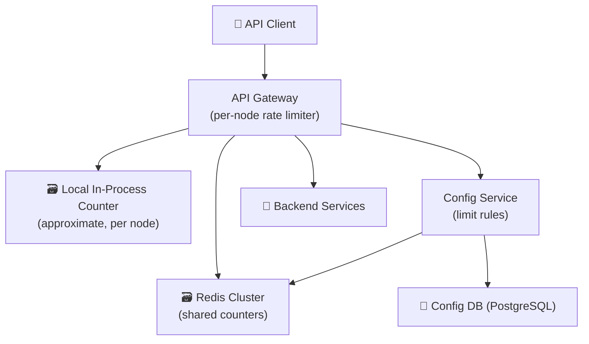
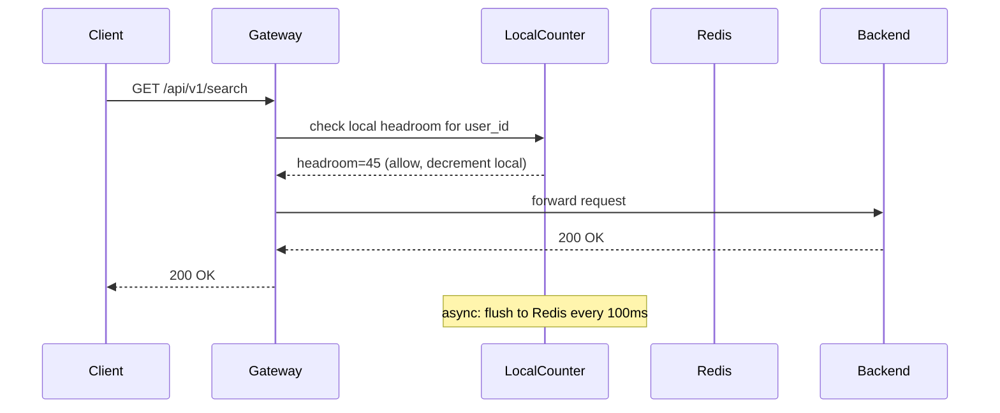
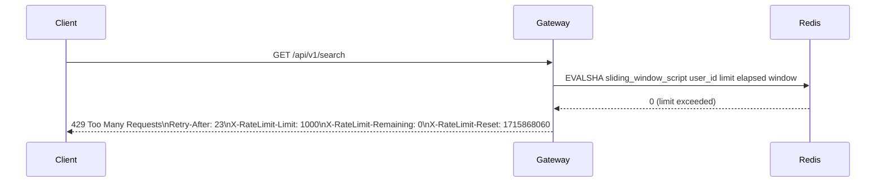
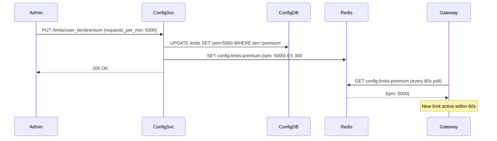

# Worked Design — Distributed Rate Limiter

> API rate limiter at gateway scale. 100K requests/sec, multi-region, per-user and per-IP limits. Approximate counting is the key trade-off.
>
> Author: Thanh Tran · v1.0 · 2026-05-16

---

## 1. Executive Summary

We design a distributed rate limiter that enforces request quotas per user and per IP at API gateway scale (100K req/sec). The rate limiter must be low-latency (< 5ms overhead per request), globally consistent enough to prevent abuse, and degrade gracefully when the rate limiter itself is unavailable.

**The non-obvious insight**: **strict global rate limiting is impossible at this scale without unacceptable latency**. A globally consistent counter requires coordination across nodes, which adds round-trip latency on every request. The practical solution is **approximate counting**: allow small overruns in exchange for local-only counter operations. A 5% overshoot is a fine trade; the alternative is 50ms added to every API response.

---

## 2. Requirements

### 2.1 Functional

- Enforce per-user rate limits (e.g., 1000 requests/minute)
- Enforce per-IP rate limits (e.g., 100 requests/minute for unauthenticated)
- Return `429 Too Many Requests` with `Retry-After` header when limit exceeded
- Support multiple algorithms: token bucket (burst-friendly) and sliding window (strict)
- Per-endpoint limit overrides (e.g., `/search` at 10 req/sec, `/upload` at 1 req/sec)
- Admin API to adjust limits dynamically without redeployment

### 2.2 Non-functional

| Quality attribute | Target | Why |
|---|---|---|
| **Added latency** | < 5ms p99 | Rate limiter is in the critical path of every request |
| **Accuracy** | ±5% of limit | Exact counting requires coordination; approximate is acceptable for abuse prevention |
| **Availability** | 99.99% | If rate limiter is down, fail open (allow requests through) |
| **Throughput** | 100K req/sec | Gateway-class scale |
| **Limit propagation** | < 60s | Dynamic limit changes reach all nodes within 1 minute |

Deprioritized: per-request priority queuing, tenant-level burst credits, exact-to-the-request accuracy.

### 2.3 Out of Scope

- Request queuing / backpressure (we reject, not queue)
- DDoS mitigation (layer 3/4 — handled at network level)
- Cost-based rate limiting (compute resources, not request counts)

---

## 3. Capacity Estimates

| Input | Value |
|---|---|
| Peak requests/sec | 100K |
| Unique users/day (active) | 10M |
| Unique IPs/day | 50M |
| Rate limit window | 60 seconds (sliding) |
| Counter entry size | ~50 bytes (key + count + timestamps) |

Derived:

| Metric | Value |
|---|---|
| Counter reads/sec | 100K (one per request) |
| Counter writes/sec | 100K (one per request) |
| Active counters in window | 10M users + 50M IPs ≈ 60M entries |
| Memory for counters (60M × 50B) | **3 GB** |
| Redis ops/sec | 200K (read + write per request) |
| Per-node Redis latency | ~0.1ms → well within 5ms budget |

**Surprise**: the counter dataset fits in a single large Redis instance (3 GB RAM). You don't need a cluster for storage — you need it for throughput. 200K Redis ops/sec requires ~2-4 Redis nodes to stay within per-node throughput limits.

---

## 4. System Context (C4 Level 1)



---

## 5. Component Deep-Dives

### 5.1 Sliding Window Counter in Redis

**Naive fixed window** (e.g., count resets at minute boundary) has a well-known double-spend problem: a user can make 1000 requests at 23:59 and 1000 more at 00:00 — 2000 in two seconds.

**Sliding window log** (store timestamp of every request) is accurate but memory-intensive: 1000 timestamps per user × 10M users = 80 GB.

**Sliding window counter** (compromise): divide the window into sub-windows, approximate sliding position by weighted average of current and previous sub-window counts.

```
sliding_count = prev_window_count × (1 - elapsed_fraction) + current_window_count

Example: limit=1000/min, current time = 23:59:30 (30s into minute)
  elapsed_fraction = 30/60 = 0.5
  prev_window_count = 800, current_window_count = 600
  sliding_count = 800 × 0.5 + 600 = 1000 → at limit
```

Redis Lua script (atomic, single round-trip):

```lua
local key_current = KEYS[1]   -- "rl:{user_id}:2026-05-16T14:00"
local key_prev    = KEYS[2]   -- "rl:{user_id}:2026-05-16T13:59"
local limit       = tonumber(ARGV[1])
local elapsed     = tonumber(ARGV[2])  -- seconds elapsed in current window
local window      = tonumber(ARGV[3])  -- window size in seconds (60)

local prev_count    = tonumber(redis.call('GET', key_prev) or 0)
local current_count = tonumber(redis.call('GET', key_current) or 0)

local sliding = prev_count * (1 - elapsed / window) + current_count

if sliding >= limit then
  return 0  -- reject
end

redis.call('INCR', key_current)
redis.call('EXPIRE', key_current, window * 2)
return 1  -- allow
```

**One atomic Lua call per request** = one Redis round trip = ~0.1ms. Well within the 5ms budget.

### 5.2 Local Approximate Counting (Gossip / Token Bucket Hybrid)

For the highest-traffic endpoints, even 0.1ms to Redis per request adds up. **Local counters** reduce Redis calls by batching:

```
local_count[user_id] incremented on every request

every 100ms:
  flush local increments to Redis (INCRBY)
  fetch current total from Redis
  update local "headroom" = limit - total
  allow requests locally until headroom is exhausted
```

**Trade-off**: the node can allow up to `local_headroom` requests before the next sync. With N gateway nodes and 100ms sync intervals, worst-case overshoot = N × requests_in_100ms. At 10 nodes and 100 req/sec per user, overshoot ≤ 10 × 10 = 100 requests. For a 1000 req/min limit, that's 10% overshoot — borderline for a strict limit, acceptable for abuse prevention.

**When to use local vs Redis**:
- Local counting: high-QPS authenticated users, endpoint-level rate limits
- Redis counting: per-IP (anonymous, distributed abuse), low-QPS but critical limits

### 5.3 Token Bucket for Burst Tolerance

Some endpoints benefit from burst: a user can do 60 requests in 1 second but no more than 3600 in an hour. Fixed/sliding window penalises this. Token bucket allows it:

```
bucket state: {tokens: float, last_refill: timestamp}
refill_rate: 1 token/second (for 3600/hr limit)
max_tokens: 60 (burst capacity)

on request:
  elapsed = now - last_refill
  tokens = min(max_tokens, tokens + elapsed × refill_rate)
  last_refill = now
  if tokens >= 1:
    tokens -= 1
    allow
  else:
    reject, retry_after = (1 - tokens) / refill_rate
```

Stored in Redis as a hash. Updated with a Lua script (atomic read-modify-write). `retry_after` is computed server-side and returned in the `Retry-After` header.

---

## 6. Key Flows

### 6.1 Request Allowed



### 6.2 Request Rejected



### 6.3 Config Change Propagation



---

## 7. Trade-off Analysis

| Decision | Chosen | Alternative | Why |
|---|---|---|---|
| **Counting accuracy** | Approximate (±5-10% overshoot) | Strict global counter | Strict requires consensus per request. At 100K req/sec × 0.5ms coordination latency = 50ms overhead. Unacceptable. ±5% overshoot is fine for abuse prevention. |
| **Algorithm** | Sliding window counter (default) + token bucket (burst) | Fixed window | Fixed window has double-spend flaw. Sliding window counter is only marginally more complex with significantly better accuracy. |
| **Failure mode** | Fail open (allow requests if Redis unavailable) | Fail closed (reject all) | Rate limiter unavailability should not take down the API. Failing open for <30s during Redis recovery is acceptable. Failing closed means total API outage. |
| **Counter storage** | Redis | In-process only | In-process counters are per-node — 10 nodes means 10× the limit effectively. Redis provides shared state. In-process is kept only as a local approximation layer for performance. |
| **Lua scripts** | Yes | WATCH/MULTI/EXEC | Lua scripts are atomic and server-evaluated (no round trips for compare-and-swap). MULTI/EXEC requires client-side retry on WATCH conflict — higher latency and complexity. |

---

## 8. Failure Modes

| Failure | Impact | Mitigation |
|---|---|---|
| Redis node failure | Rate limiting becomes per-node approximate | Redis Cluster auto-failover; during failover window, use local counters only (fail open, tolerate overshoot) |
| Redis Cluster split brain | Some nodes count independently | Cluster stops accepting writes on minority side; requests fail open for those counters |
| Config service unavailable | Gateways use cached limits (60s TTL) | Stale limits are better than no limits; 60s staleness acceptable |
| Lua script timeout | Request falls through without rate check | Script timeout → fail open for that request; log and alert |
| Local counter flush failure | Undercounting in Redis | Next flush corrects via INCRBY; short window of under-enforcement |

---

## 9. Rollout Strategy

1. **Phase 1**: Deploy Redis-based sliding window for per-user limits on authenticated endpoints only. Measure added p99 latency.
2. **Phase 2**: Add per-IP limits for unauthenticated endpoints.
3. **Phase 3**: Enable local counter approximation for high-traffic endpoints. Validate overshoot rate stays < 10%.
4. **Phase 4**: Add token bucket for burst-tolerant endpoints (uploads, search).
5. **Phase 5**: Admin API for dynamic limit management. Enable per-endpoint overrides.

---

## 10. Open Questions

- What is the right overshoot tolerance? 5-10% was chosen; requires tuning based on actual abuse patterns observed.
- Should limits be tenant-level (organization) rather than user-level? B2B APIs often need this. Requires a quota pool abstraction above the user counter.
- How do we handle legitimate burst from mobile apps (e.g., on app foreground, client retries 50 cached requests simultaneously)? Token bucket helps, but client-side retry jitter is also needed.
- Distributed tracing: how do we propagate rate limit decisions into traces for debugging?

---

## 11. ADR References

- ADR-008 (Caching Strategy) → local counter as approximate cache of Redis counter; TTL = 100ms sync interval
