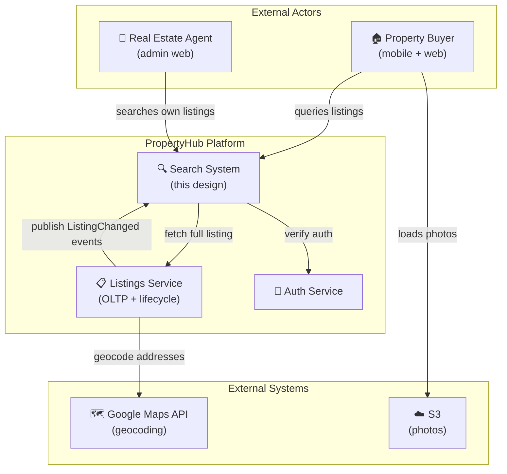
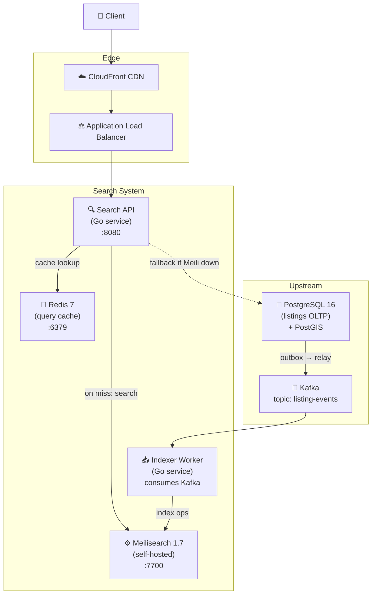
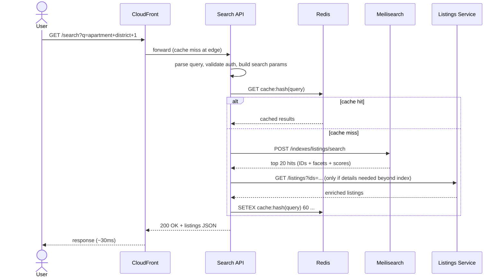
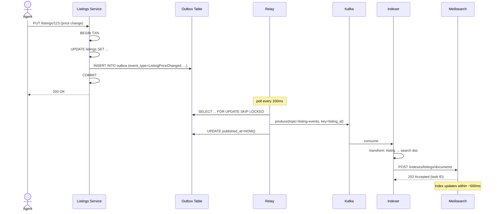
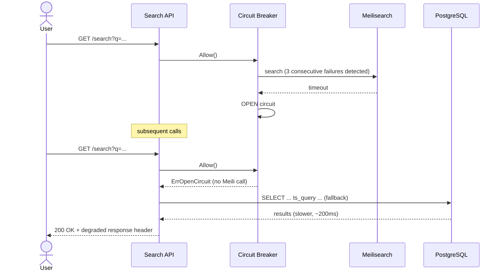
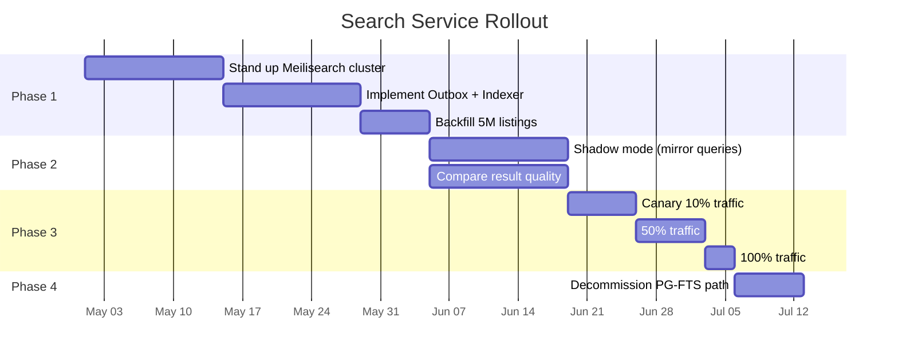

# Worked Design — PropertyHub Real Estate Search

> A complete architecture proposal for the property search system. ~5M listings, ~5K peak QPS, instant-search latency targets.
>
> Author: Thanh Tran · v1.0 · 2026-04-15

---

## 1. Executive Summary

We propose a hybrid search architecture for PropertyHub listings: **Meilisearch** as the primary search index, **PostgreSQL with PostGIS** as the source of truth, **Redis** as a hot-result cache, and the **Outbox Pattern** to keep the search index in sync with the OLTP database. The design targets p95 query latency < 50ms at 5K QPS, supports geo + faceted search across 5M listings, and is operable by a 2-engineer search team. Total infrastructure cost projected ~$1,200/month at year-1 scale.

The non-obvious decisions:

- **Meilisearch over OpenSearch** — operational simplicity wins at our scale (full benchmark in [ADR-004](../adrs/adr-004-meilisearch.md))
- **Outbox-driven indexing, not CDC** — clean domain events, decoupled from DB schema ([ADR-002](../adrs/adr-002-outbox-pattern.md))
- **No real-time recommendations in v1** — explicit out-of-scope; covered by separate roadmap item

---

## 2. Requirements

### 2.1 Functional

**Must have:**

- Full-text search over listing title, description, address, agent name
- Geo queries: within radius (default 5 km), within bounding box, near location
- Faceted filters: property type, price range, bedrooms, listing status, neighborhood
- Sorting: relevance (default), price asc/desc, date listed (newest first), distance
- Typo tolerance: "appartment" → finds "apartment"
- Prefix matching: "Times Squa" → suggests "Times Square"
- Instant search (search-as-you-type) on mobile and web
- Multi-language: English (primary), Vietnamese, Chinese

**Nice to have (v1.1+):**

- Saved searches with alerts
- Personalized ranking using user history
- Semantic search ("affordable family home near schools")

### 2.2 Non-functional

| Quality attribute | Target                    | Justification                          |
| ----------------- | ------------------------- | -------------------------------------- |
| p95 query latency | < 50ms                    | Instant-search UX on mobile            |
| p99 query latency | < 150ms                   | Worst-case still feels responsive      |
| Indexing latency  | < 5 seconds               | "Just listed" must appear quickly      |
| Availability      | 99.9%                     | Search down = product effectively down |
| Throughput        | 5K QPS sustained, 8K peak | Based on 50M searches/day projection   |
| Index size        | ~10 GB at 5M listings     | Capacity planning                      |
| Cost ceiling      | < $2K/month infra         | Stakeholder budget                     |

### 2.3 Quality Attribute Ranking

Top 3, with rationale:

1. **Latency** — instant-search UX requires sub-50ms p95
2. **Availability** — search is the front door; outage = lost users
3. **Cost-efficiency** — we're a small business; can't afford OpenSearch-scale spend without proportionate value

Explicitly **deprioritized**:

- **Result freshness < 1 second** — our use case tolerates 1–5 second indexing lag
- **Sophisticated relevance tuning** — start with library defaults; tune based on click signals later

### 2.4 Out of Scope (v1)

These are _deliberate_ non-goals — surfaced explicitly to prevent scope creep:

- Real-time personalized ranking (no user features in ranking)
- Voice search
- Multi-region serving (single region SG; MY listings replicated to SG index)
- Search analytics dashboards beyond basic query logging
- Admin search UI (separate tool)

### 2.5 Constraints

- **Hard**: data residency — listings data must remain in AWS SG/MY regions
- **Hard**: compliance — audit log of all search queries by agent accounts (B2B side)
- **Soft**: team of 2 engineers; can't operate complex distributed stores
- **Self-imposed**: Go + AWS managed where possible

---

## 3. Capacity Estimates

Inputs:

| Variable                 | Value      |
| ------------------------ | ---------- |
| Active listings          | 5,000,000  |
| New/updated listings/day | 500,000    |
| Searches/day             | 50,000,000 |
| Read:write ratio         | 100:1      |
| Peak multiplier          | 1.6×       |

Derived:

| Metric                         | Value                                          |
| ------------------------------ | ---------------------------------------------- |
| Avg search QPS                 | 50M / 86,400 ≈ 580 QPS                         |
| Peak search QPS                | 580 × 1.6 × 5 (peak hour skew) ≈ **4,650 QPS** |
| Avg index updates/sec          | 500K / 86,400 ≈ 6/sec                          |
| Peak index updates/sec         | ~30/sec                                        |
| Avg result size                | ~6 KB (20 results × 300 bytes each)            |
| Peak egress bandwidth          | 4,650 × 6 KB ≈ **28 MB/s**                     |
| Index size                     | 5M × ~2 KB indexed text ≈ **10 GB**            |
| Index size + faceting overhead | ~15 GB                                         |
| 1 year search query log        | 50M × 365 × 200 bytes ≈ **3.6 TB/yr**          |

**Headroom planning**: design for 3× current peak (15K QPS) to handle 12 months of growth.

---

## 4. System Context (C4 Level 1)

**Decision**: Search system is conceptually one box at this level. Internal complexity is hidden until Container view.

---

## 5. Container View (C4 Level 2)

**Container choices and rationale**:

- **Search API** in Go, stateless, behind ALB. Handles auth, query parsing, cache lookup, Meili call, response shaping.
- **Indexer Worker** is a separate process (different scaling profile, can be paused/replayed). Single binary, multiple instances using Kafka consumer group for parallelism.
- **Meilisearch** as one Meili instance + hot-standby + nightly snapshots to S3. Clustering deferred (see open questions).
- **Redis** for query-result caching with short TTL (60s). Most queries (top 20%) account for ~80% of traffic.
- **PostgreSQL** is upstream, not part of search system; we depend on its Outbox.
- **Fallback path**: if Meilisearch is unavailable, API can degrade to a (slower) PostgreSQL FTS query. Sufficient for read-availability during incidents.

---

## 6. Critical Flows

### 6.1 User search (the hot path)

**Latency budget breakdown** (target: p95 < 50ms):

| Hop                           | Budget   | Notes                                            |
| ----------------------------- | -------- | ------------------------------------------------ |
| CloudFront → ALB → API        | 5ms      | Same region                                      |
| API parse + auth              | 3ms      | Pre-computed JWTs, no DB hop                     |
| Redis lookup                  | 1ms      | Cache hit rate 60% → only 40% miss reaches Meili |
| Meilisearch query (on miss)   | 25ms p95 | From benchmark                                   |
| Listings enrichment (on miss) | 8ms p95  | Optional; many queries don't need it             |
| Response serialization        | 2ms      |                                                  |
| **Total on cache hit**        | ~11ms    |                                                  |
| **Total on cache miss**       | ~44ms    | Under SLO                                        |

### 6.2 Listing update propagation

**End-to-end indexing latency**:

| Step                          | Typical   | p99   |
| ----------------------------- | --------- | ----- |
| Outbox commit                 | <5ms      | 20ms  |
| Relay poll + publish          | 50-150ms  | 500ms |
| Kafka latency                 | 5ms       | 50ms  |
| Indexer transform + push      | 10ms      | 100ms |
| Meilisearch internal indexing | 200-500ms | 2s    |
| **Total**                     | ~500ms    | ~2.7s |

Meets the < 5 second SLO with headroom.

### 6.3 Failure flow — Meilisearch down

Degradation banner shown to user: "Search is running slower than usual." Acceptable.

---

## 7. Trade-off Analysis

### 7.1 Meilisearch vs OpenSearch

**Chose Meilisearch.** Full reasoning: [ADR-004](../adrs/adr-004-meilisearch.md).

Summary: OpenSearch offers more raw power; Meilisearch fits our team capability and scale. Decision is _reversible_ if scale outpaces Meilisearch's clustering ceiling.

### 7.2 Outbox vs CDC

**Chose Outbox.** Full reasoning: [ADR-002](../adrs/adr-002-outbox-pattern.md).

Summary: Outbox gives us clean domain events. CDC would couple consumers to PostgreSQL schema. Worth the modest indexing latency increase.

### 7.3 Caching strategy

**Chose Redis cache-aside with 60-second TTL.** Alternative considered: no cache, scale Meilisearch up.

|                        | Cache                  | No cache                          |
| ---------------------- | ---------------------- | --------------------------------- |
| Latency on hit         | ~10ms                  | n/a                               |
| Latency on miss        | ~45ms                  | ~30ms                             |
| Staleness              | up to 60s              | none                              |
| Meili load             | 40% of traffic         | 100%                              |
| Cost                   | + Redis (~$30/mo)      | + larger Meili instance ($150/mo) |
| Operational complexity | + cache eviction logic | None                              |

Cache wins on cost and Meili headroom. Staleness is acceptable (search results inherently lag).

**Open detail**: cache key is `hash(query, filters, sort)` — does NOT include user ID. We accept that two users with identical queries see identical (potentially stale) results.

### 7.4 Synchronous DB enrichment vs index-everything

**Chose hybrid: index summary, fetch full details from DB only when needed.**

Alternative: store complete listing document in Meilisearch.

|                       | Hybrid (chosen)      | Full doc in index |
| --------------------- | -------------------- | ----------------- |
| Index size            | 15 GB                | 40+ GB            |
| Indexing latency      | Lower (smaller docs) | Higher            |
| Search latency        | Same                 | Same (cache hit)  |
| DB load on enrichment | +N reads             | 0                 |
| Consistency           | Strong on details    | Eventual          |

Most search responses don't need full details (listing card view uses summary). Detail page fetches from DB anyway.

---

## 8. Failure Modes

| What fails              | Blast radius                                | Detection                       | Mitigation                                                     |
| ----------------------- | ------------------------------------------- | ------------------------------- | -------------------------------------------------------------- |
| Meilisearch down        | All search queries                          | Health check; latency alerts    | Circuit-breaker fallback to PostgreSQL FTS (degraded mode)     |
| Redis down              | Cache miss for all                          | Connection pool errors          | Bypass cache; Meili handles raw load (sized for it)            |
| Kafka partition down    | Indexer stalls; index falls behind          | Consumer lag alert              | Pause indexer; replay after recovery (outbox preserves events) |
| PostgreSQL down         | Outbox commits fail; listing writes blocked | Standard alerts                 | Out of scope for this design (handled by Listings team)        |
| Outbox relay crashes    | Indexing pauses, then resumes               | Relay heartbeat metric          | Multiple relay instances behind FOR UPDATE SKIP LOCKED         |
| Poison message in Kafka | Indexer keeps retrying same event           | Stuck consumer offset           | DLQ after 5 failed attempts; alert operator                    |
| Index corruption        | Wrong results returned                      | Manual report or query log diff | Snapshot restore + replay outbox from snapshot timestamp       |

---

## 9. Migration & Rollout

The current monolith uses PostgreSQL FTS for search. Migration plan:

**Rollback plan**: at any phase, route 100% traffic back to PostgreSQL FTS by config flag. No data migration needed; PG always has source of truth.

**Success metrics per phase**:

- Phase 1: 5M listings indexed; index size matches projection (±10%)
- Phase 2: 95%+ query result match rate (top-10 results) vs PG FTS
- Phase 3 canary: p95 latency < 50ms; error rate < 0.5%
- Phase 3 full: SLO sustained for 30 days; cost on track

---

## 10. Open Questions

These are _deliberately_ not decided in this document:

- **Meilisearch HA topology**: hot-standby vs new clustering feature? Tentative: start hot-standby; revisit when clustering matures (Q4 2026).
- **Multi-region failover**: SG primary, MY hot standby? Out of scope for v1 but on roadmap.
- **Index refresh during schema change**: dual-write to old/new index during migration. Need playbook before first such change.
- **Ranking improvements**: when do we add click-signal-based re-ranking? Defer to product roadmap; current relevance is acceptable per UX test.
- **Search analytics**: pipeline from query logs → Athena → BI dashboards. Separate initiative.

---

## 11. ADRs Referenced

This design rests on the following decisions:

| ADR                                            | Subject            | Why it matters here                       |
| ---------------------------------------------- | ------------------ | ----------------------------------------- |
| [ADR-001](../adrs/adr-001-postgresql-oltp.md)  | PostgreSQL as OLTP | Source of truth for listings              |
| [ADR-002](../adrs/adr-002-outbox-pattern.md)   | Outbox pattern     | Indexing pipeline reliability             |
| [ADR-003](../adrs/adr-003-modular-monolith.md) | Modular monolith   | Search is a module, not a service (today) |
| [ADR-004](../adrs/adr-004-meilisearch.md)      | Meilisearch        | Core engine decision                      |

---

## 12. Appendix — Capacity Sizing Detail

### Meilisearch instance

- **Index size**: 15 GB
- **RAM target**: 4× index size (Meilisearch recommends 2–4× for hot working set) = 60 GB
- **Instance**: `r6i.2xlarge` (8 vCPU, 64 GB RAM) — fits, with hot-standby
- **Cost**: ~$300/mo per instance × 2 = $600/mo

### Redis

- **Working set**: top 100K queries × ~6 KB = 600 MB. Round up: 4 GB.
- **Instance**: `cache.r7g.large` (2 vCPU, 13.5 GB) — comfortable
- **Cost**: ~$120/mo

### API instances

- **Throughput per instance**: ~2K QPS per `c7g.xlarge` (4 vCPU)
- **Peak need**: 8K QPS → 4 instances (with headroom)
- **Auto-scaling**: 2 min, 8 max
- **Cost**: ~$240/mo at average load

### Total

| Component           | Cost/mo        |
| ------------------- | -------------- |
| Meilisearch (× 2)   | $600           |
| Redis               | $120           |
| API instances       | $240           |
| ALB + CloudFront    | $80            |
| Storage + snapshots | $40            |
| **Total**           | **~$1,080/mo** |

Under the $2K ceiling with ~85% headroom for growth. Justified.

---

## 13. Decision Record

This worked design represents Thanh Tran's proposed architecture as of 2026-04-15.

**Reviewers next steps**:

1. Review Sections 2 (requirements), 7 (trade-offs), 10 (open questions)
2. Flag concerns inline (PR review)
3. Async discussion 1 week
4. Decision meeting 2026-04-29: accept / accept-with-changes / reject

If accepted: kickoff Phase 1 on 2026-05-01.
