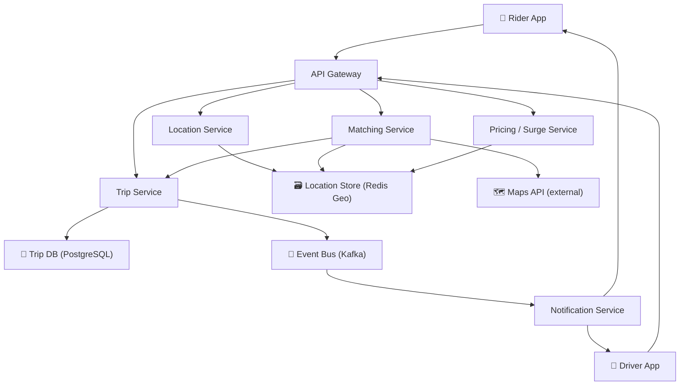
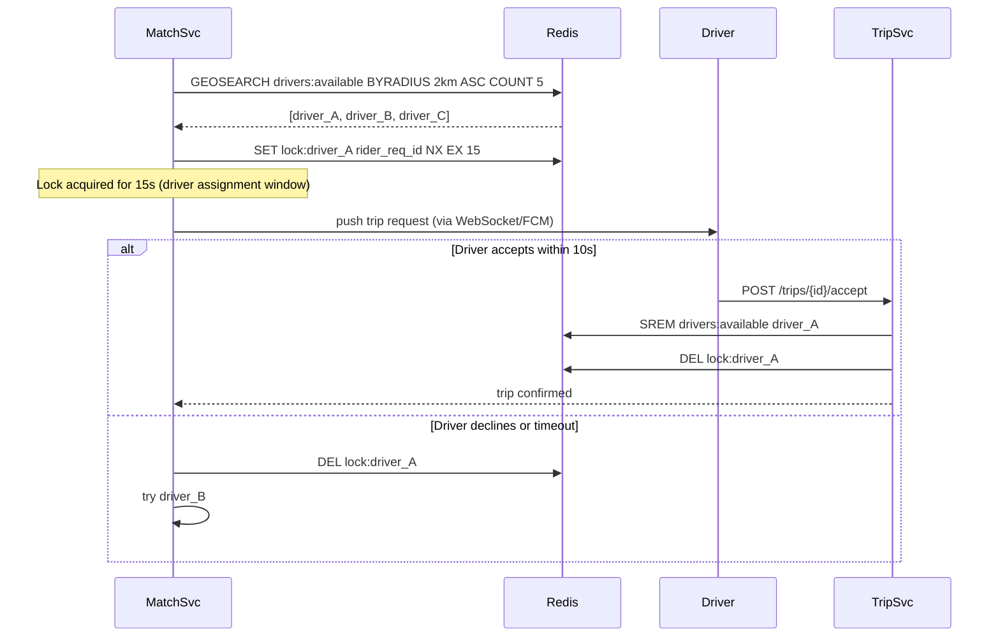
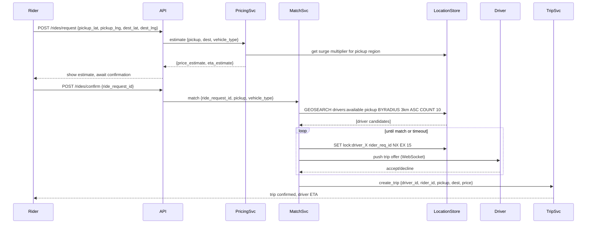
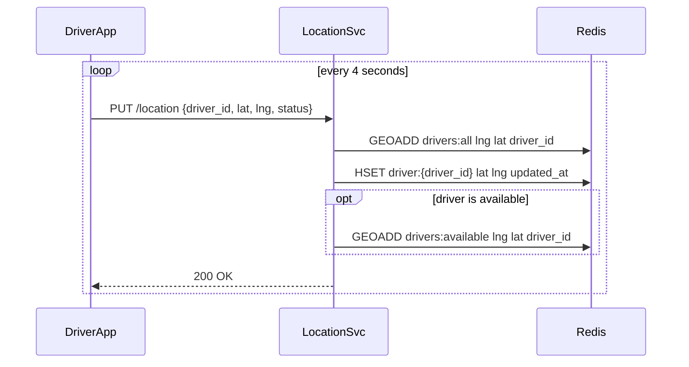

# Worked Design — Ride-Sharing Platform

> Uber/Lyft-style ride matching. 5M rides/day, sub-5s match latency. Geospatial indexing is the crux.
>
> Author: Thanh Tran · v1.0 · 2026-05-16

---

## 1. Executive Summary

We design a ride-sharing platform where riders request rides and the system matches them to nearby available drivers in under 5 seconds. The core challenge is **real-time geospatial matching** at scale: tracking millions of moving drivers, answering "find the nearest available driver to this location" thousands of times per second, and maintaining consistency when a driver is simultaneously being considered for multiple ride requests.

**The non-obvious insight**: this is primarily a **location tracking and geospatial query problem**, not a matching algorithm problem. The algorithm (nearest available driver) is simple. The hard part is maintaining a real-time, consistent, geospatially-queryable index of driver locations that updates thousands of times per second.

---

## 2. Requirements

### 2.1 Functional

- Riders can request a ride (pickup location, destination)
- System shows estimated price and ETA before confirmation
- System matches rider to nearest available driver
- Driver receives trip request and can accept/decline (10s window)
- Real-time driver location tracking (updated every 4 seconds while on duty)
- Ride status updates pushed to rider and driver
- Surge pricing based on local supply/demand ratio

### 2.2 Non-functional

| Quality attribute | Target | Why |
|---|---|---|
| **Match latency** | < 5s from request to driver assignment | Core product promise; users abandon if slow |
| **Location update ingestion** | < 1s lag | Stale driver locations cause poor matches |
| **Driver location freshness** | < 8s stale (2 missed updates) | Acceptable; driver moves ~50m in 8s at city speed |
| **Surge pricing accuracy** | ±10% of true supply/demand | Exact accuracy is impossible; approximate is fine |
| **Availability** | 99.99% | Revenue-critical; outage = zero rides |
| **Scale** | 5M rides/day, 500K active drivers peak | Uber-class city-scale |

Deprioritized: route optimisation (use third-party maps API), payment processing (separate system).

### 2.3 Out of Scope

- Route navigation (delegated to maps provider)
- Driver earnings / payment
- Fraud detection
- Multi-city fleet management / analytics

---

## 3. Capacity Estimates

| Input | Value |
|---|---|
| Rides per day | 5M |
| Peak rides/hour | 5M / 24 × 3 (peak multiplier) ≈ 625K rides/hour |
| Active drivers at peak | 500K |
| Location update interval | 4 seconds |
| Driver location update size | ~50 bytes (driver_id, lat, lng, timestamp, status) |

Derived:

| Metric | Value |
|---|---|
| Ride requests/sec (peak) | 625K / 3600 ≈ **175/sec** |
| Driver location updates/sec | 500K / 4 = **125K updates/sec** |
| Location update bandwidth | 125K × 50 bytes = **6.25 MB/sec** (trivial) |
| Match queries/sec | 175 requests × ~5 match attempts = **875 geospatial queries/sec** |
| Ride state changes/sec | 175 × 8 states = **1400 state writes/sec** |

**Surprise**: the read/write load on the driver location store (125K writes/sec) is dominated by location updates, not ride requests. Every driver pings their location every 4 seconds regardless of whether they're in a ride. This is the dimensioning constraint for the location store.

---

## 4. System Context (C4 Level 1)



---

## 5. Component Deep-Dives

### 5.1 Driver Location Store — Geospatial Indexing

**Why Redis GEO**: Redis provides `GEOADD`, `GEODIST`, `GEORADIUS`, and `GEOSEARCH` commands that implement geohash-based spatial indexing natively. At 125K writes/sec it's the right tool: single-threaded Redis can do 100K+ ops/sec, so we shard by city/region.

**Data model**:
```
GEOADD drivers:available {lng} {lat} {driver_id}
GEOADD drivers:all {lng} {lat} {driver_id}

HSET driver:{driver_id} status available lat {lat} lng {lng} updated_at {ts} vehicle_type standard
```

**Finding nearest drivers**:
```
GEOSEARCH drivers:available FROMMEMBER pickup_geohash BYRADIUS 3 km ASC COUNT 10
```

**Alternative considered — Geohash tiles**:
Partition the map into geohash cells (level 6 ≈ 1.2km × 0.6km). Each cell maintains a set of drivers. Expanding search radius = querying the cell + 8 neighbours. Slightly more complex but allows regional sharding without Redis Geo limitations. Rejected for v1 — Redis Geo is simpler and proven.

**Alternative considered — S2 geometry library**:
Google S2 cells provide better area uniformity than geohash. Used by Uber in production. More complex to implement but handles polar distortion correctly. Overkill for city-scale.

### 5.2 Matching Service — The Race Condition Problem

Finding the nearest driver is easy. **Preventing two riders from being matched to the same driver simultaneously is hard.**



**Key**: the `SET NX EX` (set-if-not-exists with expiry) on `lock:driver_{id}` is an atomic Redis operation. If two MatchSvc instances race, exactly one wins. The 15s TTL ensures the lock auto-releases if the matching service crashes.

### 5.3 Surge Pricing

Surge = demand / supply ratio within a geohash region.

```
surge_multiplier = max(1.0, demand_rate / supply_rate)

demand_rate = ride_requests in region in last 5 minutes
supply_rate = available drivers in region
```

Computed every 30 seconds per region. Stored in Redis with 60s TTL. Pricing service reads from Redis — no DB hit on the ride request path. Approximate: 30s staleness means surge lags reality slightly, which is acceptable and arguable (prevents oscillation).

---

## 6. Key Flows

### 6.1 Ride Request



### 6.2 Driver Location Update



---

## 7. Trade-off Analysis

| Decision | Chosen | Alternative | Why |
|---|---|---|---|
| **Geospatial index** | Redis GEO (geohash) | PostgreSQL PostGIS | PostGIS is excellent but would require a separate spatial DB. Redis GEO runs at 100K+ ops/sec and the data fits in RAM. Redis already needed for locks and surge data — one fewer system. |
| **Driver lock mechanism** | Redis SET NX EX (per-driver lock) | Database-level SELECT FOR UPDATE | DB locking at 875 match queries/sec would create contention. Redis atomic operations at microsecond latency, no blocking. |
| **Location update protocol** | HTTP (driver app → server) | WebSocket (persistent) | HTTP is simpler, stateless, survives app backgrounding. WebSocket requires connection management. Drivers tolerate slightly higher latency on location updates. |
| **Rider/driver notifications** | WebSocket (long-lived connection) | SMS/FCM polling | Real-time trip status updates require low latency (< 1s). WebSocket maintained while app is open; FCM as fallback when backgrounded. |
| **Surge pricing granularity** | Geohash level 5 (≈4km × 5km cells) | Per-street or finer | Finer granularity → smaller supply pools → noisier surge estimates (1 driver leaving spikes surge). City-block-sized cells balance responsiveness with stability. |

---

## 8. Failure Modes

| Failure | Impact | Mitigation |
|---|---|---|
| Redis failure | Cannot match rides or track drivers | Redis Cluster with replicas; failover within seconds; fallback: degrade to DB-based location query |
| Driver app goes offline (crash) | Driver's location becomes stale | 8s freshness threshold; after 2 missed updates, mark driver unavailable |
| Match service crash holding lock | Driver locked out for 15s | Lock TTL auto-expires; driver becomes available again |
| Location update storm (city event) | 500K drivers reconnect simultaneously | Exponential backoff on reconnect; location updates are idempotent |
| Maps API (ETA) unavailable | Cannot show ETA to rider | Cached ETA from last successful call; show "ETA unavailable" gracefully |

---

## 9. Rollout Strategy

1. **Phase 1**: Single city deployment. Validate geospatial matching correctness and match latency.
2. **Phase 2**: Add driver location history for debugging. Instrument p99 match latency per city.
3. **Phase 3**: Surge pricing. A/B test surge multiplier sensitivity vs. ride completion rate.
4. **Phase 4**: Expand to multiple cities. Each city gets its own Redis instance (driver pools don't overlap cities).
5. **Phase 5**: Scheduled rides, pool matching (shared rides) — require more complex matching heuristics.

---

## 10. Open Questions

- How do we handle cross-city airport pickups? Driver's home city vs. pickup city affects availability pool.
- Matching for ride pools (shared rides) requires knowing both riders' destinations before matching — fundamentally harder problem.
- How stale is "too stale" for surge pricing? 30s was chosen arbitrarily; could be data-driven.
- Driver earnings guarantee vs. surge pricing: some markets legally cap surge. How does pricing service account for regulatory constraints per city?

---

## 11. ADR References

- ADR-001 (PostgreSQL) → used for trip records and payment history (relational, ACID required)
- ADR-008 (Caching Strategy) → cache-aside for surge multipliers; write-through for driver status
