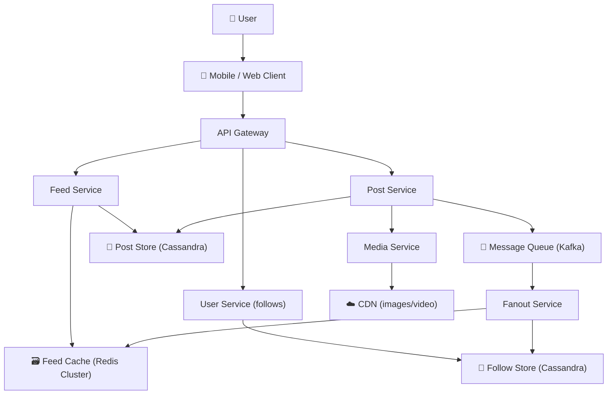
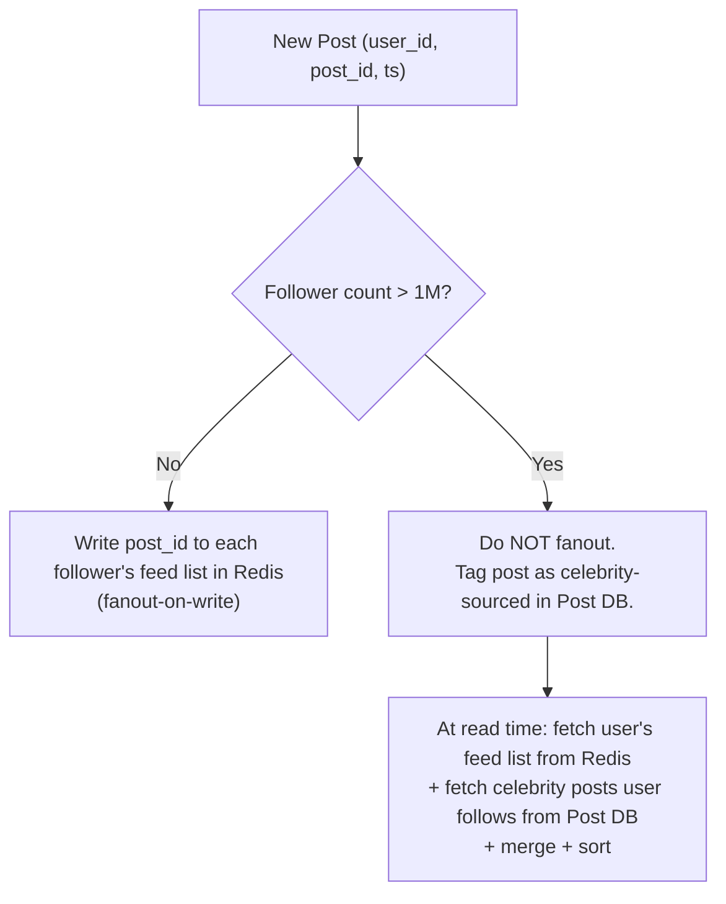
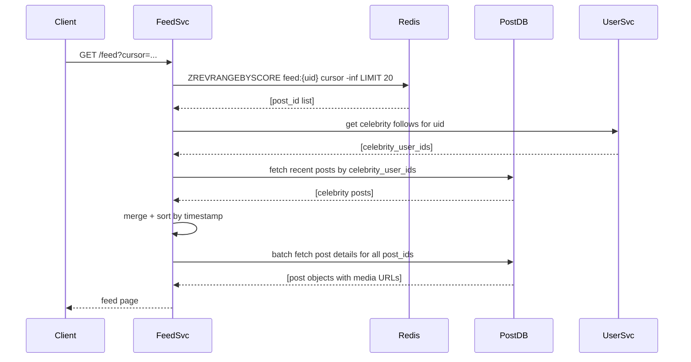
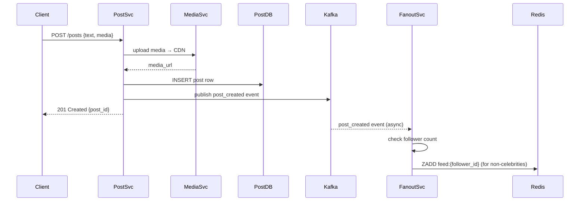
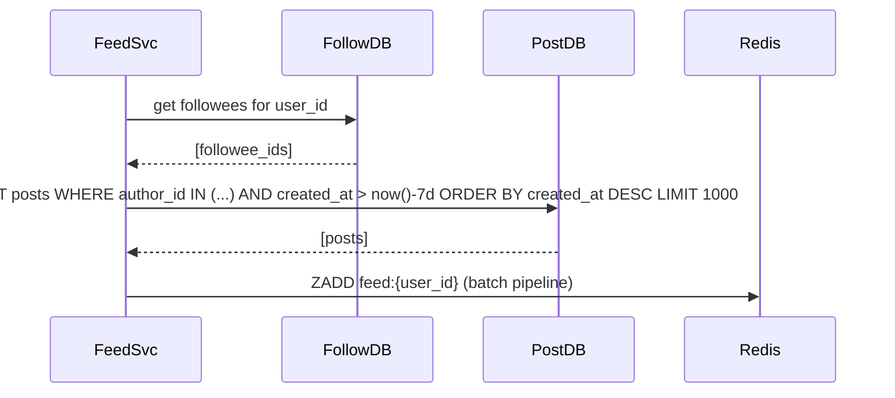

# Worked Design — Social Media Feed

> Instagram/Twitter-style social feed. 500M DAU, fanout-on-write vs fanout-on-read is the crux decision.
>
> Author: Thanh Tran · v1.0 · 2026-05-16

---

## 1. Executive Summary

We design a social feed system where users follow other users and see a reverse-chronological (or ranked) stream of their posts. At 500M DAU the fanout strategy dominates all other design decisions. We adopt a **hybrid fanout**: write-time fanout for ordinary users, read-time fanout for celebrities (>1M followers), merged at read time.

**The non-obvious insight**: the problem is not storage or compute — it's the asymmetry between celebrities (1 post → 50M writes) and ordinary users (1 post → 300 writes). A single strategy fails both. The hybrid model is the only one that works at this scale.

---

## 2. Requirements

### 2.1 Functional

- Users can follow/unfollow other users
- Users can create posts (text, image, video)
- Users see a feed of posts from accounts they follow (reverse-chronological default)
- Feed is paginated (cursor-based)
- Likes and comments exist but are not the focus of this design
- Optional: ranked/algorithmic feed (treat as extension)

### 2.2 Non-functional

| Quality attribute        | Target                                  | Why                                                      |
| ------------------------ | --------------------------------------- | -------------------------------------------------------- |
| **Feed load latency**    | p99 < 200ms                             | Feed is the home screen; slow = users leave              |
| **Write latency**        | p99 < 500ms for post creation           | User sees "posted" confirmation; async fanout acceptable |
| **Availability**         | 99.99%                                  | Feed down = app is down                                  |
| **Eventual consistency** | Followers see post within 5s            | Strict consistency would kill write throughput           |
| **Scale**                | 500M DAU, 5M posts/day, 50M follows/day | Instagram-class                                          |

Deprioritized: real-time push notifications (separate system), strict ordering across shards.

### 2.3 Out of Scope

- Algorithmic ranking (treat feed as chronological v1)
- Stories / ephemeral content
- Direct messaging
- Search / discovery

---

## 3. Capacity Estimates

| Input                      | Value                  |
| -------------------------- | ---------------------- |
| DAU                        | 500M                   |
| Posts per DAU per day      | 0.01 (1 per 100 users) |
| Average followers per user | 300                    |
| Celebrity threshold        | >1M followers          |
| Feed reads per DAU per day | 10                     |
| Peak multiplier            | 3×                     |

Derived:

| Metric                                             | Value                                                  |
| -------------------------------------------------- | ------------------------------------------------------ |
| Posts/day                                          | 5M                                                     |
| Posts/sec (avg)                                    | ~58/sec                                                |
| Posts/sec (peak)                                   | ~175/sec                                               |
| Fanout writes/sec (avg, non-celebrity)             | ~175 × 300 = **52K writes/sec**                        |
| Feed reads/sec (avg)                               | 500M × 10 / 86400 ≈ **58K reads/sec**                  |
| Feed reads/sec (peak)                              | ~175K reads/sec                                        |
| Feed entry storage (post_id + timestamp, 16 bytes) | 52K writes/sec × 86400 = 4.5B entries/day → ~72 GB/day |
| Retention (90 days in hot cache)                   | ~6.5 TB Redis                                          |

**Surprise**: fanout write amplification is the bottleneck, not read volume. Naïve fanout-on-write for a celebrity with 50M followers at 5 posts/day = **250M extra writes/day from one account**.

---

## 4. System Context (C4 Level 1)



---

## 5. Component Deep-Dives

### 5.1 Fanout Service — The Core Problem

The fanout service consumes post-created events from Kafka and writes feed entries to each follower's feed cache.

**Hybrid fanout strategy**:



**Feed list structure in Redis**:

- Key: `feed:{user_id}` → sorted set, score = timestamp (unix ms), member = `post_id`
- Max length: 1000 entries (trim on write with `ZREMRANGEBYRANK`)
- TTL: 30 days; cold feeds rebuilt on demand from follow graph + Post DB

**Fanout write path**:

1. Kafka consumer receives `{user_id, post_id, timestamp}`
2. Look up follower list from Follow Store (paginated, up to 300 followers → single batch)
3. Redis pipeline: `ZADD feed:{follower_id} {ts} {post_id}` + `ZREMRANGEBYRANK feed:{follower_id} 0 -1001`
4. Repeat in parallel for large follower sets (fan out work across fanout workers)

**Throughput**: at 175 posts/sec peak, avg 300 followers → 52K Redis writes/sec. Redis Cluster with 10 shards handles this comfortably (each shard ~5K ops/sec, Redis can do 100K+).

### 5.2 Feed Service — Read Path



**Cache miss handling**: if `feed:{user_id}` doesn't exist (cold start or TTL expired), FeedSvc triggers an async **feed rebuild**: fetch follower list, query Post DB for recent posts per followed user, populate Redis. Returns a synchronous stub of the last 20 posts while rebuild is in flight.

### 5.3 Follow Store

Cassandra table:

```
follows (
  follower_id  UUID,
  followee_id  UUID,
  created_at   TIMESTAMP,
  PRIMARY KEY (follower_id, followee_id)
)

-- reverse lookup for fanout:
followers_by_user (
  followee_id  UUID,
  follower_id  UUID,
  PRIMARY KEY (followee_id, follower_id)
)
```

For celebrities (>1M followers), the `followers_by_user` partition is large. Fanout workers read it in 10K-row pages.

---

## 6. Key Flows

### 6.1 Post Creation



### 6.2 Cold Feed Rebuild



---

## 7. Trade-off Analysis

| Decision            | Chosen                                        | Alternative                 | Why                                                                                                                                   |
| ------------------- | --------------------------------------------- | --------------------------- | ------------------------------------------------------------------------------------------------------------------------------------- |
| **Fanout strategy** | Hybrid (write for normal, read for celebrity) | Pure fanout-on-write        | Celebrity with 50M followers × 5 posts/day = 250M write amplifications/day; unacceptable                                              |
| **Feed store**      | Redis sorted set per user                     | Cassandra wide row per user | Redis sorted set ops (ZADD, ZREVRANGE) are O(log N); Cassandra is fine but adds another data store. Redis already needed for caching. |
| **Post storage**    | Cassandra                                     | PostgreSQL                  | Cassandra write throughput and partition-key-based access pattern (by author, by id) is a natural fit; no JOINs needed                |
| **Consistency**     | Eventual (5s)                                 | Strong                      | Feed latency would require distributed locking or coordination; users tolerate eventual consistency on feeds                          |
| **Feed length cap** | 1000 entries in Redis                         | Unlimited                   | Memory cost: 500M users × 1000 entries × 16 bytes = 8 TB. Cap at 1000 = 8 TB; unlimited would be unbounded                            |

---

## 8. Failure Modes

| Failure                                           | Impact                                        | Mitigation                                                                   |
| ------------------------------------------------- | --------------------------------------------- | ---------------------------------------------------------------------------- |
| Redis node failure                                | Feed reads fall back to Post DB (slower, ~2s) | Redis Cluster with replica reads; circuit breaker to DB fallback             |
| Fanout lag spike                                  | Followers see posts with >5s delay            | Kafka consumer group with multiple fanout workers; lag alerting              |
| Celebrity post goes viral (sudden follower spike) | Fanout worker queue depth grows               | Celebrity detection is recalculated hourly; real-time check on post creation |
| Follow DB overloaded                              | Fanout stalls                                 | Follow DB is Cassandra (horizontally scalable); add nodes                    |
| Cold feed rebuild storm                           | Post DB overloaded on app restart             | Stagger rebuilds using jitter; rate-limit rebuild requests                   |

---

## 9. Rollout Strategy

1. **Phase 1**: Deploy with fanout-on-write for all users. Monitor Redis memory and fanout write latency.
2. **Phase 2**: Identify top 10K accounts by follower count. Migrate them to read-time fanout. Validate feed correctness.
3. **Phase 3**: Enable hybrid fanout at the 1M follower threshold. Tune threshold based on fanout worker queue depth.
4. **Phase 4**: Rollout algorithmic ranking as a post-processing step on the merged feed.

---

## 10. Open Questions

- What is the exact threshold for "celebrity"? 1M followers chosen; could be tuned based on actual write amplification observed in production.
- How do we handle accounts that transition across the threshold? Currently recalculated hourly — gap exists.
- Ranked feed: where does the ranking model live? Offline batch vs real-time inference?
- Should the feed include ads? Requires a slot-injection mechanism on the read path.

---

## 11. ADR References

- ADR-001 (PostgreSQL) → replaced by Cassandra for post/follow store (different access pattern)
- ADR-008 (Caching Strategy) → cache-aside for post objects, write-through for feed lists
