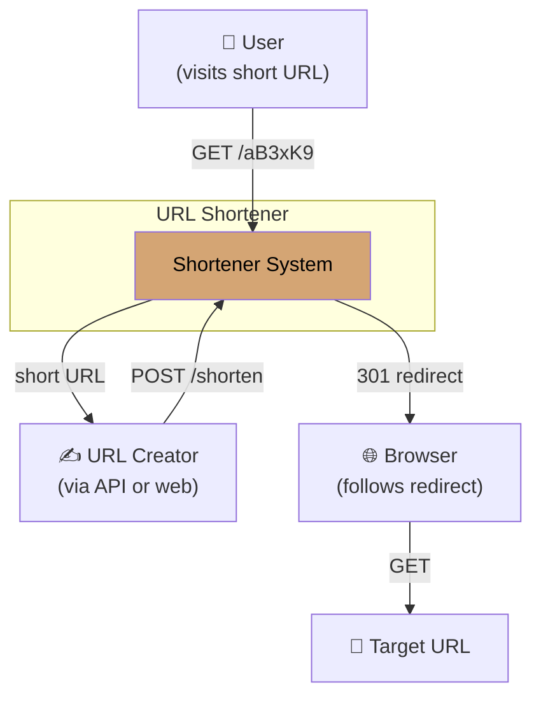
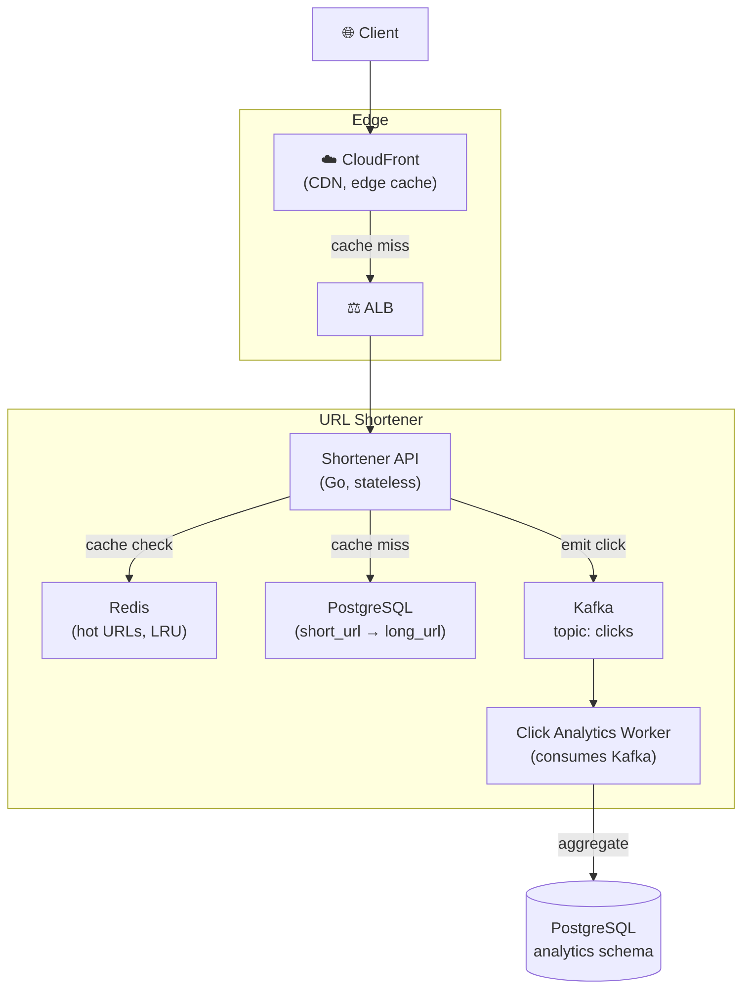
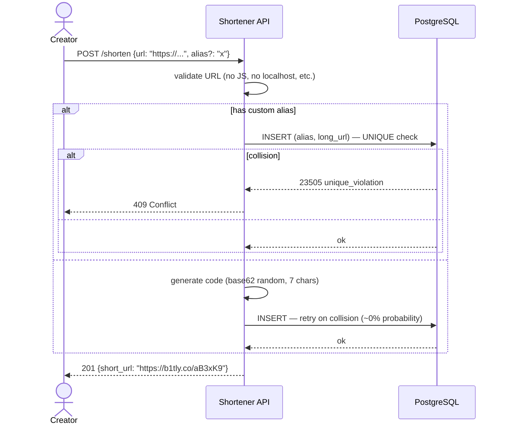
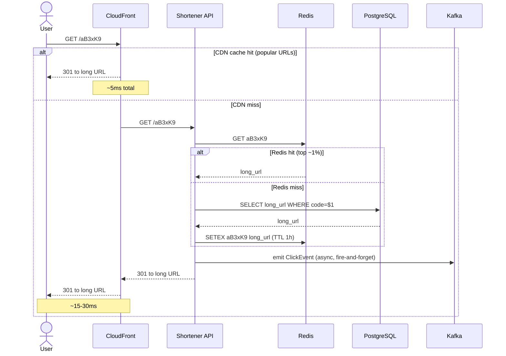

# Worked Design — URL Shortener

> Like bit.ly. ~50M URLs/month, 100:1 read:write. The "small system" case — instructive precisely because it's modest.
>
> Author: Thanh Tran · v1.0 · 2026-04-20

---

## 1. Executive Summary

We propose a deliberately boring URL shortener: PostgreSQL for the mapping, Redis for hot-URL caching, a CDN at the edge, all behind a thin Go API. ~$200/month infra, p99 < 50ms, single region.

**The non-obvious insight**: this is a **read-dominated, low-write system**. Most "URL shortener" interview answers overscope wildly (sharding, multi-region, Kafka pipelines) when the actual scale is trivial. Optimize for the boring things: read latency, durability, abuse prevention.

---

## 2. Requirements

### 2.1 Functional

- Shorten a long URL → short URL (auto-generated code, e.g. `b1tly.co/aB3xK9`)
- Visit short URL → HTTP redirect to long URL
- Optional: custom alias (`b1tly.co/my-talk-2026`)
- Optional: expiration date
- Click analytics (count, time, country)

### 2.2 Non-functional

| Quality attribute           | Target           | Why                                                                          |
| --------------------------- | ---------------- | ---------------------------------------------------------------------------- |
| **Availability**            | 99.95%           | A dead link is unacceptable; users link from emails, articles, presentations |
| **Latency** (read/redirect) | p99 < 50ms       | Click feels instant or it's broken                                           |
| **Durability**              | No URL ever lost | Worst possible bug: short link returns 404                                   |
| **Cost**                    | Low              | Free tier feasible                                                           |

Deprioritized:

- Real-time analytics (offline aggregation is fine)
- Custom-domain support (v2)

### 2.3 Out of Scope

- Malware scanning of destination URLs (handled by external service if needed)
- API for bulk creation (rate-limited normal API suffices for v1)
- Branded domains per customer
- Multi-region serving

---

## 3. Capacity Estimates

| Input                | Value                  |
| -------------------- | ---------------------- |
| URLs created / year  | 600M                   |
| Average URL lifetime | 5 years (some forever) |
| Read:write ratio     | 100:1                  |
| Peak multiplier      | 5×                     |

Derived:

| Metric                    | Value                           |
| ------------------------- | ------------------------------- |
| Avg writes/sec            | 600M / 86400 / 365 ≈ **20/sec** |
| Peak writes/sec           | ~100/sec                        |
| Avg reads/sec             | ~2000/sec                       |
| Peak reads/sec            | ~10000/sec                      |
| URLs in DB after 5 years  | 3 billion                       |
| Storage (3B × ~500 bytes) | ~1.5 TB                         |

**Surprise**: this is **trivial scale**. A single PostgreSQL instance handles it comfortably. The challenge is _availability and latency_, not throughput.

Hot read distribution: top 1% of URLs get ~99% of clicks (Zipfian). **Cache wins here.**

---

## 4. System Context (C4 Level 1)

---

## 5. Container View (C4 Level 2)

---

## 6. Critical Flows

### 6.1 Creating a short URL

### 6.2 Redirect (the hot path)

Latency budget:

| Hop                        | Budget    | Reality         |
| -------------------------- | --------- | --------------- |
| CDN cache hit              | 5ms       | ~80% of traffic |
| CDN miss → API → Redis hit | 20ms      | ~18% of traffic |
| CDN miss → API → DB read   | 40ms      | ~2% of traffic  |
| **Effective p99**          | **~30ms** | Well under SLO  |

---

## 7. Generating Short Codes

Three strategies considered:

| Strategy                    | Pros                         | Cons                                         |
| --------------------------- | ---------------------------- | -------------------------------------------- |
| Hash of URL (truncated MD5) | Same URL → same code (dedup) | Collisions need retry; leaks if used as auth |
| Random base62               | Simple, unguessable          | Collision retry (negligible at 7 chars)      |
| Pre-generated pool          | No runtime collision check   | Need to manage pool                          |
| Counter + base62            | Sequential, no collision     | Leaks creation rate; predictable             |

**Chosen**: random base62, 7 characters.

- 62^7 = 3.5 trillion possible codes
- At 3B URLs, collision probability per insert is ~3B/62^7 = 0.001
- Retry on collision; effectively zero practical rate
- 7 characters fits readable + memorable threshold

**Why not the counter approach**: predictable codes leak business metrics (you can see how many URLs were created between two specific shortlinks). For paid users who want privacy, this matters.

---

## 8. Trade-off Analysis

### 8.1 PostgreSQL vs DynamoDB

At this scale, both work. **Chose PostgreSQL** because:

- 1.5TB is comfortable for managed RDS at any tier
- Simpler ops than DynamoDB for a small team
- Easier ad-hoc queries (analytics, debugging)
- Joins for analytics joining click events to URL metadata

DynamoDB would also have been fine. Choice driven by team familiarity.

### 8.2 Sync vs Async Click Analytics

**Chose async via Kafka**, not synchronous DB write.

Sync: redirect waits for click insert, adds 5-10ms latency, ties write throughput to redirect throughput.
Async: emit to Kafka (fire-and-forget), worker batches inserts. ~2ms overhead. Worker can fall behind without affecting redirects.

Click analytics is eventual-consistency. We don't need real-time numbers.

### 8.3 Custom Aliases on Same Domain

Collision risk: with both random codes (`aB3xK9`) and custom aliases (`my-talk`) in the same namespace, custom aliases could collide with future random codes.

**Decision**: reserve custom aliases ≥4 chars + dash or alphanumeric mix that random generation won't produce (e.g., custom aliases must contain at least one dash, or be exactly 8+ chars). Eliminates collision risk by partitioning the namespace.

---

## 9. Failure Modes

| Failure                         | Blast radius               | Mitigation                                                       |
| ------------------------------- | -------------------------- | ---------------------------------------------------------------- |
| PostgreSQL down                 | All cache misses fail      | Promote read-replica; cache absorbs hot traffic                  |
| Redis down                      | More load on DB            | DB sized for full load (it's small anyway); fine to bypass cache |
| Kafka down                      | Click events lost          | Acceptable: click count is best-effort                           |
| CDN cache poisoning             | Wrong redirect for hot URL | TTL limits damage; CDN invalidation API                          |
| API instances down              | New shortens fail          | Auto-scaling group; multi-AZ                                     |
| Custom alias guessing for abuse | Spam links                 | Rate limit per IP for creation; CAPTCHA above threshold          |

---

## 10. Abuse Prevention

The interesting non-architectural concern: **URL shorteners attract abuse** — phishing, malware redirects, spam.

Defenses:

- **Rate limit**: 10 shortens/min per IP, 100/min per authenticated user
- **Domain blocklist**: known phishing/malware destinations rejected at creation time
- **Safe Browsing API**: optional integration with Google Safe Browsing
- **Reactive takedown**: API for reporting abusive URLs; mark as inactive in DB (returns 410 Gone)
- **Audit log**: every shorten + every report stored for compliance

This is more product than architecture, but it's the actual day-2 work. Plan for it.

---

## 11. Cost Estimate

| Component                              | Monthly cost            |
| -------------------------------------- | ----------------------- |
| RDS PostgreSQL (db.t4g.small Multi-AZ) | $60                     |
| Redis (cache.t4g.micro)                | $20                     |
| 3× API instances (t4g.small)           | $35                     |
| ALB                                    | $20                     |
| CloudFront                             | $40 (traffic-dependent) |
| Kafka (MSK Serverless, low volume)     | $30                     |
| Storage + backups                      | $15                     |
| **Total**                              | **~$220/month**         |

A bit lower with reserved instances or self-managed components. The point: this is a small system. Don't over-engineer it.

---

## 12. What This Design Demonstrates

This worked design exists to make a specific architectural point: **most "famous system" interview prompts are deceptively small in actual scale.** The complexity in real URL shorteners is in **operations and abuse prevention**, not in scale or distribution.

A candidate who designs a 3-region multi-master Cassandra cluster with custom consistent-hashing for a URL shortener has misread the problem. The architect who designs PostgreSQL + Redis + CDN, then spends remaining time on abuse prevention and analytics, has read it correctly.

> **Lesson**: ALWAYS estimate before designing. Numbers anchor decisions.

---

## 13. Related Material

- Module 01 (capacity estimation), Module 03 (storage), Module 06 (reliability)
- [ADR-001 PostgreSQL OLTP](../adrs/adr-001-postgresql-oltp.md) — same database choice rationale
- The hot-URL Zipfian distribution is a recurring theme in caching design
