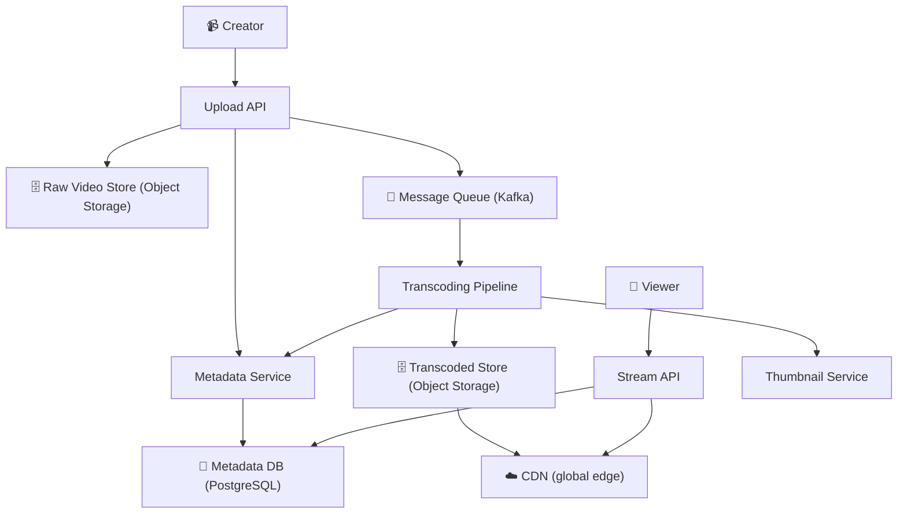
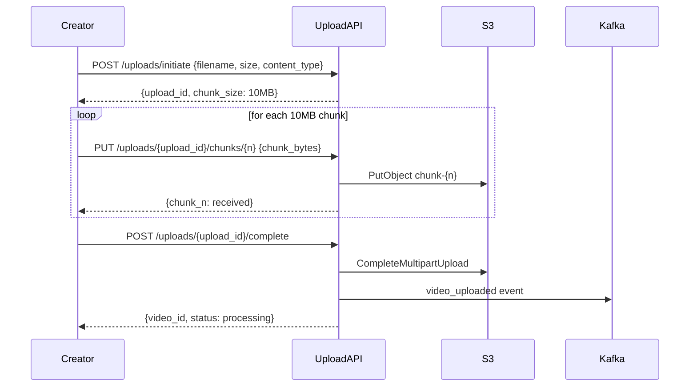
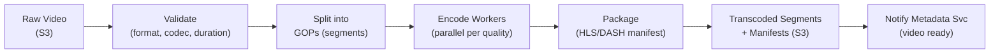
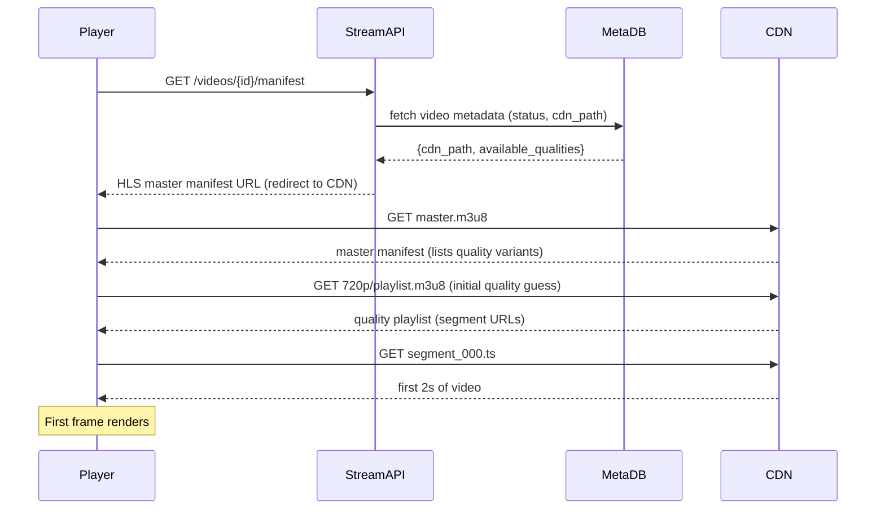
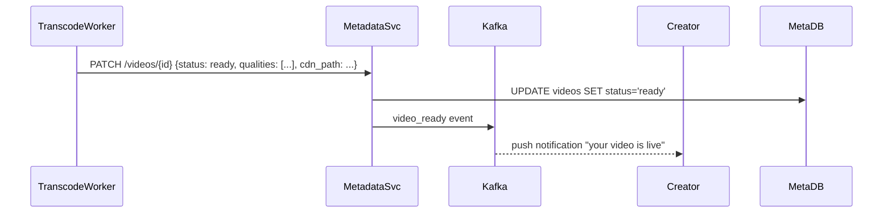

# Worked Design — Video Streaming Platform

> YouTube-style video platform. 500 hours uploaded per minute, 1B daily views. The pipeline from upload to playback is the design.
>
> Author: Thanh Tran · v1.0 · 2026-05-16

---

## 1. Executive Summary

We design a video platform where users upload videos and viewers stream them globally. The system has two fundamentally different subsystems: the **upload + transcoding pipeline** (write-heavy, async, latency-tolerant) and the **streaming delivery path** (read-heavy, latency-critical, globally distributed). These require completely different architectures and must be designed independently.

**The non-obvious insight**: the bottleneck is not storage or bandwidth — it's **transcoding**. A 10-minute 4K video takes ~30 minutes of CPU to transcode into 6 quality variants. The transcoding fleet is the capacity constraint you'll hit first, and the one that determines end-to-end upload-to-playback latency.

---

## 2. Requirements

### 2.1 Functional

- Users can upload videos (up to 10GB, any format)
- Platform transcodes videos into multiple resolutions (360p, 480p, 720p, 1080p, 4K) and formats (H.264, H.265/HEVC, AV1)
- Viewers stream videos with adaptive bitrate (ABR) — quality auto-adjusts to bandwidth
- Videos are available within 30 minutes of upload completion
- Users can search and browse videos (not this design's focus — treated as read from metadata store)
- Thumbnails auto-generated

### 2.2 Non-functional

| Quality attribute | Target | Why |
|---|---|---|
| **Playback start latency** | < 2s (time to first frame) | Users abandon at 3s |
| **Buffering rate** | < 1% of playback time | Core quality metric |
| **Upload availability** | 99.9% | Creators are revenue; failed uploads churn them |
| **Streaming availability** | 99.99% | Viewers experience any downtime immediately |
| **Transcoding throughput** | 500 hrs video/min | Current YouTube scale |
| **Global reach** | < 50ms delivery latency worldwide | CDN edge coverage |

Deprioritized: live streaming (different architecture), DRM (important but separate concern), comments/social features.

### 2.3 Out of Scope

- Live streaming
- Monetization / ad insertion (separate pipeline)
- Recommendation engine
- DRM / content protection

---

## 3. Capacity Estimates

| Input | Value |
|---|---|
| Uploads per minute | 500 hours of video |
| Average video length | 10 minutes |
| Average upload size (raw) | 2 GB per hour of video |
| Transcoding ratio | 6 quality variants × ~1.5× output size = 9× raw |
| Daily views | 1B |
| Average view duration | 7 minutes |
| Average bitrate served | 2 Mbps (mix of quality levels) |

Derived:

| Metric | Value |
|---|---|
| Raw upload bandwidth | 500 hrs × 60 min × 2 GB/hr = **1 TB/min = 133 GB/sec** |
| Transcoded storage generated/day | 133 GB/sec × 86400 × 9 ≈ **100 PB/day** (that's cumulative; per-day delta is ~10 PB) |
| Streaming bandwidth | 1B views × 7 min × 2 Mbps = **1.75 Exabits/day ≈ 20 Tbps continuous** |
| Transcoding CPU (1 hr video → 1 hr CPU for H.264, 3× for H.265) | 500 hrs upload/min × 6 variants × 1.5× → ~4500 CPU-hrs/min = **75,000 CPU cores** |

**Surprise**: at these numbers, transcoding requires a fleet of ~75,000 CPU cores running continuously. This is why YouTube runs thousands of dedicated transcoding VMs and uses GPU-based encoding at scale. The CPU estimate is also why ABR matters — serving fewer viewers at lower quality dramatically reduces bandwidth cost.

---

## 4. System Context (C4 Level 1)

---

## 5. Component Deep-Dives

### 5.1 Upload Pipeline

**Chunked upload** is essential: a 10 GB upload cannot be a single HTTP request. We use resumable uploads (similar to Google's resumable upload protocol):

**Why chunked?**: network interruptions are the norm for large uploads. Chunked uploads let creators resume from the last successful chunk. S3 Multipart Upload handles the assembly.

### 5.2 Transcoding Pipeline

This is the most complex component. A video goes through several stages:

**Parallel encoding**: each video is split into ~2-second GOP (Group of Pictures) segments. Each segment is encoded independently across the quality ladder. This allows **horizontal parallelism** — a 10-minute video split into 300 segments, encoded across 300 workers simultaneously in ~2 minutes instead of 30.

**Quality ladder** (HLS/DASH):
- 360p @ 400 Kbps
- 480p @ 800 Kbps
- 720p @ 2.5 Mbps
- 1080p @ 5 Mbps
- 1440p @ 10 Mbps
- 2160p (4K) @ 20 Mbps

**Output format**: HLS (`.m3u8` master manifest + per-quality manifests + `.ts` segments). DASH for web/Android. The player selects quality based on measured bandwidth.

**Worker infrastructure**: spot instances (70% cheaper than on-demand). Transcoding is idempotent and restartable — ideal for spot. Job queue backed by SQS; workers poll and process segments.

### 5.3 CDN Strategy

Object storage (S3) cannot serve 20 Tbps. CDN is non-optional.

**Pull CDN** (used for long-tail content):
- Viewer requests segment from CDN edge PoP
- Cache miss → CDN fetches from S3 origin → caches at edge
- Subsequent viewers at same PoP served from edge cache

**Push CDN** (used for trending/viral content):
- When a video crosses a view threshold, proactively push all segments to all CDN edge nodes
- Prevents cache miss storms on viral videos

**Adaptive bitrate player behavior**:
- Player downloads master manifest → selects starting quality based on bandwidth estimate
- After each segment download, measures throughput → switches quality up or down
- Segment duration: 2 seconds → quality can adapt every 2 seconds

---

## 6. Key Flows

### 6.1 Video Playback Start

### 6.2 Transcoding Completion Notification

---

## 7. Trade-off Analysis

| Decision | Chosen | Alternative | Why |
|---|---|---|---|
| **Transcoding parallelism** | Split into GOP segments, encode in parallel | Transcode whole file per worker | Full file per worker: 10-min video × 30 min transcode = 50 min wait. Segment parallel: ~3 min. Creator experience is dramatically better. |
| **Spot instances for transcoding** | Yes | On-demand | Transcoding is idempotent and retry-safe. Spot saves ~70% on the largest cost centre. Risk: spot interruption adds ~1 min latency per interrupted segment (rare). |
| **HLS + DASH** | Serve both | HLS only | HLS is native on iOS/Safari. DASH is native on Android/Chrome. Serving both maximises compatibility. ~2× manifest storage cost is trivial vs bandwidth savings. |
| **CDN strategy** | Hybrid push/pull | Pull only | Pull-only suffers cache miss storms on viral videos. First 10K viewers all miss cache simultaneously. Push for trending content pre-warms edges, eliminating origin load spike. |
| **Raw video retention** | 30 days then delete | Keep forever | Storage cost: 10 PB/day. Keeping raw forever is cost-prohibitive. Transcoded outputs are kept; raw can be re-generated from transcoded. Creators can re-upload if needed. |

---

## 8. Failure Modes

| Failure | Impact | Mitigation |
|---|---|---|
| Transcoding worker crash | Video stuck in "processing" | SQS message visibility timeout; unacknowledged messages re-queued after 30 min |
| CDN PoP unavailable | Viewers in that region see slow loads | CDN has automatic failover to next-nearest PoP; player retry logic |
| S3 write failure during upload | Upload fails mid-stream | Resumable upload protocol; creator retries from last chunk |
| Metadata DB overloaded | Can't serve video manifest | Read replicas for metadata reads; playback manifest is mostly read |
| Viral video cache miss storm | Origin S3 overloaded | CDN shield (single origin request per PoP); push CDN for videos crossing view threshold |
| Corrupt transcoded segment | Playback artifacts or errors | Segment-level checksum validation post-encode; failed segments re-queued |

---

## 9. Rollout Strategy

1. **Phase 1**: Single-region, single quality (720p), no ABR. Prove upload + transcode pipeline end-to-end.
2. **Phase 2**: Add full quality ladder. Deploy ABR player. Measure buffering rate.
3. **Phase 3**: Multi-CDN. Add a second CDN provider for failover. Implement traffic splitting.
4. **Phase 4**: GPU transcoding for H.265 and AV1 (3× CPU efficiency). Measure quality/cost trade-off.
5. **Phase 5**: Edge transcoding for live streaming (separate architecture track).

---

## 10. Open Questions

- AV1 encoding is 10× slower than H.264 but 50% better compression. When do we enable it? (Probably for >1080p where bandwidth savings justify the encoding cost.)
- Content moderation: when in the pipeline does ML scanning happen? Before or after transcoding? (Cost vs time-to-publish trade-off.)
- How long to retain raw uploads? 30 days chosen — is that enough for creator disputes/appeals?
- Subtitle/caption pipeline: not designed. Required for accessibility compliance in most markets.

---

## 11. ADR References

- ADR-002 (Outbox Pattern) → used between Upload API and transcoding queue to ensure no videos are lost between upload completion and transcode job creation
- ADR-008 (Caching Strategy) → cache-aside for video metadata; push-CDN for trending video segments