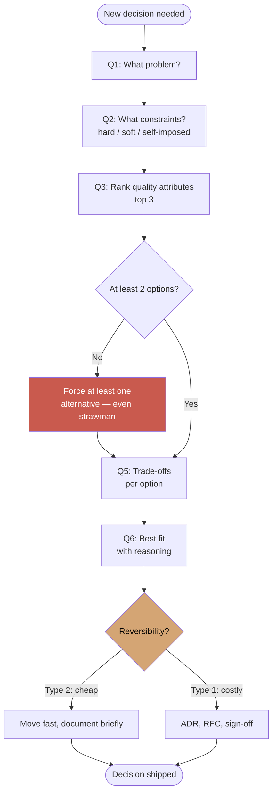
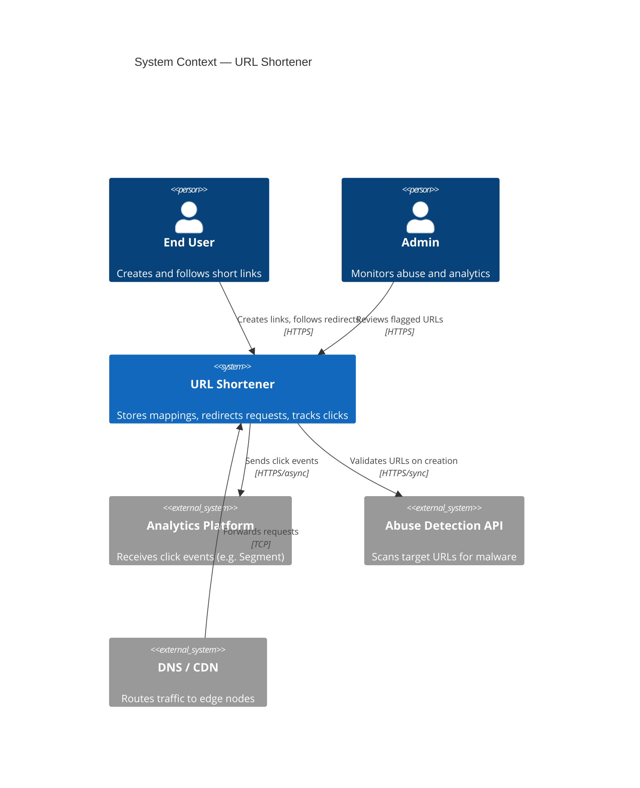

# Module 01 — Thinking in Systems

> **Phase I · Foundations · Weeks 1–3**
>
> _"Architecture is the set of decisions you wish you'd gotten right at the beginning, because they're the hardest to change later."_ — Martin Fowler

---

## At a Glance

|                              |                                                                                         |
| ---------------------------- | --------------------------------------------------------------------------------------- |
| **Mindset shift**            | From solving problems → defining constraints                                            |
| **Core concepts**            | Quality attributes, constraints, trade-offs, capacity estimation, SLI/SLO/SLA           |
| **Patterns**                 | The 7-question decision framework · Type 1/Type 2 decisions                             |
| **Capstone**                 | The Sizing Document — a deliverable a tech lead can build from                          |
| **Time investment**          | ~25-30 hours over 3 weeks                                                               |
| **One thing to internalize** | Numbers anchor every decision. Without numbers, you have preferences, not architecture. |

---

## 1. Mindset

This module is the first of the three foundational mindset shifts: **from solving problems to defining them.**

Every senior engineer can solve a well-defined problem. The architect's job starts one level up: **figuring out what problem to solve, and which solution actually fits the constraints.** Most production disasters trace back to solving the wrong problem really well.

By the end of this module, "it works" should feel insufficient to you. You'll want to know: _at what cost? at what scale? with what trade-offs? for how long?_

---

## 2. Core Concepts

### 2.1 Quality Attributes (a.k.a. Non-Functional Requirements)

A system's **quality attributes** are the dimensions you measure it on _besides_ functional correctness. They are the architecture.

The canonical list (from ISO 25010, simplified):

| Attribute           | What it means         | How you measure it                     |
| ------------------- | --------------------- | -------------------------------------- |
| **Performance**     | Speed under load      | p50/p95/p99 latency, throughput (RPS)  |
| **Scalability**     | Handles growth        | Linear cost-per-user up to N           |
| **Availability**    | Up when needed        | % uptime (99.9%, 99.99%)               |
| **Reliability**     | Correct under failure | MTBF, error rate                       |
| **Security**        | Resistant to abuse    | Pen-test outcomes, CVE response time   |
| **Maintainability** | Easy to change        | Time to onboard, lead time for changes |
| **Evolvability**    | Easy to extend        | Coupling metrics, "open for extension" |
| **Observability**   | Easy to debug         | MTTD, MTTR, % traces with errors       |
| **Cost-efficiency** | Bang per buck         | $ per user, $ per transaction          |

**The architect's first job: rank these for the system at hand.** You cannot maximize all of them. Optimizing for availability sacrifices consistency. Optimizing for performance often sacrifices maintainability. Optimizing for cost sacrifices nearly everything.

### 2.2 Constraints

Constraints are the **fences inside which you must design**. Three kinds:

- **Hard constraints**: regulatory (GDPR data residency), physical (light-speed RTT), contractual ("must stay on AWS")
- **Soft constraints**: organizational (team has no Rust experience), budgetary, time-to-market
- **Self-imposed constraints**: "we will use PostgreSQL for all OLTP" — these are decisions, not laws

A common architect mistake is treating soft constraints as hard ones, or vice versa. **Naming the constraint correctly is half the job.**

### 2.3 Trade-offs

There is no best architecture. Only **best for what.**

Classic trade-offs you'll meet repeatedly:

- **Consistency ⇄ Availability** (CAP theorem — covered in Module 02)
- **Latency ⇄ Throughput** (batching helps one, hurts the other)
- **Read performance ⇄ Write performance** (more indexes = faster reads, slower writes)
- **Flexibility ⇄ Performance** (generic APIs are slower than purpose-built ones)
- **Time-to-market ⇄ Long-term cost** (monolith ships fast, microservices scale teams)
- **Coupling ⇄ Independence** (loose coupling adds complexity)

The architect surfaces these trade-offs _explicitly_ so the team — and the business — can choose with eyes open.

### 2.4 Back-of-the-Envelope Estimation

Before you design, you estimate. This is the **single most underrated skill** in system design interviews and real work.

**Numbers every architect must know cold** (Jeff Dean's "latency numbers"):

```
L1 cache reference                     0.5 ns
L2 cache reference                     7 ns
Main memory reference                  100 ns
Compress 1 KB with Zippy               3,000 ns (3 μs)
Send 1 KB over 1 Gbps network          10,000 ns (10 μs)
Read 4 KB random from SSD              150,000 ns (150 μs)
Read 1 MB sequentially from memory     250,000 ns (250 μs)
Round trip in same datacenter          500,000 ns (500 μs / 0.5 ms)
Read 1 MB sequentially from SSD        1,000,000 ns (1 ms)
HDD seek                               10,000,000 ns (10 ms)
Read 1 MB from network                 10,000,000 ns (10 ms)
Read 1 MB sequentially from HDD        30,000,000 ns (30 ms)
Cross-continent network RTT            150,000,000 ns (150 ms)
```

**Rough memorables**:

- L1 = 0.5ns, RAM = 100ns, datacenter RTT = 0.5ms, cross-continent = 150ms
- SSD random read = 150μs (~300× memory)
- 1 Gbps network ≈ 100 MB/s ≈ 10μs/KB

**Capacity sanity checks**:

- 1 day ≈ 86,400 seconds ≈ ~10⁵
- A million users sending 1 RPS each = 1M RPS — _no single machine handles this_
- A typical SQL DB handles ~10–50K reads/sec, ~1–10K writes/sec per node
- A Kafka broker handles ~100K+ msgs/sec
- A Redis instance handles ~100K ops/sec
- An L7 load balancer (Nginx) handles ~50K RPS per core

### 2.5 Volatility Axis — What Changes vs. What Stays

Before drawing any boundary, ask: **how often does this change, and independently of what?**

Every system has two kinds of parts:

- **Stable core**: business rules that are true for years. E.g., "an order has a customer, line items, and a total." These change when the business model changes — rarely.
- **Volatile shell**: integration points, UI, third-party APIs, delivery mechanisms. These change constantly.

**The rule**: stable parts must not depend on volatile parts. Volatile parts depend inward on the stable core.

```text
        ┌─────────────────────────────┐
        │  Volatile Shell             │
        │  (UI, APIs, DBs, queues)    │
        │    ┌─────────────────┐      │
        │    │  Stable Core    │      │
        │    │  (domain logic) │      │
        │    └─────────────────┘      │
        └─────────────────────────────┘
              dependency arrows →
              point inward only
```

**How to use it**: before placing a module, ask "is this stable or volatile?" If volatile, keep it at the edge. If stable, protect it from change. This is the practical reasoning behind hexagonal architecture, clean architecture, and ports-and-adapters — they are all just ways of enforcing this axis.

**The smell**: when your domain logic imports a database driver, you've inverted the axis. The most volatile thing (your DB choice) now controls the most stable thing (your business rules).

### 2.6 SLI / SLO / SLA

Acronyms that distinguish engineering teams from architecture teams:

- **SLI** (Service Level Indicator): the _metric_. E.g., "p99 request latency" or "% of requests with 2xx status."
- **SLO** (Service Level Objective): the _target_. E.g., "p99 < 200ms" or "99.9% success rate."
- **SLA** (Service Level Agreement): the _contract with consequences_. SLA breach = refund, penalty, or breach of contract.

**Rule**: SLO < SLA. Always. You internally target tighter than what you promise customers. The gap is your _error budget_.

Error budget is your single most useful tool for product/engineering negotiation:

> "We have 99.9% availability target. That's 43 minutes downtime/month. We've burned 35 minutes this month. We cannot ship that risky migration today."

---

## 3. Patterns

### 3.1 The Architect's Decision Framework

Every architectural decision should answer:

1. **What problem are we solving?** (1 sentence, no jargon)
2. **What are the constraints?** (separate hard/soft/self-imposed)
3. **Which quality attributes matter most?** (rank top 3)
4. **What options exist?** (always list ≥2)
5. **What are the trade-offs of each?** (explicit, not hand-waved)
6. **Which option fits best, and why?**
7. **What's the reversibility cost?** (Type 1 vs Type 2 decisions)

The flow:



If you can't answer all 7 in a paragraph each, you don't have a decision — you have a preference.

> 💡 **See in practice**: every [ADR example](../examples/adrs/index.md) in this course follows this 7-question structure. Compare especially [ADR-001](../examples/adrs/adr-001-postgresql-oltp.md) (Type 1) vs casual decisions you've made recently.

### 3.2 Conway's Law

> _"Any organization that designs a system will produce a design whose structure is a copy of the organization's communication structure."_ — Melvin Conway, 1967

This is not a metaphor. It is a prediction. If you have three backend teams and one frontend team, you will get three backend services and one frontend. Not because anyone planned it — because each team makes decisions autonomously and optimizes for what they can control.

**Why it matters for architects**: when an architecture looks wrong, check the org chart before blaming the engineers. The org chart is often the real constraint.

**The Inverse Conway Maneuver**: if you want a specific architecture, restructure the teams to mirror it first. Amazon's "two-pizza team" rule and the resulting proliferation of microservices is the canonical example — Bezos mandated team structure, and the architecture followed.

**Practical implications**:

| Org structure                    | System you'll likely get              |
| -------------------------------- | ------------------------------------- |
| One monolithic team              | Monolith (often the right call early) |
| Feature teams (cross-functional) | Vertical slices, feature flags        |
| Platform + product split         | Internal platform APIs                |
| Siloed DB team                   | Shared database anti-pattern          |
| On-call ownership per service    | Well-bounded microservices            |

**The smell**: when a PR requires sign-off from 4 different teams, you have a coupling problem — but the root cause is that 4 teams share ownership of the same module. Fix the boundary, then fix the org, or vice versa.

### 3.4 Type 1 vs Type 2 Decisions (Bezos)

- **Type 1**: One-way doors. Hard or impossible to reverse. _Spend the time._ Examples: data model for core entity, language choice, building vs buying.
- **Type 2**: Two-way doors. Easy to undo. _Move fast._ Examples: choice of monitoring vendor, internal API contract, library upgrade.

Most engineers over-debate Type 2 and under-debate Type 1. Architects flip this.

### 3.5 Reversibility Analysis

For any decision, ask: **"If we're wrong in 6 months, what's the cost to change?"**

| Reversibility cost | Decision speed                        |
| ------------------ | ------------------------------------- |
| Hours/days         | Move fast, ship, iterate              |
| Weeks              | Standard review, sleep on it          |
| Months             | RFC, multiple stakeholders, prototype |
| Years/never        | Stop. Write an ADR. Get sign-off.     |

---

## 4. Go Implementation: A Capacity Estimator

Let's build a small tool that you'll actually use in interviews and real work — a **capacity estimator**.

```go
// capacity/estimator.go
package capacity

import (
	"fmt"
	"math"
)

// Estimate represents an architectural sizing estimate.
type Estimate struct {
	DAU            int           // Daily Active Users
	ActionsPerUser float64       // Avg requests per user per day
	PeakMultiplier float64       // Peak QPS / Avg QPS (typical: 2-3x)
	PayloadKB      float64       // Avg payload size per request
	StorageDays    int           // Retention in days
	ReplicationFactor float64    // Storage replication (typical: 3)
}

// Result holds derived capacity numbers.
type Result struct {
	AvgQPS         float64
	PeakQPS        float64
	BandwidthMBps  float64 // Peak ingress bandwidth
	DailyStorageGB float64
	TotalStorageTB float64
}

// Compute derives capacity from inputs.
func (e Estimate) Compute() Result {
	const secondsPerDay = 86_400.0
	totalDailyReqs := float64(e.DAU) * e.ActionsPerUser
	avgQPS := totalDailyReqs / secondsPerDay
	peakQPS := avgQPS * e.PeakMultiplier
	bandwidthMBps := (peakQPS * e.PayloadKB) / 1024.0
	dailyStorageGB := (totalDailyReqs * e.PayloadKB) / (1024.0 * 1024.0)
	totalStorageTB := (dailyStorageGB * float64(e.StorageDays) * e.ReplicationFactor) / 1024.0

	return Result{
		AvgQPS:         avgQPS,
		PeakQPS:        peakQPS,
		BandwidthMBps:  bandwidthMBps,
		DailyStorageGB: dailyStorageGB,
		TotalStorageTB: totalStorageTB,
	}
}

// SuggestShards gives a rough partition count assuming ~10K writes/sec per shard.
func (r Result) SuggestShards(maxWritesPerShard float64) int {
	if maxWritesPerShard == 0 {
		maxWritesPerShard = 10_000
	}
	return int(math.Ceil(r.PeakQPS / maxWritesPerShard))
}

func main() {
	// Example: design Twitter feed for 200M DAU
	twitter := Estimate{
		DAU:               200_000_000,
		ActionsPerUser:    50,    // 50 reads + writes per day
		PeakMultiplier:    3.0,
		PayloadKB:         1.0,   // ~1 KB per tweet
		StorageDays:       365 * 5, // 5 year retention
		ReplicationFactor: 3,
	}
	r := twitter.Compute()
	fmt.Printf("Avg QPS:           %s\n", humanize(r.AvgQPS))
	fmt.Printf("Peak QPS:          %s\n", humanize(r.PeakQPS))
	fmt.Printf("Bandwidth (peak):  %.1f MB/s\n", r.BandwidthMBps)
	fmt.Printf("Storage / day:     %.1f GB\n", r.DailyStorageGB)
	fmt.Printf("Storage (5yr×3):   %.1f TB\n", r.TotalStorageTB)
	fmt.Printf("Suggested shards:  %d (at 10K writes/shard)\n", r.SuggestShards(10_000))
}

func humanize(n float64) string {
	switch {
	case n >= 1_000_000:
		return fmt.Sprintf("%.1fM", n/1_000_000)
	case n >= 1_000:
		return fmt.Sprintf("%.1fK", n/1_000)
	default:
		return fmt.Sprintf("%.0f", n)
	}
}
```

**Output**:

```
Avg QPS:           116K
Peak QPS:          347K
Bandwidth (peak):  339.0 MB/s
Storage / day:     9.5 GB
Storage (5yr×3):   51.0 TB
```

Now you know: Twitter-scale = ~350K peak QPS, ~340 MB/s peak bandwidth, ~50TB stored. That's a non-trivial system — but also not as scary as the marketing makes it sound.

**Use this tool every time you design.** Numbers anchor decisions.

---

## 5. System Context Diagram (C4 Level 1)

Numbers anchor decisions. Diagrams communicate them. Before any architecture discussion, draw the **context diagram** — the simplest useful view: your system as a single box, surrounded by the people and external systems that interact with it.

This is C4 Level 1. It answers: _what is the system, who uses it, what does it depend on?_ Nothing more.



**Why draw this first?**

- Forces you to name external dependencies before designing internals
- Surfaces integration constraints early (sync vs async, who owns the contract)
- Becomes the cover page of your sizing document and ADRs
- Takes 10 minutes; saves hours of misaligned assumptions

**The rule**: if two people on your team draw this diagram independently and get different boxes, your system has undefined scope. Align on the context diagram before touching the design.

> Draw the C4 Level 1 for your capstone system before filling in the sizing document. The external systems you draw will become your hard constraints.

---

## 6. Trade-offs Table

| Decision                           | Option A              | Option B        | Trade-off                                                            |
| ---------------------------------- | --------------------- | --------------- | -------------------------------------------------------------------- |
| **Sync vs Async**                  | Synchronous API       | Async via queue | Sync = simpler, lower latency; Async = decoupled, harder to debug    |
| **Scale up vs out**                | Bigger box            | More boxes      | Up = simpler; Out = no ceiling but distributed                       |
| **Cache eagerly vs lazily**        | Pre-populate          | Cache-aside     | Eager = fast first-read, stale risk; Lazy = simpler, cold-start cost |
| **Strong vs eventual consistency** | Strong (linearizable) | Eventual        | Strong = correct, slow; Eventual = fast, requires UX/business buy-in |
| **Push vs pull**                   | Server pushes updates | Client polls    | Push = realtime, complex; Pull = simple, wasteful                    |

You will see these trade-offs in every module. Internalize them.

---

## 7. Real-World Failures

**Failure 1: Knight Capital's $440M loss (2012)**

- Deployed code with a 9-year-old debug flag accidentally enabled
- Quality attribute ignored: **operability** (deployment hygiene, feature flag retirement)
- Lesson: Quality attributes you don't name will kill you

**Failure 2: AWS S3 outage (2017)**

- Single typo in a debug command took down S3 in us-east-1 for 4 hours
- Quality attribute violated: **blast radius containment**
- Lesson: Hard constraints on tooling (no large-blast commands without confirmation) are architecture, not policy

**Failure 3: Twitter's "fail whale" era (2008–2010)**

- Monolithic Rails app couldn't scale to growth
- Wrong quality-attribute ranking at founding: optimized for **time-to-market** (correct), but didn't replan when **scalability** became dominant
- Lesson: Quality attribute priorities _change over time_. Re-architecting is normal.

---

### The Pre-mortem

Post-mortems teach from the past. **Pre-mortems teach before it happens.**

Before finalizing any significant design, run this exercise with your team (15 minutes):

> _"It's 18 months from now. This system failed catastrophically. Write the headline of the post-mortem."_

Then work backwards: what chain of events led there? What assumption turned out to be wrong?

**Why it works**: humans are better at explaining failure than predicting it. Giving permission to imagine failure unlocks concerns people were too optimistic (or too polite) to raise.

**The three most common pre-mortem headlines in system design**:

1. _"System could not scale beyond original DAU estimate — no headroom was planned"_ → capacity estimation was skipped or sandbagged
2. _"Single point of failure in [third-party dependency] took down core user flow"_ → external dependencies weren't modeled in the context diagram
3. _"Migration took 4× longer than estimated, blocking 3 other teams"_ → Type 1 decision was treated as Type 2

Run a pre-mortem for your capstone system. If you can't imagine how it fails, you haven't thought about it hard enough.

---

## 8. Design Challenges

### Challenge 1.1 — Define Constraints (30 min)

You're asked to design a **URL shortener** (like bit.ly). Before designing anything:

1. List 5 questions you must ask before starting
2. Identify 3 quality attributes that matter most for this product, ranked
3. List 2 hard constraints, 2 soft constraints, 2 self-imposed constraints
4. Estimate: 100M URLs created/year, 10:1 read:write ratio. Compute peak QPS, storage in 5 years.

**Reference answers** (try first, then check):

<details>
<summary>Click to expand</summary>

**Questions to ask**:

- What's the expected scale? (DAU, RPS)
- Custom aliases or auto-generated?
- Expiration / TTL?
- Analytics required?
- Geo-distribution? Compliance?

**Quality attributes ranked**:

1. Availability — a dead link is unacceptable
2. Latency — redirects must be <50ms
3. Durability — losing a URL mapping is bad

**Constraints**:

- Hard: must not expose user data; URLs must be unguessable for paid tier
- Soft: ~$X/month budget; team knows Go
- Self-imposed: stay on AWS; use managed services where possible

**Estimates**:

- 100M URLs/yr ÷ ~10⁷ sec = ~3 writes/sec avg, ~10/sec peak (writes are easy)
- 10:1 read:write → ~30 reads/sec avg, ~100/sec peak
- Storage: 100M × ~200 bytes ≈ 20 GB/year × 5yr ≈ 100GB. Trivial. Fits on one machine.
- **Surprise**: a URL shortener is mostly a _reliability and latency_ problem, not a scale one.

</details>

### Challenge 1.2 — SLO Negotiation (20 min)

Product manager says: "I want 100% uptime."

Write the 3-paragraph response that:

1. Explains why 100% is impossible/wasteful
2. Frames the decision as a business trade-off (cost vs availability)
3. Proposes 3 SLO tiers with explicit cost/complexity differences

### Challenge 1.3 — Rank These (15 min)

For each system, rank these quality attributes: _performance, availability, consistency, cost, evolvability_. Justify in one sentence.

1. Online banking app
2. Twitch live chat
3. A B2B analytics dashboard
4. An IoT device telemetry pipeline
5. A startup's landing page

---

## 9. Capstone Project — "The Sizing Document"

**Goal**: For a system of your choice (use your day job's domain if useful), produce a complete **sizing document** that a tech lead could use to start designing.

**Deliverable** (Markdown, 4–8 pages):

1. **Executive summary** (1 paragraph): what is this system, who uses it, why does it exist
2. **Functional scope** (bullets): what it does, what it doesn't do
3. **Quality attribute ranking**: top 5, with rationale
4. **Constraints**: hard/soft/self-imposed
5. **Capacity estimates**: DAU, peak QPS, storage growth, bandwidth (use the estimator)
6. **Top 3 trade-offs** the design will face
7. **Open questions**: things you don't know yet and need to find out

**Grading rubric** (self-grade or peer):

- [ ] All 5 quality attributes ranked with reasoning, not gut feel?
- [ ] Constraints clearly separated by type?
- [ ] Capacity numbers backed by inputs (not invented)?
- [ ] Trade-offs are _explicit choices_, not platitudes?
- [ ] Could a tech lead start designing from this document?

**Bonus**: present this in 10 minutes to a peer or mentor. If they ask "why X?" and you can't answer in one sentence, your doc isn't done.

---

## 10. ADR Practice

Write your first Architecture Decision Record. Use this template:

```markdown
# ADR-001: [Title — short, decision-shaped, not problem-shaped]

## Status

Proposed | Accepted | Deprecated | Superseded by ADR-XXX

## Context

What is the situation? What forces are at play?
(2-4 paragraphs, no jargon)

## Decision

What did we decide? Active voice.
("We will use PostgreSQL for OLTP storage.")

## Consequences

- Positive: ...
- Negative: ...
- Neutral / Trade-offs: ...

## Alternatives Considered

- Option B: why rejected
- Option C: why rejected

## References

- Links to docs, prior art, benchmarks
```

**Your task**: Write an ADR for any real decision you've made recently — choice of database, framework, deployment strategy, anything.

**Quality bar**: Could a new team member read this in 6 months and understand _why_, not just _what_? If they'd still ask "but why didn't we just do X?" — it's not done.

---

## 11. Mock Interview

**Prompt** (45 min):

> Design a system for a real estate listing platform (PropertyHub style). 500K agents, 5M monthly users browsing listings, ~1M new listings/month, listings have images and geo-coordinates. Users can search by location, price, type.

**Interviewer rubric** — score yourself or peer:

| Criterion                | 1 — Junior           | 3 — Senior             | 5 — Architect                                     |
| ------------------------ | -------------------- | ---------------------- | ------------------------------------------------- |
| **Clarifying questions** | Dives in immediately | Asks a few             | Defines scope, scale, SLOs _before_ drawing       |
| **Capacity estimation**  | Hand-waves           | Rough math             | Numbers with assumptions stated                   |
| **Quality attributes**   | Doesn't mention      | Mentions vaguely       | Ranks them, drives design from ranking            |
| **Trade-offs**           | Picks "best"         | Acknowledges some      | Surfaces 3+ explicit trade-offs with rationale    |
| **Reversibility**        | Doesn't consider     | Notes Type 1 decisions | Frames decisions by reversibility cost            |
| **Communication**        | Jumps around         | Linear                 | Frames problem → constraints → options → decision |

**Target**: All 5s by the end of Module 08. For now, aim for 3s.

---

## 12. Further Reading

**Books** (read in this order if you're new):

- _Designing Data-Intensive Applications_ — Martin Kleppmann (the canonical text)
- _Software Architecture: The Hard Parts_ — Ford, Richards, et al.
- _Fundamentals of Software Architecture_ — Ford, Richards

**Papers**:

- "Numbers Every Programmer Should Know" — Jeff Dean (Stanford lecture)
- "Latency Lags Bandwidth" — David Patterson

**Talks**:

- "Architecture: The Lost Years" — Robert C. Martin
- Any Tim Berglund talk on data architecture

**Blogs**:

- High Scalability
- Increment Magazine (back issues)
- The Pragmatic Engineer (architecture issues)

---

## Module Completion Checklist

- [ ] Read all sections
- [ ] Completed 3 design challenges
- [ ] Built and ran the capacity estimator (modify it for your needs)
- [ ] Wrote ADR-001
- [ ] Completed sizing document capstone
- [ ] Self-scored mock interview
- [ ] Ran a pre-mortem on your capstone system
- [ ] Identified one real-life decision you'd now make differently

**Next**: Module 02 — Distributed Systems Theory. The hard truths.
