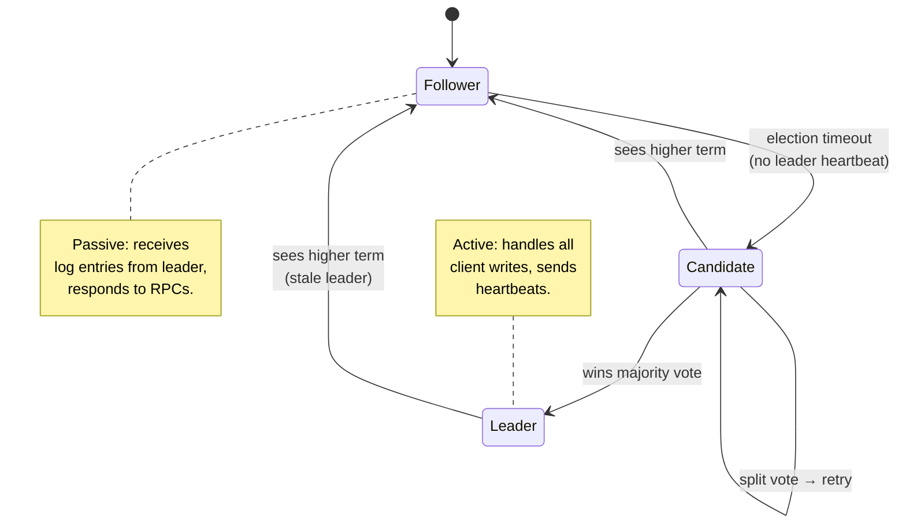

# Module 02 — Distributed Systems Theory

> **Phase I · Foundations · Weeks 4–6**
>
> _"There are only two hard things in distributed systems: 2. Exactly-once delivery, 1. Guaranteed order of messages, 2. Exactly-once delivery."_ — Mathias Verraes

---

## At a Glance

|                              |                                                                                                 |
| ---------------------------- | ----------------------------------------------------------------------------------------------- |
| **Mindset shift**            | From single-machine intuition → reasoning about each node's local view                          |
| **Core concepts**            | 8 fallacies, FLP impossibility, CAP/PACELC, consistency models, time (Lamport/HLC), Raft, CRDTs |
| **Patterns**                 | Quorum R+W>N · Leader election · Gossip · Hinted handoff                                        |
| **Capstone**                 | 3-node KV store with configurable consistency (R, W)                                            |
| **Time investment**          | ~30 hours over 3 weeks                                                                          |
| **One thing to internalize** | Consensus is fundamentally hard. At-least-once + idempotent is the only sustainable design.     |

---

## 1. Mindset

This is the module where most engineers' intuitions break. You've spent years building local programs where:

- Time advances linearly
- Operations either succeed or fail (cleanly)
- Memory is one source of truth
- "Network" is a thing other people deal with

None of this holds in distributed systems. **A distributed system is a set of independent computers that appears to its users as a single coherent system.** Every word in that definition is doing work — and "appears" is doing the most.

The mindset shift: stop reasoning about _the system_ and start reasoning about _each node's local view of the system_. They disagree. They will always disagree for some non-zero window. Your design either embraces this or pretends it doesn't, and reality eventually wins.

---

## 2. Core Concepts

### 2.1 The Eight Fallacies of Distributed Computing (Peter Deutsch)

Every distributed bug you'll write traces back to assuming one of these:

1. The network is reliable
2. Latency is zero
3. Bandwidth is infinite
4. The network is secure
5. Topology doesn't change
6. There is one administrator
7. Transport cost is zero
8. The network is homogeneous

Print this. Tape it to your monitor.

### 2.2 The Two Generals Problem

Two generals on hills, planning to attack a city in the valley. They must attack simultaneously to win. They communicate by messenger through enemy territory. **Can they ever be certain of coordinated attack?**

**Answer**: No. Never.

Proof sketch: General A sends "attack at dawn." Until acknowledgment received, A doesn't know B got it. B sends ack. Until _acknowledgment of the ack_ received, B doesn't know A got the ack. Recurses infinitely.

**Implication**: There is no protocol over an unreliable channel that guarantees both sides reach a confirmed common state. None. Ever.

**Practical consequence**: every distributed transaction relies on probability and timeout, not certainty. Idempotency is not optional.

### 2.3 The FLP Impossibility Result

Fischer, Lynch, Paterson (1985) proved: **In an asynchronous distributed system with even one faulty node, no deterministic consensus algorithm exists that guarantees termination.**

"Asynchronous" means no bound on message delay. "Consensus" means all non-faulty nodes agree on the same value.

**Implication**: All real consensus protocols (Paxos, Raft) work _in practice_ by using timeouts (i.e., they're not purely asynchronous) and accepting that they may not terminate in extreme adversarial scenarios.

You don't need to remember the proof. You need to remember: **consensus is fundamentally hard, and any protocol claiming "always works" is lying about its assumptions.**

### 2.4 CAP Theorem (and Why You Should Stop Quoting It Wrong)

CAP (Brewer): given **Consistency**, **Availability**, **Partition tolerance** — you can have **at most 2** during a partition.

The misquoting: "CAP says you pick 2 of 3."

**The correct framing**:

- Partitions _will happen_ (P is not optional in real systems)
- During a partition, you choose: **respond with possibly-stale data (AP)** or **refuse to respond (CP)**
- When _no partition_, you can have both C and A

It's not "pick 2 of 3." It's "during partition, pick C or A."

| System               | Choice       | Why                                                                |
| -------------------- | ------------ | ------------------------------------------------------------------ |
| **DynamoDB**         | AP           | Always serves a response; eventually consistent reads default      |
| **Spanner**          | CP-ish       | Refuses writes during partition; uses TrueTime for global ordering |
| **MongoDB**          | Tunable      | Replica set quorum determines behavior                             |
| **Etcd / Zookeeper** | CP           | Used as coordinator — staleness is unacceptable                    |
| **Cassandra**        | AP (tunable) | Quorum reads/writes give you a knob                                |

### 2.5 PACELC — The Better CAP

CAP is incomplete. **PACELC** (Abadi): if Partitioned, choose between A and C; **Else** (normal operation), choose between Latency and Consistency.

This is what actually matters day-to-day. **Even without partitions, you trade latency for consistency.** Want strong consistency across regions? You're paying cross-region RTT. Want low latency? You're reading from a local replica that may be stale.

| System    | P→  | E→                                     |
| --------- | --- | -------------------------------------- |
| DynamoDB  | A   | L (low latency, eventual)              |
| Spanner   | C   | C (strong consistency, higher latency) |
| Cassandra | A   | L                                      |
| MongoDB   | C   | C (with strong concerns)               |

### 2.6 Consistency Models — The Real Spectrum

"Consistent" isn't binary. The spectrum, strongest to weakest:

| Model                     | Guarantee                                                   | Cost                      |
| ------------------------- | ----------------------------------------------------------- | ------------------------- |
| **Strict (Linearizable)** | Operations appear atomic, in real-time order                | High — requires consensus |
| **Sequential**            | All nodes see ops in same order (not necessarily real-time) | Lower                     |
| **Causal**                | If A causally precedes B, all nodes see A before B          | Much lower                |
| **Read-your-writes**      | You see your own writes                                     | Cheap                     |
| **Monotonic reads**       | Time only goes forward for a given client                   | Cheap                     |
| **Eventual**              | If updates stop, replicas converge                          | Cheapest                  |

**Most production systems run on causal or eventual.** Strict linearizability is rare and expensive.

**The architect's question is never "is it consistent?" It's "what consistency model fits this use case?"**

Example: a "like" count being slightly stale is fine (eventual). A bank balance going negative is not (strict, with transactional guarantees).

### 2.7 Time in Distributed Systems

**Wall-clock time across nodes is unreliable.** NTP drifts, clocks skew, leap seconds happen.

Solutions:

- **Lamport timestamps**: monotonic logical counter. Captures _causal_ ordering but not concurrency.
- **Vector clocks**: per-node counters. Can detect concurrency (two events neither precedes).
- **Hybrid Logical Clocks (HLC)**: combine wall-clock + logical counter. Used by CockroachDB.
- **TrueTime** (Google Spanner): GPS+atomic clocks giving bounded uncertainty. The only way to do globally-linearizable transactions efficiently.

**Why you care**: any time you order events across nodes, you're picking a clock model. Default assumption (wall time) breaks under contention.

### 2.8 Consensus: Raft (and a Glance at Paxos)

When N nodes must agree on a value (e.g., "who is the leader?"), they run a **consensus protocol**.

**Raft** (Ongaro & Ousterhout, 2014): designed to be understandable. Three roles:

- **Leader**: handles writes, replicates to followers
- **Follower**: replicates leader's log
- **Candidate**: trying to become leader during election

State transitions:



Properties:

- **Election**: when leader heartbeat times out, a follower becomes candidate, requests votes. Majority wins.
- **Log replication**: leader appends entries, replicates to followers. Entry "committed" once majority ack.
- **Safety**: at most one leader per term; committed entries never overwritten.

**Used by**: etcd, Consul, CockroachDB, MongoDB (modified), TiKV, many more.

**Paxos** is older, more general, harder to implement correctly. If you ever see "we use Paxos," they probably mean Multi-Paxos with their own ad-hoc modifications. Raft is what people actually use.

### 2.9 Split-Brain

A **split-brain** occurs when a network partition divides a cluster into two (or more) isolated groups, and each group independently elects a leader — producing two leaders simultaneously writing to their own half of the cluster.

```text
Before partition:         During partition:          After heal:

  A(leader)                A(leader) | B(leader)      Diverged logs,
  B(follower)    ──X──     writes ←  | → writes       conflict to resolve
  C(follower)              C         |
```

**Why it's dangerous**: both leaders accept writes. When the partition heals, you have two divergent write histories. One must be discarded or merged — meaning data loss or complex conflict resolution.

**How systems prevent it**:

- **Quorum majority**: Raft/Paxos require a majority (>N/2) to elect a leader. A partition minority can't reach quorum, so only one partition can have a leader at a time.
- **Fencing tokens**: storage systems issue a monotonic token with each lease. Writes with a stale token are rejected, even if the stale leader thinks it's valid.
- **STONITH** ("Shoot the Other Node in the Head"): on detecting split-brain, one side forcibly fences the other via out-of-band signaling (power control, cloud API shutdown).

**The GitHub 2018 outage was split-brain**: MySQL Orchestrator failed over during a 43-second partition. The old primary recovered still thinking it was primary. Both sides accepted writes for a window before detection.

**Design rule**: if a system uses leader election, ask "what happens if two leaders exist simultaneously?" If the answer is "bad things," confirm your quorum or fencing mechanism prevents it.

### 2.10 Failure Modes

Failures aren't binary. The hierarchy:

1. **Fail-stop**: node crashes, stops responding. _Easiest._
2. **Fail-slow**: node responds but slowly. _Worst — propagates through system._
3. **Network partition**: subset of nodes can't reach another subset.
4. **Byzantine**: node sends arbitrary or malicious responses. _Rarest in trusted networks._

**Grey failure** is the modern category that breaks naive monitoring: a node "seems up" (passes health checks) but is broken in subtle ways. This is where most outages happen now.

### 2.11 CRDTs — Conflict-Free Replicated Data Types

Data structures that automatically merge concurrent updates without coordination. Two kinds:

- **State-based (CvRDT)**: replicas exchange state, merge via commutative function
- **Op-based (CmRDT)**: replicas broadcast operations, must be delivered exactly once

Examples:

- **G-Counter**: grow-only counter. Each node has its own count; total = sum.
- **PN-Counter**: positive + negative G-Counters.
- **LWW-Register**: last-write-wins by timestamp.
- **OR-Set**: observed-remove set. Allows add/remove with conflict resolution.

**Used by**: Riak, Redis CRDTs (Active-Active), Automerge, Yjs (collaborative editing).

**Trade-off**: CRDTs eliminate coordination but limit data model expressiveness. Great for counters, sets, collaborative text. Not great for "transfer $X from A to B."

---

## 3. Patterns

### 3.1 Idempotency — The At-Least-Once Contract

The module's core claim is: **at-least-once delivery + idempotent operations is the only sustainable design.** Here's what that actually means in code.

**The problem**: in a distributed system, a request may be delivered zero, one, or many times due to retries, timeouts, and network failures. You cannot know from the sender's side whether the operation executed.

**At-least-once** delivery means: retry until you get an acknowledgment. The operation _will_ execute — but may execute more than once.

**Idempotency** means: executing the same operation N times produces the same result as executing it once.

```text
Non-idempotent:     POST /transfer { amount: $100 }
  → retry × 3 → $300 transferred ← disaster

Idempotent:         POST /transfer { idempotency_key: "txn-abc-123", amount: $100 }
  → retry × 3 → $100 transferred, 2 duplicates rejected
```

**Implementation pattern — idempotency keys**:

1. Client generates a unique key per logical operation (UUID or hash of inputs)
2. Server stores `(idempotency_key → result)` before returning
3. On duplicate request with same key: return stored result, skip execution
4. Key TTL: long enough for all retries (typically 24h–7d)

```go
func (s *Server) HandleTransfer(ctx context.Context, req TransferRequest) (*TransferResult, error) {
    // Check for duplicate
    if cached, ok := s.idempotencyStore.Get(req.IdempotencyKey); ok {
        return cached, nil
    }
    result, err := s.doTransfer(ctx, req)
    if err != nil {
        return nil, err
    }
    // Store before returning — even on partial failure, safe to replay
    s.idempotencyStore.Set(req.IdempotencyKey, result, 7*24*time.Hour)
    return result, nil
}
```

**Storage-layer idempotency** (upsert pattern):

```sql
-- Instead of INSERT (fails on retry):
INSERT INTO payments (id, amount) VALUES ($1, $2)

-- Use INSERT ... ON CONFLICT DO NOTHING:
INSERT INTO payments (id, amount) VALUES ($1, $2)
ON CONFLICT (id) DO NOTHING
RETURNING *;
```

**Where idempotency is hardest**: operations with external side effects (sending email, charging a card, posting to a webhook). For these, use a **transactional outbox** — write the intent to your own DB atomically, then a background worker delivers it exactly once with deduplication on the consumer.

**Rule**: every API endpoint that mutates state must document its idempotency guarantee. "Not idempotent" is a valid answer — but it must be a deliberate choice, not an oversight.

### 3.2 Quorum Reads & Writes

Replicate data to **N** nodes. Require **W** acks to consider a write successful, **R** acks to read.

**Rule**: **R + W > N** guarantees strong consistency (read will see latest write).

Common configs:

- N=3, W=2, R=2: typical strong-ish, tolerates 1 failure
- N=3, W=3, R=1: fast reads, slow/fragile writes
- N=3, W=1, R=1: fast everything, eventual consistency

Used by: Cassandra, DynamoDB (configurable), Riak.

### 3.3 Leader Election

One node becomes the source of truth for writes. Reduces coordination complexity.

Approaches:

- **Static**: configured manually (bad)
- **Bully algorithm**: highest-ID node wins (simple, fragile)
- **Raft / ZAB**: consensus-based (robust)
- **Distributed lock service**: use Zookeeper/etcd to elect

Used by: most leader-follower DBs (PostgreSQL, MySQL primary), Kafka controllers, Kubernetes control plane.

### 3.4 Two-Phase Commit (2PC) — and Why It's Usually Wrong

Classic distributed transaction: coordinator asks all participants to "prepare," then "commit."

**Why it's avoided in modern systems**:

- Blocking: if coordinator crashes after prepare, participants wait forever
- Slow: requires synchronous coordination across all participants
- Doesn't compose with high-availability designs

**What replaced it**: Sagas (Module 05), or single-node transactions + eventual consistency.

### 3.5 Hinted Handoff

When a write arrives but its target replica is **temporarily down**, rather than fail the write, a live node accepts it with a "hint" — a note saying "deliver this to node X when it recovers."

```text
Normal write (N=3, W=2):          With hinted handoff (node C down):

  Client                            Client
    │ PUT key=foo                     │ PUT key=foo
    ▼                                 ▼
  Node A ──replicate──▶ Node B      Node A ──replicate──▶ Node B
           ──replicate──▶ Node C              ──hint──────▶ Node D
                                                (stores hint for C)
                                     When C recovers:
                                     Node D ──replay──▶ Node C
```

**Properties**:

- Improves write availability without sacrificing durability
- Hint storage is bounded — if the target is down too long, hints expire and anti-entropy (full repair) catches up
- Does **not** count toward quorum W — the write is not durable on C until replayed

**Used by**: Cassandra, Amazon Dynamo, Riak.

**The failure mode**: if the hinting node crashes before replaying, the hint is lost. This is why W must be set high enough that you never rely solely on hinted handoff for durability.

### 3.6 Sloppy Quorum

Strict quorum (R+W>N) requires the _designated_ N replicas to respond. **Sloppy quorum** relaxes this: during a partition, a write may be accepted by any W available nodes, even if some aren't in the "home" replica set.

```text
Strict quorum (N=3, home={A,B,C}):
  If C is down → write must wait for C or fail

Sloppy quorum (N=3):
  If C is down → D accepts write with a hint "deliver to C"
  W=2 still satisfied (A + D), write succeeds
```

This is what makes hinted handoff (3.5) coherent — sloppy quorum is the policy, hinted handoff is the mechanism for eventual delivery.

**Trade-off**: sloppy quorum improves write availability but weakens consistency guarantees. A read of R=2 from {A,B} may miss the write that went to {A,D}.

**Used by**: Amazon Dynamo, Cassandra, Riak.

### 3.7 Anti-Entropy and Merkle Trees

Even with hinted handoff and gossip, replicas drift. **Anti-entropy** is the background process that detects and repairs divergence.

**Naive approach**: compare every key across replicas. Too slow at scale.

**Merkle tree approach**: build a hash tree over the keyspace. Each leaf is a hash of a key-value pair. Each internal node is a hash of its children.

```text
        root
       /    \
    h(AB)  h(CD)
    /  \   /  \
  h(A) h(B) h(C) h(D)

Two replicas compare roots:
  Same root → no divergence, done
  Different root → compare children → find divergent subtree
  Only exchange the divergent leaf range
```

**Properties**:

- Detects divergence in O(log N) comparisons
- Repairs only the divergent range, not the full dataset
- Runs continuously in background at low priority

**Used by**: DynamoDB, Cassandra, Riak, Amazon S3.

**The failure mode**: Merkle anti-entropy finds _what_ differs, not _which version wins_. You still need a conflict resolution policy (LWW, vector clock comparison, CRDT merge).

### 3.8 Read Repair

When a read fetches from R replicas and detects inconsistency (different values or vector clock versions), the coordinator **repairs the stale replicas inline** — no background job needed.

```text
Client GET key="user:42" (R=2)

Coordinator reads from A and B:
  A returns: {value: "alice@old.com", vc: {A:3}}
  B returns: {value: "alice@new.com", vc: {A:4}}

B's version is fresher (A:4 > A:3).
Coordinator:
  1. Returns B's value to client
  2. Sends async write of B's value to A  ← read repair
```

**Properties**:

- Repairs on the critical path (latency is already paid)
- Convergence is proportional to read frequency — hot keys heal fast, cold keys may stay stale
- Should be asynchronous so the client doesn't wait for the repair write

**Limitation**: read repair only fires on reads. Keys that are never read after a divergence won't heal — this is why anti-entropy (3.7) is also needed.

**Used by**: Cassandra, DynamoDB, Riak, your capstone stretch goal.

### 3.9 Circuit Breaker

When a downstream service is slow or failing, a naive caller retries — amplifying load on an already-struggling system. The **circuit breaker** pattern interrupts this feedback loop.

Three states:

```text
         failures > threshold               success > threshold
CLOSED ──────────────────────▶ OPEN ──────────────────────────▶ HALF-OPEN
  │                              │                                   │
  │ (normal operation,           │ (reject all calls                 │ (probe with
  │  count failures)             │  immediately, no wait)            │  limited traffic)
  └──────────────────────────────┴───────────────────────────────────┘
```

```go
type CircuitBreaker struct {
    mu           sync.Mutex
    state        State // Closed, Open, HalfOpen
    failures     int
    threshold    int
    lastFailure  time.Time
    resetTimeout time.Duration
}

func (cb *CircuitBreaker) Call(fn func() error) error {
    cb.mu.Lock()
    switch cb.state {
    case Open:
        if time.Since(cb.lastFailure) > cb.resetTimeout {
            cb.state = HalfOpen
        } else {
            cb.mu.Unlock()
            return ErrCircuitOpen // fast-fail, no call made
        }
    }
    cb.mu.Unlock()

    err := fn()

    cb.mu.Lock()
    defer cb.mu.Unlock()
    if err != nil {
        cb.failures++
        cb.lastFailure = time.Now()
        if cb.failures >= cb.threshold {
            cb.state = Open
        }
    } else {
        cb.failures = 0
        cb.state = Closed
    }
    return err
}
```

**Why it matters**: circuit breakers prevent a slow dependency from exhausting your connection pool, goroutine pool, or thread pool. A cascading failure that takes down a whole service cluster almost always starts with a slow downstream — and a caller that keeps retrying.

**Used by**: Netflix Hystrix (archived), resilience4j, every serious service mesh (Envoy, Linkerd).

**Design rule**: set the timeout shorter than your upstream's timeout. A circuit that opens after 30 seconds doesn't protect you if your upstream times out in 25.

### 3.10 Backpressure

When a consumer can't keep up with a producer, the queue grows until memory is exhausted or latency becomes unacceptable. **Backpressure** propagates the "slow down" signal upstream rather than buffering infinitely.

```text
Without backpressure:
  Producer ──1000 rps──▶ [Queue ∞] ──100 rps──▶ Consumer
                          grows without bound → OOM

With backpressure:
  Producer ──1000 rps──▶ [Queue, cap=500] ──100 rps──▶ Consumer
                          full → reject/block
                ◀── "slow down" ────────────────
  Producer ──100 rps──▶ ...
```

**Mechanisms**:

- **Reject**: return 429/503, let caller retry with backoff (simplest, works for stateless APIs)
- **Block**: block the producer's send call until capacity is available (works in-process)
- **Drop**: drop the oldest items (acceptable for metrics, never for financial data)
- **Propagate**: flow-control signals all the way to the origin (TCP does this natively; gRPC supports it)

**Connection to fail-slow (2.10)**: fail-slow nodes cause backpressure to accumulate silently. The symptom is queues growing and latency creeping up — not errors. This is why queue depth and processing lag are first-class metrics, not just request rate.

**Design rule**: every queue in your system should have a bounded capacity. An unbounded queue is a time bomb. The policy for what happens when it's full is a product decision, not an implementation detail.

### 3.11 Gossip Protocols

Each node periodically tells a few random neighbors what it knows. Information spreads exponentially.

**Properties**: scales to many nodes, robust to failure, but eventually consistent and unbounded propagation time.

Used by: Cassandra (cluster state), Consul (service catalog), Redis Cluster.

---

## 4. Go Implementation: A Simple Vector Clock

```go
// vectorclock/vc.go
package vectorclock

import (
	"fmt"
	"strings"
)

// VectorClock tracks per-node logical timestamps.
type VectorClock struct {
	NodeID string
	Clock  map[string]uint64
}

func New(nodeID string) *VectorClock {
	return &VectorClock{
		NodeID: nodeID,
		Clock:  map[string]uint64{nodeID: 0},
	}
}

// Tick advances local clock for a local event.
func (v *VectorClock) Tick() {
	v.Clock[v.NodeID]++
}

// Update merges an incoming clock (from a received message) into this one.
func (v *VectorClock) Update(other map[string]uint64) {
	for node, ts := range other {
		if ts > v.Clock[node] {
			v.Clock[node] = ts
		}
	}
	v.Tick() // increment local for the receive event
}

// HappensBefore reports whether v causally precedes other.
// v < other iff for all nodes: v[n] <= other[n] AND exists n: v[n] < other[n]
func (v *VectorClock) HappensBefore(other *VectorClock) bool {
	allLeq := true
	someStrict := false
	allNodes := unionKeys(v.Clock, other.Clock)
	for _, n := range allNodes {
		vn := v.Clock[n]
		on := other.Clock[n]
		if vn > on {
			allLeq = false
			break
		}
		if vn < on {
			someStrict = true
		}
	}
	return allLeq && someStrict
}

// Concurrent reports whether v and other are causally concurrent
// (neither happens-before the other).
func (v *VectorClock) Concurrent(other *VectorClock) bool {
	return !v.HappensBefore(other) && !other.HappensBefore(v) && !v.Equal(other)
}

func (v *VectorClock) Equal(other *VectorClock) bool {
	allNodes := unionKeys(v.Clock, other.Clock)
	for _, n := range allNodes {
		if v.Clock[n] != other.Clock[n] {
			return false
		}
	}
	return true
}

func (v *VectorClock) String() string {
	var parts []string
	for n, ts := range v.Clock {
		parts = append(parts, fmt.Sprintf("%s:%d", n, ts))
	}
	return "{" + strings.Join(parts, ",") + "}"
}

func unionKeys(a, b map[string]uint64) []string {
	seen := map[string]struct{}{}
	for k := range a {
		seen[k] = struct{}{}
	}
	for k := range b {
		seen[k] = struct{}{}
	}
	keys := make([]string, 0, len(seen))
	for k := range seen {
		keys = append(keys, k)
	}
	return keys
}
```

**Usage** (collaborative document scenario):

```go
alice := New("alice")
bob := New("bob")

alice.Tick()              // alice edits: {alice:1}
bob.Tick()                // bob edits concurrently: {bob:1}
fmt.Println(alice.Concurrent(bob)) // true — conflict to resolve

// alice sends her change to bob:
bob.Update(alice.Clock)   // bob now has {alice:1, bob:2}
bob.Tick()                // bob edits again: {alice:1, bob:3}

// now alice receives from bob:
alice.Update(bob.Clock)   // alice has {alice:2, bob:3}, no concurrency now
```

**Why this matters**: vector clocks are the foundation of CRDTs, eventually-consistent stores, and collaborative editing. The code is ~50 lines. The concept underpins billion-dollar systems.

---

## 5. Observability in Distributed Systems

Distributed systems are hard to build. They are even harder to debug without the right observability primitives. This section covers the one thing that separates engineers who diagnose distributed failures in minutes from those who spend days: **distributed tracing**.

### 5.1 The Three Pillars

| Pillar      | What it captures                 | When it's enough                       |
| ----------- | -------------------------------- | -------------------------------------- |
| **Logs**    | Discrete events on one node      | Single-node failures, audit trails     |
| **Metrics** | Aggregated numbers over time     | Alerting, capacity planning            |
| **Traces**  | A request's journey across nodes | Latency debugging, dependency failures |

Logs and metrics are necessary but insufficient for distributed systems. A p99 latency spike tells you _something_ is slow. A trace tells you _which node, which span, which dependency_ caused it.

### 5.2 Correlation IDs — the Minimum Viable Observability

Before you have a full tracing system, **every request must carry a correlation ID**.

```text
Client → Gateway → Auth Service → DB
          │             │
          └─────────────┴── same X-Correlation-ID: "req-7f3a"

grep "req-7f3a" across all service logs → full request timeline
```

**Rules**:

- Generate at the edge (API gateway or client) if not present
- Propagate through every downstream call: HTTP headers, message queue metadata, async job payloads
- Log it on every log line that touches the request
- Never regenerate mid-flight — one ID for the full logical operation

**In Go**:

```go
func WithCorrelationID(next http.Handler) http.Handler {
    return http.HandlerFunc(func(w http.ResponseWriter, r *http.Request) {
        id := r.Header.Get("X-Correlation-ID")
        if id == "" {
            id = uuid.New().String()
        }
        ctx := context.WithValue(r.Context(), ctxKeyCorrelationID, id)
        w.Header().Set("X-Correlation-ID", id)
        next.ServeHTTP(w, r.WithContext(ctx))
    })
}
```

### 5.3 Distributed Tracing — How It Works

A **trace** is a directed acyclic graph of **spans**. Each span represents one unit of work (an RPC call, a DB query, a cache lookup) with a start time, duration, and metadata.

```text
Trace: req-7f3a  (total: 95ms)
│
├── [Gateway]          0–5ms    "route request"
├── [Auth Service]     5–20ms   "validate JWT"
│   └── [Redis]        6–10ms   "cache lookup"
├── [Product Service]  20–90ms  "fetch product"   ← slow!
│   ├── [Postgres]     21–85ms  "SELECT products" ← missing index?
│   └── [Cache]        86–88ms  "write-through"
└── [Gateway]          90–95ms  "serialize response"
```

This view is impossible to reconstruct from individual node logs. It requires propagating trace context through every hop.

**Context propagation** (W3C Trace Context standard):

```text
traceparent: 00-4bf92f3577b34da6a3ce929d0e0e4736-00f067aa0ba902b7-01
             ^^ ^^^^^^^^^^^^^^^^^^^^^^^^^^^^^^^^ ^^^^^^^^^^^^^^^^ ^^
             version  trace-id (128-bit)          span-id (64-bit)  flags
```

Every service reads this header on ingress, creates a child span, and forwards the header to downstream calls.

### 5.4 What to Instrument

For each service, instrument at minimum:

- **Inbound requests**: method, path, status code, duration
- **Outbound calls**: target service, duration, error
- **Database queries**: query fingerprint, duration, row count
- **Queue operations**: topic, lag, processing time
- **Cache operations**: hit/miss ratio, latency

**The "four golden signals"** (Google SRE):

1. **Latency** — how long requests take (separate successful vs failed)
2. **Traffic** — requests per second
3. **Errors** — rate of failed requests
4. **Saturation** — how "full" the system is (CPU, queue depth, connection pool)

If you instrument nothing else, instrument these four per service.

### 5.5 Tools

| Layer   | OSS options                   | Managed options                   |
| ------- | ----------------------------- | --------------------------------- |
| Tracing | Jaeger, Zipkin, OpenTelemetry | Datadog APM, Honeycomb, AWS X-Ray |
| Metrics | Prometheus + Grafana          | Datadog, New Relic                |
| Logs    | Loki, ELK stack               | Datadog Logs, CloudWatch          |

**OpenTelemetry** is the standard instrumentation layer — instrument once, export to any backend. Use it in all new services.

> **Rule**: if you can't trace a request end-to-end in production, your distributed system is a black box. You will debug by guesswork. Correlation IDs cost nothing — add them on day one.

---

## 6. Trade-offs Table

| Decision                          | Strong Consistency              | Eventual Consistency             |
| --------------------------------- | ------------------------------- | -------------------------------- |
| **Latency**                       | High (consensus RTTs)           | Low (local reads/writes)         |
| **Availability during partition** | Reduced (CP)                    | Full (AP)                        |
| **Programming model**             | Familiar (transactions)         | Foreign (conflict resolution)    |
| **Cost at scale**                 | Expensive (cross-region coord.) | Cheap                            |
| **Right for**                     | Money, identity, inventory      | Counts, feeds, "likes," presence |

| Decision          | Synchronous Replication        | Asynchronous Replication        |
| ----------------- | ------------------------------ | ------------------------------- |
| **Durability**    | Higher (write to N before ack) | Lower (lag window of data loss) |
| **Write latency** | Higher                         | Lower                           |
| **Failover**      | Clean (replica is up-to-date)  | May lose recent writes          |

---

## 6. Real-World Failures

**GitHub's 24-hour outage (Oct 2018)**:

- 43-second network partition between East/West Coast data centers
- MySQL Orchestrator failed over to a stale replica
- Detected too late; recovery took 24 hours
- Lesson: failover automation must distinguish "primary down" from "primary unreachable" — the **split-brain** scenario

**Roblox 73-hour outage (Oct 2021)**:

- Consul (uses Raft) cluster degraded due to write contention
- Streaming feature pushed Consul beyond design point
- Lesson: consensus systems have capacity limits. "We use Raft" doesn't mean "infinite scale"

**Cloudflare outage (2020) — leap second style**:

- Time skew between machines caused some servers to reject all requests
- Lesson: never trust wall clocks for ordering. Even NTP-synced clocks skew.

---

## 7. Design Challenges

### Challenge 2.1 — Choose a Consistency Model (20 min)

For each system, pick a consistency model (strict / sequential / causal / read-your-writes / eventual) and justify:

1. WhatsApp message delivery
2. Twitter timeline
3. Stock trading order book
4. Google Docs collaborative editing
5. DNS resolution
6. Banking transfer
7. Hotel room booking

### Challenge 2.2 — Design a Leader Election (45 min)

Without using Zookeeper/etcd, design leader election for a 5-node cluster. Specify:

- How a node becomes candidate
- How votes are cast
- How split-vote is handled
- How a partition between nodes is detected
- Recovery when partition heals

Then critique your design against Raft. What does Raft do better? What does your simpler design buy you?

### Challenge 2.3 — Quorum Math (15 min)

Given N=5 replicas:

- What R, W gives strong consistency?
- What's the highest availability for writes (lowest W)?
- What's the highest read availability (lowest R)?
- If you set W=3, R=3, how many nodes can fail and the system still serves both reads and writes?

---

## 8. Capstone Project — Build a Toy Distributed Key-Value Store

**Goal**: implement a 3-node KV store with replication. Choose a consistency model and stick to it.

**Requirements**:

- HTTP API: `PUT /kv/{key}`, `GET /kv/{key}`, `DELETE /kv/{key}`
- 3 nodes, each running the same binary, configured with peer addresses
- Replication factor 3
- Configurable W (1, 2, or 3) and R (1, 2, or 3) per request via headers
- Handles a partition: simulate by killing/restarting a node — system should keep serving
- Reports per-key version (vector clock or Lamport)

**Stretch goals**:

- Implement read-repair: if reads see disagreement, push freshest to stale replicas
- Implement hinted handoff: if a replica is down during write, queue and replay
- Implement a simple gossip-based membership

**Grading**:

- [ ] Works on happy path
- [ ] Configurable consistency (R, W)
- [ ] Survives a node going down (depending on R, W)
- [ ] You can explain your consistency model trade-offs in 2 minutes
- [ ] You can describe one bug you encountered and fixed

**Skeleton** (start here):

```go
// node/main.go — minimal skeleton
package main

import (
	"flag"
	"net/http"
	// ...
)

type Node struct {
	ID    string
	Peers []string
	Store map[string]versionedValue
	// mu sync.RWMutex
}

type versionedValue struct {
	Value     []byte
	VectorClk map[string]uint64
}

func main() {
	id := flag.String("id", "", "node id")
	addr := flag.String("addr", ":8080", "listen addr")
	peers := flag.String("peers", "", "comma-separated peer URLs")
	flag.Parse()

	n := &Node{
		ID:    *id,
		Peers: parsePeers(*peers),
		Store: map[string]versionedValue{},
	}
	http.HandleFunc("/kv/", n.handleKV)
	http.HandleFunc("/_replicate/", n.handleReplicate)
	http.ListenAndServe(*addr, nil)
}
// TODO: implement handlers, replication, vector clocks
```

This is non-trivial. Budget 8–15 hours. **Push through. The lessons are in the bugs.**

---

## 9. ADR Practice

Write **ADR-002** for your KV store: _Decision: consistency model and quorum configuration._

Must include:

- The C/A trade-off you made
- Why this fits your hypothetical use case
- What you'd change if the use case changed
- One specific failure scenario your config handles, and one it doesn't

---

## 10. Mock Interview

**Prompt** (60 min):

> Design a globally distributed user session store. Sessions are read on every authenticated request (high RPS), written on login/logout (lower). The product is in 5 regions. A session is ~2KB. Loss of a session means a user is logged out (annoying, not catastrophic).

**Watch for**:

- Do you ask about read:write ratio? Acceptable staleness?
- Do you pick CP or AP and justify?
- Do you discuss replication strategy (sync vs async, all-replicas vs region-local)?
- Do you handle the "user moves regions mid-session" case?

**Rubric** — Architect-level expectations:

- [ ] Frames C vs A explicitly given the product context
- [ ] Picks AP with regional replication, justifies
- [ ] Discusses session affinity / sticky routing
- [ ] Mentions vector clocks or LWW for conflict resolution
- [ ] Acknowledges grey-failure mode (replication lag > session lifetime)

---

## 11. Further Reading

**Books**:

- _Designing Data-Intensive Applications_ — Chapters 5, 7, 8, 9 (this module IS those chapters)
- _Database Internals_ — Alex Petrov (Part II — Distributed Systems)

**Papers**:

- "Time, Clocks, and the Ordering of Events" — Lamport (1978). Foundational.
- "The Part-Time Parliament" — Lamport (Paxos). Famously dense.
- "In Search of an Understandable Consensus Algorithm" — Ongaro, Ousterhout (Raft).
- "Dynamo: Amazon's Highly Available Key-value Store" (2007)
- "Conflict-free Replicated Data Types" — Shapiro et al.

**Interactive**:

- raft.github.io — Raft visualization
- thesecretlivesofdata.com/raft — Raft animation

**Talks**:

- "Distributed Systems Theory for the Distributed Systems Engineer" — Aphyr
- "Jepsen tests" by Kyle Kingsbury — read the analysis posts. They're worth more than most courses.

---

## Module Completion Checklist

- [ ] Can state the FLP impossibility result without notes
- [ ] Can explain why "CAP = pick 2" is misleading
- [ ] Can pick a consistency model for a given product and defend it
- [ ] Built the vector clock toy
- [ ] Built the 3-node KV store capstone
- [ ] Wrote ADR-002
- [ ] Self-scored mock interview

**Next**: Module 03 — Data at Scale. Where consistency models meet actual storage engines.
