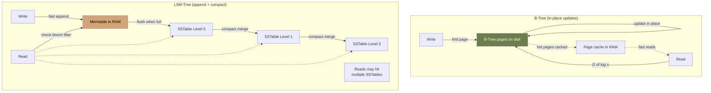
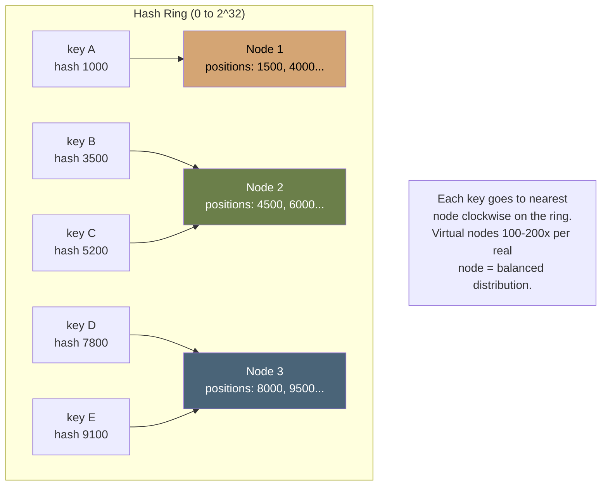

# Module 03 — Data at Scale

> **Phase I · Foundations · Weeks 7–8**
>
> _"Choose your data model before your database. Choose your access patterns before your data model."_

---

## At a Glance

|                              |                                                                                                                                        |
| ---------------------------- | -------------------------------------------------------------------------------------------------------------------------------------- |
| **Mindset shift**            | Pick storage from access patterns, not from fashion                                                                                    |
| **Core concepts**            | B-Tree vs LSM, indexing, partitioning (range/hash/consistent), replication, OLTP vs OLAP, ACID/BASE, isolation levels, CDC, vector DBs |
| **Patterns**                 | Read-replica · Materialized view · CQRS read model · Polyglot persistence                                                              |
| **Capstone**                 | Full data architecture document for a real-estate search system                                                                        |
| **Time investment**          | ~20 hours over 2 weeks                                                                                                                 |
| **One thing to internalize** | Every quality attribute trade-off in storage is a workload bet. Get the workload analysis right first.                                 |

---

## 1. Mindset

Most engineers pick databases by reputation: "we use Postgres" or "MongoDB scales." That's not architecture — that's tribalism.

Architects pick storage based on **access patterns** and **quality attributes**. They know _why_ each storage engine exists, what trade-off it embodies, and the cost of getting it wrong.

This module makes you fluent in the _internals_ — enough to predict performance, debug pathological queries, and have credible opinions in design reviews. You don't need to write a B-tree from scratch. You need to know _which storage shape_ fits _which problem_.

---

## 2. Core Concepts

### 2.1 Storage Engines: B-Tree vs LSM-Tree

Two dominant storage engine families. They embody opposite trade-offs.

**B-Tree** (read-optimized):

- Tree of disk pages, typically 4-16 KB each
- Reads: O(log n) page accesses. Pages cached in memory.
- Writes: in-place update of a page. Random I/O.
- Used by: PostgreSQL, MySQL InnoDB, SQL Server, MongoDB (WiredTiger default).

**LSM-Tree** (write-optimized):

- Writes go to in-memory **memtable**, periodically flushed to immutable **SSTables** on disk
- Background compaction merges SSTables
- Reads may need to check multiple SSTables (mitigated by bloom filters)
- Used by: Cassandra, RocksDB, LevelDB, ScyllaDB, HBase, BigTable.

Visually:



**The trade-off**:

|                     | B-Tree             | LSM                             |
| ------------------- | ------------------ | ------------------------------- |
| Write throughput    | Lower              | Higher (sequential writes)      |
| Write amplification | ~1× (in-place)     | 10-30× (compaction)             |
| Read latency        | Predictable        | Variable (compaction-dependent) |
| Space efficiency    | Some fragmentation | Better (after compaction)       |
| Range scans         | Excellent          | Good                            |

**Rule of thumb**: write-heavy workloads → LSM. Read-heavy with complex queries → B-Tree.

> 💡 **See in practice**: [ADR-005](../examples/adrs/adr-005-scylladb.md) walks through a real migration from Cassandra (LSM, JVM-based) to ScyllaDB (same LSM model, but C++ — no GC) at scale.

### 2.2 Indexing

An index is **a separate data structure that maps from a search key to a row location.** Trade-off: faster reads on the indexed column, slower writes (must update index), more storage.

Index types:

- **B-Tree index**: default. Good for equality and range queries. `WHERE age > 30`.
- **Hash index**: O(1) equality lookup. No range queries. (PostgreSQL has hash indexes; rarely used.)
- **Bitmap index**: low-cardinality columns (sex, status). Used in OLAP.
- **Full-text index**: tokenized inverted index (Module 07).
- **Spatial index** (R-Tree, GiST): geo queries. PostGIS, ScyllaDB.
- **Vector index** (HNSW, IVF): similarity search for embeddings. pgvector, Milvus.

**Composite indexes**: order matters. `(user_id, created_at)` supports:

- `WHERE user_id = X` ✓
- `WHERE user_id = X AND created_at > Y` ✓
- `WHERE created_at > Y` ✗ (won't use index efficiently)

**Architect's rule**: every query in your top 20 by frequency should hit an index. EXPLAIN ANALYZE everything that gets paged.

### 2.3 Partitioning (Sharding)

When data exceeds a single machine, you split it. Strategies:

**Range partitioning**:

- Each shard handles a key range (e.g., A-F, G-M, N-Z)
- Good: range scans efficient
- Bad: hot spots (everyone named "S" lives on one shard)
- Used by: HBase, BigTable

**Hash partitioning**:

- `shard = hash(key) % N`
- Good: uniform distribution
- Bad: range scans hit every shard
- Bad: resharding requires moving everything when N changes

**Consistent hashing**:

- Maps keys and nodes to a ring; key → nearest node clockwise
- Adding/removing a node moves only ~1/N keys
- Used by: DynamoDB, Cassandra, Memcached clients



When a node is added or removed, **only keys mapped to its segment move**. Other nodes are unaffected. This is the property that makes consistent hashing scale.

**Directory-based (lookup) partitioning**:

- A metadata service decides where keys live
- Maximum flexibility, single point of failure if not careful
- Used by: HDFS NameNode, Vitess

### 2.4 Replication

Multiple copies of data for **durability** (survive disk failure) and **availability** (survive node failure) and sometimes **read scaling**.

**Topologies**:

- **Single-leader (primary-replica)**: writes go to leader, replicate to followers. Reads can go anywhere (with staleness).
- **Multi-leader**: any node accepts writes. Conflict resolution required.
- **Leaderless**: every node equal. Use quorum reads/writes (R+W>N).

**Sync vs async**:

- Synchronous: leader waits for replica ack before responding. Durable but slower.
- Asynchronous: leader responds immediately, replicates in background. Faster but can lose writes on leader crash.
- Semi-synchronous: one replica synchronous, others async. Common compromise.

### 2.5 OLTP vs OLAP

Two fundamentally different access patterns. Two fundamentally different storage shapes.

|                | OLTP                    | OLAP                                    |
| -------------- | ----------------------- | --------------------------------------- |
| Operations     | Many small reads/writes | Few large scans/aggregations            |
| Latency target | Milliseconds            | Seconds-minutes                         |
| Data freshness | Real-time               | Hours/days lag OK                       |
| Storage layout | **Row-oriented**        | **Column-oriented**                     |
| Indexes        | Many, narrow            | Few, often none (full scan + filter)    |
| Examples       | PostgreSQL, MySQL       | Snowflake, BigQuery, ClickHouse, DuckDB |

**Why columnar wins at OLAP**: when you `SELECT AVG(revenue) FROM sales WHERE year=2024`, you read _only_ the `revenue` and `year` columns. In a row store, you read every column of every row. Columnar = 10-100× faster for analytics.

**HTAP** (Hybrid Transactional/Analytical) is the unicorn quest to combine these. SingleStore, TiDB, CockroachDB attempt it. Most production setups use **OLTP + CDC → OLAP** instead (Module 05).

### 2.6 ACID vs BASE

**ACID** (single-node SQL DB world):

- **Atomicity**: transaction all-or-nothing
- **Consistency**: DB invariants hold after txn (foreign keys, etc.)
- **Isolation**: concurrent txns don't see each other's intermediate states
- **Durability**: committed data survives crashes

**BASE** (distributed/NoSQL world):

- **Basically Available**: system responds (maybe with stale data)
- **Soft state**: state may change without input (replicas converge)
- **Eventual consistency**: replicas eventually agree

**Reality**: most NoSQL databases now offer ACID on single partitions. Most SQL databases offer BASE-like behavior across replicas. The dichotomy is dated. Ask about specific guarantees, not the acronym.

### 2.7 Isolation Levels

A subtle topic that bites everyone eventually.

Standard SQL isolation levels, weakest to strongest:

- **Read Uncommitted**: see uncommitted (dirty) reads. Rarely useful.
- **Read Committed**: only see committed data. Still allows non-repeatable reads.
- **Repeatable Read**: same query in same txn returns same data. PostgreSQL default is _actually_ a snapshot isolation variant called this.
- **Snapshot Isolation**: each txn sees a snapshot at start. Most modern DBs default.
- **Serializable**: as if txns ran one at a time. Strongest, slowest.

**Phenomena**:

- **Dirty read**: read uncommitted write
- **Non-repeatable read**: same row read twice gives different values
- **Phantom read**: same range query returns different rows
- **Write skew**: two txns each read X, both modify Y based on X, both commit — invariant on X violated

**Snapshot isolation does not prevent write skew.** This is where most real bugs hide. If correctness requires "if X then Y," use **SERIALIZABLE** or explicit locking (`SELECT FOR UPDATE`).

### 2.8 Vector Databases & pgvector

Embeddings (numeric vectors representing meaning, ~1500 dims for OpenAI embeddings) are the new index target.

**Similarity search**: given a query vector, find K nearest neighbors. Naïve = O(n × d), unusable at scale.

**Approximate Nearest Neighbor (ANN)** algorithms:

- **HNSW** (Hierarchical Navigable Small World): graph-based, fast, popular
- **IVF** (Inverted File): partitions vectors into clusters, searches relevant clusters
- **PQ** (Product Quantization): compresses vectors for memory efficiency

**pgvector** brings ANN to PostgreSQL. Lets you keep relational + vector in one DB.

- Pro: simpler stack, transactional consistency
- Con: not as fast as dedicated (Milvus, Pinecone) at very large scale

For < 10M vectors, pgvector is usually enough. Above that, evaluate dedicated stores.

### 2.9 CDC — Change Data Capture

Stream of every change to a database. Replication on steroids.

How: read the DB's write-ahead log (PostgreSQL: logical replication; MySQL: binlog) and emit each change as an event.

**Tools**: Debezium (the dominant CDC platform), AWS DMS, Maxwell, custom.

**Why it matters**: lets you keep multiple downstream systems (search index, analytics warehouse, cache) in sync with your OLTP DB without dual writes.

**The dual-write problem**: app writes to DB and Kafka. They diverge under failure. CDC solves this — the DB is the source of truth, events derive from it.

### 2.10 Bloom Filters

A probabilistic data structure that answers: "is this key definitely NOT in the set?" with zero false negatives, at the cost of rare false positives.

- Space: ~10 bits per element for 1% false-positive rate
- Lookup: O(k) hash computations, no disk I/O
- Cannot delete entries (without a counting variant)

**Why LSM trees rely on them**: without a bloom filter, a read for a non-existent key must scan every SSTable level — expensive. With a bloom filter per SSTable, most non-existent key lookups are short-circuited in memory.

**Other uses**: "have I seen this URL before?" (web crawlers), "does this username exist?" before a DB round-trip, spam filter pre-check.

Rule: any system that frequently queries for keys that don't exist is a bloom filter candidate.

### 2.11 Connection Pooling

Every time your app opens a raw connection to PostgreSQL, the DB forks a process (~5MB RAM, ~50ms setup). At 500 concurrent requests, that's 2.5GB just in connection overhead — before any query runs.

**Solution**: a connection pool holds a fixed number of live connections and queues requests against them.

| Mode              | Tool                                         | How it works                         |
| ----------------- | -------------------------------------------- | ------------------------------------ |
| Client-side pool  | `pgxpool` (Go), `HikariCP` (Java), `asyncpg` | Pool lives in the app process        |
| Server-side proxy | **PgBouncer**                                | Separate process; apps connect to it |
| Managed           | RDS Proxy, Cloud SQL Auth Proxy              | Cloud-native, auto-scaling           |

**PgBouncer modes**:

- **Session mode**: one server connection per client session. Safest, lowest multiplexing.
- **Transaction mode**: connection returned to pool after each transaction. Most efficient. Breaks `LISTEN/NOTIFY`, prepared statements, advisory locks.
- **Statement mode**: connection returned after each statement. Breaks multi-statement transactions entirely. Rarely used.

**Rule of thumb**: max pool size ≈ `(number of CPU cores on DB host) × 2 + number of disks`. A 16-core machine typically caps out at ~40-50 useful connections. More connections = more context switching, not more throughput.

> 💡 **Failure pattern**: teams set pool max to 500 because "it's just a config value." The DB chokes under lock contention and context switching. Start low, instrument, raise only with evidence.

### 2.12 Caching Patterns

A cache is only as good as its invalidation strategy. Four patterns, each with a different consistency/complexity trade-off:

**Cache-aside (lazy loading)**:

```text
read:  check cache → miss → read DB → populate cache → return
write: write DB → invalidate (or update) cache entry
```

Most common. App owns the cache logic. Stale reads possible between write and cache invalidation.

**Read-through**:

```text
read:  check cache → miss → cache fetches DB → returns to app
```

Cache is the only interface. Consistent logic, but first read is always slow (cold start). Library/proxy does the work.

**Write-through**:

```text
write: write to cache → cache writes to DB synchronously → confirm
```

Cache always consistent with DB. Write latency doubles. Rarely used alone.

**Write-behind (write-back)**:

```text
write: write to cache → confirm → cache flushes to DB asynchronously
```

Lowest write latency. Risk: data loss if cache dies before flush. Used for high-frequency counters (likes, views) where approximate is acceptable.

**Cache invalidation strategies**:

- **TTL**: expire after N seconds. Simple. Stale window = TTL.
- **Event-driven invalidation**: CDC event or app signal triggers cache delete. Consistent but operationally coupled.
- **Version key**: embed a version in the cache key (`user:123:v7`). Old keys expire naturally; no delete needed. Best for immutable-ish data.

> The classic: "There are only two hard things in Computer Science: cache invalidation and naming things." — Phil Karlton. Both are fundamentally naming problems.

### 2.13 Zero-Downtime Schema Migrations

Altering a table while it has live traffic is one of the most dangerous production operations. `ALTER TABLE ... ADD COLUMN NOT NULL` on a 500M-row table takes an exclusive lock for minutes.

**The expand-contract (parallel change) pattern**:

1. **Expand**: add the new column/table as nullable. Deploy code that writes to both old and new.
2. **Backfill**: migrate existing rows in batches (never one `UPDATE` on 500M rows — it locks).
3. **Switch reads**: deploy code that reads from new column/table.
4. **Contract**: drop the old column/table once confident.

Each step is independently deployable. No lock. No downtime.

**Tools**:

- **`pg_repack`**: rebuilds tables and indexes online without locks
- **`gh-ost`** / **`pt-online-schema-change`**: MySQL online DDL via shadow table + CDC
- **Atlas**, **Flyway**, **Liquibase**: migration frameworks with safety checks

**The hard rule**: never run a DDL that acquires an exclusive lock on a large table without `lock_timeout` set. If the lock can't be acquired in 200ms, fail fast rather than queue behind a long transaction.

```sql
SET lock_timeout = '200ms';
ALTER TABLE listings ADD COLUMN score float;
-- If it fails, retry during a low-traffic window
```

### 2.14 Data Serialization Formats

How you encode data at rest and in motion determines storage cost, schema evolution flexibility, and query performance.

| Format       | Type            | Schema                   | Compression | Best for                           |
| ------------ | --------------- | ------------------------ | ----------- | ---------------------------------- |
| JSON         | Text            | Schemaless               | Poor        | APIs, config, flexibility          |
| CSV          | Text            | Implicit                 | Poor        | Simple exports/imports             |
| **Avro**     | Binary          | External schema registry | Good        | Kafka event streams, CDC           |
| **Protobuf** | Binary          | `.proto` files           | Excellent   | gRPC, high-throughput pipelines    |
| **Parquet**  | Columnar binary | Self-describing          | Excellent   | OLAP, data lakehouse, S3 analytics |
| **ORC**      | Columnar binary | Self-describing          | Excellent   | Hive/Spark ecosystems              |

**Schema evolution** is the key differentiator. Avro and Protobuf support forward/backward compatibility (add fields, deprecate fields) with a schema registry. JSON breaks when a field name changes and nobody notices.

**Parquet at scale**: storing 1TB of JSON as Parquet typically compresses to 100-200GB and reads 10-50× faster for analytical queries because only queried columns are read from disk.

Rule: JSON for human-readable APIs, Avro/Protobuf for machine-to-machine streams, Parquet for anything that lands in a data lake or warehouse.

### 2.15 Multi-Tenancy Data Patterns

When your SaaS serves multiple customers, how you isolate their data shapes every other architectural decision.

**Three models**:

**Shared schema, shared tables** (row-level isolation):

```sql
SELECT * FROM listings WHERE tenant_id = 'acme';
```

- Operationally simple: one DB, one schema
- Risk: a missing `WHERE tenant_id = ?` leaks data across tenants (and it happens)
- Scale ceiling: one noisy tenant affects everyone
- Used by: most early-stage SaaS

**Schema per tenant** (PostgreSQL schemas / MySQL databases):

```text
db: saas_prod
  schema: tenant_acme
  schema: tenant_betacorp
```

- Stronger isolation, simpler per-tenant backup/restore
- Migrations must run across N schemas (use tooling)
- Works well up to ~1000 tenants

**Database per tenant**:

- Maximum isolation, easy compliance (GDPR delete = drop database)
- High operational overhead: N databases to monitor, patch, back up
- Used when contractual data residency requirements mandate it

**Rule**: start with shared schema + `tenant_id` everywhere (use RLS in PostgreSQL for enforcement). Migrate to schema-per-tenant only when a compliance requirement or a genuinely noisy large tenant forces it.

### 2.16 Data Lakehouse & Modern Table Formats

The traditional split — data warehouse for analytics, data lake for raw files — created painful duplication. The **lakehouse** pattern collapses them: open file formats on cheap object storage (S3/GCS), queryable directly by multiple engines.

**Key table formats**:

- **Apache Iceberg**: ACID transactions on S3, time travel, schema evolution, partition pruning. Backed by Apple, Netflix, Databricks.
- **Delta Lake**: similar to Iceberg, Databricks-origin, strong Spark integration.
- **Apache Hudi**: upsert-heavy workloads (CDC from OLTP into the lake).

**Why it matters architecturally**:

- No more ETL from lake to warehouse: query Iceberg tables directly from Snowflake, BigQuery, Spark, DuckDB, Athena.
- ACID on object storage means the lake can serve as the source of truth, not just a dump.
- Time travel: `SELECT * FROM listings AS OF VERSION 42` for debugging, compliance, ML reproducibility.

**When to reach for it**: when your data volume outgrows a managed warehouse's cost model, or when multiple engines (Spark, Trino, DuckDB) need to share the same dataset without copying it.

### 2.17 CAP Theorem

Every distributed data system can provide at most two of three guarantees simultaneously:

- **Consistency (C)**: every read returns the most recent write (or an error)
- **Availability (A)**: every request receives a response (never an error, possibly stale)
- **Partition tolerance (P)**: the system continues operating when network messages between nodes are lost

**Network partitions happen in production.** You cannot opt out of P. The real choice is: during a partition, do you return a stale answer (AP) or return an error (CP)?

```text
         C
        / \
       /   \
     CA     CP   ← partition = choose C or A
      \   /
       \ /
        A
       (AP)
```

| System                   | Choice                      | Why                                                |
| ------------------------ | --------------------------- | -------------------------------------------------- |
| PostgreSQL (single-node) | CA                          | No partition tolerance claim — one node            |
| Cassandra / DynamoDB     | AP                          | Always responds; eventual consistency              |
| HBase / Zookeeper        | CP                          | Returns errors during partition to stay consistent |
| Spanner / CockroachDB    | CP (with high availability) | Paxos/Raft consensus; refuses rather than diverges |

**The nuance**: CAP is binary and worst-case. Real systems live on a spectrum. The better framing for design reviews is **PACELC**: if there's a partition (P), choose A or C; else (E), choose latency (L) or consistency (C). DynamoDB is PA/EL — available during partitions, low latency otherwise.

**Practical rule**: if your use case can tolerate stale reads (social feeds, product catalogs, leaderboards) → AP. If stale reads are business-critical failures (financial balances, inventory, seat booking) → CP.

### 2.18 Distributed Transactions: 2PC and the Saga Pattern

When a single operation must atomically span two databases or services, you have two tools.

**Two-Phase Commit (2PC)**:

A coordinator drives all participants through two phases:

```text
Phase 1 — Prepare:
  Coordinator → all participants: "can you commit?"
  Each participant: locks resources, writes to WAL, replies YES/NO

Phase 2 — Commit (or Abort):
  If all YES → Coordinator → all: "commit"
  If any NO  → Coordinator → all: "abort"
```

- Strong consistency: all-or-nothing atomicity
- Blocking: if coordinator crashes between phases, participants hold locks indefinitely
- Used by: traditional RDBMS distributed transactions, XA protocol
- Verdict: avoid across service boundaries. Use inside a single DB cluster if the DB supports it.

**Saga Pattern** (the distributed alternative):

Break the transaction into a sequence of local transactions, each with a compensating transaction that undoes it.

```text
Step 1: Reserve inventory        → compensate: release reservation
Step 2: Charge payment           → compensate: refund
Step 3: Dispatch fulfillment     → compensate: cancel order
```

Two coordination styles:

- **Choreography**: each service publishes an event; the next service listens. No central coordinator. Simple, but hard to debug when something goes wrong mid-chain.
- **Orchestration**: a central saga orchestrator sends commands to each service and handles failures. Easier to trace, single point of failure.

**When to use Saga**: any multi-service operation that needs eventual consistency with rollback semantics — order checkout, booking, onboarding flows.

**The key trade-off**: Sagas give eventual consistency, not atomicity. There's a window where step 1 has committed but step 2 hasn't. Design your UI and compensations around this.

> 💡 **The dual-write problem revisited**: CDC (§2.9) solves the DB→event-bus dual write. Sagas solve the service A→service B dual write. They complement each other.

### 2.19 RPO and RTO — Recovery Objectives

Two numbers every production data system must have explicit answers for:

- **RPO (Recovery Point Objective)**: maximum acceptable data loss, measured in time. "We can lose at most 5 minutes of orders."
- **RTO (Recovery Time Objective)**: maximum acceptable downtime. "We must be back online within 30 minutes."

These are business requirements, not engineering choices. Engineering choices must satisfy them.

| RPO                 | What it drives                                             |
| ------------------- | ---------------------------------------------------------- |
| Zero (no data loss) | Synchronous replication to at least one replica before ack |
| Minutes             | Async replication + WAL archiving (PITR)                   |
| Hours               | Daily snapshot backup                                      |
| Days                | Periodic export to object storage                          |

| RTO     | What it drives                                              |
| ------- | ----------------------------------------------------------- |
| Seconds | Active-active multi-region, automatic failover              |
| Minutes | Hot standby with automated failover (RDS Multi-AZ, Patroni) |
| Hours   | Manual promotion of replica                                 |
| Days    | Restore from backup + replay WAL                            |

**PostgreSQL PITR (Point-in-Time Recovery)**: continuously archive WAL segments to S3. On disaster, restore a base backup then replay WAL up to any moment. RPO ≈ WAL archival interval (typically seconds to minutes). This is the minimum viable DR strategy for any production Postgres.

**Backup rule**: a backup you haven't tested is not a backup. Restore drills must be scheduled and pass before a system goes to production.

**The mismatch trap**: teams often have RPO=0 aspirations but async replication (RPO = replication lag). Name the gap explicitly in your architecture document.

### 2.20 Database Observability

"It's slow" is not a diagnosis. These are the metrics that tell you what's actually wrong.

**PostgreSQL key metrics**:

| Metric               | Where                           | What it tells you                                                |
| -------------------- | ------------------------------- | ---------------------------------------------------------------- |
| `pg_stat_statements` | Extension                       | Top queries by total time, mean time, calls                      |
| Cache hit ratio      | `pg_statio_user_tables`         | `heap_blks_hit / (heap_blks_hit + heap_blks_read)` — target >99% |
| Active connections   | `pg_stat_activity`              | Connection saturation; how many are idle-in-transaction          |
| Replication lag      | `pg_stat_replication`           | Bytes behind primary; alert if > a few seconds                   |
| Dead tuple ratio     | `pg_stat_user_tables`           | `n_dead_tup / n_live_tup` — high = autovacuum falling behind     |
| Lock waits           | `pg_locks` + `pg_stat_activity` | Slow writes? Check for lock contention first                     |
| Table/index bloat    | `pgstattuple`                   | Bloat > 30% → VACUUM or REINDEX                                  |

**VACUUM and autovacuum**:

PostgreSQL uses MVCC: updates don't overwrite rows, they append new versions and mark old ones dead. Dead tuples accumulate until VACUUM reclaims them.

- Autovacuum runs automatically but can fall behind under heavy write load
- Unvacuumed tables bloat on disk and slow sequential scans
- **Transaction ID wraparound**: PostgreSQL has a 32-bit txid counter (~2B transactions). If autovacuum doesn't keep up, the DB will force-shut down to prevent data corruption. This is the most dramatic PostgreSQL failure mode — watch `age(datfrozenxid)` in `pg_database`; alert at 500M, emergency at 1.5B.

**The four signals** (USE method applied to databases):

- **Utilization**: CPU, disk I/O, connection pool saturation
- **Saturation**: queue depth, replication lag, autovacuum backlog
- **Errors**: connection errors, transaction rollback rate, deadlocks/sec
- **Latency**: p50/p95/p99 query time, broken down by query type

**Practical setup**:

1. Enable `pg_stat_statements` on day one
2. Export metrics to Prometheus via `postgres_exporter`
3. Alert on: replication lag > 30s, connection utilization > 80%, dead tuple ratio > 20%, cache hit ratio < 99%
4. Keep a `EXPLAIN ANALYZE` of every query in your top-10 by total time, updated weekly

### 2.21 VACUUM, Autovacuum, and Table Bloat

A short deep-dive into the mechanism behind dead tuples — important enough to deserve its own section.

**MVCC refresher**: when you `UPDATE` a row, PostgreSQL does not overwrite it. It inserts a new row version and marks the old one as deleted (with a transaction timestamp). This is what makes snapshot isolation work without locks. The cost: dead row versions accumulate.

**What VACUUM does**:

- Marks dead tuple space as reusable (does not return it to the OS)
- Updates the visibility map (speeds up index-only scans)
- Advances `relfrozenxid` (prevents transaction ID wraparound)

**What VACUUM FULL does**:

- Rewrites the entire table to a new file (compacts to disk)
- Requires an exclusive lock — essentially table downtime
- Use `pg_repack` instead in production (online, no lock)

**Signs autovacuum is falling behind**:

```sql
-- Tables with high dead tuple ratio
SELECT relname,
       n_dead_tup,
       n_live_tup,
       round(n_dead_tup::numeric / nullif(n_live_tup,0) * 100, 1) AS dead_pct,
       last_autovacuum
FROM pg_stat_user_tables
WHERE n_live_tup > 10000
ORDER BY dead_pct DESC NULLS LAST;
```

**Tuning autovacuum** for high-write tables:

```sql
ALTER TABLE orders SET (
  autovacuum_vacuum_scale_factor = 0.01,  -- trigger at 1% dead (default: 20%)
  autovacuum_vacuum_cost_delay = 2        -- less throttling (default: 20ms)
);
```

**The wraparound number to watch**:

```sql
SELECT datname, age(datfrozenxid) AS txid_age
FROM pg_database
ORDER BY txid_age DESC;
-- Alert at 500M. Hard limit: ~2.1B (DB shuts down itself before crossing it)
```

---

## 3. Patterns

### 3.1 The Read-Optimized Replica

Send writes to primary; reads to a follower replica. Add caching in front.

```text
Client → LB → App → [primary for writes, replicas for reads]
                              ↓
                          Redis cache
```

Trade-off: replication lag means _read-after-write_ may fail. Solutions:

- Read your own writes from primary
- "Sticky session" routing
- Wait until replica catches up (track LSN)

### 3.2 The CQRS Read Model (Materialized View)

Build a denormalized read model from your normalized write model. Update it via CDC or async events.

Used for: dashboards, feeds, reports. (Module 05 covers full CQRS.)

### 3.3 Polyglot Persistence

Different data, different stores. Common combinations:

- PostgreSQL — core transactional data
- Redis — cache, session, rate limit
- OpenSearch / Meilisearch — text search
- S3 — blobs, large files
- ClickHouse / BigQuery — analytics
- pgvector / Pinecone — embeddings

**Caveat**: each store is operational overhead. "Polyglot" sounds great in a slide deck; in production, 6 datastores is 6 things to monitor, backup, and recover.

Rule: only add a datastore when **the dominant access pattern** clearly doesn't fit your existing stack.

---

## 4. Go Implementation: A Consistent-Hash Ring

Build a consistent-hash ring you can use for partitioning.

```go
// hashring/ring.go
package hashring

import (
	"crypto/sha1"
	"encoding/binary"
	"sort"
	"sync"
)

// Ring is a consistent hash ring with virtual nodes for balance.
type Ring struct {
	mu       sync.RWMutex
	replicas int               // virtual nodes per real node
	hashes   []uint32          // sorted ring positions
	nodes    map[uint32]string // hash -> node ID
}

// New returns a ring with 'replicas' virtual nodes per real node.
// 50-200 virtual nodes per real node gives good balance.
func New(replicas int) *Ring {
	return &Ring{
		replicas: replicas,
		nodes:    map[uint32]string{},
	}
}

// Add inserts a node.
func (r *Ring) Add(node string) {
	r.mu.Lock()
	defer r.mu.Unlock()
	for i := 0; i < r.replicas; i++ {
		h := hash(node + "#" + itoa(i))
		r.hashes = append(r.hashes, h)
		r.nodes[h] = node
	}
	sort.Slice(r.hashes, func(i, j int) bool { return r.hashes[i] < r.hashes[j] })
}

// Remove deletes a node.
func (r *Ring) Remove(node string) {
	r.mu.Lock()
	defer r.mu.Unlock()
	for i := 0; i < r.replicas; i++ {
		h := hash(node + "#" + itoa(i))
		delete(r.nodes, h)
	}
	rebuilt := r.hashes[:0]
	for _, h := range r.hashes {
		if _, ok := r.nodes[h]; ok {
			rebuilt = append(rebuilt, h)
		}
	}
	r.hashes = rebuilt
}

// Get returns the node responsible for the key.
func (r *Ring) Get(key string) string {
	r.mu.RLock()
	defer r.mu.RUnlock()
	if len(r.hashes) == 0 {
		return ""
	}
	h := hash(key)
	// binary search for the first hash >= h
	idx := sort.Search(len(r.hashes), func(i int) bool {
		return r.hashes[i] >= h
	})
	if idx == len(r.hashes) {
		idx = 0 // wrap around
	}
	return r.nodes[r.hashes[idx]]
}

// GetN returns N distinct nodes responsible for the key (for replication).
func (r *Ring) GetN(key string, n int) []string {
	r.mu.RLock()
	defer r.mu.RUnlock()
	if len(r.hashes) == 0 {
		return nil
	}
	h := hash(key)
	idx := sort.Search(len(r.hashes), func(i int) bool {
		return r.hashes[i] >= h
	})
	seen := map[string]struct{}{}
	out := make([]string, 0, n)
	for i := 0; i < len(r.hashes) && len(out) < n; i++ {
		nodeIdx := (idx + i) % len(r.hashes)
		node := r.nodes[r.hashes[nodeIdx]]
		if _, dup := seen[node]; !dup {
			seen[node] = struct{}{}
			out = append(out, node)
		}
	}
	return out
}

func hash(s string) uint32 {
	sum := sha1.Sum([]byte(s))
	return binary.BigEndian.Uint32(sum[:4])
}

func itoa(i int) string {
	// minimal int-to-string for hash mixing
	if i == 0 {
		return "0"
	}
	digits := ""
	for i > 0 {
		digits = string(rune('0'+i%10)) + digits
		i /= 10
	}
	return digits
}
```

**Try this** to see balance with virtual nodes:

```go
r := New(150) // 150 virtual nodes per real node
r.Add("node-a")
r.Add("node-b")
r.Add("node-c")

counts := map[string]int{}
for i := 0; i < 100_000; i++ {
	counts[r.Get(fmt.Sprintf("key-%d", i))]++
}
// counts should be ~33K each (within a few %)
```

**Now remove a node**:

```go
r.Remove("node-b")
// Only ~1/3 of keys move. The rest stay put.
```

This is the math behind DynamoDB, Cassandra, Memcached-client-side sharding.

---

## 5. Trade-offs Table

| If your workload is...                   | Pick...                        | Because...                    |
| ---------------------------------------- | ------------------------------ | ----------------------------- |
| Lots of joins, complex queries, <10TB    | PostgreSQL                     | Mature, ACID, JSON, pgvector  |
| Massive write throughput, simple queries | Cassandra / ScyllaDB           | LSM, multi-master, AP         |
| Document model, flexible schema          | MongoDB / PostgreSQL JSONB     | Schema flexibility            |
| Time-series (metrics, IoT)               | TimescaleDB / InfluxDB         | Time-partitioned, compression |
| Analytics over large data                | ClickHouse / DuckDB / BigQuery | Columnar, vectorized          |
| Search                                   | OpenSearch / Meilisearch       | Inverted index, ranking       |
| Vectors / similarity                     | pgvector / Milvus / Pinecone   | ANN indexes                   |
| KV with strict latency SLO               | Redis / DynamoDB               | In-memory or specialized      |
| Graph traversal                          | Neo4j / Memgraph               | Index-free adjacency          |

---

## 6. Real-World Failures

**MongoDB and the "lost writes" reputation (2009-2015)**:

- Default write concern was `w=0` (fire-and-forget)
- Combined with replica failures, writes silently disappeared
- Fixed by changing defaults, but reputation damage permanent
- Lesson: defaults are architecture. Pick stores whose defaults match your needs.

**ScyllaDB at Discord (2022 migration)**:

- Cassandra became unmanageable at Discord's scale (~120 nodes, frequent garbage collection pauses)
- Migrated to ScyllaDB; reduced cluster size 10x, latency much better
- Lesson: same data model, different runtime. Architecture isn't just data model — runtime matters.

**The Knight Capital indexed scan (re: Module 01)**:

- Above story, but also: their database had an unindexed query that ran every trade
- Fine at low volume; catastrophic when volume spiked
- Lesson: every production query needs EXPLAIN ANALYZE under expected peak load, not just unit-test load.

---

## 7. Design Challenges

### Challenge 3.1 — Pick a Store (15 min)

For each system, pick a primary store and justify:

1. A real-time leaderboard for a mobile game (10M users, updates every score)
2. Audit log: append-only, queried by user+date range, retained 7 years
3. User-uploaded videos with thumbnails
4. A reverse geocoding service (lat/lng → address)
5. Product catalog for an e-commerce site (100K SKUs, complex filters)
6. Real-time chat with full message history
7. Embeddings for semantic search of documents

### Challenge 3.2 — Schema Design (30 min)

Design the schema for the PropertyHub property listings (or any familiar domain). Include:

- Primary tables with PKs and FKs
- Index list (and _why each one_)
- Partitioning strategy if scaling beyond one node
- One query you'd have to "design around" because it's hard

Then re-do it for a write-heavy use case: agent activity logs (1M agents × ~100 actions/day).

### Challenge 3.3 — Isolation Bug Hunt (20 min)

Given this scenario at READ COMMITTED:

```sql
-- Customer requests to withdraw $100. Account has $150.
-- Two app instances handle the request concurrently (due to retry).

-- Both execute:
BEGIN;
SELECT balance FROM accounts WHERE id = 1;  -- returns 150
-- application checks balance >= 100, proceeds
UPDATE accounts SET balance = balance - 100 WHERE id = 1;
COMMIT;
```

1. What goes wrong?
2. What isolation level fixes it?
3. What query change fixes it without changing isolation level?
4. Which fix do you prefer in production, and why?

---

## 8. Capstone Project — Design Document for a Real-Estate Search

**Goal**: full data architecture document for a property search system (PropertyHub or similar).

**Scope**:

- 5M listings, 500K updates/day
- 50M searches/day, peak 5K searches/sec
- Search by: location (geo), price range, type, custom filters
- Sort by: price, recency, relevance
- Real-time inventory (listing taken/added reflects in <30s)
- Some users browse anonymously, some bookmark/favorite (write-heavy per session)

**Deliverable** (Markdown, 6–10 pages):

1. **Data model**: ER diagram + JSON shape of a listing
2. **Storage choices**: primary store, search engine, cache — each justified
3. **Indexing strategy**: which fields indexed in which store
4. **Partitioning**: how data is sharded if needed
5. **Replication**: topology, sync mode, failover plan
6. **Read/write path**: end-to-end diagram for "user searches"
7. **CDC pipeline**: how do search index and cache stay fresh
8. **Capacity numbers**: storage, RPS, bandwidth per component

**Grading**:

- [ ] Storage choices justified by access patterns, not preference?
- [ ] Every quality attribute trade-off named explicitly?
- [ ] At least one alternative considered and rejected with reasoning?
- [ ] Capacity numbers traceable to assumptions?

---

## 9. ADR Practice

Write **ADR-003**: choice of search engine for the capstone (Meilisearch vs OpenSearch vs Postgres FTS).

Force yourself to write the **alternatives considered** section with 3 options and concrete reasons each was kept/rejected. Bonus: include a small benchmark or back-of-envelope cost estimate.

---

## 10. Mock Interview

**Prompt** (60 min):

> Design the storage and data flow for a global ad-serving system. 1B ad impressions/day, sub-100ms decision time, real-time spend tracking (so we don't overspend a campaign budget), and analytics dashboards for advertisers with hour-level freshness.

**Watch for**:

- Hot path (serving) vs warm path (analytics) separation
- Counter consistency: how do you not overspend during a partition?
- CDC or event-stream from hot path to warm
- Cache hierarchy (CDN, regional, in-memory)
- The unique challenge: counter increments at 1B/day = ~12K/sec sustained, much higher peak. How do you not lose them and not overspend?

---

## 11. Further Reading

**Books**:

- _Designing Data-Intensive Applications_ — Kleppmann (chapters 3, 5, 6)
- _Database Internals_ — Alex Petrov (Part I — Storage Engines)

**Papers**:

- "The Log-Structured Merge-Tree (LSM-Tree)" — O'Neil et al.
- "Bigtable: A Distributed Storage System for Structured Data" — Chang et al.
- "Spanner: Google's Globally-Distributed Database" — Corbett et al.

**Hands-on**:

- Use `EXPLAIN ANALYZE` on every slow query in your day job
- Run your favorite DB with single-node first, then add a replica, then shard. Feel the seams.
- Read PostgreSQL's psql `\d+` output on a complex table. Understand every line.

**Talks**:

- "PostgreSQL Indexing Strategies" — various PgCon
- "Why You Should Pick Strong Consistency, Whenever Possible" — Eric Brewer (re-examining CAP)

---

## Module Completion Checklist

- [ ] Can explain B-tree vs LSM-tree trade-offs without notes
- [ ] Can pick a storage engine from access patterns alone
- [ ] Understand at least 4 isolation level phenomena
- [ ] Built and tested the consistent-hash ring
- [ ] Wrote the real-estate data architecture capstone
- [ ] Wrote ADR-003
- [ ] Self-scored mock interview

**Next**: Module 04 — Architecture Styles. Monolith, microservices, modular monolith, serverless. The honest comparison.

---

## End of Phase I

By now you should have:

- A mental model that prioritizes constraints and trade-offs
- Comfort with the limits and impossibilities of distributed systems
- A toolkit for picking storage based on workload, not fashion

**Take a week.** Look back at the 3 capstones. Find one place each could be better. Revise. _This is what architects do — they revisit._
