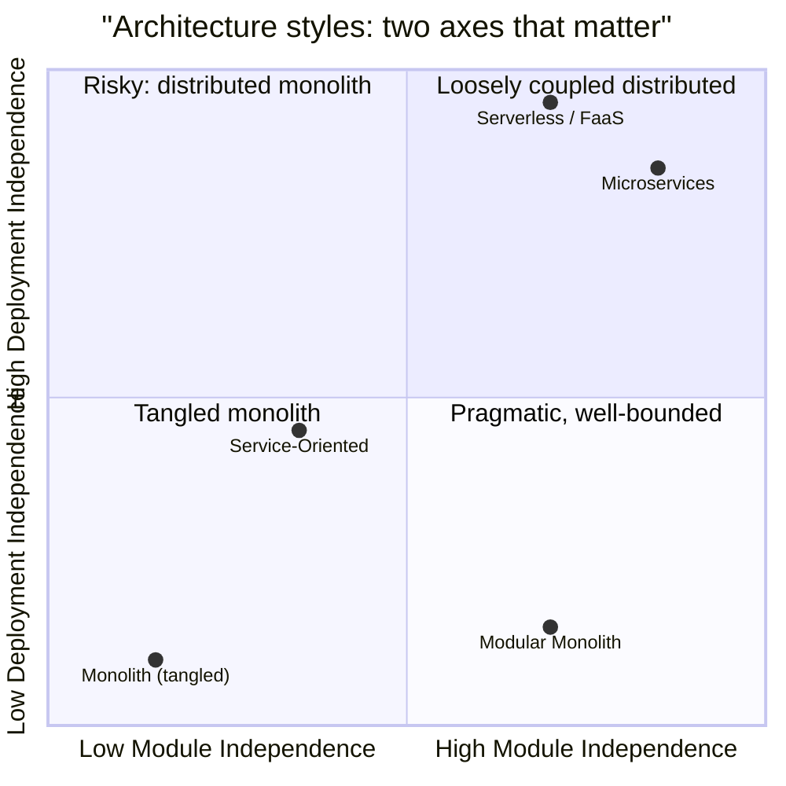
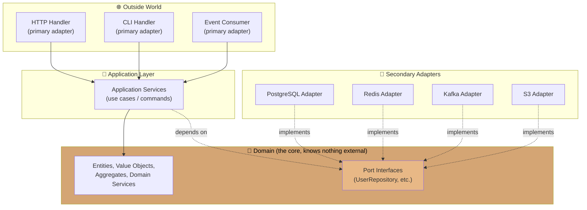
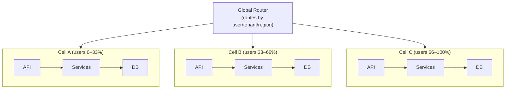
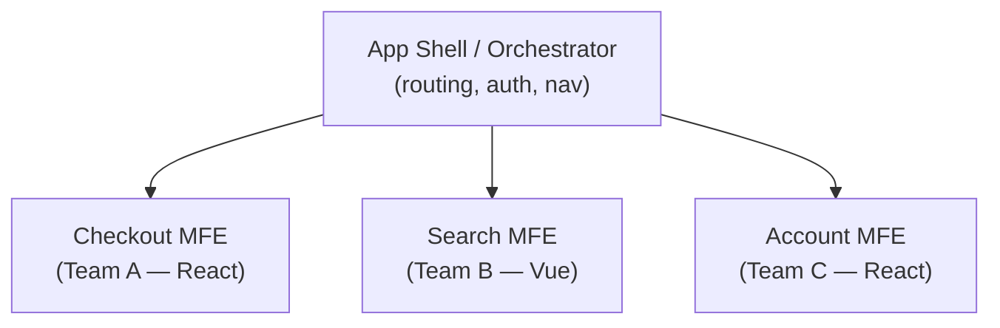
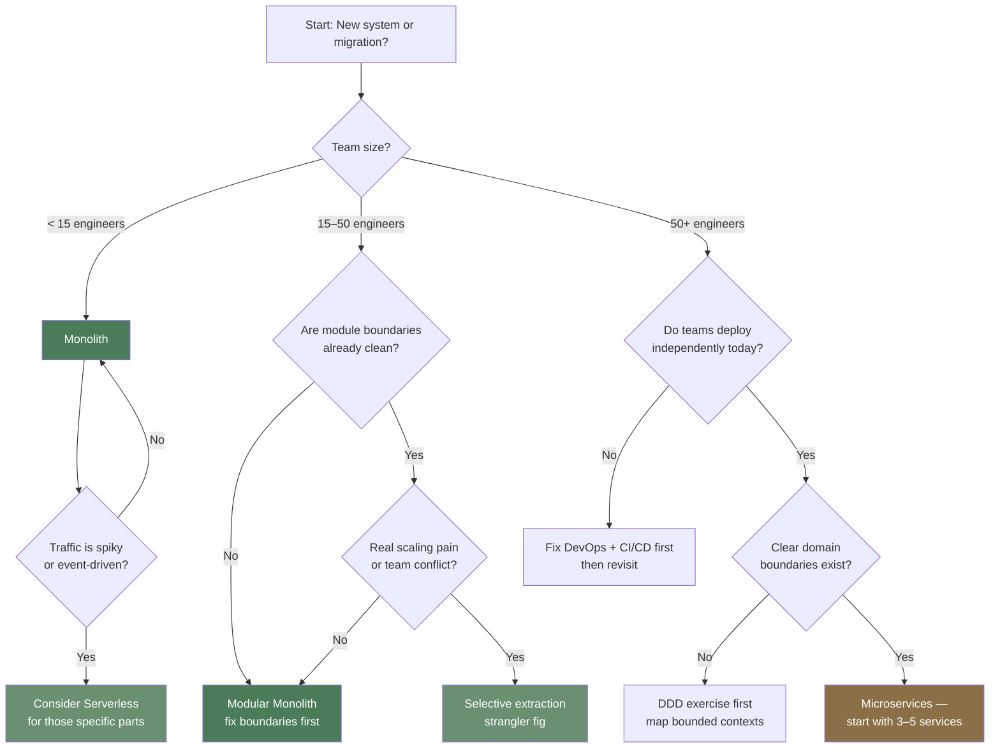

# Module 04 — Architecture Styles

> **Phase II · Patterns · Weeks 9–11**
>
> _"Microservices are a tax you pay to scale your organization. If you're not at that scale, you're paying for nothing."_

---

## At a Glance

|                              |                                                                                                                      |
| ---------------------------- | -------------------------------------------------------------------------------------------------------------------- |
| **Mindset shift**            | Be immune to fashion. Pick the style that fits team + business stage                                                 |
| **Core concepts**            | Monolith spectrum, SOA, hexagonal/clean/onion, DDD (strategic + tactical), event-driven, cell-based, micro-frontends |
| **Patterns**                 | Strangler fig · BFF · API gateway · Anti-corruption layer                                                            |
| **Capstone**                 | Architecture migration proposal (monolith → modular monolith / microservices)                                        |
| **Time investment**          | ~30 hours over 3 weeks                                                                                               |
| **One thing to internalize** | Microservices are a tax you pay to scale your organization, not your traffic. Pay only when needed.                  |

---

## 1. Mindset

Architecture style is one of the most fashion-driven decisions in our industry. Every 5 years there's a new dominant style and a generation of resumés padded with the keyword.

Your job as architect: **be immune to fashion**. Pick the style that fits team size, business stage, technical constraints, and (importantly) team competence. Pick boring, well-understood styles when in doubt.

This module is the honest comparison. By the end you should be able to defend "we're keeping the monolith" to a CTO who just read a Netflix blog post — and back it up with substance.

---

## 2. Core Concepts

### 2.1 The Honest Spectrum

Architecture styles aren't categories — they're a spectrum on two axes:



Most "should we go microservices" debates are really "should we untangle the modular boundaries?" The right answer is usually **yes, fix boundaries** before _yes, separate deploys._

### 2.2 The Monolith

A single deployable artifact containing all functionality.

**Strengths**:

- Simple deployment, simple debugging
- Strong consistency by default (one DB, ACID transactions)
- Refactoring across modules is fast (compile-time)
- Low operational overhead
- Excellent for small teams (< 30 engineers)

**Weaknesses**:

- One bug = whole system down
- Build/test slows as code grows
- Hard to scale one part independently
- Team coordination overhead as headcount grows
- Tech stack lock-in

**When right**: startups, small-to-mid teams, single-product companies, anything pre-product-market-fit.

**Famous monoliths**: Shopify, GitHub (still), Basecamp, Stack Overflow.

### 2.3 The Modular Monolith

A monolith with **strict internal boundaries**: modules can only talk to each other through defined interfaces, not by reaching into each other's internals.

This is the **most underrated architecture style of the past decade.** It captures 80% of microservices benefits with 20% of the operational cost.

How to enforce:

- Module-per-package (Go), or per-Maven-module (Java), or per-folder (Python with import linters)
- Each module owns its data tables; no cross-module table access
- Cross-module calls only through public interfaces
- Use static analysis tools (ArchUnit, deptrac, custom Go vet) to enforce

**The architect's secret**: a modular monolith is a microservices system that _hasn't paid the deployment-tax yet_. When you need to extract a service, the boundary is already there.

### 2.4 Microservices

Multiple small services, each independently deployed, owning their data, communicating via network.

**Strengths**:

- Independent deployment (smaller blast radius)
- Independent scaling
- Technology diversity (Go service + Python ML service + Node frontend)
- Independent team ownership
- Failure isolation (if done right)

**Weaknesses (the part the conference talks skip)**:

- Distributed transactions (cf. Module 02 — they don't really work)
- Eventual consistency _everywhere_
- Operational complexity: many deploys, many on-call rotations
- Network as failure mode
- Schema evolution coupling (API versioning, breaking changes)
- Testing complexity (mocks vs contract tests vs integration)
- "Distributed monolith" — the failure mode where you have all the costs and none of the benefits

**Conway's Law in action**: the architecture mirrors org structure. Microservices work when teams are autonomous. Microservices fail when teams still coordinate on every change.

**When right**: organizations with 50+ engineers, clear domain boundaries, mature DevOps, business that benefits from independent scaling.

### 2.5 Service-Oriented Architecture (SOA)

SOA predates microservices by a decade and shares many of the same goals: decompose a system into services that communicate over a network. The key difference is **scope and coupling**.

SOA typically means:

- Large, coarse-grained services (an "Order Service" might be 50K lines)
- Shared enterprise service bus (ESB) for communication — the bus often becomes the bottleneck and a single point of failure
- Shared data stores between services (the monolith problem, distributed)
- Heavy governance: WSDL, SOAP, WS-\* standards

**Why it mostly failed**:

- The ESB became a god-object that every team had to coordinate through
- "Shared database" negated the independence the style promised
- Heavy standards made iteration slow

**What microservices got right that SOA got wrong**: no shared bus, no shared DB, services own their data, communicate via lightweight protocols (HTTP/gRPC/events).

SOA is in the quadrant chart because it occupies the "risky middle" — deployment independence without module independence. You pay distributed systems costs without getting team autonomy.

### 2.5a Serverless (Function-as-a-Service)

You write functions, the cloud manages everything else. AWS Lambda, GCF, Azure Functions.

**Strengths**:

- Zero idle cost — scale to zero
- Auto-scaling out of the box
- No server management

**Weaknesses**:

- Cold starts (100ms-3s depending on runtime)
- Vendor lock-in (severe)
- Stateless — state goes elsewhere
- 15-min execution limits
- Cost surprise at scale (cheaper to run an EC2 for sustained workloads)
- Local development pain
- Observability is harder

**When right**: event-driven workloads with spiky traffic, glue code, scheduled jobs, low-traffic side-features.

**When wrong**: sustained-traffic services, latency-critical APIs, anything stateful, anything you want to move clouds.

### 2.6 Hexagonal / Clean / Onion / Ports & Adapters

These four "architectures" are 95% the same idea. **Separate domain logic from infrastructure.** The domain doesn't know about HTTP, databases, message queues, or frameworks.

The shape:



The domain depends on **nothing external**. External systems implement domain-defined interfaces.

**Why it matters**:

- Testable: domain logic tested without DBs or HTTP
- Replaceable infra: swap PostgreSQL for DynamoDB without changing domain
- Long-lived: domain code outlives framework choices (and we know how often those change)

**Cost**: more layers, more code, slower for CRUD apps. Worth it for non-trivial domains.

**This is independent of monolith vs microservices.** A monolith can be hexagonal. A microservice can be a tangled ball of HTTP + SQL.

### 2.7 Domain-Driven Design (DDD)

Eric Evans's book is large; here's the architect's distillation.

**Strategic patterns** (the important ones):

- **Ubiquitous language**: domain terms used identically by code, docs, conversations. No "ProductDTO" vs "ItemModel" vs "Inventory entry."
- **Bounded context**: a coherent area of the model. Inside the context, terms have one meaning. Outside, terms mean different things — and that's _fine_.
- **Context map**: how bounded contexts relate (shared kernel, customer-supplier, anti-corruption layer, etc.)
- **Anti-corruption layer**: a translation layer that protects your domain from external/legacy models

**Tactical patterns** (used inside a context):

- **Entity**: has identity (User with ID), mutable
- **Value object**: identity-less, immutable (Money, Address)
- **Aggregate**: cluster of entities + values with a root entity, enforces invariants
- **Repository**: collection-like interface for retrieving aggregates
- **Domain service**: logic that doesn't fit on an entity
- **Domain event**: something happened (covered Module 05)

**Why architects care about DDD**: it gives you a vocabulary to argue about **boundaries** — the only thing that matters when sizing services.

### 2.8 Event-Driven Architecture

Services communicate primarily through events (published facts about what happened), not commands (instructions to act).

**Spectrum**:

- **Event notification**: lightweight event with just an ID. Consumers fetch details.
- **Event-carried state transfer**: event contains all relevant data. Consumers don't need to call back.
- **Event sourcing**: events ARE the state. (Module 05.)

**Strengths**: decoupling, scalability, audit trail
**Weaknesses**: eventual consistency, debugging cross-service flows, schema evolution

(Deep dive in Module 05.)

### 2.9 Database-per-Service

One of the most misunderstood microservices constraints. **Each service owns its data and no other service touches it directly.**

This means: no shared tables, no shared schemas, ideally no shared database cluster.

**Why it's non-negotiable**:

- Shared DB = tight coupling. Any service can change the schema and break others.
- If two services share a DB, you effectively have a distributed monolith — you can't deploy them independently without coordinating migrations.
- Independent scaling becomes impossible if services share a connection pool or table.

**Practical options** (in order of isolation):

| Pattern               | What it means                                     | When to use                      |
| --------------------- | ------------------------------------------------- | -------------------------------- |
| Separate table prefix | Same DB, namespaced tables (`orders_*`)           | Early stage, low risk            |
| Separate schema       | Same DB cluster, different schema                 | Most teams — good balance        |
| Separate database     | Different DB instance                             | High-value isolation, compliance |
| Different engine      | Service A uses Postgres, Service B uses Cassandra | When workloads genuinely differ  |

**The cost**: cross-service queries become cross-service API calls or events. `JOIN` across services is gone. You use:

- **API composition**: fetch from service A and B, join in memory (for reads)
- **CQRS read models**: maintain a denormalized view for query needs
- **Sagas**: for transactions that span services (Module 05)

**The rule of thumb**: if two services need to JOIN frequently, they probably belong in the same service.

### 2.10 The Strangler Fig Pattern

How to migrate from monolith to microservices (or any rewrite) without a Big Bang.

1. Identify a slice of functionality
2. Build the new system to handle it
3. Route traffic for that slice to the new system (proxy/router/edge)
4. Decommission the old code
5. Repeat with the next slice

**Critical**: this is _incremental_. The old and new systems coexist for _months or years_. Don't believe anyone who says "we'll migrate in a quarter."

Named for the fig tree that grows around a host tree, eventually replacing it.

### 2.11 Cell-Based Architecture

An evolution beyond microservices used at Uber, AWS, Cloudflare, and others. The idea: instead of one global pool of services, the system is split into isolated **cells**, each a self-contained replica of the full stack serving a subset of users or tenants.



**Why cells**:

- A failure in Cell A affects only 33% of users, not all of them
- You can deploy to one cell as a canary before rolling out globally
- Cells can be sized independently (a "VIP" cell for enterprise tenants)
- No cross-cell traffic — blast radius is hard-bounded

**Cost**: operational complexity multiplies by cell count. Cell-to-cell communication (e.g., a user in Cell A messaging a user in Cell B) requires special handling — typically async via a global event bus.

**When right**: global-scale systems (100M+ users), strict isolation requirements (multi-tenant SaaS), or when a single region/shard failure must be survivable with minimal user impact.

**When wrong**: most companies. This is a solution to problems you need hundreds of engineers and millions of users to even have.

### 2.12 Micro-Frontends

The frontend equivalent of microservices. Each team owns a vertical slice: backend service **and** its frontend UI, deployed independently.



**Integration patterns**:

- **Build-time**: publish as npm packages. Simple but couples release cycles — defeats the purpose.
- **Run-time via iframes**: strong isolation, terrible UX (shared state, sizing, auth).
- **Run-time via Module Federation** (Webpack 5 / Vite): each MFE is a remote module loaded at runtime. The current best practice.
- **Server-side composition**: edge/CDN assembles HTML fragments from multiple services. Used by IKEA, Zalando.

**Strengths**: true team autonomy end-to-end, independent deploys, tech stack freedom per team.

**Weaknesses**:

- Shared state (auth, cart, user session) is painful without a shared shell contract
- Consistent UX across teams requires a design system + enforcement
- Performance: multiple JS bundles, duplicate dependencies unless shared carefully
- Local development: running the full app means running all MFEs

**When right**: large orgs (10+ frontend teams), clear vertical ownership, teams already doing microservices on the backend.

**When wrong**: single product team, shared design system is immature, or performance budget is tight. Most companies don't need this.

**Conway's Law applies here too**: your frontend architecture will mirror your org chart. If teams are siloed by feature, micro-frontends emerge naturally. If they're siloed by layer (frontend team, backend team), micro-frontends are fighting the org.

---

## 2.13 Decision Framework — Choosing Your Style

Stop choosing architectures based on what Netflix does. Use this:



**The meta-rule**: if you're asking "should we do microservices?", the answer is probably "not yet." The companies that got microservices right (Netflix, Uber, Amazon) didn't plan for it — they grew into it and had the DevOps maturity to support it.

---

## 3. Patterns

### 3.1 Backend for Frontend (BFF)

Different frontends (mobile, web, voice) have different needs. Build a small backend per frontend that aggregates calls to downstream services.

- Mobile BFF: optimizes for fewer round trips, small payloads
- Web BFF: optimizes for richer data, browser-friendly formats
- Public API: optimizes for stability and versioning

Used by: Netflix, SoundCloud, most large consumer products.

### 3.2 API Gateway

Single entry point for clients. Handles:

- Auth (verify JWT once, not per service)
- Rate limiting
- Request routing
- Aggregation (sometimes)
- Protocol translation (REST → gRPC internally)

**Tools**: Kong, Tyk, AWS API Gateway, Envoy, custom.

**Risk**: gateway becomes a god-object. Keep it thin. Business logic stays in services.

### 3.3 Service Mesh

Dedicated infrastructure for service-to-service communication. Sidecar (Envoy) per service handles:

- mTLS between services
- Retry, timeout, circuit breaking
- Observability (traces, metrics)
- Traffic shifting (canaries)

**Tools**: Istio, Linkerd, Consul Connect.

**When right**: 20+ services, polyglot, security/compliance demands mTLS.
**When wrong**: < 10 services, single team — you're adding complexity for theater.

### 3.4 Anti-Corruption Layer (ACL)

A boundary between your domain and an external/legacy system. Translates the external model into your domain language; the rest of your code never sees the external mess.

Critical when integrating with: a legacy system you can't change, a vendor API with weird semantics, a different bounded context with different terms.

---

## 4. Go Implementation: A Hexagonal Service

Show the structure with a small "user registration" service.

```go
// domain/user.go - pure domain, no imports beyond stdlib
package domain

import (
	"errors"
	"strings"
	"time"
)

type UserID string

type User struct {
	ID        UserID
	Email     string
	CreatedAt time.Time
}

var ErrInvalidEmail = errors.New("invalid email")
var ErrUserExists = errors.New("user exists")

func NewUser(id UserID, email string) (*User, error) {
	if !strings.Contains(email, "@") {
		return nil, ErrInvalidEmail
	}
	return &User{
		ID:        id,
		Email:     strings.ToLower(email),
		CreatedAt: time.Now(),
	}, nil
}
```

```go
// domain/repository.go - port (interface)
package domain

import "context"

type UserRepository interface {
	Save(ctx context.Context, u *User) error
	FindByEmail(ctx context.Context, email string) (*User, error)
}

type IDGenerator interface {
	NewID() UserID
}
```

```go
// app/register.go - application service (use case)
package app

import (
	"context"
	"yourapp/domain"
)

type RegisterUser struct {
	Repo domain.UserRepository
	IDs  domain.IDGenerator
}

type RegisterInput struct {
	Email string
}

func (r *RegisterUser) Execute(ctx context.Context, in RegisterInput) (*domain.User, error) {
	if existing, _ := r.Repo.FindByEmail(ctx, in.Email); existing != nil {
		return nil, domain.ErrUserExists
	}
	u, err := domain.NewUser(r.IDs.NewID(), in.Email)
	if err != nil {
		return nil, err
	}
	if err := r.Repo.Save(ctx, u); err != nil {
		return nil, err
	}
	return u, nil
}
```

```go
// adapters/postgres/userrepo.go - secondary adapter
package postgres

import (
	"context"
	"database/sql"
	"yourapp/domain"
)

type UserRepo struct {
	DB *sql.DB
}

func (r *UserRepo) Save(ctx context.Context, u *domain.User) error {
	_, err := r.DB.ExecContext(ctx,
		`INSERT INTO users (id, email, created_at) VALUES ($1, $2, $3)`,
		u.ID, u.Email, u.CreatedAt)
	return err
}

func (r *UserRepo) FindByEmail(ctx context.Context, email string) (*domain.User, error) {
	row := r.DB.QueryRowContext(ctx,
		`SELECT id, email, created_at FROM users WHERE email = $1`, email)
	var u domain.User
	if err := row.Scan(&u.ID, &u.Email, &u.CreatedAt); err != nil {
		if err == sql.ErrNoRows {
			return nil, nil
		}
		return nil, err
	}
	return &u, nil
}
```

```go
// adapters/http/handler.go - primary adapter (driving the application)
package http

import (
	"encoding/json"
	"net/http"
	"yourapp/app"
)

type Handler struct {
	Register *app.RegisterUser
}

func (h *Handler) HandleRegister(w http.ResponseWriter, r *http.Request) {
	var body struct{ Email string }
	if err := json.NewDecoder(r.Body).Decode(&body); err != nil {
		http.Error(w, "bad request", 400)
		return
	}
	u, err := h.Register.Execute(r.Context(), app.RegisterInput{Email: body.Email})
	if err != nil {
		http.Error(w, err.Error(), 400)
		return
	}
	w.Header().Set("Content-Type", "application/json")
	json.NewEncoder(w).Encode(u)
}
```

```go
// main.go - composition root
package main

import (
	"database/sql"
	"net/http"
	"yourapp/adapters/http"
	pgrepo "yourapp/adapters/postgres"
	"yourapp/app"
)

func main() {
	db, _ := sql.Open("postgres", "...")
	repo := &pgrepo.UserRepo{DB: db}
	register := &app.RegisterUser{Repo: repo, IDs: uuidGen{}}
	handler := &http.Handler{Register: register}

	http.HandleFunc("/register", handler.HandleRegister)
	http.ListenAndServe(":8080", nil)
}
```

**Notice**:

- `domain/` has _zero_ infrastructure imports
- `app/` depends on `domain/` only
- `adapters/` are interchangeable; swap Postgres for DynamoDB by writing a new adapter
- The "composition root" (main.go) is the only place that wires everything together

You can test `app.RegisterUser.Execute` with an in-memory repo — no DB, no HTTP. That's the win.

---

## 5. Trade-offs Table

| Style            | Team Size | Operational Cost | Deploy Independence               | Best For                     |
| ---------------- | --------- | ---------------- | --------------------------------- | ---------------------------- |
| Monolith         | 1–30      | Low              | None                              | Startup, early stage         |
| Modular Monolith | 5–100     | Low              | None (but module-level isolation) | Growth stage, prep for split |
| Microservices    | 50+       | High             | Yes                               | Mature org, autonomous teams |
| Serverless       | Any       | Medium           | Per-function                      | Event-driven, spiky          |

| Aspect                 | Monolith | Microservices           |
| ---------------------- | -------- | ----------------------- |
| Local debug            | Trivial  | Hard                    |
| Cross-feature refactor | Easy     | Hard (multi-service PR) |
| Independent scaling    | No       | Yes                     |
| Strong consistency     | Default  | Hard (sagas, eventual)  |
| New language           | Lock-in  | Free                    |
| On-call complexity     | Low      | High                    |

---

## 6. Real-World Failures

**Segment (2017) — Microservices → Monolith**:

- Started with many microservices, hit operational ceiling
- Combined into a "monoservice" — better ops, faster iteration
- Lesson: microservices have a _team-size threshold_. Below it, you suffer.

**Uber's monolith → microservices → modular monolith** (the famous saga):

- Started monolith; split into ~2000 microservices at peak
- Operational complexity exploded; many were "distributed monoliths"
- Now consolidating to a "modular monolith" architecture
- Lesson: the right granularity changes with org maturity. Architects must keep re-evaluating.

**Knight Capital, again, from a style angle**:

- Their trading system was a monolith with deeply intertwined modules
- A bug in one module corrupted others
- A modular monolith with proper isolation would've contained blast radius
- Lesson: modular boundaries are about blast radius, not just code aesthetics.

---

## 7. Design Challenges

### Challenge 4.1 — The Split Decision (45 min)

You're tech lead at a 25-engineer startup. The monolith is starting to hurt: tests take 20 min, deploys take 1h, and the "checkout" team and "search" team conflict on every release.

The CEO has read about microservices and is excited. Engineering is split.

Write a 1-page memo to the CEO that:

1. Acknowledges the real pain
2. Explains the real cost of microservices (not strawmen)
3. Proposes an intermediate step
4. Names what success looks like
5. Names what failure looks like

**This is real architect work.** No diagrams. Just prose, recommendations, trade-offs.

### Challenge 4.2 — Identify the Boundaries (30 min)

For PropertyHub (or your domain), list potential bounded contexts. For each:

- Ubiquitous language (3-5 terms)
- Who owns it (which team)
- What aggregates live inside
- How it relates to its neighbors (anti-corruption? customer-supplier?)

Then: if you had to split into 3 services, which would you split first? Why?

### Challenge 4.3 — Hexagonalize a Codebase (45 min)

Take a real CRUD endpoint from your day job (or write one if not). Refactor into hexagonal layers:

- Domain entities
- Application service
- Repository interface in domain
- Repository adapter
- HTTP handler

Then write a domain-level unit test (no DB) for the application service.

Reflect: did the refactor surface any hidden coupling? (It usually does.)

---

## 8. Capstone Project — Architecture Proposal Document

**Goal**: Write a full architecture proposal for migrating an existing monolith (real or hypothetical) to a more decoupled architecture.

**Scenario**: A 6-year-old monolith with ~500K lines of code, ~30 engineers, frequent deploy contention, but no operational fire. Leadership is open but not committed.

**Deliverable** (~10 pages):

1. **Current state**: pain points (data, not vibes)
2. **Quality attribute analysis**: what we're optimizing for
3. **Options considered** (≥3):
   - Stay as-is, fix process
   - Modular monolith refactor
   - Selective extraction (strangler fig)
   - Full microservices
4. **Recommended path** with reasoning
5. **Phased rollout**: months 0-3, 3-6, 6-12
6. **Risks and mitigation**
7. **Success metrics**
8. **What we will NOT do** (explicit non-goals)

**Grading**:

- [ ] At least one option recommended over your "gut" choice, with reason?
- [ ] Quality attributes drive the choice?
- [ ] Phases are real (delivering value), not "step 1: design"?
- [ ] Honest about costs?

---

## 9. ADR Practice

Write **ADR-004**: choice of architecture style for a new product you might build.

This time, write the **Consequences** section in two columns: _good now / bad later_. Architects predict 5 years out, not 5 months.

---

## 10. Mock Interview

**Prompt** (60 min):

> Your company has a single 8-year-old Django monolith. 80 engineers, 2 daily deploys with frequent rollbacks, mobile app team blocked on backend. The CTO asks you, the new principal engineer, to "lead the microservices migration." What do you say in your first 90 days?

**This is a leadership prompt, not a technical one.** Look for:

- Does the candidate push back / clarify before agreeing?
- Do they propose discovery (audit, metrics) before solutions?
- Do they consider alternatives to the stated solution?
- Do they have a phased plan with reversibility?
- Do they think about org/Conway's Law, not just code?

---

## 11. Further Reading

**Books**:

- _Building Microservices_ — Sam Newman (the canonical)
- _Monolith to Microservices_ — Sam Newman
- _Domain-Driven Design_ — Eric Evans (skim strategic, deep-dive tactical)
- _Implementing Domain-Driven Design_ — Vaughn Vernon (more practical than Evans)
- _Software Architecture: The Hard Parts_ — Ford, Richards, et al.

**Articles**:

- "Modular Monolith" — Simon Brown
- "Microservices Premium" — Martin Fowler
- "MonolithFirst" — Martin Fowler
- "How we ended up with microservices" — soundcloud.com (foundational)

**Talks**:

- "Why You Should — and Shouldn't — Use Microservices" — Sam Newman
- Any GOTO/QCon talk on real microservices migrations

---

## Module Completion Checklist

- [ ] Can defend "we should NOT do microservices" to a CTO
- [ ] Can identify bounded contexts in a familiar domain
- [ ] Hexagonalized at least one real codebase
- [ ] Wrote the migration proposal capstone
- [ ] Wrote ADR-004
- [ ] Self-scored mock interview

**Next**: Module 05 — Event-Driven & CQRS. Where loose coupling becomes a design constraint, not an aspiration.
