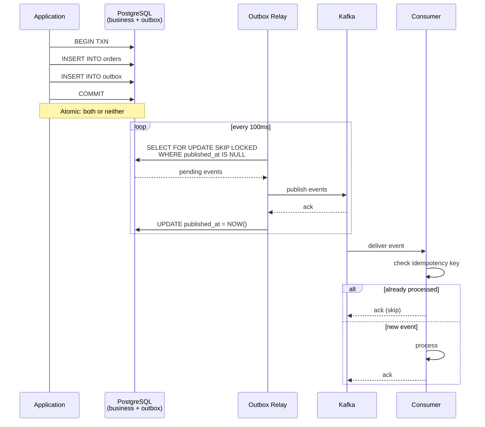
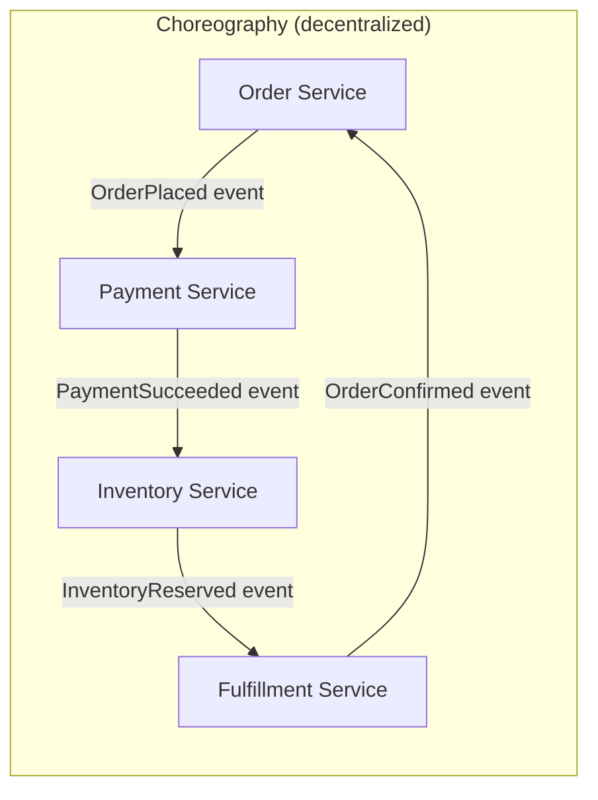
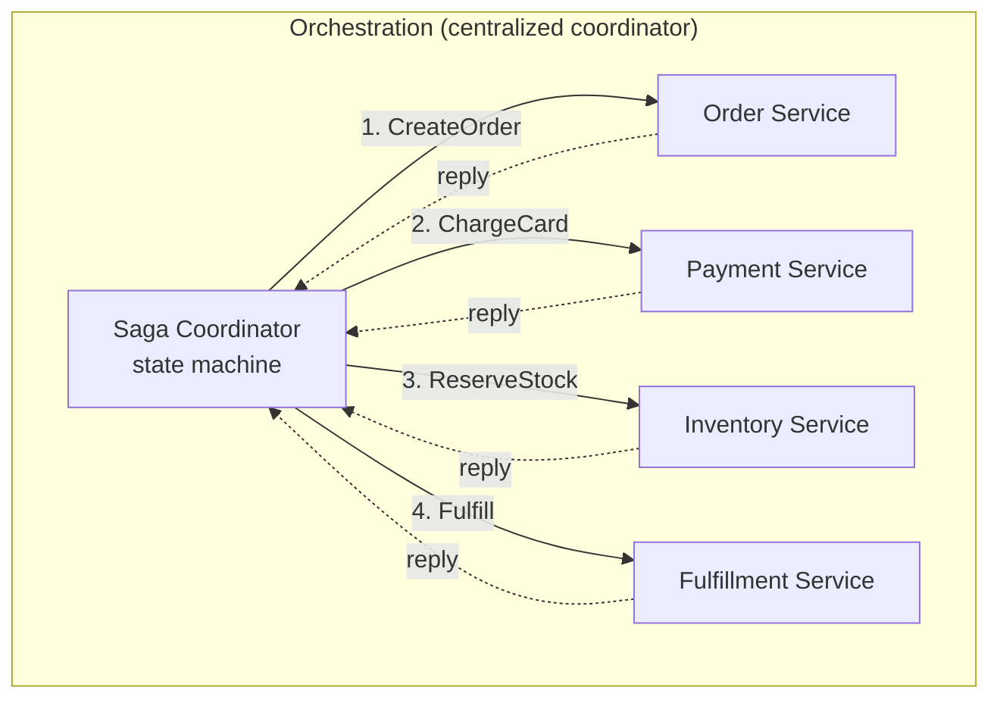
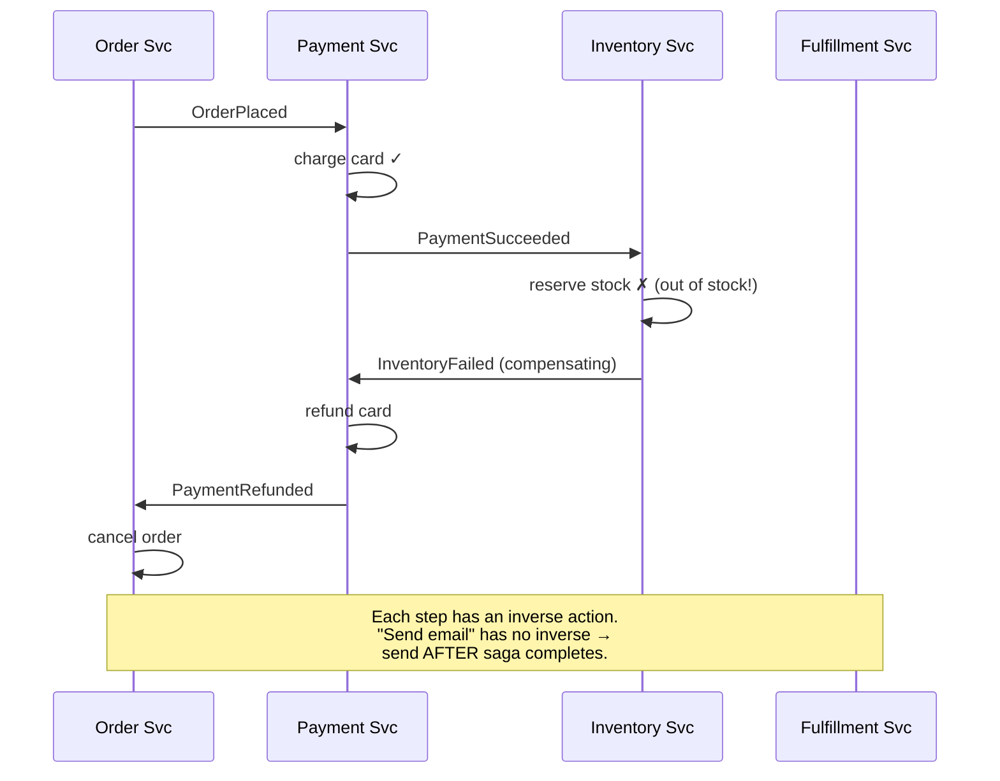

# Module 05 — Event-Driven & CQRS

> **Phase II · Patterns · Weeks 12–14**
>
> _"In a distributed system, the only thing more dangerous than a lost message is a message delivered twice — unless you've designed for both."_

---

## At a Glance

|                              |                                                                                                                                               |
| ---------------------------- | --------------------------------------------------------------------------------------------------------------------------------------------- |
| **Mindset shift**            | From requests-and-responses → facts-and-reactions                                                                                             |
| **Core concepts**            | Commands/events/queries, dual-write problem, outbox, idempotency, sagas (choreography + orchestration), event sourcing, CQRS, Kafka internals |
| **Patterns**                 | Outbox + relay · Saga compensation · Process manager · DLQ · Schema registry                                                                  |
| **Capstone**                 | Event-driven order system (4 services, full failure modes tested)                                                                             |
| **Time investment**          | ~35 hours over 3 weeks                                                                                                                        |
| **One thing to internalize** | At-least-once + idempotent consumers. Exactly-once is mythology.                                                                              |

---

## 1. Mindset

Event-driven architecture rewards a specific mental shift: stop thinking in **requests and responses**, start thinking in **facts and reactions**.

A command says "do this." A request says "give me that." Both are tightly coupled: caller knows about callee, often blocks waiting. Events are different — they're past-tense statements of fact (`OrderPlaced`, `PaymentProcessed`) that the producer publishes without knowing or caring who consumes them. Consumers are decoupled in time, in identity, in failure modes.

This decoupling has a cost: **everything is eventually consistent, and you have to design for that.** This module is mostly about _how_ to design for it without going insane.

---

## 2. Core Concepts

### 2.1 Commands vs Events vs Queries

|             | Tense                     | Direction         | Coupling                        |
| ----------- | ------------------------- | ----------------- | ------------------------------- |
| **Command** | Imperative ("PlaceOrder") | 1:1, expects ack  | Caller knows callee             |
| **Event**   | Past ("OrderPlaced")      | 1:N, broadcast    | Producer doesn't know consumers |
| **Query**   | Question ("GetOrder")     | 1:1, returns data | Caller knows callee             |

A common architectural confusion: treating events as commands ("`UserShouldBeEmailed`") creates coupling and makes the producer responsible for downstream concerns. Rename to past-tense (`UserRegistered`), let the email service decide what to do.

### 2.2 The Dual-Write Problem

The classic mistake: application writes to DB, then publishes to Kafka. Both can fail independently.

```go
// BROKEN
db.Save(order)
kafka.Publish("OrderPlaced", order) // what if this fails?
```

Failure modes:

- DB succeeds, Kafka fails → DB has data, downstream doesn't know
- Kafka succeeds, DB fails (rare with rollback, but with crash possible) → downstream acts on phantom data
- Network partition mid-flight → unpredictable

**You cannot solve this with retries alone.** It's the two-generals problem.

Two real solutions:

1. **Transactional Outbox** (the standard)
2. **CDC from the DB** (Module 03)

### 2.3 The Transactional Outbox Pattern

Write the event to a table _in the same transaction_ as the business write. A separate process polls the outbox table and publishes events.

```
BEGIN;
  INSERT INTO orders (...) VALUES (...);
  INSERT INTO outbox (event_type, payload, ...) VALUES ('OrderPlaced', '{"id":...}', ...);
COMMIT;

-- Asynchronously:
SELECT * FROM outbox WHERE published_at IS NULL LIMIT 100;
-- publish each to Kafka
-- mark as published_at = NOW()
```

**Guarantees**: at-least-once delivery (a crash between publish and mark-published causes re-delivery). Combine with idempotent consumers.

The flow visually:



This is **the most important pattern in event-driven architecture**. Use it.

### 2.4 At-Least-Once and Idempotency

You cannot guarantee exactly-once delivery in a distributed system. You guarantee **at-least-once + idempotent consumers**.

**Idempotent consumer**: processing the same event twice has the same effect as once.

Techniques:

- **Natural idempotency**: `SET status = 'paid'` is idempotent. `INCREMENT counter` is not.
- **Idempotency keys**: store `(event_id, processed_at)`; skip if already seen.
- **Conditional writes**: `UPDATE WHERE version = X` (optimistic concurrency).

**Architect's litmus test**: ask "what happens if this event is delivered twice?" If you can't answer cleanly, you don't have an idempotent consumer.

### 2.5 Ordering Guarantees

"Ordering" means different things:

- **Per-partition ordering**: Kafka guarantees events within one partition arrive in order
- **Per-key ordering**: produced events with key K go to one partition; they're ordered
- **Global ordering**: no Kafka guarantee; impossible at scale without a single partition

**Architect's rule**: choose your **partition key** carefully. Events that must be processed in order _must_ share a partition key.

Example: `OrderEvents` partitioned by `order_id` — guarantees all events for one order are in order. Cross-order ordering is lost (and usually doesn't matter).

### 2.6 Sagas

You wanted distributed transactions. You can't have them. You can have sagas.

A **saga** is a sequence of local transactions, each in a different service, coordinated to either all complete or compensate.

Two flavors:

**Choreography** (no central coordinator):

- Each service listens for events and reacts
- `OrderPlaced` → `PaymentProcessed` → `InventoryReserved` → `OrderConfirmed`
- If one fails, _compensating events_ roll back: `PaymentRefunded`, `InventoryReleased`, `OrderCancelled`

**Orchestration** (central coordinator):

- A "saga coordinator" service tracks the state machine
- Calls each service, handles failures, issues compensations
- Easier to debug, easier to evolve, single failure point

Side-by-side:





The compensation flow when something fails:



|             | Choreography      | Orchestration                     |
| ----------- | ----------------- | --------------------------------- |
| Coupling    | Loosest           | Tighter (coordinator knows steps) |
| Visibility  | Hard to trace     | Easy (state machine)              |
| Adding step | New consumer      | Coordinator change                |
| Recovery    | Distributed       | Centralized                       |
| Best for    | 2-4 steps, stable | 4+ steps, complex flows           |

**Critical**: every step must have a **compensating action**. "Send email" doesn't have one — emails can't be unsent. Plan accordingly: send emails only after the saga completes (Saga Outcome Event), not mid-flight.

### 2.7 Event Sourcing

The state of an aggregate is the **fold over its event history**. You don't store current state — you store every event that ever happened and replay them.

```
Account: []
+ AccountOpened(id=1, owner="Alice")
+ MoneyDeposited(id=1, amount=100)
+ MoneyDeposited(id=1, amount=50)
+ MoneyWithdrawn(id=1, amount=30)

Current state: {id:1, owner:Alice, balance:120}
```

**Strengths**:

- Complete audit trail by construction
- Easy to add new projections (rebuild from events)
- Temporal queries ("what was state at time T?")
- Strong fit for domains with regulatory requirements

**Weaknesses**:

- Mental model shift (steep)
- Snapshot mechanism needed for performance (recomputing 10M events for one read is bad)
- Schema evolution painful (events are immutable forever — handle old versions in code)
- Most domains don't actually need it

**Don't event-source everything.** Pick aggregates where audit / temporal queries are first-class needs. (Banking, claims, anything regulated.) Use regular CRUD for everything else.

### 2.8 CQRS — Command-Query Responsibility Segregation

Separate the **write model** from the **read model**.

- Write side: normalized, transactional, optimized for invariants (DDD aggregates)
- Read side: denormalized, often materialized, optimized for queries (one shape per UI)

Synchronization: events from write side update read side asynchronously.

```
[Command]     →  [Write DB (Postgres)]  →  [Event Stream (Kafka)]  →  [Read DB (e.g., ES, Redis)]
                                                                      ↑
[Query]   ─────────────────────────────────────────────────────────────┘
```

**When to use**:

- Read vs write workloads are very different (10:1 or worse ratio)
- You need different shapes for different queries (one read model per UI screen)
- You need to scale reads independently
- You want to add new read models without touching writes

**When not to use**:

- Simple CRUD (cost > benefit)
- Strong consistency requirements between writes and reads
- Small team — operational burden of two models

**CQRS does NOT require event sourcing.** You can have CQRS with a normal SQL write side + CDC to a read side. Conflating these is a common error.

### 2.9 Kafka Internals (the architect's view)

You don't need to be a Kafka committer. You do need to know:

- **Topics**: a named stream
- **Partitions**: a topic's units of parallelism. Each consumer in a group reads from a subset of partitions.
- **Brokers**: Kafka nodes. Partitions replicated across brokers (typically 3×).
- **Consumer groups**: a group reads each event once (across its members). Two groups = two independent reads.
- **Offsets**: a consumer's bookmark per partition. Stored in Kafka itself.
- **Log retention**: events kept for time (7 days default) or size. Compacted topics keep only latest per key.
- **Exactly-once semantics (EOS)**: Kafka offers it via idempotent producer + transactions. Limited applicability (works within Kafka; doesn't cover external systems).

**Capacity rule of thumb**: a Kafka cluster on modest hardware handles 100K+ msgs/sec per broker. Partitions = your parallelism ceiling.

### 2.10 Schema Evolution

Events live forever. Schemas don't.

Rules:

- Use a schema registry (Confluent Schema Registry, AWS Glue, etc.) with versioning
- Adopt a serialization format with schema support: Avro, Protobuf, JSON Schema
- **Backward compatibility**: new code reads old events (consumers upgrade)
- **Forward compatibility**: old code reads new events (producers upgrade)
- **Full compatibility**: both — hardest, most flexible

**Avoid**: deleting fields, renaming fields, narrowing types. **Prefer**: adding optional fields, deprecating, versioning event types when truly different.

---

## 3. Patterns

### 3.1 Outbox + Relay

Already covered. The default.

### 3.2 Event Carried State Transfer

Event contains _all_ needed data. Consumers don't call back to producer.

Pro: full decoupling.
Con: large events, schema coupling on event itself.

### 3.3 Event Notification

Event contains just enough to know _something happened_ + an ID. Consumer fetches details via API call.

Pro: small events.
Con: tighter coupling (consumer must call producer), more requests.

### 3.4 The Read Replica via CDC

Postgres → Debezium → Kafka → consumer → Elasticsearch.

Pros: no app-level dual writes. Postgres is source of truth.
Cons: schema coupling (consumers must understand Postgres tables).

Solution: **a transformation step** that produces clean domain events from CDC records.

### 3.5 Dead-Letter Queue (DLQ)

Events that fail processing after retries land in a DLQ. Out-of-band investigation/replay.

Critical pattern. Every consumer should have a DLQ. Always.

### 3.6 Process Manager (a.k.a. Saga Orchestrator)

A long-running stateful process that coordinates a workflow across services. Lives in its own service, has its own state machine, listens for events, sends commands.

Distinct from "domain logic" — process managers handle _orchestration_ across boundaries.

---

## 4. Go Implementation: Outbox Pattern

A minimal but production-shaped outbox with PostgreSQL and a relay process.

```sql
-- migrations/001_outbox.sql
CREATE TABLE outbox (
    id              BIGSERIAL PRIMARY KEY,
    aggregate_id    TEXT NOT NULL,
    event_type      TEXT NOT NULL,
    payload         JSONB NOT NULL,
    headers         JSONB,
    created_at      TIMESTAMPTZ NOT NULL DEFAULT NOW(),
    published_at    TIMESTAMPTZ
);
CREATE INDEX idx_outbox_unpublished ON outbox (created_at) WHERE published_at IS NULL;
```

```go
// outbox/writer.go - called from the same transaction as business writes
package outbox

import (
	"context"
	"database/sql"
	"encoding/json"
)

type Event struct {
	AggregateID string
	Type        string
	Payload     any
	Headers     map[string]string
}

func Append(ctx context.Context, tx *sql.Tx, e Event) error {
	payload, err := json.Marshal(e.Payload)
	if err != nil {
		return err
	}
	headers, _ := json.Marshal(e.Headers)
	_, err = tx.ExecContext(ctx, `
		INSERT INTO outbox (aggregate_id, event_type, payload, headers)
		VALUES ($1, $2, $3, $4)
	`, e.AggregateID, e.Type, payload, headers)
	return err
}
```

```go
// outbox/relay.go - background worker process
package outbox

import (
	"context"
	"database/sql"
	"log"
	"time"
)

type Publisher interface {
	Publish(ctx context.Context, topic string, key, payload []byte, headers map[string]string) error
}

type Relay struct {
	DB        *sql.DB
	Pub       Publisher
	BatchSize int
	Interval  time.Duration
}

func (r *Relay) Run(ctx context.Context) error {
	tick := time.NewTicker(r.Interval)
	defer tick.Stop()
	for {
		select {
		case <-ctx.Done():
			return ctx.Err()
		case <-tick.C:
			if err := r.tick(ctx); err != nil {
				log.Printf("outbox relay error: %v", err)
			}
		}
	}
}

func (r *Relay) tick(ctx context.Context) error {
	// SELECT FOR UPDATE SKIP LOCKED lets multiple relay instances run safely.
	tx, err := r.DB.BeginTx(ctx, nil)
	if err != nil {
		return err
	}
	defer tx.Rollback()

	rows, err := tx.QueryContext(ctx, `
		SELECT id, aggregate_id, event_type, payload, headers
		FROM outbox
		WHERE published_at IS NULL
		ORDER BY created_at
		LIMIT $1
		FOR UPDATE SKIP LOCKED
	`, r.BatchSize)
	if err != nil {
		return err
	}
	defer rows.Close()

	type pending struct {
		id      int64
		aggID   string
		evType  string
		payload []byte
		headers []byte
	}
	var batch []pending
	for rows.Next() {
		var p pending
		if err := rows.Scan(&p.id, &p.aggID, &p.evType, &p.payload, &p.headers); err != nil {
			return err
		}
		batch = append(batch, p)
	}

	if len(batch) == 0 {
		return tx.Commit()
	}

	for _, p := range batch {
		var hdrs map[string]string
		_ = json.Unmarshal(p.headers, &hdrs)
		topic := p.evType // or a topic-routing function
		if err := r.Pub.Publish(ctx, topic, []byte(p.aggID), p.payload, hdrs); err != nil {
			return err // entire batch retried next tick
		}
	}

	// Mark all as published in one query
	ids := make([]int64, len(batch))
	for i, p := range batch {
		ids[i] = p.id
	}
	if _, err := tx.ExecContext(ctx, `
		UPDATE outbox SET published_at = NOW() WHERE id = ANY($1)
	`, ids); err != nil {
		return err
	}
	return tx.Commit()
}
```

```go
// app/order_service.go - business logic uses outbox
package app

import (
	"context"
	"database/sql"
	"yourapp/outbox"
)

type OrderService struct {
	DB *sql.DB
}

func (s *OrderService) PlaceOrder(ctx context.Context, customerID string, items []Item) (string, error) {
	tx, err := s.DB.BeginTx(ctx, nil)
	if err != nil {
		return "", err
	}
	defer tx.Rollback()

	orderID := generateID()
	if _, err := tx.ExecContext(ctx, `
		INSERT INTO orders (id, customer_id, status) VALUES ($1, $2, 'placed')
	`, orderID, customerID); err != nil {
		return "", err
	}
	// ... insert order items ...

	// Same transaction - guaranteed atomic with business write
	if err := outbox.Append(ctx, tx, outbox.Event{
		AggregateID: orderID,
		Type:        "OrderPlaced",
		Payload: map[string]any{
			"order_id":    orderID,
			"customer_id": customerID,
			"items":       items,
		},
		Headers: map[string]string{
			"schema_version": "v1",
		},
	}); err != nil {
		return "", err
	}

	return orderID, tx.Commit()
}
```

**Why this works**:

- Business write + event = one DB transaction = atomic
- Relay reads only committed rows, can't see in-flight transactions
- `FOR UPDATE SKIP LOCKED` allows horizontal scaling of the relay
- Crash anywhere = at-least-once redelivery (consumers must be idempotent)
- DB is the source of truth; no message-broker state leaked into app code

---

## 5. Trade-offs Table

| Decision      | Choreography        | Orchestration         |
| ------------- | ------------------- | --------------------- |
| Coupling      | Lowest              | Some central coupling |
| Debuggability | Poor (event chains) | Good (state machine)  |
| Adding steps  | Add new consumer    | Update coordinator    |
| Best for      | Few, stable steps   | Many, evolving steps  |

| Decision                  | Event Notification         | Event Carried State            |
| ------------------------- | -------------------------- | ------------------------------ |
| Event size                | Small                      | Large                          |
| Consumer self-sufficiency | Calls back to producer     | Has all data                   |
| Coupling                  | Behavioral (must call API) | Schema (must understand event) |
| Best for                  | Small, frequent updates    | Audit, replication             |

| Decision             | CQRS                      | Same Model Read/Write |
| -------------------- | ------------------------- | --------------------- |
| Complexity           | Higher                    | Lower                 |
| Read scale           | Excellent                 | Limited               |
| Eventual consistency | Built in                  | None                  |
| Best for             | High RPS, distinct shapes | Simple CRUD           |

---

## 6. Real-World Failures

**The "exactly-once delivery" mythology**:

- Many teams believe their broker provides exactly-once
- They build non-idempotent consumers
- Years later: duplicate orders, double-charges, support nightmares
- Lesson: **at-least-once + idempotent** is the only sustainable design

**Schema break in production**:

- Team removes a field from an event; downstream consumers crash
- Outage; rollback; incident review reveals no schema registry
- Lesson: events are forever. Schema registry is not optional.

**Saga with no compensation**:

- Order saga emails customer in step 3 of 7
- Step 5 fails, saga compensates — but email already sent
- Customer confused, support tickets multiply
- Lesson: side effects without inverses go at the end. Always.

---

## 7. Design Challenges

### Challenge 5.1 — Outbox Drill (30 min)

You have an event producer that writes to DB and publishes to Kafka. Walk through these failure modes and identify the bug + fix:

1. App crashes between DB commit and Kafka publish
2. Kafka acks the publish, app crashes before DB commit
3. Kafka is partitioned from app for 5 minutes
4. The DB commits, app publishes, then publishes again (duplicate)

For each: which problem does outbox solve? Which does it not?

### Challenge 5.2 — Saga or Not? (20 min)

For each multi-step workflow, decide: saga / no saga / something else. Justify.

1. User signs up: create user, send welcome email, add to mailing list
2. User checks out: charge card, reserve inventory, create order, ship
3. Background job: nightly, delete inactive users + their data + their files
4. Real-time bidding: receive ad request, query 5 ad networks, return winner
5. Document approval workflow: submit → manager → director → CFO → final approval

### Challenge 5.3 — Design an Outbox at Scale (45 min)

The outbox table in your high-traffic service grows by 100M rows/day. Discuss:

- How to archive/delete old rows
- How to scale the relay (multiple workers, partitioning the table)
- How to detect "stuck" events (oldest unpublished > N minutes)
- How to handle a 1-hour Kafka outage gracefully
- How to handle a poison-pill event (always fails publish)

---

## 8. Capstone Project — Event-Driven Order System

**Goal**: Build a minimal but production-shaped event-driven system.

**Services** (separate Go binaries, communicating via Kafka):

1. **Order service**: REST API to place orders. Uses outbox.
2. **Payment service**: Listens for `OrderPlaced`. Charges card (mock). Emits `PaymentSucceeded` or `PaymentFailed`.
3. **Inventory service**: Listens for `OrderPlaced`. Reserves stock. Emits `InventoryReserved` or `OutOfStock`.
4. **Order fulfillment service**: Listens for all of above; updates order status; emits `OrderConfirmed` or `OrderCancelled`.

**Requirements**:

- All event publication via outbox pattern
- All consumers idempotent (use event IDs)
- Implement saga (your choice: choreography or orchestration) for the order flow
- Compensating events for `OrderCancelled`: `RefundIssued`, `InventoryReleased`
- Dead-letter handling
- Local dev: docker-compose with Postgres + Kafka

**Grading**:

- [ ] Survives killing any one service mid-flow
- [ ] Survives Kafka restart
- [ ] Survives duplicate event delivery (you'll inject this in test)
- [ ] Has a working DLQ
- [ ] Can replay events from outbox/Kafka to a new consumer

**This is the biggest project so far. Budget 15–25 hours.**

---

## 9. ADR Practice

Write **ADR-005**: choreography vs orchestration for your order saga.

Force yourself: include a section called _"Why we are NOT doing the obvious thing"_ — i.e., name the option most teams would pick and explain why it's wrong for _your_ context.

---

## 10. Mock Interview

**Prompt** (60 min):

> Design a global payment processing system. Multiple acquirer banks, dynamic routing for cost optimization, idempotent retries, reconciliation with bank statements. ~10K transactions/sec peak. Single payment can route through up to 3 different acquirers before succeeding or finally failing.

**Watch for**:

- Idempotency keys end-to-end
- Compensating actions for partial failures
- Reconciliation as a first-class concept (this trips up most candidates)
- Audit trail (event sourcing earns points here)
- How you handle a 2-day acquirer outage (replay? queue?)

---

## 11. The Inbox Pattern

The outbox solves the producer side of dual-write. The **inbox** solves the consumer side: how do you guarantee your consumer processes each event exactly once, even if your app crashes mid-handler?

Without an inbox, idempotency is usually handled in-memory (`if alreadyProcessed(eventID) { return }`). That check disappears on restart. The inbox makes it durable.

```sql
-- migrations/002_inbox.sql
CREATE TABLE inbox (
    id           BIGSERIAL PRIMARY KEY,
    event_id     TEXT NOT NULL UNIQUE,  -- the broker's message ID
    event_type   TEXT NOT NULL,
    payload      JSONB NOT NULL,
    processed_at TIMESTAMPTZ NOT NULL DEFAULT NOW()
);
CREATE UNIQUE INDEX idx_inbox_event_id ON inbox (event_id);
```

```go
// inbox/handler.go
package inbox

import (
    "context"
    "database/sql"
    "errors"
)

var ErrAlreadyProcessed = errors.New("event already processed")

// Process wraps your handler in a transaction that also writes to inbox.
// If the event_id already exists, it returns ErrAlreadyProcessed (ack without reprocessing).
func Process(ctx context.Context, db *sql.DB, eventID, eventType string, payload []byte,
    fn func(ctx context.Context, tx *sql.Tx) error,
) error {
    tx, err := db.BeginTx(ctx, nil)
    if err != nil {
        return err
    }
    defer tx.Rollback()

    _, err = tx.ExecContext(ctx, `
        INSERT INTO inbox (event_id, event_type, payload)
        VALUES ($1, $2, $3)
        ON CONFLICT (event_id) DO NOTHING
    `, eventID, eventType, payload)
    if err != nil {
        return err
    }

    // If zero rows inserted, this event was already processed.
    var count int
    tx.QueryRowContext(ctx, `SELECT COUNT(*) FROM inbox WHERE event_id = $1`, eventID).Scan(&count)

    if err := fn(ctx, tx); err != nil {
        return err
    }
    return tx.Commit()
}
```

Usage in a consumer:

```go
func (s *PaymentService) HandleOrderPlaced(ctx context.Context, msg KafkaMessage) error {
    return inbox.Process(ctx, s.DB, msg.ID, "OrderPlaced", msg.Value, func(ctx context.Context, tx *sql.Tx) error {
        // All business logic here runs in the same transaction as the inbox insert.
        // Crash after commit → inbox row exists → duplicate delivery → no-op.
        _, err := tx.ExecContext(ctx, `INSERT INTO payments (...) VALUES (...)`)
        return err
    })
}
```

**The guarantee**: business write + inbox insert = one atomic transaction. Crash after commit means the event is already in `inbox`, so redelivery is ignored. No in-memory state, no risk of restart losing idempotency.

_Inbox vs idempotency key table_: same idea, different name. The inbox table _is_ an idempotency key table scoped to events.

---

## 12. Observability in Event-Driven Systems

Synchronous systems have call stacks. Async systems have event chains. When something goes wrong at step 4 of a choreographed saga, you need to reconstruct the full chain from logs and traces — or you're debugging blind.

### Correlation IDs

Every event carries two IDs in its headers:

| Header             | Purpose                                                                                               |
| ------------------ | ----------------------------------------------------------------------------------------------------- |
| `x-correlation-id` | Stays the same for the entire business flow (set once at the origin, copied to all downstream events) |
| `x-causation-id`   | The ID of the event that _caused_ this event (parent pointer)                                         |

```go
type EventHeaders struct {
    CorrelationID string `json:"x-correlation-id"` // propagate unchanged
    CausationID   string `json:"x-causation-id"`   // set to current event's ID
    SchemaVersion string `json:"schema_version"`
}
```

With these two headers, you can reconstruct the full event DAG from your log store.

### Distributed Tracing (W3C traceparent)

If your stack uses OpenTelemetry, propagate the `traceparent` header through events. The consumer extracts it and starts a child span — your trace becomes a tree that spans multiple services and async hops.

```go
// Producer: inject trace context into event headers
otel.GetTextMapPropagator().Inject(ctx, propagation.MapCarrier(headers))

// Consumer: extract and continue the trace
ctx = otel.GetTextMapPropagator().Extract(ctx, propagation.MapCarrier(msg.Headers))
ctx, span := tracer.Start(ctx, "HandleOrderPlaced")
defer span.End()
```

Tools: Jaeger, Grafana Tempo, Honeycomb, Datadog APM. Any of these reconstruct the async trace from the injected context.

### What to Log at Every Event Handler

```text
[INFO] event received  event_id=abc123 type=OrderPlaced correlation_id=xyz causation_id=- topic=orders partition=3 offset=10042
[INFO] event processed event_id=abc123 type=OrderPlaced correlation_id=xyz duration_ms=14
[ERROR] event failed   event_id=abc123 type=OrderPlaced correlation_id=xyz attempt=3 error="payment gateway timeout" → DLQ
```

Structured logs (JSON) + correlation ID = you can filter all events for one order flow in seconds.

### Alerting on Consumer Lag

Consumer lag (offset behind latest) is your primary health signal for event-driven systems. Alert before it becomes an outage.

```yaml
# Prometheus alerting rule
- alert: KafkaConsumerLagHigh
  expr: kafka_consumer_group_lag > 10000
  for: 5m
  labels:
    severity: warning
  annotations:
    summary: "Consumer group {{ $labels.group }} lagging on {{ $labels.topic }}"
```

Rule of thumb: if lag grows unbounded, you have a processing bottleneck or a poison pill stalling the partition.

---

## 13. Testing Event-Driven Systems

Testing async systems is harder than testing request/response systems. There's no return value to assert on — you assert on side effects that happen asynchronously.

### Unit: Test Handlers in Isolation

Extract handler logic from broker coupling. The handler just takes a payload and a transaction; you can test it without Kafka.

```go
func TestHandleOrderPlaced_ChargesCard(t *testing.T) {
    db := testDB(t)
    svc := &PaymentService{DB: db, Stripe: &mockStripe{}}

    err := svc.handleOrderPlaced(context.Background(), db.Begin(), OrderPlacedPayload{
        OrderID: "order-1", Amount: 9900,
    })
    require.NoError(t, err)

    // Assert: payment row inserted
    var count int
    db.QueryRow(`SELECT COUNT(*) FROM payments WHERE order_id = 'order-1'`).Scan(&count)
    assert.Equal(t, 1, count)
}
```

### Integration: Testcontainers for Real Kafka

Don't mock Kafka. Run it.

```go
func TestOutboxRelay_PublishesEvents(t *testing.T) {
    ctx := context.Background()

    kafka, _ := testcontainers.GenericContainer(ctx, testcontainers.GenericContainerRequest{
        ContainerRequest: testcontainers.ContainerRequest{
            Image:        "confluentinc/cp-kafka:7.5.0",
            ExposedPorts: []string{"9092/tcp"},
            Env:          map[string]string{"KAFKA_AUTO_CREATE_TOPICS_ENABLE": "true", ...},
        },
        Started: true,
    })
    broker, _ := kafka.Endpoint(ctx, "")

    // run relay against real DB + real Kafka
    // consume from Kafka, assert event arrives within timeout
    assert.Eventually(t, func() bool {
        return len(consumed) == 1
    }, 10*time.Second, 100*time.Millisecond)
}
```

### Contract Testing (Pact)

The most common breakage in event-driven systems: producer changes event schema, consumer crashes. Contract tests catch this before deployment.

- **Consumer** writes a contract: "I expect `OrderPlaced` to have `order_id` (string) and `amount` (int)"
- **Producer** verifies its events satisfy all registered contracts before merging
- A schema registry enforces this at runtime; Pact enforces it in CI

```go
// consumer side — define what you expect
pact.AddInteraction().
    UponReceiving("an OrderPlaced event").
    WithContent(map[string]interface{}{
        "order_id": like("order-123"),
        "amount":   like(9900),
    }).
    ConsumerFunc(func(config MessageConfig) error {
        return svc.HandleOrderPlaced(config.Content)
    })
```

### Failure Mode Injection

Your tests must cover what your runbook covers:

| Failure                    | How to inject                                 | What to assert                      |
| -------------------------- | --------------------------------------------- | ----------------------------------- |
| Duplicate delivery         | Publish same event twice                      | Business effect happens once        |
| Out-of-order events        | Publish step 3 before step 2                  | Correct final state                 |
| Poison pill                | Publish malformed payload                     | Lands in DLQ, other events continue |
| Consumer crash mid-handler | Kill process after DB write, before Kafka ack | Redelivery handled idempotently     |

---

## 14. Backpressure and Consumer Lag

When consumers can't keep up with producers, lag accumulates. Left unchecked: memory pressure, cascading failures, stale reads.

### Kafka's Parallelism Ceiling

**Consumers in a group ≤ partitions in a topic.** Extra consumers sit idle. If you need more consumer parallelism, you must increase partition count — and partition count is set at topic creation (increasing it is possible but changes key-to-partition mapping, which breaks ordering guarantees).

Design partition count for your expected peak consumer parallelism, not your current load.

```text
Topic: orders, 12 partitions
→ max 12 consumer instances processing in parallel
→ want to scale to 24? Must repartition (with care)
```

### Diagnosing Lag

```bash
# Check consumer group lag across all partitions
kafka-consumer-groups.sh --bootstrap-server localhost:9092 \
  --group payment-service --describe

# Output:
# TOPIC    PARTITION  CURRENT-OFFSET  LOG-END-OFFSET  LAG
# orders   0          10042           10200           158
# orders   1          9981            9981            0
# orders   2          8900            10100           1200   ← lagging
```

Lag concentrated on one partition usually means a **poison pill** (one bad message blocking the partition). Check DLQ and consumer error logs for that partition.

### Applying Backpressure

Kafka has no built-in backpressure to producers. Options when consumers fall behind:

1. **Scale consumers** (up to partition count ceiling)
2. **Reduce handler work** — defer heavy work to a secondary queue
3. **Pause consumption** (`consumer.Pause(partitions)`) — stops fetching, lets the app drain in-flight work
4. **Rate limit at the producer** — only viable if you control both ends

```go
// Pause a partition if local queue is full
if len(s.workQueue) > maxQueueSize {
    consumer.Pause([]kafka.TopicPartition{{Topic: &topic, Partition: partition}})
}
// Resume when drained
if len(s.workQueue) < resumeThreshold {
    consumer.Resume(...)
}
```

---

## 15. When to Reach for a Workflow Engine

Hand-rolled sagas work well for simple flows (3-5 steps, linear, well-understood failure modes). They break down when:

- The flow has **branching** (if payment fails AND it's a VIP customer, do X; otherwise do Y)
- Steps need **timers** ("wait 48 hours for user confirmation, then auto-cancel")
- Steps require **human approval** in the loop
- You need **versioned workflows** — upgrading a running workflow without breaking in-flight instances
- Retry policies per-step are complex (exponential backoff with jitter, max attempts, alerting on exhaustion)

At that point, a workflow engine like **Temporal** or **Conductor** gives you:

- Durable execution — workflow state survives crashes, redeploys, even years of wait
- Built-in retry/timeout/compensation primitives
- Visibility UI — see every running workflow, its current step, its history
- Versioning — safely deploy new workflow code without killing in-flight instances

**When NOT to reach for Temporal**: simple linear sagas, high-throughput flows (Temporal adds latency), or when your team can't own another infrastructure component.

The decision tree:

```text
Is your saga > 5 steps, has branching, needs timers, or human approval?
    → Yes → evaluate Temporal/Conductor
    → No  → hand-rolled orchestrator or choreography is fine
```

---

## 16. Further Reading

**Books**:

- _Designing Event-Driven Systems_ — Ben Stopford (free PDF from Confluent)
- _Microservices Patterns_ — Chris Richardson (saga chapter)
- _Enterprise Integration Patterns_ — Hohpe & Woolf (the OG)

**Papers / talks**:

- "The Outbox Pattern" — Gunnar Morling
- "Six Things I Hate About Saga" — Tyler Treat
- "Avoiding the Distributed Big Ball of Mud" — Vaughn Vernon
- Any Martin Kleppmann talk on logs as a building block

**Tools to explore**:

- Debezium (CDC)
- Confluent Schema Registry
- Conductor or Temporal (workflow orchestrators)

---

## Module Completion Checklist

- [ ] Can explain dual-write problem and outbox solution
- [ ] Can defend at-least-once + idempotent over exactly-once
- [ ] Built order saga capstone with at least one failure-mode test
- [ ] Wrote ADR-005 with non-obvious choice
- [ ] Self-scored mock interview

**Next**: Module 06 — Reliability Patterns. Building systems that break gracefully.
