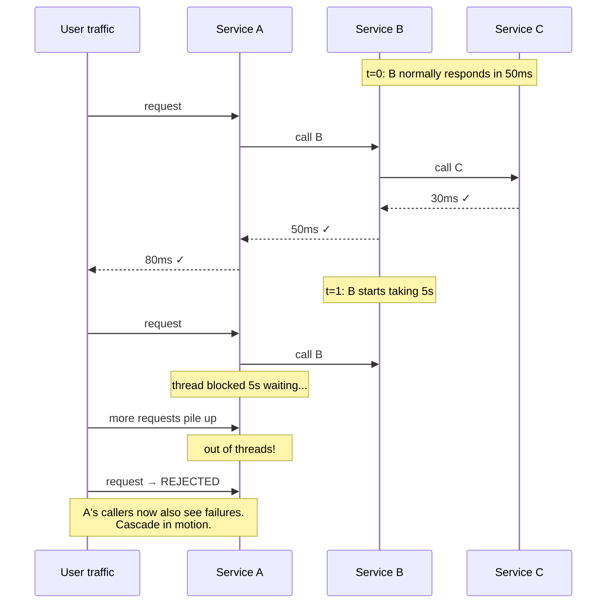
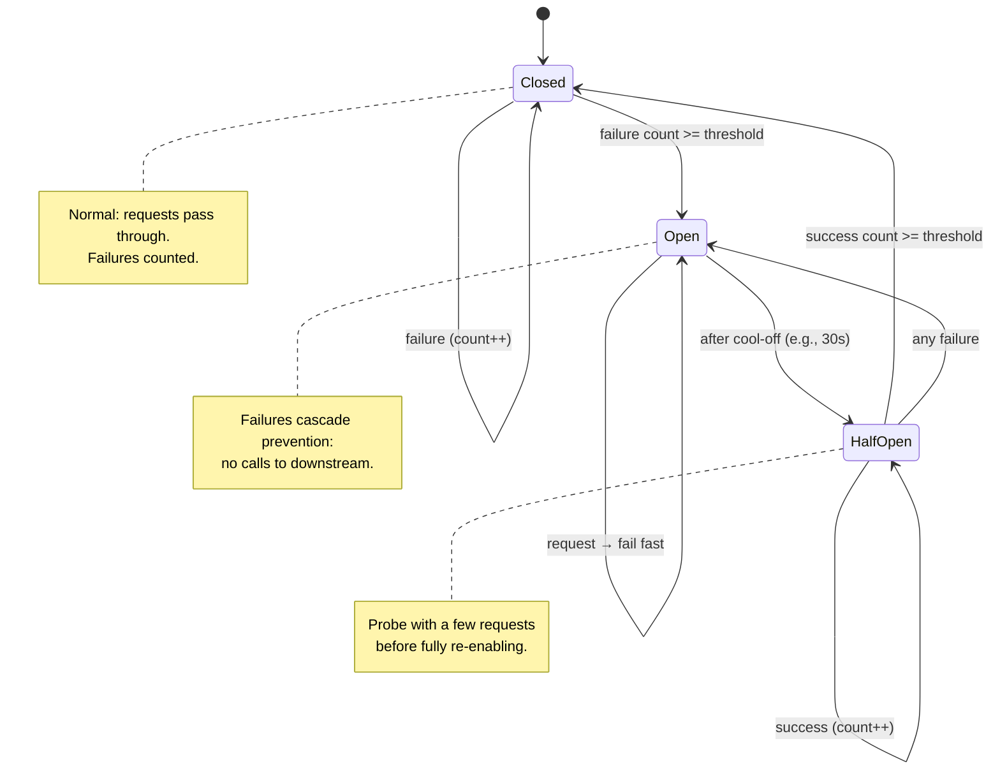
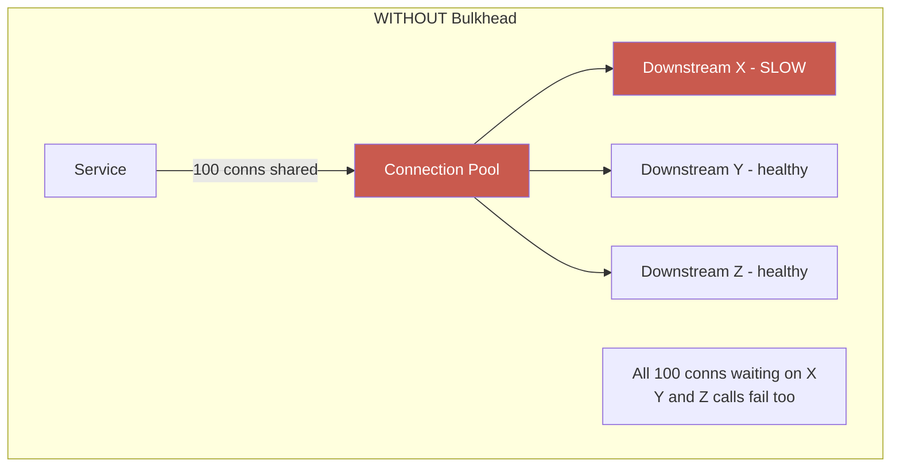
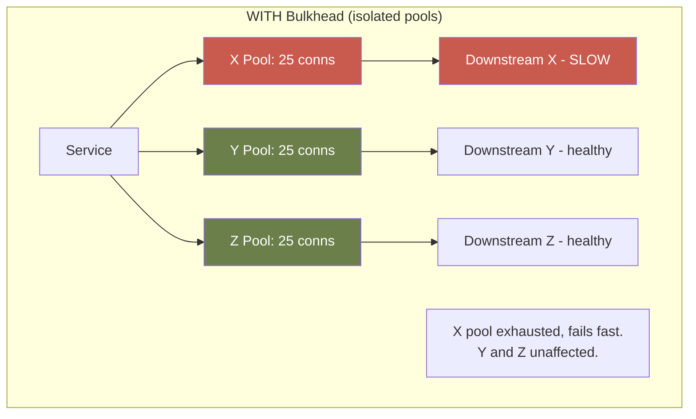

# Module 06 — Reliability Patterns

> **Phase II · Patterns · Weeks 15–16**
>
> _"Hope is not a strategy."_ — Google SRE Book
>
> _"Everything fails, all the time."_ — Werner Vogels

---

## At a Glance

|                              |                                                                                                               |
| ---------------------------- | ------------------------------------------------------------------------------------------------------------- |
| **Mindset shift**            | Design assuming everything fails. The question is how gracefully                                              |
| **Core concepts**            | Failure cascade, blast radius, backpressure, fail-slow vs fail-stop, grey failure, chaos engineering          |
| **Patterns**                 | Timeout · Retry+backoff+jitter · Circuit breaker · Bulkhead · Rate limit · Load shedding · Hedging · Fallback |
| **Capstone**                 | Production-resilient service with all 8 patterns + chaos tests via toxiproxy                                  |
| **Time investment**          | ~20 hours over 2 weeks                                                                                        |
| **One thing to internalize** | A reliability pattern you haven't verified by breaking the system on purpose is just hope.                    |

---

## 1. Mindset

The naïve engineer designs for the happy path. The senior engineer adds error handling. **The architect designs assuming everything will fail, and the question is _how gracefully_.**

This module shifts you from "will it work?" to "**how does it degrade?**" When a downstream is slow, when the network blips, when traffic spikes 10×, when one shard dies — your design either handles it or it cascades. There is no middle ground.

The patterns in this module aren't optional. They're table stakes for any system that has to stay up. If your production system doesn't have circuit breakers, rate limits, and bulkheads — it's not a question of _if_ it'll burn down, only _when_.

---

## 2. Core Concepts

### 2.1 The Failure Cascade

The most dangerous outage pattern: **one slow service makes its callers slow, which makes their callers slow, until everything is down.**



Service B takes 5s instead of 50ms. Service A's threads pile up waiting. Service A runs out of threads. Service A starts rejecting all requests, including ones that don't need B. Now A's callers fail. Cascade.

This is **the single most common outage shape** in microservices systems. Every pattern in this module is, at heart, a way to prevent or contain cascades.

### 2.2 Failure Domains and Blast Radius

A **failure domain** is the set of components that share a fate. When one fails, all fail. Architects design to **shrink failure domains.**

Examples:

- A single AZ is a failure domain (one AZ outage = everything in it dies)
- A single database = failure domain for all queries
- A shared cache cluster = failure domain for all services using it
- One Kubernetes node = failure domain for its pods

**Blast radius** is what's affected when a failure happens. Architects design to **minimize blast radius**:

- Multi-AZ deployment (one AZ down ≠ all down)
- Per-service caches (one cache outage ≠ all services down)
- Cell-based architecture (one cell of users down ≠ all users down)

### 2.3 Backpressure

When a component can't keep up, it needs to push back on its callers — not silently buffer, not crash. Backpressure is the signal.

**Without backpressure**:

- Producer overwhelms consumer
- Consumer's queue grows unbounded
- Memory exhaustion or latency spike
- Cascade to producer's callers

**With backpressure**:

- Consumer signals "I'm full" (HTTP 429, gRPC RESOURCE_EXHAUSTED, queue rejection)
- Producer slows down, retries with backoff, or sheds load
- System reaches sustainable equilibrium

**Architect's question**: at every queue/buffer in your system, ask _"what happens when this fills up?"_ If the answer is "it grows," you have no backpressure.

### 2.4 Fail-slow vs Fail-stop

There are two ways a component can fail. The difference matters enormously for how you detect and handle them.

**Fail-stop**: the component crashes or returns an error immediately. Easy to detect. Circuit breakers catch it in seconds. Example: database is down, connection refused.

**Fail-slow**: the component is still alive but responds at 10× normal latency. Hard to detect. Thread pools fill silently. The system _looks_ healthy until it suddenly isn't. Example: database is overloaded, queries take 8s instead of 50ms.

Fail-slow is **more dangerous** than fail-stop:

- Monitoring doesn't alarm (no errors, just latency)
- Callers keep sending requests (they get responses eventually)
- Resources drain slowly over minutes, not seconds
- By the time you notice, many dependent services are also failing

**Design responses**:

- Timeouts convert fail-slow into fail-stop (section 2.8)
- Circuit breakers use both error _and_ latency thresholds
- Latency percentiles (p95, p99) are your early-warning system — set alerts on them, not just error rate

### 2.5 Grey Failure

Grey failures are **partial, ambiguous failures** — a component that appears healthy by some measures but is failing for specific users, endpoints, or request types.

Examples:

- A cache node responds to pings but returns corrupt data for 3% of keys
- A service's health endpoint returns 200 but one handler is deadlocked
- A DNS resolver works globally but fails for one geographic region
- A database replica is reachable but lags 30 minutes behind primary

**Why grey failures are uniquely dangerous**:

- Health checks pass (the component is "up")
- Monitoring doesn't alarm (aggregate metrics look normal)
- Retries don't help (the failure is deterministic for that request)
- Users experience failures that the team can't reproduce

**Detection strategies**:

- **User-scoped metrics**: don't just track global error rate; track per-user, per-region, per-partition
- **Synthetic probes**: canary requests that exercise specific code paths, not just liveness
- **End-to-end latency tracking**: measure from user perspective, not component perspective
- **Compare replicas**: if replica A diverges from replica B, one of them is grey-failing

**The architect's rule**: any health check that doesn't exercise the actual code path is measuring something other than health.

### 2.6 SLI / SLO / SLA / Error Budget

Before implementing reliability patterns, you need to know what you're aiming for. The Google SRE vocabulary:

| Term             | Meaning                                                          | Example                              |
| ---------------- | ---------------------------------------------------------------- | ------------------------------------ |
| **SLI**          | Service Level Indicator — a metric you measure                   | p99 request latency; error rate      |
| **SLO**          | Service Level Objective — your internal target for the SLI       | p99 < 500ms; error rate < 0.1%       |
| **SLA**          | Service Level Agreement — contractual commitment, usually looser | 99.9% uptime or customer gets refund |
| **Error budget** | 1 − SLO — how much failure you're _allowed_ before breaching     | 0.1% errors/month = ~43 min downtime |

**Why this shapes reliability architecture**:

The error budget is a decision-making tool, not just a number. If you have 43 minutes of downtime budget per month and your current deploy takes 20 minutes to roll back, you have very little room for incidents. That drives:

- Faster rollback strategies (blue-green, feature flags)
- Tighter timeout and circuit-breaker thresholds
- More aggressive pre-production chaos testing

**Practical questions**:

- What's your SLO for this service? If you don't know, you can't set timeouts rationally.
- How much of the error budget is already consumed by planned deploys?
- When the error budget is exhausted, the correct response is to stop feature work and fix reliability — not release more.

### 2.7 The Reliability Patterns Family

We'll cover the canonical patterns:

- **Timeout** — never wait forever
- **Retry** (with backoff & jitter) — recover from transient failures
- **Circuit Breaker** — stop calling a broken downstream
- **Bulkhead** — isolate resource pools per dependency
- **Rate Limiting** — protect against overload (yours or theirs)
- **Load Shedding** — drop low-priority requests under pressure
- **Hedging** — duplicate slow requests to faster replicas
- **Fallback** — degrade gracefully instead of failing
- **Idempotency** — make retries safe

### 2.8 Timeouts

The simplest pattern, the most often missing.

**Every** network call needs a timeout. **Every** lock acquisition needs a timeout. **Every** retry loop needs a timeout. Anything that waits needs a deadline.

**Default Go behavior is wrong**:

```go
// WRONG - default HTTP client has no timeout
resp, _ := http.Get("https://downstream")
```

```go
// RIGHT
client := &http.Client{Timeout: 2 * time.Second}
resp, _ := client.Get("https://downstream")

// BETTER - context-aware, cancellable, propagatable
ctx, cancel := context.WithTimeout(parentCtx, 2*time.Second)
defer cancel()
req, _ := http.NewRequestWithContext(ctx, "GET", "https://downstream", nil)
resp, _ := http.DefaultClient.Do(req)
```

**Timeout budget**: if your service's SLO is p99 < 500ms and you make 3 downstream calls, your timeouts cannot all be 500ms. Allocate budget: maybe 150ms each + 50ms slack. **Always think in budgets, not raw timeouts.**

### 2.9 Deadline Propagation

Setting a timeout on an outbound call is not enough if you don't propagate the deadline across service boundaries.

**The problem**: your service has a 500ms budget. You call Service B with a 400ms timeout. Service B calls Service C with a _new_ 400ms timeout, ignoring the fact that 200ms is already gone. The total chain can now take 600ms — violating your SLO even if every individual timeout was "set."

**The solution**: propagate the remaining deadline, not a fresh one.

```go
// WRONG — fresh timeout for every hop
func callB(ctx context.Context) {
    ctx, cancel := context.WithTimeout(context.Background(), 400*time.Millisecond)
    defer cancel()
    // ...
}

// RIGHT — derive from parent context (remaining budget propagates)
func callB(ctx context.Context) {
    ctx, cancel := context.WithTimeout(ctx, 400*time.Millisecond)
    defer cancel()
    // If parent has 200ms left, WithTimeout uses min(400ms, 200ms) = 200ms
    // ...
}
```

In Go, `context.WithTimeout(ctx, d)` automatically uses the _earlier_ of the parent deadline and `d`. Always pass the parent context. Never create a `context.Background()` mid-chain.

**gRPC**: deadline propagated automatically in the `grpc-timeout` header. HTTP: propagate via `X-Request-Deadline` or a custom header, and reconstruct on the receiving side.

**Cancellation**: when a caller cancels (user closes browser, upstream times out), the downstream work should stop. This is free in Go if you pass the context through: DB queries, HTTP calls, and most I/O operations respect context cancellation.

### 2.10 Retries: The Pattern That's Half-Right Most of the Time

Retries are necessary and dangerous. Done wrong, they _amplify_ outages.

**The retry storm**: downstream is slow, every caller retries 3 times, downstream gets 3× more load, gets slower, more retries, cascade.

**Rules**:

1. **Only retry idempotent operations** (GET, conditional writes, idempotent commands)
2. **Exponential backoff**: 100ms, 200ms, 400ms — not 100ms, 100ms, 100ms
3. **Jitter**: add randomness so retries don't synchronize across callers
4. **Cap retries**: 2-3 attempts, not "until success"
5. **Don't retry 4xx** (it's your fault, not theirs)
6. **Combine with circuit breaker**: once breaker opens, don't retry at all

```go
// Exponential backoff with full jitter (AWS-recommended)
delay := time.Duration(rand.Int63n(int64(baseDelay * (1 << attempt))))
```

### 2.11 Idempotency Keys

Retries are only safe when operations are idempotent. For operations that aren't naturally idempotent (payments, order creation, email sends), **idempotency keys** make them safe to retry.

**The pattern**: the caller generates a unique key for the operation (UUID, content hash) and sends it with every attempt. The server stores the key and result. On duplicate requests with the same key, it returns the stored result instead of executing again.

```go
// Caller side
idempotencyKey := uuid.New().String() // generated once, reused for all retries

for attempt := 0; attempt < 3; attempt++ {
    req, _ := http.NewRequestWithContext(ctx, "POST", "/payments", body)
    req.Header.Set("Idempotency-Key", idempotencyKey)
    resp, err := client.Do(req)
    if err == nil && resp.StatusCode < 500 {
        break
    }
    time.Sleep(backoff(attempt))
}
```

```go
// Server side
func (s *PaymentService) CreatePayment(ctx context.Context, req *PaymentRequest) (*Payment, error) {
    key := req.IdempotencyKey
    if key == "" {
        return nil, errors.New("idempotency key required")
    }

    // Check cache/DB for existing result
    if result, ok := s.idempotencyStore.Get(ctx, key); ok {
        return result, nil // return stored result, no side effects
    }

    // Execute once
    payment, err := s.processPayment(ctx, req)
    if err != nil {
        return nil, err
    }

    // Store result for future duplicate requests
    s.idempotencyStore.Set(ctx, key, payment, 24*time.Hour)
    return payment, nil
}
```

**Key design rules**:

- Key must be unique per _logical operation_, not per request
- Keys should expire (24h is typical)
- The store must be durable (Redis with persistence, or DB) — in-memory loses keys on restart
- Return exactly the same response, including HTTP status code, for duplicates

**Where idempotency keys are mandatory**: payments, order creation, account provisioning, email/SMS sends — any operation with real-world side effects.

### 2.12 Circuit Breaker

After N consecutive failures, **stop calling** the downstream for a cool-off period. Fail fast instead of waiting for timeout.

**States**:

- **Closed**: normal operation, requests pass through, counting failures
- **Open**: requests fail immediately without calling downstream
- **Half-open**: after cool-off, allow one request to test. If success, close. If fail, re-open.

State machine:



**Why this matters**:

- Spares broken downstream from added load (helps it recover)
- Spares caller from waiting on doomed requests (faster failure = better latency)
- Provides a signal: when breaker opens, alert. Something is wrong.

Tuning parameters:

- **Failure threshold**: e.g., 50% errors over rolling 10s window
- **Minimum request volume**: don't open on 1/2 failures; wait for 20+ requests
- **Cool-off duration**: 30-60s typical
- **Half-open probe count**: 1-3 test requests

### 2.13 Bulkhead

Borrowed from ship design: compartments that contain flooding to one section. In software: **separate resource pools per downstream**, so one downstream's slowness doesn't exhaust shared resources.

**Without bulkhead**:

- 100 connection pool shared across all downstreams
- Downstream X gets slow; all 100 connections wait on X
- Calls to healthy downstream Y also fail (no connections available)

**With bulkhead**:

- 25 connections allocated to X, 25 to Y, 25 to Z, 25 spare
- X exhausts its 25; calls to X fail; calls to Y unaffected





Implementations:

- Separate connection pools per downstream
- Separate thread pools / goroutine semaphores per downstream
- Separate Kubernetes pods entirely (extreme bulkheading)

### 2.14 Rate Limiting

Limit requests per unit time. Protects you from caller misbehavior (DDoS, runaway client) and protects downstreams from you.

**Algorithms**:

- **Token bucket**: bucket holds N tokens, refills at rate R. Each request consumes a token. Allows bursts up to N.
- **Leaky bucket**: requests queued, drained at fixed rate R. Smooths spikes.
- **Fixed window**: count requests per minute. Simple, but edge-of-window spikes (2× rate possible).
- **Sliding window**: smoothed version of fixed window. Better.

**Where to rate-limit**:

- **Edge** (CDN, API gateway): cheap, protects everything behind
- **Per-service**: prevents one tenant from starving others
- **Per-user**: fairness, abuse prevention
- **Per-IP**: DDoS mitigation
- **Per-endpoint**: expensive endpoints get tighter limits

**Distributed rate limiting**: with multiple gateway instances, you need a shared counter. Redis-based token bucket is the standard.

### 2.15 Load Shedding

When overloaded, **deliberately drop** low-priority requests to keep high-priority ones working.

Examples:

- API serves both user traffic (high priority) and analytics queries (low). Under load, drop analytics first.
- Recommendation widget is nice-to-have. Under load, return empty (don't fail the whole page).
- Background jobs deferred during peak hours.

**Priority signaling**: clients must mark their requests with priority. Otherwise everything is "high" and shedding doesn't work.

Common implementation: Envoy/Istio with priority labels, or in-process semaphore per priority tier.

### 2.16 Request Hedging

For p99-sensitive systems: when a request takes longer than the p95, **send a duplicate** to another replica. Use whichever returns first. Cancel the slower.

**Why it works**: tail latency is often caused by transient issues on one node (GC pause, hot key). Another node won't have the same problem.

**Cost**: ~5% extra load for ~50% p99 reduction (depending on tail distribution). Often a great trade.

Used by: Google (Jeff Dean's "tail at scale" paper), Cassandra, Riak.

**Be careful**: hedging non-idempotent operations duplicates side effects. Hedge reads, not writes.

### 2.17 Graceful Degradation

When a feature can't work, return a degraded version, not an error.

- Recommendation service down → show popular items instead
- User profile picture service slow → return default avatar
- Real-time price feed broken → use last-known price with stale-data warning

**The architect's job**: enumerate every dependency and pre-design the degradation. Don't let it happen at 3 AM.

### 2.18 Thundering Herd

When many clients simultaneously retry or reconnect after a shared event (restart, cache miss, outage recovery), they create a traffic spike that can overwhelm the target.

Common shapes:

- **Cache stampede**: cache entry expires; hundreds of requests simultaneously miss and all query the database
- **Reconnection storm**: a service restarts; thousands of clients all reconnect within the same second
- **Cold start spike**: first business day of the year (see the Slack example in §6); scheduled maintenance ends

**Prevention strategies**:

| Shape              | Strategy                                                                                               |
| ------------------ | ------------------------------------------------------------------------------------------------------ |
| Cache stampede     | Probabilistic early expiration (refresh before expiry); mutex / single-flight (one DB call, rest wait) |
| Reconnection storm | Jittered reconnect backoff on all clients                                                              |
| Cold start         | Pre-warm instances before routing traffic; ramp traffic gradually                                      |
| Scheduled spikes   | Over-provision before the known event; autoscaler pre-scaling                                          |

**Single-flight pattern** (Go):

```go
import "golang.org/x/sync/singleflight"

var group singleflight.Group

func getUser(id string) (*User, error) {
    // All concurrent calls for the same id share one DB query
    v, err, _ := group.Do(id, func() (interface{}, error) {
        return db.QueryUser(id)
    })
    if err != nil {
        return nil, err
    }
    return v.(*User), nil
}
```

**Jittered reconnect** (client-side):

```go
base := 1 * time.Second
cap  := 60 * time.Second

for attempt := 0; ; attempt++ {
    if err := connect(); err == nil {
        break
    }
    sleep := min(cap, base * (1 << attempt))
    // Full jitter: random in [0, sleep]
    time.Sleep(time.Duration(rand.Int63n(int64(sleep))))
}
```

### 2.19 Chaos Engineering

Intentionally inject failures in production (or production-like) to verify the system actually degrades as designed.

**Levels**:

- **Game days**: scheduled exercise, engineers respond
- **Latency injection**: add 200ms to a downstream, see what happens
- **Failure injection**: kill a service, kill a pod, kill an AZ
- **Continuous chaos**: Chaos Monkey randomly killing pods, every day

**Why**: untested failure modes are theory. **A reliability pattern you haven't verified by breaking the system on purpose is just hope.**

Famous tool: Netflix's Chaos Monkey (and the broader Simian Army).

---

## 3. Patterns Summary

| Pattern         | Solves                        | Cost                           |
| --------------- | ----------------------------- | ------------------------------ |
| Timeout         | Hangs forever                 | Wrong timeout = false failures |
| Retry + backoff | Transient failures            | Retry storms if naive          |
| Idempotency key | Unsafe retries                | Storage + key management       |
| Circuit breaker | Cascading failures            | Tuning overhead                |
| Bulkhead        | Resource exhaustion           | More resources / pools         |
| Rate limit      | Overload, abuse               | False positives in spikes      |
| Load shedding   | Saturation                    | Requires priority labels       |
| Hedging         | Tail latency                  | Extra load                     |
| Fallback        | Hard dependency on downstream | Stale/degraded data            |
| Thundering herd | Reconnect / cache spikes      | Coordination overhead          |
| Chaos           | Untested failure modes        | Time investment                |

---

## 4. Go Implementation: A Circuit Breaker + Token Bucket

Two for the price of one — both patterns you'll use often.

### 4.1 Circuit Breaker

```go
// reliability/breaker.go
package reliability

import (
	"errors"
	"sync"
	"time"
)

type State int

const (
	StateClosed State = iota
	StateOpen
	StateHalfOpen
)

var ErrOpenCircuit = errors.New("circuit open")

type Breaker struct {
	mu sync.Mutex

	// Config
	FailureThreshold int           // failures before opening
	SuccessThreshold int           // successes in half-open before closing
	OpenDuration     time.Duration // how long to stay open before half-open

	// State
	state          State
	failureCount   int
	successCount   int
	lastFailureAt  time.Time
}

func NewBreaker(failureThreshold, successThreshold int, openDuration time.Duration) *Breaker {
	return &Breaker{
		FailureThreshold: failureThreshold,
		SuccessThreshold: successThreshold,
		OpenDuration:     openDuration,
		state:            StateClosed,
	}
}

// Allow reports whether a request should be attempted, and updates state.
func (b *Breaker) Allow() error {
	b.mu.Lock()
	defer b.mu.Unlock()

	switch b.state {
	case StateClosed:
		return nil
	case StateOpen:
		if time.Since(b.lastFailureAt) >= b.OpenDuration {
			b.state = StateHalfOpen
			b.successCount = 0
			return nil
		}
		return ErrOpenCircuit
	case StateHalfOpen:
		// Allow probe requests in half-open
		return nil
	}
	return nil
}

func (b *Breaker) OnSuccess() {
	b.mu.Lock()
	defer b.mu.Unlock()

	switch b.state {
	case StateClosed:
		b.failureCount = 0
	case StateHalfOpen:
		b.successCount++
		if b.successCount >= b.SuccessThreshold {
			b.state = StateClosed
			b.failureCount = 0
			b.successCount = 0
		}
	}
}

func (b *Breaker) OnFailure() {
	b.mu.Lock()
	defer b.mu.Unlock()

	b.lastFailureAt = time.Now()
	switch b.state {
	case StateClosed:
		b.failureCount++
		if b.failureCount >= b.FailureThreshold {
			b.state = StateOpen
		}
	case StateHalfOpen:
		// Any failure in half-open re-opens immediately
		b.state = StateOpen
	}
}

// Execute wraps a function call.
func (b *Breaker) Execute(fn func() error) error {
	if err := b.Allow(); err != nil {
		return err
	}
	err := fn()
	if err != nil {
		b.OnFailure()
		return err
	}
	b.OnSuccess()
	return nil
}
```

Usage:

```go
breaker := NewBreaker(5, 2, 30*time.Second)

err := breaker.Execute(func() error {
	return callDownstream()
})
if errors.Is(err, ErrOpenCircuit) {
	// fall back to cache, return degraded response, etc.
	return cachedValue, nil
}
```

### 4.2 Token Bucket Rate Limiter

```go
// reliability/ratelimit.go
package reliability

import (
	"sync"
	"time"
)

type TokenBucket struct {
	mu        sync.Mutex
	capacity  float64       // max tokens
	rate      float64       // tokens added per second
	tokens    float64
	lastCheck time.Time
}

func NewTokenBucket(capacity, ratePerSec float64) *TokenBucket {
	return &TokenBucket{
		capacity:  capacity,
		rate:      ratePerSec,
		tokens:    capacity, // start full
		lastCheck: time.Now(),
	}
}

// Allow returns true if a request can proceed (consumes 1 token).
func (t *TokenBucket) Allow() bool {
	return t.AllowN(1)
}

// AllowN returns true if n tokens are available.
func (t *TokenBucket) AllowN(n float64) bool {
	t.mu.Lock()
	defer t.mu.Unlock()

	now := time.Now()
	elapsed := now.Sub(t.lastCheck).Seconds()
	t.lastCheck = now

	// Refill
	t.tokens += elapsed * t.rate
	if t.tokens > t.capacity {
		t.tokens = t.capacity
	}

	if t.tokens >= n {
		t.tokens -= n
		return true
	}
	return false
}
```

Usage (per-user rate limiting):

```go
// In real code, use a sync.Map or LRU for per-user buckets
buckets := map[string]*TokenBucket{}
var mu sync.Mutex

func getBucket(userID string) *TokenBucket {
	mu.Lock()
	defer mu.Unlock()
	b, ok := buckets[userID]
	if !ok {
		b = NewTokenBucket(10, 1) // 10 burst, 1/sec sustained
		buckets[userID] = b
	}
	return b
}

func handle(w http.ResponseWriter, r *http.Request) {
	userID := r.Header.Get("X-User-ID")
	if !getBucket(userID).Allow() {
		http.Error(w, "rate limit", http.StatusTooManyRequests)
		return
	}
	// process...
}
```

For distributed rate limiting, replace the in-memory map with Redis (`INCR` + `EXPIRE` for fixed window, or a Lua script for token bucket).

---

## 5. Trade-offs Table

| Decision        | Aggressive Timeouts          | Loose Timeouts      |
| --------------- | ---------------------------- | ------------------- |
| False failures  | More                         | Fewer               |
| User latency    | Better (fail fast)           | Worse (long waits)  |
| Cascade risk    | Lower                        | Higher              |
| **Recommended** | **Tight timeouts + retries** | Only for batch jobs |

| Decision              | Many Retries         | Few Retries          |
| --------------------- | -------------------- | -------------------- |
| Transient recovery    | Better               | Worse                |
| Cascade risk          | Higher (storm)       | Lower                |
| Latency under failure | Worse                | Better               |
| **Recommended**       | **2-3 with backoff** | OK for low-value ops |

| Decision        | Per-tenant rate limit      | Global rate limit                   |
| --------------- | -------------------------- | ----------------------------------- |
| Fairness        | Good                       | Poor (one tenant can starve others) |
| DDoS protection | Bad (each gets full quota) | Better                              |
| **Recommended** | **Both** (tiered)          | Edge only                           |

---

## 6. Health Check Design

A health endpoint that lies is worse than no health endpoint — it gives false confidence and hides problems.

### Liveness vs Readiness

| Type          | Question                               | Kubernetes action on failure       |
| ------------- | -------------------------------------- | ---------------------------------- |
| **Liveness**  | Is the process alive? (not deadlocked) | Restart the pod                    |
| **Readiness** | Is the service ready to take traffic?  | Remove from load balancer rotation |
| **Startup**   | Has the service finished initializing? | Don't start liveness checks yet    |

Liveness should be **shallow**: just confirm the process is running and not deadlocked. Avoid hitting databases in liveness — a slow DB will make all pods restart.

Readiness should be **deep**: check actual dependencies. If the DB is unreachable, the pod isn't ready. Remove it from rotation, don't restart it.

### What a Good Health Endpoint Returns

```json
GET /healthz/ready

{
  "status": "degraded",
  "version": "1.4.2",
  "uptime_seconds": 3721,
  "checks": {
    "database": { "status": "ok", "latency_ms": 4 },
    "cache":    { "status": "ok", "latency_ms": 1 },
    "payments": { "status": "degraded", "latency_ms": 1820, "message": "p99 above threshold" },
    "auth":     { "status": "ok", "latency_ms": 12 }
  }
}
```

Rules:

- Return `200` for healthy and degraded (degraded still takes traffic). Return `503` for unhealthy (remove from rotation).
- Include per-dependency status, not just aggregate.
- Include latency, not just up/down.
- Do **not** make the health check itself slow — use cached results refreshed in the background (every 5s), not synchronous dependency calls on every probe.

### The Grey Failure Problem

Standard health checks miss grey failures (§2.5). Complement them with:

- **Synthetic canary requests**: a background goroutine that sends a real request through the full stack every 30s and records success/latency
- **Dependency version checks**: confirm the DB schema version or config version is what the service expects
- **Saturation signals**: include queue depth, active goroutine count, connection pool utilization in the health payload — these predict failure before it happens

---

## 7. Observability for Reliability

You can't tune what you can't measure. Each pattern needs corresponding metrics, or you'll never know if it's working.

### The Four Golden Signals (Google SRE)

| Signal         | What it measures                                        | Alert threshold            |
| -------------- | ------------------------------------------------------- | -------------------------- |
| **Latency**    | Request duration (p50, p95, p99 — not average)          | p99 > SLO budget           |
| **Traffic**    | Request rate (RPS, events/sec)                          | Unexpected drops or spikes |
| **Errors**     | Rate of failed requests (5xx, timeouts)                 | > error budget burn rate   |
| **Saturation** | How full the service is (CPU, connections, queue depth) | > 80% of any resource      |

**Always use percentiles, never averages.** An average of 50ms can hide a p99 of 5s.

### Per-Pattern Metrics

| Pattern         | Metrics to emit                                                                                     |
| --------------- | --------------------------------------------------------------------------------------------------- |
| Timeout         | `timeout_total` counter per downstream; `request_duration_seconds` histogram                        |
| Retry           | `retry_attempts_total{attempt="1,2,3"}` counter; `retry_exhausted_total`                            |
| Circuit breaker | `circuit_state{downstream,state}` gauge (0=closed,1=open,2=half-open); `circuit_open_total` counter |
| Bulkhead        | `pool_active_connections{downstream}`; `pool_wait_duration_seconds` histogram                       |
| Rate limit      | `rate_limit_rejected_total{tier,reason}`                                                            |
| Load shedding   | `shed_requests_total{priority}`; `queue_depth` gauge                                                |
| Fallback        | `fallback_used_total{feature}`                                                                      |
| Idempotency     | `idempotency_hit_total` (duplicate requests caught)                                                 |

### Error Budget Burn Rate Alerting

Rather than alerting on raw error rate, alert on **burn rate** — how fast you're consuming the error budget.

If your monthly SLO is 99.9% (43 min budget), and you're burning it at 5× the sustainable rate, you'll exhaust it in 6 days instead of 30. Alert on this:

```promql
# Alert if burning budget 14× faster than sustainable (exhausts in 2h)
burn_rate_1h = error_rate_1h / (1 - SLO_target)
alert if burn_rate_1h > 14.4
```

This gives you actionable alerts: "you have 2 hours before SLA breach" beats "error rate is 0.5%."

### Runbook Integration

Every alert should link to a runbook. The runbook for a circuit breaker firing should include:

1. Which downstream opened the breaker?
2. Check that downstream's health endpoint
3. Check latency graphs for that downstream over the last hour
4. Is this correlated with a deploy? (check deploy timeline)
5. If downstream is healthy, check network path (MTR, traceroute)
6. Escalation path if not resolved in 15 min

---

## 8. Real-World Failures

**Amazon Prime Day 2018 — cart service**:

- Cart service became slow; everything that touched cart (checkout, recommendations, wishlists) cascaded
- Lesson: shared dependencies are blast-radius bombs. Bulkhead them.

**GitHub October 2018 (extended) — retry storm**:

- After a brief network blip, every client retried; aggregate load spiked
- Took 24 hours to fully recover even after underlying issue fixed
- Lesson: retries without backoff turn brief outages into long ones

**Cloudflare June 2022 — BGP misconfig**:

- A configuration change caused a routing storm
- Customers cascaded: many services depend on Cloudflare for everything
- Lesson: even your CDN is a failure domain. Plan for it.

**Slack January 2021 — first business day of the year**:

- Cold start; everyone reconnected at once; backend autoscaler couldn't keep up
- Lesson: thundering-herd at periodic boundaries (Monday, New Year, after maintenance). Pre-warm.

---

## 9. Design Challenges

### Challenge 6.1 — Timeout Budget (20 min)

Your service has p99 SLO of 800ms. It makes these downstream calls per request:

- Auth service (every request)
- User profile (every request)
- Recommendations (every request)
- Analytics event (fire-and-forget)

Allocate timeout budget. Justify. What's your fallback for each if it times out?

### Challenge 6.2 — Bulkhead Audit (30 min)

Pick a service you know (work or hypothetical). List every external dependency. For each:

- Is it bulkheaded (separate connection pool, separate thread/goroutine pool)?
- If that dependency went to 100× normal latency, what would happen to other operations in the same service?

Then identify the top 2 dependencies you'd add bulkheads to first, and how.

### Challenge 6.3 — Chaos Plan (45 min)

For an existing system, design a 6-week chaos engineering program:

- Week 1-2: what failures will you inject? In what order (least → most invasive)?
- What do you measure?
- What's your rollback plan if chaos exposes a real outage?
- How do you get stakeholder buy-in?
- What's the success criterion?

This is real architect work — most teams never start chaos engineering because the plan looks scary. The plan is the deliverable.

### Challenge 6.4 — Grey Failure Hunt (30 min)

For a system you know, answer:

- Which dependencies could fail partially without triggering any current alerts?
- What synthetic canary requests would expose those grey failures?
- Pick one dependency and design a canary probe: what does it send, what does it measure, what threshold triggers an alert?

### Challenge 6.5 — Idempotency Audit (20 min)

List every non-GET endpoint in a service you know. For each, answer:

- Is it naturally idempotent? If not, what side effects would a duplicate cause?
- Does it accept an idempotency key? If not, add one. Where would you store it?
- What's the appropriate expiry for that key?

---

## 10. Capstone Project — The Resilient Service

**Goal**: take a service (your capstone from Module 04 or 05, or a new one) and add **all** reliability patterns. Then _prove they work_ with chaos tests.

**Required patterns**:

- Context-based timeouts on every downstream call, with deadline propagation
- Retry with exponential backoff and jitter
- Idempotency keys on all non-idempotent operations
- Circuit breaker per downstream
- Bulkhead per downstream (separate connection pools or semaphores)
- Rate limiting (per-IP and per-user tiers)
- Load shedding under saturation (priority-aware)
- Graceful degradation for at least one feature
- Health endpoint (liveness + readiness, per-dependency status)

**Required tests** (this is the important part):

- Chaos test 1: kill a downstream → service responds with fallback within SLO
- Chaos test 2: slow a downstream to 5s → circuit opens within 10s, no cascade
- Chaos test 3: 10× traffic spike → rate limit returns 429, system stays healthy
- Chaos test 4: kill 1 of 3 service instances → other instances handle load
- Chaos test 5: flood with duplicate requests (same idempotency key) → side effects execute exactly once

**Use `toxiproxy`** (https://github.com/Shopify/toxiproxy) for network chaos. Wrap your downstream calls; inject latency, drops, timeouts.

**Grading**:

- [ ] All patterns implemented
- [ ] All 5 chaos tests pass (i.e., system degrades as designed)
- [ ] Metrics emitted for: circuit state, rate-limit rejects, fallback rate, idempotency hits
- [ ] Health endpoint returns per-dependency status with latency
- [ ] One pattern you removed because the cost wasn't worth it (and you can defend that)

---

## 11. ADR Practice

Write **ADR-006**: choice of resilience strategy for one critical dependency.

The novel section to include: _"Failure modes considered but NOT defended against"_ — explicit list of what your design _won't_ handle and why that's acceptable. This is mature architectural thinking. You can't defend against everything; pick what you ignore consciously.

---

## 12. Mock Interview

**Prompt** (60 min):

> Design a payment gateway integration layer. Your service sits between an e-commerce app and 3 external payment providers (Stripe, Adyen, PayPal). Each provider has its own latency profile (p99 around 800ms), occasional outages, different error semantics. Your SLO: 99.95% availability, p99 < 1.5s. Estimate ~500 TPS peak.

**Watch for**:

- Per-provider circuit breakers and bulkheads
- Idempotency keys end-to-end
- Hedging across providers for latency-sensitive ops
- Fallback / failover strategy (try Stripe, fallback to Adyen)
- How to handle "Stripe says I charged the user but never confirmed" — reconciliation
- Budget allocation across multi-step flows

**Architect-level cues**:

- Discusses failure isolation explicitly
- Acknowledges reconciliation as a first-class concern
- Brings up chaos engineering proactively
- Sketches the on-call runbook
- Defines SLO and derives error budget before proposing thresholds

---

## 13. Further Reading

**Books**:

- _Release It!_ — Michael Nygard (the canonical text on reliability patterns)
- _Site Reliability Engineering_ — Google SRE Book (free online)
- _The Site Reliability Workbook_ — Google (the practical follow-up)

**Papers**:

- "The Tail at Scale" — Dean & Barroso (the hedging paper)
- "Hystrix: Latency and Fault Tolerance for Distributed Systems" — Netflix
- "Adaptive LIFO and 99.9% availability" — Facebook (queue management)

**Talks**:

- "Stop Rate Limiting! Capacity Management Done Right" — Jon Moore
- "Mastering Chaos: A Netflix Guide to Microservices" — Josh Evans

**Tools**:

- Toxiproxy (network chaos)
- Hystrix / resilience4j (JVM circuit breakers — read the code, it's instructive)
- Litmus / Gremlin (Kubernetes chaos)

---

## Module Completion Checklist

- [ ] Can explain why retry-without-backoff is dangerous
- [ ] Can explain fail-slow vs fail-stop and why fail-slow is harder
- [ ] Can identify grey failure scenarios in a system you know
- [ ] Can define SLI/SLO/error budget and use them to set timeout values
- [ ] Can design bulkheads given a list of dependencies
- [ ] Understands when and how to use idempotency keys
- [ ] Built the resilient service capstone with passing chaos tests
- [ ] Wrote ADR-006 with explicit non-goals
- [ ] Self-scored mock interview

**Next**: Module 07 — Design at Scale. The classic interview prompts, done right.

---

## End of Phase II

You now have:

- The vocabulary of architectural patterns (styles, event-driven, resilience)
- Hands-on experience implementing each
- A growing portfolio of ADRs and capstones

**Take a week.** Pick one of your capstones, present it to a peer or mentor, and let them poke holes. Their questions will be the holes you couldn't see yourself.

Phase III is different. It's less new material, more **integration and communication**. The point isn't to add new knowledge — it's to make the knowledge you have _land_ in the real world.
