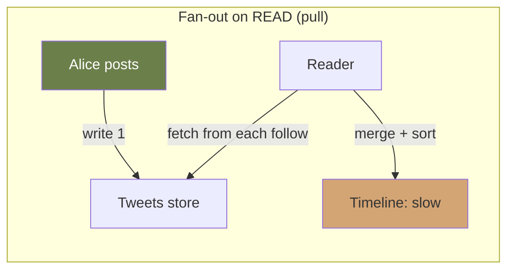
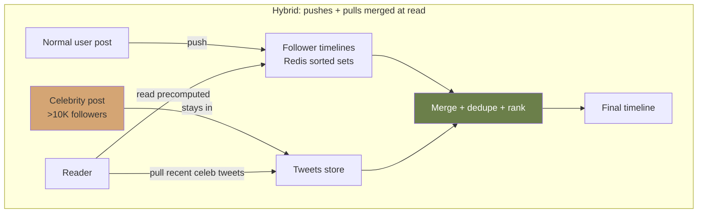

# Module 07 — Design at Scale

> **Phase III · Craft · Weeks 17–20**
>
> _"In a 45-minute interview, the candidate who designs less but defends it better wins."_

---

## At a Glance

|                              |                                                                                                                           |
| ---------------------------- | ------------------------------------------------------------------------------------------------------------------------- |
| **Mindset shift**            | Integration, not new theory. Build the 45-minute design muscle                                                            |
| **Core concepts**            | The 5-phase framework: clarify → estimate → high-level → deep-dive → trade-offs                                           |
| **Patterns**                 | Six interview classics: URL shortener · Feed (Twitter) · Search (Google) · Chat (WhatsApp) · Ride-share (Uber) · Payments |
| **Capstone**                 | Full architecture document for one classic (C4 diagrams + ADRs + migration plan)                                          |
| **Time investment**          | ~40 hours over 4 weeks                                                                                                    |
| **One thing to internalize** | In a 45-min interview, the candidate who designs less but defends it better wins.                                         |

---

## 1. Mindset

This module is **integration, not new theory.** You already know about consistency models (M02), storage choices (M03), event-driven patterns (M05), and reliability (M06). What you might lack is the **muscle to combine them under time pressure**, on prompts you've never seen.

That muscle is what this module builds. We'll walk through six classic system design prompts — not so you can memorize answers, but so you can internalize the **process**: clarify → estimate → high-level → deep-dive → trade-offs.

The interview rubric and the real-world rubric are the same. The good architect:

1. **Defines the problem before solving it**
2. **Surfaces trade-offs explicitly**
3. **Names what they're NOT doing and why**
4. **Has numbers, not vibes**
5. **Is communicating, not lecturing**

---

## 2. The 45-Minute Framework

Whether you're in an interview or facing a real design brief, the rhythm is the same:

| Phase                     | Time      | What you do                                                   |
| ------------------------- | --------- | ------------------------------------------------------------- |
| **1. Requirements**       | 5 min     | Clarify functional + non-functional. Establish scope.         |
| **2. Estimate**           | 5 min     | DAU, QPS, storage, bandwidth. Identify dominant constraint.   |
| **3. High-level**         | 10 min    | Boxes and arrows. Major components only.                      |
| **4. Deep-dive**          | 15-20 min | Pick 2-3 components to detail. Data models, APIs, algorithms. |
| **5. Trade-offs + scale** | 5-10 min  | What breaks at 10× scale? What did you not solve?             |

**The most common candidate mistake**: skipping phase 1 and 2, jumping straight to drawing boxes. **The most common architect mistake**: same thing in design reviews.

---

## 3. Prompt #1: URL Shortener (warm-up)

The "hello world" of system design.

### Requirements

- Functional: shorten long URL → short URL; visit short URL → redirect to long
- Optional: custom aliases, analytics, expiration

**Clarifying questions to ask**:

- Scale? (50M new URLs/month is canonical)
- URL lifetime? (forever? configurable?)
- Custom aliases?
- Analytics required?
- Auth required?

### Estimates

- 50M new URLs/month = ~20 writes/sec average, ~200 writes/sec peak
- Reads:writes = 100:1 → ~2000 reads/sec average, ~20K peak
- Storage: 50M × ~500 bytes × 12 months × 5 years = ~1.5 TB. Fits comfortably.

**Surprise**: this is a _small_ system. Read-optimized, but not at "interesting" scale.

### High-Level Design

```
[Client] → [CDN/Edge cache for hot URLs]
              ↓
        [Load Balancer]
              ↓
        [App Service]
        /         \
   [Redis cache]  [PostgreSQL]
                  (shortcode → long_url)
```

### Key Design Decisions

**Generating short codes**:

- Option A: Hash the URL (md5 truncated). Collisions need handling.
- Option B: Counter-based, base62 encoded. Sequential = leaks rate. Random salt fixes it.
- Option C: Pre-generate a pool of unused codes. Simplest at scale.

**Recommended**: pre-generated pool (C) or random base62 (B with collision retry).

**Custom alias collisions**: insert with unique constraint, return conflict on dup.

**Read path**: cache aggressively. Hot URLs (the top 1%) get 99% of traffic. Redis with LRU is enough.

**Analytics**: emit click event to Kafka, aggregate offline. Don't write per-click to OLTP.

### What You Won't Solve (state explicitly)

- Global multi-region (single region is fine for this scale)
- Real-time analytics dashboards (offline aggregation is fine)
- Malicious URL detection (separate concern, can be added)

### Common Mistakes

- Over-engineering for "internet scale" when 200 writes/sec is the reality
- Storing per-click rows in primary DB (use a stream, aggregate offline)
- Not thinking about hot-URL distribution (cache works because of skew)

---

## 4. Prompt #2: News Feed (Twitter timeline)

The canonical "fan-out" problem.

### Requirements

- User posts a tweet
- Followers see tweet in their home timeline
- Timeline: reverse-chronological, with some ranking
- Optional: replies, retweets, media

**Clarifying questions**:

- DAU?
- Avg followers per user? (skewed: most users few, celebrities millions)
- Read:write ratio?
- Timeline freshness? Acceptable lag?
- Ranking algorithm?

### Estimates

- 200M DAU
- Avg 50 tweets read/user/day, 5 tweets written/user/day
- Reads: 10B/day ≈ 115K RPS avg, ~350K peak
- Writes: 1B/day ≈ 12K RPS avg, ~36K peak
- Read:write ≈ 8:1
- Storage: 1B tweets × 1KB × 5yr × 3 replicas = ~5 PB. Significant.

### High-Level Design

```
[Client] → [API Gateway] → [Tweet service]
                              ↓
                         [Postgres + Kafka]
                              ↓
                         [Fan-out service]
                          /       |       \
                  [User timeline]  ...   [User timeline]
                  (Redis sorted set)
```

### The Fan-Out Question

**Fan-out on write** (push):

- When user posts, immediately write tweet ID to every follower's timeline cache
- Read: O(1) — read pre-built timeline
- Write: O(followers) — can be huge for celebrities (10M followers!)

**Fan-out on read** (pull):

- When user posts, just store the tweet
- Read: O(follows) — for each followed user, fetch recent tweets, merge
- Write: O(1)
- Read is expensive, especially for users following many

Visually:

```mermaid
graph LR
    subgraph "Fan-out on WRITE (push)"
        A1[Alice posts] -->|write 1| F11[Follower 1 timeline]
        A1 -->|write 2| F12[Follower 2 timeline]
        A1 -->|write 3| F13[...]
        A1 -->|write N| F1N[Follower N timeline]
        F11 -->|read O(1)| R1[Reader: instant]
        style A1 fill:#d4a574
        style R1 fill:#6b7f4a,color:#fff
    end
```



**Hybrid (the real answer)**:

- Fan-out on write for most users
- Fan-out on read for celebrities (high-follower accounts)
- Per-user: when reading timeline, merge pushed tweets with celebrity pulls



**Architect's framing**: "We use fan-out-on-write by default for read efficiency. For users above a threshold (say, 10K followers), we degrade to fan-out-on-read for their tweets to bound the write fanout. Followers' timeline reads then merge precomputed timeline + recent celebrity tweets at query time."

### Storage Layer

- **Tweets**: Cassandra or sharded MySQL, partitioned by tweet_id
- **Social graph (follows)**: graph DB or sharded SQL with follower/followee tables
- **Timelines**: Redis sorted set, key = `timeline:{user_id}`, score = tweet timestamp
- **Tweet content cache**: Redis hash

### Deeper Dives

**Ranking**: not the bottleneck of system design — it's a search/ML problem. Mention ML feature store, training pipeline, but don't dive deep unless asked.

**Push notifications**: separate service, consumes Kafka stream of "FollowingTweeted" events, fans out to APN/FCM.

**Media uploads**: separate path. Direct upload to S3, processing pipeline (resize, transcode), CDN serving.

### What You Won't Solve

- Search (separate system; see prompt #3)
- DMs (separate domain)
- Real-time trending (offline batch is fine for v1)
- Compliance / moderation (separate platform service)

---

## 5. Prompt #3: Search Engine (Google-lite)

### Requirements

- Crawl the web
- Build index
- Serve queries with ranked results <200ms

### Estimates

- 10B pages indexed (Google's actual count is way more, but pick something tractable)
- 100K queries/sec
- Page avg 100KB; index entries much smaller
- Storage: 10B × 100KB = 1 PB raw web pages, but the _index_ is much smaller (~10% of original after compression and stop-word removal)

### High-Level Design

```
[Crawler]  →  [Pages stored in S3 / HDFS]
                  ↓
       [Indexing pipeline (batch)]
                  ↓
       [Inverted index (sharded)]
                  ↓
       [Query service] ← [Query]
```

### Inverted Index

Term → posting list (list of document IDs containing that term, with positions and frequencies).

```
"distributed" → [doc1: positions [4, 17], doc55: positions [102], doc89: ...]
"systems"     → [doc1: positions [5, 18], doc23: positions [44], ...]
```

Query "distributed systems" → intersect posting lists.

**Sharding**: by term (each shard owns a subset of terms) or by document (each shard indexes a subset of docs).

- **Term-sharded**: hot terms become hot shards. Bad balance.
- **Document-sharded**: every query hits every shard, results merged. Good balance, more network.

Real systems: document-sharded.

### Ranking

The hard part. Combines:

- Term frequency × inverse document frequency (TF-IDF)
- PageRank or equivalent link analysis
- Click signals (the most predictive in practice)
- Content quality signals
- Freshness
- Personalization

**Multi-stage retrieval**:

1. Candidate generation (~thousands of docs from inverted index)
2. Light ranking (BM25, basic features)
3. Heavy ranking (neural model, lots of features)

### Query Path

```
Query → [Spell correction] → [Query understanding (intent, entities)]
       → [Parallel scatter to all index shards]
       → [Each shard returns top K]
       → [Gather → merge → rank → top N]
       → [Snippet generation]
       → [Response]
```

### What You Won't Solve

- Crawling at scale (huge area — robots.txt, politeness, freshness scheduling)
- Spam detection (massive separate concern)
- Personalization details
- Multilingual / RTL specifics

---

## 6. Prompt #4: Real-Time Chat (WhatsApp-lite)

### Requirements

- 1:1 messages
- Group chats (up to 256 members)
- Delivery + read receipts
- Online/offline status
- Media support
- Push notifications when offline

### Estimates

- 1B DAU
- Avg 100 messages/user/day
- Total: 100B msgs/day ≈ 1.2M msgs/sec avg, ~5M peak
- Active connections: maybe 200M concurrent

### High-Level Design

```
[Client] ←→ [WebSocket Gateway]
               ↓ ↑
       [Connection state (Redis): user → gateway]
               ↓ ↑
       [Message service] → [Storage] + [Kafka]
                              ↓
                         [Delivery to recipient via gateway]
                         [Push notif if offline]
```

### Key Decisions

**Connection state**: gateway servers hold WebSocket connections. A user is connected to exactly one gateway. A central registry (Redis) maps user → gateway.

To send a message: lookup recipient's gateway, forward, gateway pushes via WebSocket.

**Storage**: Cassandra (write-heavy, partition by conversation_id, ordered by timestamp).

**Group fan-out**: for groups of N, do N lookups + N pushes. For 256-member groups this is fine. For "broadcast lists" of millions, treat differently (fan-out-on-read).

**Read receipts**: separate events, eventually consistent. Don't block messaging.

**Online/offline status**: presence service. Heartbeats from clients; absence → offline after timeout. Subscribers (friends viewing your status) get updates.

**End-to-end encryption** (the WhatsApp differentiator): client-side encryption. Server can't read messages. Storage becomes opaque blobs. Operational implications: no server-side search, no server-side ML.

**Push notifications**: when recipient offline, send via APNs/FCM. Critical for re-engagement.

### Deep Dive: Message Ordering

In group chats, what's the canonical order? Several options:

- **Server timestamp**: assign on receipt at server. Linearizable per server, but multiple servers cause skew.
- **Client timestamp + tiebreaker**: clients are untrusted; clocks skew.
- **Lamport timestamps per conversation**: monotonic logical clock. Clean.

Real systems use hybrid: server timestamp, with a conversation-scoped sequence number for tiebreak.

### What You Won't Solve

- Voice/video calling (separate WebRTC architecture)
- Anti-spam, abuse (large separate system)
- Multi-device sync (real but complex)
- Backups (separate service)

---

## 7. Prompt #5: Ride-Sharing (Uber)

The classic "geo + matching + real-time" prompt.

### Requirements

- Riders request rides; drivers accept
- Matching by proximity + driver availability
- Real-time location tracking
- Fare calculation, payment
- Ride history

### Estimates

- 10M active drivers, 100M MAU
- 1M concurrent ride sessions during peak
- Location pings: every driver pings every 4s when online → 2.5M pings/sec
- Ride requests: 100K/min average, ~500K/min peak

### High-Level Design

```
[Driver app] → [Location service] → [Geo index (Redis GEO / dedicated)]
                                              ↓
[Rider app] → [Matching service] ← search by proximity
                    ↓
              [Trip service]
                    ↓
              [Storage + event stream]
```

### Geo Indexing

The interesting bit.

Options:

- **R-tree**: spatial index. PostgreSQL/PostGIS gives you this. Good for read-heavy with moderate writes.
- **Geohash + sharding**: encode lat/lng into a string prefix (`9q9hv...`). Group by prefix.
- **H3 (Uber's actual choice)**: hexagonal grid. Hexagons tile better than squares for distance queries.
- **Quadtree**: divide-and-conquer space.

For 10M drivers updating every 4s, you don't want every update going to disk. Use **Redis with GEO commands** as the hot index. Persist to disk less often.

### Matching

Naive: rider position → query nearby drivers → rank by ETA → offer to closest → wait for accept/decline.

Better:

- Pre-compute zones, batch-match riders to drivers in same zone every 1-2s ("dispatch tick")
- Account for projected pickup time, not straight-line distance
- Account for driver preferences (rating, recent fares, fairness)

Trade-off: more frequent matching = lower latency but more compute. Most production systems batch to balance.

### Surge Pricing

Real-time supply-demand imbalance signal. Geo-tile based. Heuristic + ML.

### Eventual Consistency Within Trips

A trip has a state machine: `requested → matched → en_route → arrived → in_progress → completed → paid`. Each transition can fail. Sagas/state machines (Module 05).

### What You Won't Solve

- Maps and routing (entire industry)
- Fraud detection (separate system)
- Driver onboarding flow (separate domain)
- Dynamic vehicle pricing (separate ML system)

---

## 8. Prompt #6: Payments System (the deep one)

### Requirements

- Accept payments via card, ACH, wallets
- Idempotent (retries don't double-charge)
- High reliability (99.99% SLO)
- Audit and reconciliation
- Multi-currency, multi-acquirer routing

### Estimates

- 10K TPS sustained, 50K peak
- Each transaction touches multiple systems: card processor, fraud, ledger, notification
- Avg processing time: 200-500ms acceptable, but variance must be controlled

### High-Level Design

```
[Merchant] → [Payment API] → [Payment Orchestrator]
                                    ↓
                              [Fraud check]
                                    ↓
                         [Card processor routing]
                          /        |          \
                    [Stripe]  [Adyen]    [Local processor]
                                    ↓
                              [Ledger service (immutable)]
                                    ↓
                              [Notification + reconciliation]
```

### Idempotency

**Critical**. Every payment request from merchant includes `Idempotency-Key`. Server stores `(merchant_id, idempotency_key) → result`. Duplicates return cached result.

Storage: Redis (short-lived) + DB (audit), with consistency guarantee.

### Ledger Design

The **ledger** is the source of truth for money. Architectural rules:

- **Append-only**. Never UPDATE or DELETE.
- **Double-entry**: every transfer is a debit + credit. Balances always sum to zero.
- **Idempotent**: replaying entries gives same balance.
- **Auditable**: every entry has a reason, a source event, timestamps.

This is naturally event-sourced. Current balance = sum of entries.

### Reconciliation

The unsung hero of payments. Every day:

- Pull settlement reports from acquirers
- Compare with internal ledger
- Investigate discrepancies (missing, mismatched, late)

Without reconciliation, you'll bleed money slowly and not know.

### Multi-Acquirer Routing

Why: cost optimization (different acquirers cheaper per region), redundancy (one acquirer down ≠ payments stop).

Strategy: try cheapest first; on decline, fall back to next. Track per-acquirer success rate; route around degraded ones (circuit breaker).

### What You Won't Solve

- KYC/AML (huge separate domain)
- Tax computation (separate domain)
- Chargeback handling (related but deep)
- Specific PCI compliance details (architecture vs procedure)

---

## 9. Prompt #7: Video Streaming (YouTube / Netflix)

The CDN + ingestion + adaptive bitrate prompt.

### Requirements

- Upload a video; process it; make it streamable
- Stream to millions of concurrent viewers globally
- Adaptive bitrate (quality adjusts to network conditions)
- Search, recommendations (mention but don't design)
- Optional: live streaming, comments, chapters

**Clarifying questions**:

- Upload volume? (500 hours of video uploaded per minute — YouTube's actual figure)
- Viewer concurrency?
- Acceptable processing latency before video is available?
- Live streaming in scope?
- DRM required?

### Estimates

- 500 hours uploaded/min → ~30K minutes of raw video/min
- Storage: 1 min of 1080p ≈ 500MB. After encoding all resolutions: ~2GB/min → 60 GB/min ingested permanently
- Viewers: 1B DAU, avg 30 min/day → 30B min served/day ≈ 20M min/sec peak
- Bandwidth: 1 min of video at 4Mbps avg → 80 Tbps at peak. **This is why CDN is non-negotiable.**

### High-Level Design

```
[Uploader] → [Upload service] → [Raw storage (S3)]
                                       ↓
                              [Transcoding pipeline]
                              (split → encode → merge)
                                       ↓
                              [Processed storage (S3)]
                                       ↓
                              [CDN (CloudFront / Akamai)]
                                       ↑
                              [Viewer] ← [Manifest (m3u8)]
```

### The Transcoding Pipeline

Single biggest design area. Raw video → multiple resolutions (240p, 480p, 720p, 1080p, 4K) × multiple codecs (H.264 for compatibility, H.265/AV1 for efficiency).

**Split-encode-merge** (the correct approach):

1. Split video into ~10-second **chunks** (GOP-aligned — don't split mid-frame group)
2. Encode all chunks in parallel across a worker pool
3. Merge encoded chunks back into final file per resolution

Why: a 2-hour video encodes in minutes, not hours. Linear encoding is a single-machine bottleneck.

```
Raw video (2hr)
    ↓
[Chunker] → chunk_001.ts, chunk_002.ts, ... chunk_720.ts
    ↓
[Worker pool — encode each chunk in parallel]
    ↓
[Merger] → video_720p.mp4, video_1080p.mp4, ...
```

Storage: store every chunk separately in S3. The manifest file (`.m3u8`) is just a text index pointing to chunk URLs.

### Adaptive Bitrate Streaming (HLS / DASH)

The player doesn't fetch one big file. It:

1. Fetches the **master manifest** — lists all resolution variants
2. Fetches the **variant manifest** for chosen quality — lists chunk URLs
3. Fetches chunks one at a time, buffering ahead
4. Monitors download speed → switches variant if bandwidth drops

```
master.m3u8
  ├── 1080p/manifest.m3u8
  │     ├── chunk_001.ts
  │     ├── chunk_002.ts
  │     └── ...
  ├── 720p/manifest.m3u8
  └── 360p/manifest.m3u8
```

**CDN placement**: chunks are static objects. CDN edge nodes cache them close to users. Cache hit ratio for popular videos is near 100%. Long-tail videos may not be cached — origin fetch is the fallback.

### Storage Tiering

Not all videos are equally popular:

- **Hot tier** (S3 standard + CDN): top 5% of videos, serving 95% of traffic
- **Warm tier** (S3 IA): videos watched occasionally
- **Cold tier** (Glacier): videos rarely viewed, archived for compliance

Lifecycle policies move videos between tiers automatically based on access recency.

### Key Design Decisions

**Deduplication**: hash the video before storing. Re-uploads of the same content are detected early — skip transcoding, serve existing processed file.

**DRM**: if required, each chunk is encrypted per-title key. Key delivery via a separate Key Management Server (KMS), authenticated per-viewer. CDN only caches ciphertext — safe to cache.

**Live streaming**: chunk duration drops to 2-3s. Encoder pushes chunks in real-time. Manifest is updated continuously. Latency floor ≈ 2× chunk duration. Low-latency HLS (LL-HLS) reduces to sub-2s.

### What You Won't Solve

- Recommendation engine (separate ML system — a whole design of its own)
- Monetization / ads insertion (SSAI is its own architecture)
- Content moderation pipeline
- Multi-CDN routing and failover (provider-specific)

---

## 10. Rate Limiting — Deep Dive

Rate limiting appears in nearly every prompt. Worth knowing cold.

### Why It Matters

- Prevents abuse (scraping, credential stuffing, DDoS amplification)
- Protects downstream services from unexpected spike load
- Enables fair resource allocation between tenants

### Algorithms

| Algorithm                  | How it works                                                     | Burst behavior                  | Memory              |
| -------------------------- | ---------------------------------------------------------------- | ------------------------------- | ------------------- |
| **Fixed window**           | Count reqs per window (1-min buckets). Reset at boundary.        | Allows 2× limit across boundary | Low                 |
| **Sliding window log**     | Store timestamp of every request. Count in last N seconds.       | Accurate, no boundary spike     | High (per-user log) |
| **Sliding window counter** | Approximate: interpolate between two fixed windows.              | Good enough in practice         | Low                 |
| **Token bucket**           | Bucket refills at rate R, max capacity B. Request costs 1 token. | Allows bursts up to B           | Low                 |
| **Leaky bucket**           | Queue requests; process at fixed rate. Excess dropped.           | Smooths bursts entirely         | Queue depth         |

**In practice**: token bucket (or equivalent) is the most common choice. Burst allowance is often desired.

### Distributed Rate Limiting

Single-server rate limiting is easy. Distributed is hard because counters must be shared.

**Option A — Centralized Redis**:

```
[App server 1] ──┐
[App server 2] ──┼──→ [Redis: INCR key TTL] → allow/deny
[App server 3] ──┘
```

Lua script for atomicity:

```lua
local count = redis.call('INCR', key)
if count == 1 then redis.call('EXPIRE', key, window) end
return count
```

Pros: accurate. Cons: Redis is on the critical path; single point of failure.

**Option B — Local approximate + sync**:

Each node maintains local counter. Periodically sync to Redis (every 100ms). Local decisions allow some over-count, but Redis is not on hot path.

Pros: low latency. Cons: brief over-admission possible.

**Option C — Edge rate limiting**:

Push limits to CDN / API gateway (Cloudflare, Kong, AWS API Gateway). Limits enforced before traffic hits your origin. Best for volumetric attacks.

### Where to Enforce

- **API Gateway**: coarse, per-user, per-endpoint
- **Service layer**: per-tenant, per-feature, internal quotas
- **Storage layer**: write rate limits to protect DB

Always enforce at the earliest possible point.

### Response Protocol

Return `429 Too Many Requests` with:

```
HTTP/1.1 429 Too Many Requests
Retry-After: 30
X-RateLimit-Limit: 100
X-RateLimit-Remaining: 0
X-RateLimit-Reset: 1716000000
```

Never silently drop. Clients must be able to back off intelligently.

---

## 11. Data Modeling Checklist

Every design involves storage. Use this checklist before committing to a schema.

### Access Pattern First

Write down every query before designing the schema. Schema follows access pattern — not the other way around.

```
Q1: Fetch timeline for user U (by recency, last 50 items)
Q2: Fetch tweet by tweet_id
Q3: Check if user A follows user B
Q4: List all followers of user U (paginated)
```

For each query: what's the partition key? What's the sort/range key? Is a secondary index needed?

### Denormalization Decision

In SQL: normalize to remove redundancy, join at query time.
In NoSQL: denormalize — duplicate data to collocate what you read together.

| Signal           | Normalize   | Denormalize                   |
| ---------------- | ----------- | ----------------------------- |
| Read:write ratio | Write-heavy | Read-heavy                    |
| Join frequency   | Rare        | Frequent                      |
| Data consistency | Critical    | Eventually consistent is fine |
| Scale            | Moderate    | Very high                     |

There is no universal answer. Name the trade-off explicitly.

### Common Patterns

**Composite sort keys** (DynamoDB / Cassandra): pack multiple fields into sort key for range queries.

```
PK: user#123  SK: tweet#2024-01-15T10:00:00#tweet_id_xyz
→ enables: "all tweets by user 123, newer than date X"
```

**Time-series partitioning**: partition by `(user_id, bucket)` where bucket = month/week. Avoids hot-partition on high-volume writers. Queries span at most 2 buckets.

**Write-time fan-out vs. read-time join**: the feed system trade-off (Prompt #2) is a general pattern. Pre-compute on write = fast reads, expensive writes. Compute on read = cheap writes, expensive reads. Decide based on read:write ratio.

**TTL-based expiry**: use native TTL (Redis `EXPIRE`, DynamoDB `ttl` attribute, Cassandra `USING TTL`) rather than background delete jobs. Simpler, cheaper.

**Soft deletes**: `deleted_at` timestamp instead of `DELETE`. Enables recovery, audit, and feed consistency. But every query must filter `WHERE deleted_at IS NULL` — easy to forget.

---

## 12. Handling the "Extend Your Design" Pivot

Interviewers routinely pivot mid-session: _"Now make it multi-tenant"_, _"Now support offline mode"_, _"Now add analytics."_

This tests adaptability — not whether you already knew the extension.

### The Pivot Response Framework

1. **Acknowledge the constraint change** — "OK, that changes the write path significantly."
2. **Identify what breaks** — which components in your current design can't absorb this?
3. **State the minimal delta** — what's the smallest change that accommodates the new constraint?
4. **Name the new trade-offs** — the pivot usually introduces new costs. Say them.

### Common Pivots and Responses

#### "Now make it multi-tenant"

- Add `tenant_id` to every partition key
- Introduce per-tenant rate limiting and quota enforcement
- Separate storage per tenant if isolation is a compliance requirement (more expensive, simpler reasoning)
- What breaks: any shared cache that doesn't partition by tenant leaks data across tenants

#### "Now make it work offline / eventually consistent"

- Client-side storage (IndexedDB, SQLite) as local replica
- Sync protocol: last-write-wins or CRDT depending on conflict tolerance
- What breaks: any design that assumes server as single source of truth
- What's new: conflict resolution becomes a first-class problem

#### "Now add analytics / reporting"

- Don't write analytics to the OLTP DB
- Emit events to a stream (Kafka); separate analytics pipeline
- OLAP store (Redshift, BigQuery, ClickHouse) for analytical queries
- What breaks: nothing in the main path — this is additive

#### "Now make it globally distributed"

- Data residency requirements → which regions must own which data?
- Active-active or active-passive?
- What breaks: any strong consistency guarantee — distributed transactions are expensive; identify what can be eventually consistent
- Async replication between regions for reads; synchronous only for what truly requires it

**The meta-skill**: you don't need a perfect answer to the pivot. You need to show that you understand what breaks and why. "I'd need to revisit the storage partition scheme because X" is a strong answer even if you don't have the full solution.

---

## 13. Whiteboard vs. Remote — Technique Differences

### Whiteboard (in-person)

- Draw **top-down**: title the problem, then context box, then decompose
- **Spatial discipline**: leave room. Draw boxes large. Leave white space for additions mid-design.
- **Talk while drawing**: never be silent for more than 10 seconds
- Use **arrows with labels** — direction and label matter ("async write", "sync read", "fan-out")
- When you make a decision, say it out loud: "I'm putting cache here because this is a read-heavy path"
- **Stand back** periodically and narrate the whole diagram

### Remote (shared screen / virtual whiteboard)

- Agree on tool upfront: Excalidraw, Miro, draw.io, or even a shared doc
- **Start with a legend** — one line explaining your box/arrow notation
- Narrate more: the interviewer can't see your face or where your cursor is
- Label everything — remote diagrams lose context faster than in-person
- Use **zoom discipline**: keep the full diagram visible; zoom into a component only during a deep-dive
- Keep a second tab with running requirements and estimates — easier to reference than re-reading the diagram

### Universal

- **Requirements as a persistent artifact**: write your requirements in a corner of the board before drawing anything. Refer back when making decisions.
- **Don't erase** — cross out instead. Erasing looks like hiding mistakes; crossing out shows evolution of thinking.
- **Take the hint**: if the interviewer asks "what about X?" — they want you to design X. Stop and address it.
- **Reading silence**: if the interviewer goes quiet after your answer, wait 5 seconds before filling it. If still silent, ask "does that address your concern or should I go deeper?"

---

## 14. Failure Scenario Walkthroughs

The mock interview rubric scores "failure modes" — but reading the rubric is not the same as practicing it. Here is the failure you should walk through cold for each prompt.

### URL Shortener — Redis cache node dies

**Scenario**: the Redis instance holding hot URL cache goes down.

**Impact**: all reads miss cache and hit PostgreSQL. At 20K reads/sec, Postgres is under immediate load. If connection pool exhausts, requests queue or error.

**Response**:

- Circuit breaker: detect Redis down, route all reads to DB, alert
- Promote Redis replica to primary (seconds)
- Rate-limit or shed inbound traffic during recovery to protect DB
- Why acceptable: URL data is fully in Postgres — no data loss, just latency spike

### News Feed — Fan-out consumer falls behind

**Scenario**: Kafka lag on the fan-out consumer grows under spike traffic. Timelines are stale.

**Impact**: users see fewer new posts. No data loss, but freshness SLA is violated.

**Response**:

- Auto-scale consumer group (add partitions + consumers)
- Serve stale timeline from cache + supplement with a direct "recent tweets from followed users" query at read time
- Define bounded staleness SLO explicitly — "timelines within 30s" is reasonable and communicable
- Dead-letter queue: messages failing repeatedly go to DLQ without blocking the main stream

### Chat — WebSocket gateway node crashes

**Scenario**: one gateway server crashes. All 500K users connected to it lose their connection.

**Impact**: users see "disconnected". Messages sent during this window are at risk if not persisted before delivery attempt.

**Response**:

- Clients reconnect immediately — load balancer routes to surviving gateway
- Message must be persisted to Cassandra **before** delivery attempt — crash during delivery means message is already durable; delivery retried on reconnect
- Unread count and delivery receipt updated on reconnect
- Presence service detects heartbeat loss, marks users offline within TTL timeout

### Ride-share — Geo index goes stale

**Scenario**: network partition isolates the Redis geo-index update path. Driver location updates queue but don't reach Redis.

**Impact**: matching service sees stale driver locations. Riders matched to drivers who have moved.

**Response**:

- Matching service checks driver's last-update timestamp before confirming match — if stale beyond threshold (>30s), skip that driver
- Driver app retries location ping with backoff; when partition heals, rapid catch-up
- Trips in progress use a direct connection to the driver's device — separate from the matching geo-index

### Payments — Acquirer timeout

**Scenario**: charge request to an acquirer times out. Did the charge succeed or not?

**Impact**: unknown. Retry if it succeeded → double-charge. Don't retry if it failed → lost payment.

**The correct response**:

- The `Idempotency-Key` sent to the acquirer means retrying the same key is safe — the acquirer returns the same result
- Your internal payment record stays in `PENDING` state until a confirmed response arrives
- Retry with exponential backoff + same idempotency key
- Timeout after N retries → mark as `UNKNOWN`, trigger manual reconciliation
- Never mark a payment as `FAILED` on a timeout — that may cause the user to re-enter card details and create a second charge

### Video Streaming — Transcoding worker crashes mid-job

**Scenario**: a worker processing chunk_042.ts of a video crashes halfway through encoding.

**Impact**: job is incomplete. If not handled, video is partially encoded and unplayable.

**Response**:

- Each chunk is an independent unit of work — checkpointing at chunk granularity. Crashed worker's chunk is retried from scratch by another worker.
- Job coordinator (e.g., workflow engine) tracks which chunks are complete, in-flight, and need retry
- Idempotent chunk output: encoding the same input chunk always produces the same output — safe to retry unconditionally
- Video is not marked "available" until all chunks for all resolutions are confirmed complete

---

## 15. The Practice Routine

Pick a prompt every other day. **30 minutes**:

- 5 min: requirements + estimates
- 15 min: design
- 10 min: critique your own design (what's missing, what would scale break)

Once a week: **full 60-min mock interview** with a peer or via online platform (Pramp, interviewing.io).

**Record yourself** doing a few. Watching back is brutal but transformative. You'll see:

- You jumped to a solution without confirming requirements
- You ignored a question the "interviewer" raised
- You over-built the obvious parts and under-thought the hard parts

---

## 10. Common Anti-Patterns to Unlearn

### "Let's use Kafka" (without saying why)

Kafka is a tool, not an architecture. Name what it gives you (decoupling, replay, fan-out). If a queue (SQS, RabbitMQ) suffices, say so.

### "Microservices for everything"

Re-read Module 04. Most prompts don't need 12 microservices. A modular monolith with a few extracted services is often right.

### "Cache everything"

Cache where there's read skew, value reuse, and tolerable staleness. Caches that aren't hit are wasted memory; caches that are stale are bugs.

### "We'll just use Redis / Cassandra"

Always name _why_ this fits the access pattern. Not because someone famous uses it.

### "Add more replicas"

Replication adds availability and read scaling. Doesn't help write scaling. Doesn't help if your problem is a hot key.

### Skipping numbers

The single biggest signal of "not yet architect-level": designing without back-of-envelope numbers. Without numbers you can't justify anything.

### Designing for "scale" when scale isn't the problem

A URL shortener doesn't need 12-region active-active. A startup CRM doesn't need event sourcing. Match the design to the problem.

---

## 11. Capstone Project — Pick One, Do It End-to-End

**Goal**: take one of the six prompts above (or a similar prompt of comparable size) and produce a **full architecture document** as if presenting to a director-of-engineering.

**Deliverable** (10-15 pages):

1. **Executive summary** (½ page)
2. **Functional and non-functional requirements** (1 page)
3. **Capacity estimates with assumptions** (1 page)
4. **System context diagram** (C4 Level 1)
5. **Container diagram** (C4 Level 2)
6. **Key components: data models, APIs** (2-3 pages)
7. **Critical flows**: 2-3 sequence diagrams of important user journeys
8. **Trade-offs**: at least 3, explicit
9. **What we are NOT building** (½ page)
10. **Migration / rollout strategy** (1 page)
11. **Open questions** (½ page)
12. **Appendix: ADRs** (link to 3 ADRs for key decisions)

**Format**: Markdown, with mermaid or PlantUML for diagrams. Make it ready to share.

**Grading**:

- [ ] Could this doc be the basis for actually building the system?
- [ ] Are the numbers traceable to assumptions?
- [ ] Are at least 2 non-obvious trade-offs surfaced?
- [ ] Does the migration plan account for cutover, rollback, dual-running?

---

## 12. ADR Practice

Write **ADR-007** for one critical decision in your capstone. This is your 7th ADR — quality should be visibly higher than ADR-001.

Force yourself to write the _"Decision context: why now"_ section. Architects don't just decide what; they decide _when_. Including "now is not the right time, we'll revisit in 6 months" is itself a valid architectural decision.

---

## 13. Mock Interview Rubric (Self-Score)

Use this for every mock interview in this module:

| Phase         | Junior (1)               | Senior (3)            | Architect (5)                                                                   |
| ------------- | ------------------------ | --------------------- | ------------------------------------------------------------------------------- |
| Clarification | Dives in                 | Asks a few            | Establishes scope, scale, SLOs explicitly                                       |
| Estimation    | None / hand-waves        | Some numbers          | Numbers with assumptions, identifies dominant constraint                        |
| Top-down      | Boxes immediately        | Roughly layered       | Top-down: clients → API → services → storage; one slide at a time               |
| Trade-offs    | Picks "the right" choice | Notes alternatives    | Surfaces 3+ explicit trade-offs, each grounded in non-functional requirements   |
| Deep-dives    | All breadth              | Some depth on obvious | Depth on 2-3 components most uncertain or risky                                 |
| Failure modes | Doesn't mention          | Mentions briefly      | Names blast radius, picks bulkheads/breakers, predicts what breaks first at 10× |
| Communication | Rambling                 | Linear                | Frames problem → constraints → options → decision; takes interviewer's hints    |

**Target by end of module**: consistent 4s, occasional 5s.

---

## 14. Further Reading

**For prompts**:

- _System Design Interview Vol 1 & 2_ — Alex Xu (the most popular reference)
- "Designing Data-Intensive Applications" — Kleppmann (the why behind what Xu shows)

**Real architectures**:

- The "How We Built X" engineering blog category. Read 3 per week. Discord, Cloudflare, Stripe, Pinterest, Twitter blogs are gold.
- Patrick McKenzie's "Bits about Money" — payments architecture explained for engineers

**Practice**:

- pramp.com, interviewing.io — peer mock interviews
- ByteByteGo, Hello Interview — video walkthroughs (use for variety, not gospel)

---

## Module Completion Checklist

- [ ] Walked through all 6 prompts (own design, not just reading)
- [ ] Did at least 4 full 60-min mock interviews
- [ ] Wrote the capstone architecture doc
- [ ] Wrote ADR-007
- [ ] Self-scored mocks; trend shows improvement
- [ ] Can do a 45-min design on a _new_ prompt and feel comfortable

**Next**: Module 08 — The Architect's Craft. The 50% they don't teach you anywhere.
