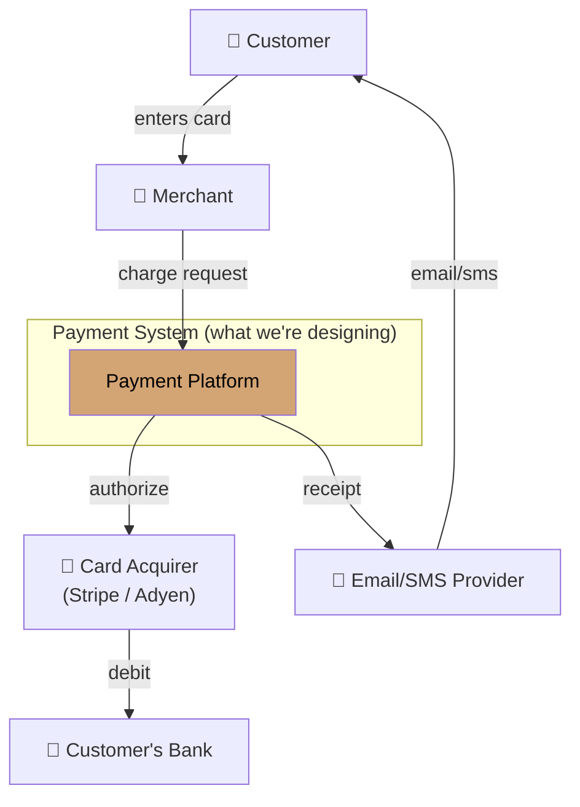
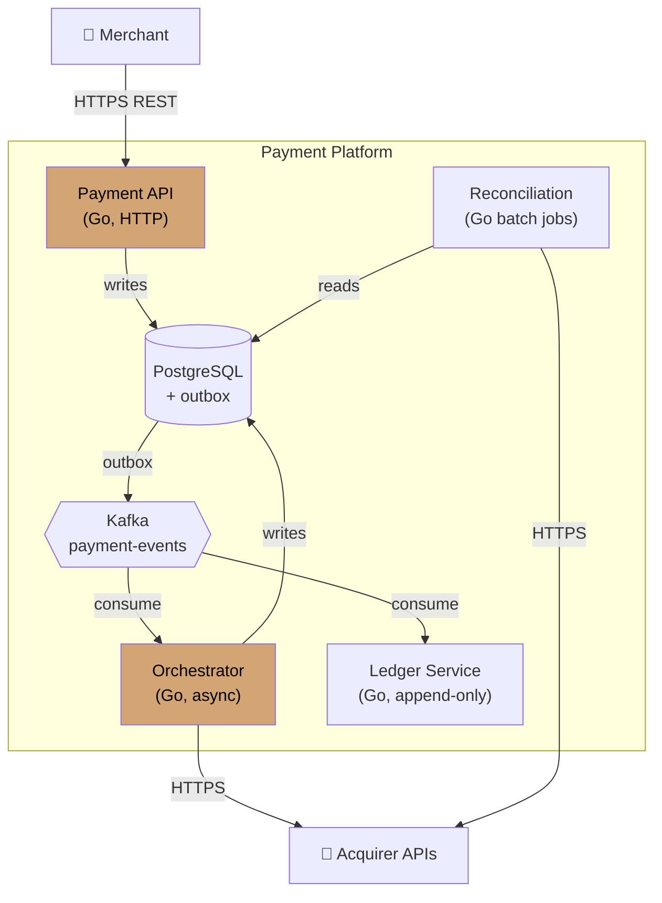

# Module 08 — The Architect's Craft

> **Phase III · Craft · Weeks 21–24**
>
> _"The hardest part of being a software architect is not the software. It's the people who will build it, the people who will pay for it, and the people who will live with it after you're gone."_

---

## At a Glance

|                              |                                                                                                                      |
| ---------------------------- | -------------------------------------------------------------------------------------------------------------------- |
| **Mindset shift**            | From code-as-artifact → communication-as-artifact                                                                    |
| **Core concepts**            | ADRs (proper), RFCs, C4 diagrams, stakeholder translation, influence without authority, career paths                 |
| **Patterns**                 | Pre-wiring decisions · Async-first reviews · Bad-news framework (5 steps) · Disagreement without damage              |
| **Capstone**                 | Final integrated capstone: 5 parts including strategy doc, full architecture, migration plan, 5-8 ADRs, exec summary |
| **Time investment**          | ~40 hours over 4 weeks                                                                                               |
| **One thing to internalize** | The title is a side effect of the work. Internalize the mindset shifts; the title follows.                           |

---

## 1. Mindset

If you've made it here, your technical foundation is solid. You can reason about distributed systems, pick storage by access patterns, design event-driven flows, build resilient services, and walk through interview prompts.

And you are still only halfway there.

The other half is the craft. It's the difference between **knowing the right answer and getting the team to ship it**. Between writing a beautiful design and watching it actually run in production five years later. Between being the smartest person in the room and being the person whose decisions outlast their tenure.

This module is unlike the others. There's less to memorize, more to practice. The skills here can't be tested in 45 minutes; they're tested over years. But you can build them deliberately — and most engineers never do.

This is the third and most important mindset shift: **from code as the artifact to communication as the artifact.** A design no one implements correctly is a failed design.

---

## 2. The Architect's Real Job

Strip the title back to first principles. What does an architect actually _do_ on a Tuesday?

**They make decisions visible.**

- Write ADRs so the team understands _why_ a path was chosen
- Diagram systems so everyone shares a mental model
- Surface trade-offs so the business can weigh in

**They align stakeholders.**

- Translate engineering concerns into business language ("this is a 6-month risk if we delay")
- Translate business pressure into engineering constraints ("we need to ship in Q3, so we're cutting feature X")
- Reduce the number of "we should've talked about this earlier" moments

**They reduce decision fatigue.**

- Establish defaults and patterns the team can apply without re-deciding
- Capture the _spirit_ of the architecture so new decisions are obvious

**They predict the future (a little).**

- Anticipate which decisions will hurt in 3 years
- Make irreversible decisions correctly; make reversible decisions reversible

**They model the standard.**

- The architect writes the ADR the way they want others to write ADRs
- The architect runs the design review the way they want others to run reviews
- Quality is contagious; so is sloppiness

If your day-to-day doesn't include most of the above, you're a senior engineer with a different title — not an architect.

---

## 3. Architecture Decision Records (ADRs), Properly

You've been writing ADRs throughout this course. Let's elevate them.

### 3.1 The ADR Template, Final Form

```markdown
# ADR-NNN: [Decision in active voice — "Use PostgreSQL for OLTP", not "PostgreSQL vs MySQL"]

## Status

[Proposed | Accepted | Deprecated | Superseded by ADR-XXX]

## Context

What is the situation? What forces are pushing on this decision?
2-4 paragraphs. No code. Set the stage.
Name the constraints. Name the stakeholders. Name the timeline.

## Decision

What we will do. Active voice. Short.
("We will adopt PostgreSQL 16 as the primary OLTP store for the orders service.")

## Consequences

### Positive

- ...

### Negative / Costs

- ...

### Neutral / Trade-offs we accept

- ...

## Alternatives Considered

### Option B: [Name]

Why considered, why rejected. Be specific. "Slower" is not specific. "p99 read latency 1.8x higher in our benchmark with realistic data volume" is specific.

### Option C: [Name]

...

## Open Questions

Things we don't know yet but committed anyway. (Naming uncertainty is honesty.)

## References

Benchmarks, prior art, related ADRs, vendor docs.

## Review Date

When do we revisit this? (Most ADRs should have one. Decisions get stale.)
```

### 3.2 ADRs That Get Read vs ADRs That Get Ignored

**Get read**:

- Short (1-3 pages max)
- Title is the decision, not the question
- Clear "Context → Decision → Consequences" arc
- Honest about costs
- Names alternatives concretely
- Written for a smart colleague who wasn't in the room

**Get ignored**:

- 12-page treatises
- Conclusion buried in the middle
- All upside, no downside
- "We considered other options" without naming them
- Written for "the future" abstractly

**The test**: print the ADR. Hand it to a senior engineer who joined yesterday. Can they explain the decision back to you in 2 minutes? If not, rewrite.

### 3.3 ADRs as Conversations, Not Monuments

The ADR isn't the decision-making process; it's the **artifact of the process**. The process is:

1. Architect drafts ADR
2. Stakeholders comment, ask questions
3. Architect revises
4. Decision converges (sometimes after several rounds)
5. ADR marked "Accepted"
6. Months later, if circumstances change, supersede with new ADR

**Don't treat accepted ADRs as immortal.** They reflect a moment. Re-examine them on review dates.

---

## 4. RFCs and Larger Design Documents

ADRs are for single decisions. **RFCs (Request for Comments)** are for larger proposals — usually involving multiple decisions, multiple teams, weeks of work.

### 4.1 RFC Structure

```markdown
# RFC: [Title]

## Author / Reviewers

Who's writing, who's the decision-maker, who must review.

## Summary

1-paragraph TL;DR. If readers stop here, what do they know?

## Motivation

Why are we doing this? What's the cost of NOT doing it?
Real numbers. Real pain.

## Goals / Non-goals

What we WILL solve. What we will NOT solve (this is critical).

## Detailed Design

The actual proposal. Multiple sections as needed.
Diagrams. Sequence flows. Data models.

## Alternatives Considered

Same rigor as ADRs but for the broader proposal.

## Migration / Rollout Plan

How do we get from current state to proposed state?
Phases. Cutover. Rollback. Dual-running periods.

## Risks

What can go wrong? Mitigations?

## Open Questions

What do we still need to figure out?

## Decision

After review, what's the disposition? Approved? Approved with changes? Rejected?
```

### 4.2 Running an RFC Process

The RFC is the document. The process around it is what produces alignment.

A healthy RFC process:

- **Pre-draft conversation**: discuss the problem with 1-2 stakeholders _before_ writing. The first draft should already reflect their concerns.
- **Async review**: post the doc, give 1-2 weeks. Comments inline.
- **Live review meeting**: only after async, only to resolve disagreements. NOT to walk through the doc (reviewers should have read it).
- **Decision artifact**: at the end, write the _decision_. RFC + decision = closed loop.

**Anti-pattern**: scheduling a 60-min meeting to "review the RFC" and having half the attendees read it for the first time. The meeting becomes a 60-min monologue. Async-first.

### 4.3 RFC vs ADR: Which to Use

A common confusion: when do you write an ADR versus an RFC?

| Signal                                                       | Use |
| ------------------------------------------------------------ | --- |
| Single bounded decision (one service, one technology choice) | ADR |
| Multiple interdependent decisions                            | RFC |
| Involves one team                                            | ADR |
| Involves 2+ teams or cross-cutting concerns                  | RFC |
| Decision can be documented in 1-2 pages                      | ADR |
| Proposal requires migration plan, rollout phases, risk table | RFC |
| Captures a past decision already made                        | ADR |
| Seeks alignment on a future proposal                         | RFC |

A single RFC often _generates_ multiple ADRs. The RFC is the proposal; the ADRs are the individual decisions made as a result. They're complementary, not alternatives.

---

## 5. C4 Diagrams (and Why Most Diagrams Are Bad)

Most architecture diagrams in the wild are useless. They're random boxes with random arrows, labeled inconsistently, at no specific level of abstraction. They confuse more than they clarify.

**C4** (by Simon Brown) is a discipline for diagrams at four levels:

### Level 1: System Context

The big picture. **One box for your system**, surrounded by external actors and external systems.

Who: business stakeholders, product, distant teams
Detail: minimal

### Level 2: Container

Inside your system, what are the major deployable units? "Container" here means deployable thing (app, database, queue), not Docker.

Who: most engineers, tech leads
Detail: moderate

### Level 3: Component

Inside one container, what are the major components/modules?

Who: engineers working in that container
Detail: high

### Level 4: Code

Class diagrams, function signatures. (Often skipped; the code IS this level.)

### Example: C4 Level 1 (Context) for a payments system



### Example: C4 Level 2 (Container) for the same payment system



Notice in both examples:

- **Boxes labeled with what they are** (and the language/protocol)
- **Arrows labeled with the protocol/medium**
- **External systems clearly distinguished** from internal
- **Color highlights the system being designed** (gold)

### Rules That Make Diagrams Useful

- **One level per diagram.** Don't mix containers and components.
- **Label every box with what it IS.** "Order Service [Go]" not "Service".
- **Label every arrow with what it CARRIES** (HTTP/REST, gRPC, Kafka topic, etc.) and which way it goes.
- **Title the diagram with its level and scope.** "Container Diagram: Order Processing Subsystem".
- **Include a legend** if shapes/colors mean anything.

**Tools**: PlantUML (`@startuml`), Structurizr (C4-native), Mermaid (Markdown-friendly), Excalidraw (looks-like-you-care).

### Diagrams as Code

Store diagrams in version control as text (PlantUML, Mermaid). Generate images on CI. Why:

- Diffs make sense ("Added auth service" not "image binary changed")
- Pull requests can review diagrams
- Stays in sync with code

### 5.1 Architectural Anti-Patterns

Knowing what to avoid is as important as knowing what to build. These are the most common traps:

**Big Ball of Mud**
No clear structure. Everything calls everything. Changes are terrifying because you can't predict the blast radius. Common in systems that started as prototypes and were never refactored.

_Symptom_: "I need to change X but I'm afraid to touch it."

**Distributed Monolith**
The worst of both worlds: services are split up (so you pay the operational cost of microservices) but they're tightly coupled at the data or API layer (so you lose the independent deployability benefit). Usually happens when monoliths are split by technical layer ("frontend service", "database service") rather than by business domain.

_Symptom_: deploying service A requires coordinating with team B, C, and D.

**Resume-Driven Architecture**
Using technology because it's interesting, not because it solves the problem. Kafka for a system that processes 10 events/day. GraphQL for a team of 2. Kubernetes for a single-tenant app with 100 users.

_Symptom_: the system has more infrastructure than traffic.

**The Shared Database**
Multiple services writing to the same database schema. Looks like pragmatism; is actually coupling in disguise. Service A's migration can break service B. Neither team can evolve their schema independently.

_Symptom_: you can't change a table without a multi-team coordination call.

**Synchronous Call Chains**
Service A calls B calls C calls D. Latency adds. Availability multiplies: if each service is 99.9% available, four of them in a chain is 99.6%. One service's timeout brings down the whole chain.

_Symptom_: a "simple" request makes 8 synchronous hops.

**The Eternal Monolith Migration**
A migration from monolith to microservices that takes 5+ years, is never complete, and runs the monolith and the new system in parallel indefinitely. Expensive to maintain both. Team never gets the benefits of either.

_Symptom_: "we're mid-migration" has been true for three years.

**Recognizing the pattern in your own work**: the question to ask is "what assumption would have to be true for this to be the right choice?" If the assumption is wrong, the design is wrong — and anti-patterns usually rest on false assumptions about scale, team size, or traffic.

---

## 6. Stakeholder Communication

Architects work across audiences. **What you say** matters less than **how it lands**. Same idea, framed for the audience:

### 6.1 The Translation Matrix

| Engineer says                       | Tech lead says                                    | Architect says (to exec)                                                           |
| ----------------------------------- | ------------------------------------------------- | ---------------------------------------------------------------------------------- |
| "Postgres replication lag is 800ms" | "Our read replicas can be stale by ~1 second"     | "Customer transactions show consistent results within ~1 second; UX is unaffected" |
| "Need to refactor module X"         | "Module X is high-debt; slowing feature velocity" | "We're investing 2 sprints to reduce delivery risk in our core area"               |
| "Should add a circuit breaker"      | "Without it, downstream outages cascade"          | "Adding $X of resilience prevents the kind of outage we saw last quarter"          |

This isn't dumbing down. It's **respecting the audience's mental model and time**.

Engineers care about _how_. Tech leads care about _impact and risk_. Execs care about _business outcomes and trade-offs_.

### 6.2 Pre-Wiring

For any big decision: **never blindside stakeholders in a group meeting.** Have 1:1 conversations first. Find resistance early. Adjust the proposal before public review.

If you walk into the group meeting and people are surprised, you've done it wrong.

**The architect's superpower**: by the time the meeting happens, the decision is already aligned.

### 6.3 The Bad-News Conversation

Sometimes you have to tell a team their pet project is wrong. Or a leader their preferred direction won't work. The architect's job.

Framework:

1. **Start with shared values**: "We both want X."
2. **Name the conflict**: "I see the proposal in tension with X because Y."
3. **Bring data, not opinion**: "Our benchmark / past outage / cost model shows Z."
4. **Offer alternatives**: "Here are 2 paths I'd consider."
5. **Let them choose**: don't dictate; equip them to decide.

This is harder than it sounds. Practice it in low-stakes settings.

### 6.4 Tech Debt as a Business Case

Engineers say "we have tech debt." Executives hear "engineers want to do things they find interesting." The disconnect kills most tech debt conversations.

**The reframe**: debt is a delivery tax. Not a technical nicety.

How to quantify it:

- **Velocity impact**: "Our lead time for this module is 3x the rest of the codebase. Over the last quarter that cost us approximately 6 engineer-weeks of delay on features that touched it."
- **Defect rate**: "This module produces 40% of our production incidents despite representing 15% of the codebase."
- **Onboarding tax**: "Every new engineer spends 2-3 weeks before they can safely touch this area."
- **Opportunity cost**: "We cannot implement feature X without first addressing Y. Feature X is on the roadmap for Q3."

**The ask structure**:

1. Here is the business outcome we're trying to achieve (not "we want to refactor")
2. Here is the specific debt standing in the way
3. Here is the cost of NOT addressing it (in delivery, risk, or engineer-hours)
4. Here is what we propose, and what it would cost
5. Here is what we'd be able to do after

Never ask for "a sprint to pay down tech debt." Ask for "2 weeks to reduce the delivery risk on the checkout flow so we can hit the Q3 date."

---

## 7. Influence Without Authority

Most architects don't manage anyone. You can't tell engineers "do this." You have to _convince_ them.

### 7.1 Sources of Influence

- **Expertise**: "they know more than me"
- **Track record**: "their last decision worked out"
- **Clarity**: "their explanation makes sense"
- **Relationships**: "I trust them"
- **Frameworks**: "they help me decide better"

Notice: **none of these is positional.** Title doesn't grant influence; it's earned.

### 7.2 How Architects Lose Influence

- **Over-architecting**: people stop bringing problems because the response is always "let me design the perfect solution" (slow)
- **Holier-than-thou**: people stop listening because you're always saying their code/design is wrong
- **Ivory tower**: you stop coding entirely, lose touch with current tools, lose credibility
- **Long docs that no one reads**: you wrote it; was it influence?
- **Inconsistent stances**: said X last quarter, now saying Y without acknowledgment

### 7.3 The "Stay in the Code" Question

How much should an architect code?

There's no right answer, but a useful one: **enough to be credible.** Maybe 20-40% of your time. Build prototypes. Contribute to the codebase you're shaping. Pair with engineers occasionally. Run a `gofmt` over your design ideas before they become canon.

Pure-paper architects get stale. Always-coding architects don't have time for the rest of the job. Find your balance.

---

## 8. Technical Leadership

Tech leadership and architecture overlap heavily. The difference:

- **Architecture**: what we build, structurally
- **Tech leadership**: how the team builds it together

But the two roles run together in most companies. Skills:

### 8.1 Setting Direction

The architect/tech lead names where the team is going. Not in detail — _in spirit_.

"We're moving toward event-driven for these reasons. New services should default to outbox pattern. Synchronous calls between domains require a justification."

This is **policy**, not decree. A good policy reduces decision overhead. A bad policy creates resentment.

### 8.2 Delegating with Context

Junior engineers want to be told what to do. Senior engineers want to be told _why_. Staff+ engineers want to define the _what_.

Good delegation:

- **What** for juniors: "Implement this endpoint per the spec"
- **Why** for seniors: "We need to reduce coupling here; pick an approach and run it by me"
- **Whether** for staff: "Should we even build this? Investigate and propose"

Delegating well means **calibrating to the engineer**, not delegating the same way to everyone.

### 8.3 Running a Design Review

Design reviews are where architecture lives or dies. Run them well:

- **Async pre-read** is not optional
- **Start with the goal of the meeting**: are we deciding, or exploring?
- **Time-box discussions**: "5 more minutes on this, then we move on"
- **Capture decisions in writing** _during_ the meeting
- **End with concrete next steps** and owners

Bad design reviews are 90-minute meetings that end with "let's discuss further." Good design reviews end with a decision, even if the decision is "we need a prototype before deciding."

### 8.4 Mentoring

Architects multiply themselves through mentoring. Don't keep all your taste private.

- **Code reviews are teaching opportunities**: leave comments that explain _why_, not just _what_
- **Pair-design**: when an engineer brings a design problem, work through it together, narrating your thinking
- **Public ADR review**: in 1:1s with juniors, walk through an ADR you wrote, including the parts you struggled with
- **Encourage them to write ADRs**: even bad ones. The skill is the point.

---

## 9. The First 90 Days

The capstone scenario places you as a new lead architect, 90 days in. Here's the actual playbook:

### Days 1–30: Listen

Your only job is to understand. Resist the urge to propose.

- **Map the system**: read existing ADRs, RFCs, runbooks. Draw the architecture as you understand it, then share it — the corrections tell you more than the reading did.
- **Map the people**: who makes decisions? Who has informal authority? Who is frustrated, and why? Who built the things that are still standing?
- **Attend incident reviews and production on-call handoffs.** What breaks repeatedly? What does the team tolerate?
- **Find the pain**: ask every tech lead "what's the one thing that slows your team down most?" Don't offer solutions yet. Listen.

Output: a private document of what you've learned. Not for sharing yet.

### Days 31–60: Diagnose

Synthesize what you heard into a structured view:

- **Where is the architecture healthy?** Don't only focus on problems.
- **Where is the pain concentrated?** Which systems, which seams, which team handoffs?
- **What decisions are actively pending?** What's blocking teams right now?
- **What are the 3 highest-leverage changes?** Not the most technically interesting — the most impactful relative to effort.

Share your diagnosis in 1:1s before publishing it. Pre-wire. Find out what you got wrong.

### Days 61–90: Propose

Now you have standing to propose. Your credibility comes from the listening.

- **Pick one thing**: don't try to fix everything. One visible win in the first 90 days is worth more than a comprehensive plan that takes 6 months to start.
- **Write the RFC or ADR**: make the proposal concrete and reviewable.
- **Be explicit about what you're NOT proposing**: scoping is a trust signal.
- **Close the loop**: after the first decision, write up what was decided and why. Make the process visible.

The architect who arrives with the answer on day 1 rarely builds the influence needed to implement it. The one who listens first usually does.

---

## 10. Security as Architecture

Security is not a feature you add at the end. It's a structural property. Architects own the threat model — the same way they own the data model or the reliability strategy.

### 10.1 Threat Modeling (STRIDE)

STRIDE is a framework for enumerating threats systematically rather than hoping you thought of the obvious ones.

| Threat                     | Question to ask                                             | Example                                    |
| -------------------------- | ----------------------------------------------------------- | ------------------------------------------ |
| **S**poofing               | Can an attacker pretend to be a legitimate user or service? | Forged JWT, impersonated service identity  |
| **T**ampering              | Can data be modified in transit or at rest?                 | Modified request body, corrupted event     |
| **R**epudiation            | Can someone deny having done something?                     | No audit log, deniable writes              |
| **I**nformation Disclosure | Can data leak to unauthorized parties?                      | Verbose error messages, unprotected bucket |
| **D**enial of Service      | Can the system be made unavailable?                         | No rate limiting, unbounded queries        |
| **E**levation of Privilege | Can an attacker gain capabilities they shouldn't have?      | IDOR, missing authorization checks         |

**How to run a threat model**:

1. Draw the data flow diagram (DFD) — similar to C4 Level 2 but focused on data movement and trust boundaries.
2. For each data flow crossing a trust boundary, apply STRIDE.
3. Rate each threat by likelihood × impact.
4. Document mitigations and residual risks.
5. Produce a threat model ADR.

This doesn't require security expertise to start. It requires asking the right questions systematically.

### 10.2 Security Decisions That Belong in Architecture

Some security decisions look like implementation details but are actually architectural. Get these wrong and no amount of application-layer hardening fixes them:

- **Authentication model**: centralized (API gateway validates JWTs) vs. per-service. Once services proliferate, retrofitting this is painful.
- **Service-to-service auth**: mTLS, short-lived tokens, or nothing? "Nothing" is fine until it isn't.
- **Data classification and residency**: where does PII live? Who can read it? Is it encrypted at rest and in transit? These are schema decisions as much as policy decisions.
- **Secrets management**: how do secrets get to services? Baked into images (bad), environment variables from a vault (better), rotated automatically (best). The architect designs the pipeline.
- **Audit trails**: for compliance and incident response. Which events do you need to be able to reconstruct? Design logging with this in mind — you cannot add it retroactively to a distributed system without gaps.

### 10.3 The Security ADR

Every security decision of consequence deserves an ADR:

- "We use short-lived JWTs issued by auth service; no refresh tokens; users re-authenticate after 15 minutes idle"
- "Service-to-service calls within the cluster use mTLS; external-facing calls require API key"
- "PII is encrypted at the column level in PostgreSQL; the encryption key is held in Vault; only the user service holds access"

These are architectural decisions. Record them.

---

## 11. Platform Thinking and Golden Paths

As organizations grow, architects shift from designing individual systems to designing **how teams design systems**. This is platform thinking.

### 11.1 The Platform Mindset

A platform is anything that makes it easier to do the right thing than the wrong thing. The architect's job becomes:

- **Reduce cognitive load** for feature teams: they shouldn't need to understand service mesh internals to deploy a service.
- **Encode decisions once**: a golden path for "how to create a new service" should already include logging, tracing, auth, health checks, rate limiting — by default.
- **Enable without mandating** (where possible): the best platforms make the right path the easiest path.

### 11.2 Golden Paths

A **golden path** is an opinionated, supported way of doing a common task. Examples:

- "The golden path for a new Go service" → scaffold using this template, which includes: structured logging with the org's log format, Prometheus metrics endpoint, gRPC health probe, Dockerfile, Helm chart, and CI pipeline wired to our deployment system.
- "The golden path for a new data pipeline" → use the internal pipeline framework, which handles idempotency, dead-letter queuing, and backpressure by default.

Golden paths are not mandatory (teams can deviate, with justification) but they should be faster than building from scratch. If the golden path is slower, no one will use it.

### 11.3 When to Invest in Platform

Not every organization needs a platform team. Ask:

- Are teams solving the same infrastructure problems repeatedly?
- Is "how do I set up X" taking weeks when it should take hours?
- Are security and reliability properties inconsistent across services because each team implements them differently?

If yes to two or more: platform investment will pay off. If no: you're a small enough team that shared libraries and a template repo are sufficient.

### 11.4 The Platform Trap

Platform teams fail when they:

- **Build for hypothetical users** instead of talking to actual feature teams
- **Mandate without support**: "you must use our platform" with no migration help
- **Optimize for platform elegance** instead of feature team velocity
- **Stop dogfooding**: the platform team doesn't build features, so they lose touch with what it's like to use their own tools

The metric that matters: **how long does it take a new team to go from zero to their first production deployment?** If the platform is working, that number should be going down over time.

---

## 12. Fitness Functions

Architectural decisions decay. A fitness function is an **automated check that guards an architectural property over time**, so it doesn't have to be enforced by human review alone.

### 12.1 What They Are

From _Building Evolutionary Architectures_ (Ford, Richards): a fitness function is any mechanism that provides an objective integrity assessment of some architectural characteristic.

The word "function" is loose. A fitness function might be:

- A test
- A linting rule
- A CI check
- A production metric with an alert

The key property: **it runs automatically, with every change**, and **fails loudly** when an architectural rule is violated.

### 12.2 Examples

**Dependency direction**:

```
# No service in the payments domain may import from the fulfillment domain
# Checked in CI
$ grep -r "fulfillment" payments/ && exit 1 || exit 0
```

**Layer violations** (using tools like `import-linter`, `dependency-cruiser`):

```
# Controllers may not directly access the database layer
# Repository layer is the only permitted database access point
```

**Cyclomatic complexity ceiling**:

```yaml
# In your linter config: no function may exceed complexity 15
max-complexity: 15
```

**Response time budget** (production):

```
# Alert if p99 latency for checkout exceeds 800ms for 5 minutes
# This is an architectural SLO, not just an ops SLO
```

**Data residency**:

```
# PII fields may only exist in tables tagged `pii: true` in the schema catalog
# Checked by a nightly scan
```

### 12.3 Designing Fitness Functions

A good fitness function:

- **Is automatable**: can run without human judgment
- **Is specific**: "this service may not import that package" not "services should be loosely coupled"
- **Has a known threshold**: pass or fail, not "hmm"
- **Lives in the codebase**: checked in alongside the code it guards
- **Is documented with intent**: a comment explaining _why_ this rule exists, so future engineers don't delete it without understanding what they're breaking

### 12.4 Fitness Functions vs Tests

Tests verify _behavior_. Fitness functions verify _structure and properties_. Both belong in CI. A codebase without fitness functions is one where architectural properties erode silently, one "small exception" at a time.

**Record your fitness functions in an ADR.** The rule, why it exists, what it catches. Future architects will thank you.

---

## 13. The Career Path

You're transitioning to architect. What's after that? The honest map:

```
Senior Engineer (5-8 yrs)
  ↓
Staff Engineer / Tech Lead
  ↓
Principal Engineer / Architect
  ↓
Distinguished Engineer / Senior Principal
  ↓
Fellow (very rare)
```

Parallel: Solution Architect → Enterprise Architect (more org/client-facing, less hands-on)

### 13.1 What Each Level Optimizes For

| Level               | Primary value                            | What they actually do             |
| ------------------- | ---------------------------------------- | --------------------------------- |
| Senior              | Owns a feature/component                 | Ships, mentors a junior           |
| Staff               | Owns a system or domain                  | Designs, leads, multiplies team   |
| Principal/Architect | Owns architecture across systems         | Sets direction, unblocks at scale |
| Distinguished       | Owns _technology choices_ across the org | Strategic tech bets               |

### 13.2 The "Plateau Trap"

Senior engineers who stay senior often hit this trap: they're great at building, but the next level requires building _less_ and shaping _more_. They keep shipping features because that's what they're rewarded for at their level. They never make the leap.

Watch for it. If your day is 95% coding and 5% talking, you're not transitioning. Force the ratio toward 50/50 — even at the cost of some shipping.

### 13.3 The "Just Become a Manager" Trap

Tempting trap: people think "architect" = "manager without ops." It isn't.

Architects don't run performance reviews, don't allocate headcount, don't handle compensation. They influence; they don't authorize. Some companies blur the line (Tech Lead Manager roles); most don't.

If you want to manage humans, go for manager track. If you want to shape technology and people _through it_, architect track. Different jobs.

### 13.4 Real Talk: Compensation

In well-paying tech companies, architect/principal track tops out comparable to mid-level director. In smaller companies, architect tops out near senior engineer pay because "architect" isn't a separate track.

Pick your environment with this in mind. If "principal engineer" doesn't exist as a real career level at your company, you'll need to leave (or shape the company's career ladders) to advance.

---

## 14. The Most Important Soft Skills

If you forget every framework, remember these:

### 14.1 Listen More Than You Speak

In design discussions, the architect's first 5 minutes should be _listening_. What is the team's actual constraint? What are they afraid of? What's their experience? _Then_ speak.

Architects who speak first signal "I have the answer." That kills the room.

### 14.2 Ask the Question Underneath

"Should we use Kafka or RabbitMQ?" The architect asks: "What problem are you solving?" Often the real problem isn't queue choice — it's "we're losing events" or "we have no replay." Either of those has different solutions.

The skill: hear past the proposed solution to the actual problem.

### 14.3 Disagree Without Damaging

You will disagree. Often. Make it about the design, not the designer:

- ✗ "This design is bad because..."
- ✓ "I have concerns about how this handles X. What if we..."

Disagree publicly with arguments; never with people. Save personal feedback for private.

### 14.4 Own Your Mistakes

You will be wrong about big decisions. **Own them quickly and publicly.**

"Six months ago I argued for X. I was wrong because Y. Here's what I'd do differently and what I learned."

This _increases_ your influence — counterintuitively but reliably. Engineers respect honest reckoning. They lose respect for people who never admit error.

### 14.5 Choose Your Battles

Not every bad decision is worth fighting. Save your political capital for decisions where:

- Reversibility cost is high
- You're confident, not just opinionated
- The forum can actually change direction

For everything else: voice the concern in writing, let the team proceed, revisit if reality proves you right.

---

## 15. Final Capstone — The Whole Stack

**Goal**: produce a complete architecture proposal that integrates _everything_ in this course.

**Scenario**: choose a real product (or use your day job's system). Imagine you're the new lead architect, 90 days in.

**Deliverable** (the most ambitious one in the course):

### Part 1: Strategy (2-3 pages)

- Current state assessment
- Quality attribute priorities for the next 18 months
- Strategic decisions (the 3-5 big bets)

### Part 2: Architecture (6-10 pages)

- C4 Context, Container, and one Component diagram
- Major design decisions (link to ADRs)
- Critical flows (3 sequence diagrams)
- Data architecture (storage, partitioning, replication)
- Reliability strategy (the patterns you use, and don't)
- Threat model: STRIDE applied to at least one critical flow

### Part 3: Migration Plan (2-3 pages)

- Current → target
- Phases (3-6 months each)
- Risks and mitigations
- Success metrics per phase

### Part 4: ADRs (5-8 documents)

- Major decisions linked from Part 2
- Each fully-formed using the final template
- At least one **superseding** an older decision (this is the marker of mature architecture)
- At least one covering a security decision

### Part 5: Communication artifacts (1-2 pages each)

- A 1-page **executive summary** for the CTO
- A 1-page **technical brief** for tech leads
- A **draft of the all-hands talk** announcing this direction

### Part 6: Fitness Functions (1 page)

- List 3-5 architectural properties you would guard automatically
- For each: the rule, the mechanism (CI check, linting rule, production alert), and why it matters

### Grading

| Criterion                                                             | Self-check |
| --------------------------------------------------------------------- | ---------- |
| Could a director-of-engineering read and approve?                     | \_\_\_     |
| Could a senior engineer start implementing on Monday?                 | \_\_\_     |
| Could an executive understand the bets and trade-offs?                | \_\_\_     |
| Are 3+ trade-offs surfaced explicitly?                                | \_\_\_     |
| Is there one decision you'd be willing to defend in a hostile review? | \_\_\_     |
| Did you include something you'll NOT do, with reasons?                | \_\_\_     |
| Did you supersede an earlier ADR (i.e., revisit a past decision)?     | \_\_\_     |
| Did you run STRIDE on at least one critical flow?                     | \_\_\_     |
| Did you define at least 3 fitness functions?                          | \_\_\_     |
| Could this document outlive you at the company?                       | \_\_\_     |

**If you can answer yes to all 10**, you've passed the course. More than that — you've produced your first piece of evidence that you can do this job.

---

## 16. Mock Interview — The Behavioral / Leadership Round

By now your technical mock interviews should be solid. The architect interview has a second half: **leadership/behavioral**.

Sample prompts (practice all):

1. _Tell me about a technical decision you made that you later regretted. What did you do?_
2. _Tell me about a time you convinced engineering leadership to NOT do something._
3. _How do you handle disagreement with a manager or peer architect?_
4. _Walk me through how you'd onboard as a new architect at a 200-engineer company._
5. _Tell me about the last ADR you wrote. What was the alternative you almost picked?_
6. _Describe a system you architected that's been in production for 3+ years. What would you change?_
7. _Tell me about a time you had to deliver bad news (project not feasible, design flawed)._
8. _How do you decide between coding and "architecting" on a given day?_

**Frame each answer with STAR**: Situation, Task, Action, Result. Don't ramble. 2-3 minutes per answer is a good target.

### What Strong vs. Weak Looks Like

**Prompt**: _Tell me about a technical decision you made that you later regretted._

**Weak answer**:

> "We picked MongoDB early on and it turned out to not be the right choice. We learned a lot and eventually moved to Postgres."

What's wrong: no specificity on _why_ it was wrong, no ownership of the decision, no named trade-offs, no concrete outcome, no honest reckoning.

**Strong answer**:

> "When we started the user profile service, I pushed for MongoDB because we anticipated schema flexibility. [Situation] I was the tech lead responsible for storage decisions for that domain. [Task] I drove the ADR, gathered buy-in, and we shipped on Mongo in Q2. [Action] A year later we needed strong consistency guarantees for a new billing feature — Mongo's eventual consistency model meant we'd had three billing discrepancies in production. We spent two quarters migrating to Postgres. [Result] What I'd do differently: I was optimizing for flexibility at the cost of consistency, and I hadn't done a threat model on what happens if reads are stale. The lesson I took: don't sacrifice consistency guarantees on financial data for schema flexibility you haven't needed yet."

What's strong: named trade-off, owned the decision, specific consequence (billing discrepancies), concrete lesson, no blame.

**Watch for in your own answers**:

- Specific stories, not abstractions
- Named trade-offs, not "I just decided"
- Owned mistakes, not blame
- Outcomes, not just activities
- Honesty about what you'd do differently

---

## 17. Further Reading

**Books — these will outlast frameworks**:

- _The Software Architect Elevator_ — Gregor Hohpe (the canonical book on architect as translator)
- _Software Architecture: The Hard Parts_ — Ford, Richards (re-read; it hits differently now)
- _Building Evolutionary Architectures_ — Ford, Richards, Kua (fitness functions, architectural governance)
- _Staff Engineer: Leadership Beyond the Management Track_ — Will Larson
- _An Elegant Puzzle: Systems of Engineering Management_ — Will Larson
- _The Five Dysfunctions of a Team_ — Lencioni (people side)
- _Crucial Conversations_ — Patterson et al. (for the hard conversations)
- _Threat Modeling: Designing for Security_ — Adam Shostack
- _Writing for Engineers_ — various; pick one you like

**Articles / blogs**:

- Will Larson's _Staff Engineer's Path_ posts
- _LeadDev_ magazine archives
- The _Pragmatic Engineer_ newsletter
- Engineering blogs at Stripe, Cloudflare, Shopify (the _engineering culture_ posts, not just architecture)
- _The Architect Elevator_ (Hohpe's blog companion)

**Talks**:

- "Architect's Newsletter" — anything by Gregor Hohpe
- Sam Newman keynotes (any year)
- "Staff Engineer" track on InfoQ / GOTO

---

## Module Completion Checklist

- [ ] Wrote at least 8 ADRs across the course; the last 3 are noticeably better than the first
- [ ] Wrote one full RFC and got peer feedback
- [ ] Produced C4 Context + Container + Component diagrams for at least one system
- [ ] Ran STRIDE threat modeling on one critical flow
- [ ] Defined 3+ fitness functions for an architecture you designed
- [ ] Wrote a tech debt business case framed in delivery terms (not "refactor" terms)
- [ ] Completed the final capstone (all 6 parts)
- [ ] Did 3+ behavioral mock interviews using the strong-answer framework
- [ ] Identified one current decision you'd handle differently with what you now know
- [ ] Wrote 1-pager executive summary translating technical decision to business outcome

---

## End of Course

You started this course because you wanted to grow from senior engineer to software architect. Six months later, the question is whether you've earned that title.

Here's the honest answer: **the title is a side effect of the work.**

If you've internalized the three mindset shifts — constraints over solutions, quality attributes first, communication as the artifact — you're an architect, whether your business card says so or not. The companies that recognize this will hire you. The decisions you make will outlast your tenure. The teams you work with will be measurably better for your presence.

If you haven't internalized those shifts, the title won't help. You'll be a senior engineer in an expensive role.

So the course's final test is not a quiz. It's whether, six months from now, the way you approach a system design problem is **visibly different** from how you approached one before.

If it is — congratulations.

If it isn't — go back to Module 01 and start again. The first read was for content. The second read is for transformation.

---

## A Closing Note

Software architecture is not a finished discipline. The patterns will change. The cloud will change. The fashion will change.

The mindset shifts won't.

**Define problems clearly. Trade off honestly. Communicate so the team can act without you.**

Build the systems your future self will thank you for.

Good luck.
