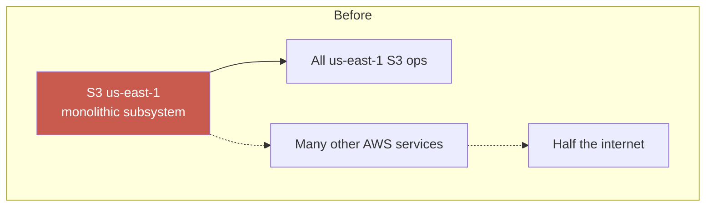
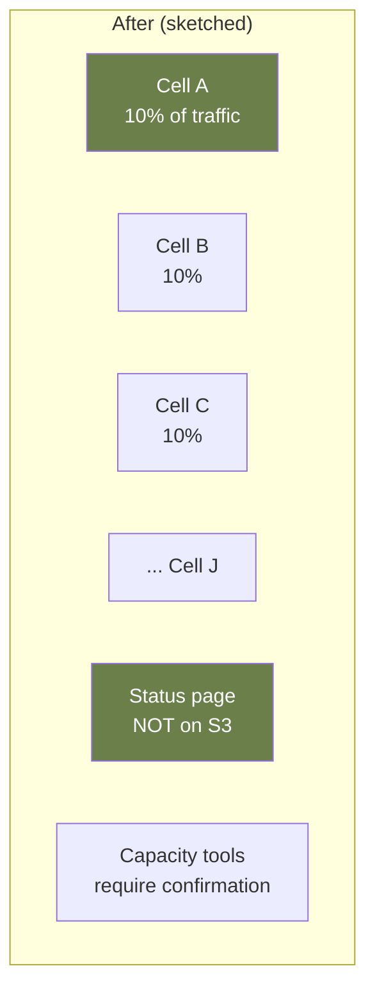

# Case Study: AWS S3 — A Typo Takes Down Half the Internet

> **Date**: February 28, 2017
> **Duration**: ~4 hours
> **Trigger**: A debug command with a typo
> **Primary modules**: 06 (Reliability Patterns), 08 (Architect's Craft)

## The 30-Second Version

An engineer ran a debug command to remove a small number of servers from a billing subsystem. A typo expanded the scope: instead of removing a few, the command removed a large fraction of the **index subsystem**, which serves all S3 metadata. The us-east-1 region's S3 effectively went offline for ~4 hours. Recovery required a full restart of the index subsystem, which had never been performed at production scale — it took hours.

**The lesson: tools that can do catastrophic things should not be that easy to misuse.**

## Timeline

- **9:37 AM PST** — Engineer runs the command, intending to remove a small set of servers.
- **9:37 AM** — Command actually removes a much larger set, including capacity from the **index subsystem** (the metadata layer) and the **placement subsystem** (which routes object creation).
- **9:37–9:52** — Index subsystem unable to keep up with requests; S3 reads start failing in us-east-1.
- **9:54 AM** — AWS begins recovery: restart index subsystem from scratch.
- **~12:00 PM** — Index subsystem restored.
- **~1:54 PM** — Full S3 us-east-1 functionality restored.

## The Blast Radius

S3 us-east-1 is so widely used that _its outage took out other AWS services that don't appear to depend on it_:

- AWS Lambda — used S3 for code storage
- EC2 — autoscaling and AMI lookups
- Slack, Quora, Trello, Medium, Imgur — all relied on S3
- AWS's own status page — hosted on S3, couldn't update during outage 😅

This is the **transitive dependency** problem. You depend on S3. So does every service you depend on. A single-tool-failure cascades through layers of indirect dependency.

## Root Causes

### 1. The command was overly powerful

A single CLI command could remove an arbitrarily large number of servers. No interactive confirmation for large impact. No "rate limit" on destructive operations.

### 2. Restart time hadn't been measured at scale

The index subsystem had grown so large that restarting it took hours. AWS had never benchmarked the cold-start time at production scale. **Operational metrics that matter weren't tracked.**

### 3. Implicit fate-sharing

Many AWS services depended on S3 us-east-1 in non-obvious ways. Failure in S3 cascaded broadly. **No one had mapped the blast radius.**

### 4. The status page was on S3

Trivial cause: AWS's status page was a static site hosted on S3. When S3 was down, AWS couldn't update its own status page. This makes for great engineering jokes but reveals a real architectural lesson: **your monitoring/status infrastructure must not depend on what it monitors.**

## What AWS Changed (per post-mortem)

1. **Safeguards on capacity-removal commands** — confirmation prompts, rate limits.
2. **Partitioned the index subsystem** — smaller cells, faster restart.
3. **Decoupled the status page** — no longer hosted on the service it reports on.
4. **Improved recovery time measurement** — regular drills.

## The Larger Pattern

**Blast radius minimization** is the highest-leverage architectural concept. Most major outages come down to: _one component's failure took down more than expected_.

## Lessons Mapped to Course

- **Module 06**: Bulkhead pattern at infrastructure layer. Cell-based architecture isolates failures.
- **Module 06**: Operator tools are part of reliability architecture. Sharp tools cause sharp accidents.
- **Module 08**: Architecture includes **operator interfaces**. Designing how humans interact with the system is architecture.

## Discussion Questions

1. What's your most destructive operational command? What's the worst it could do if mistyped?
2. If your most critical service had to restart from a cold state, how long would it take? Have you measured this?
3. List 3 services that depend on your service. Do they all know? Do they have a fallback?
4. Where is your status page hosted? Could it survive an outage of your primary infrastructure?
5. If a junior engineer can't tell the difference between a safe and a dangerous command, the tool is too sharp. Where in your tooling does this risk exist?

## References

- AWS official post-mortem: https://aws.amazon.com/message/41926/
- Excellent commentary by Werner Vogels at the time
- Course material: Module 06 (blast radius), Module 08 (operator tools as architecture)

---

> _"It's not that engineers should be more careful. It's that systems should make the dangerous case the harder one to invoke."_
