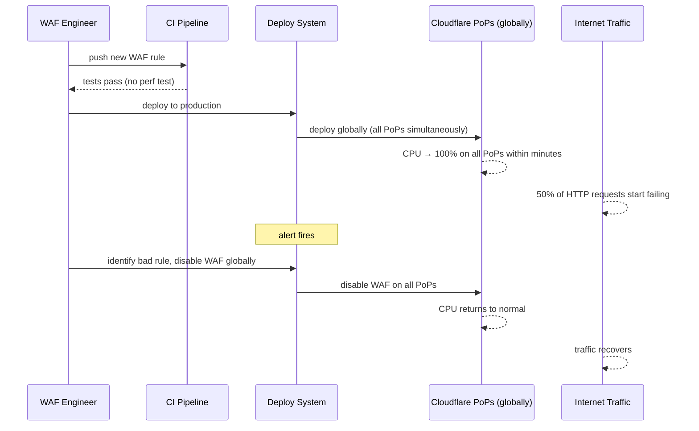

# Case Study: Cloudflare — The Regex That Took Down the Internet

> **Date**: July 2, 2019 — 27 minutes of ~50% global traffic drop
> **Type**: Performance incident — CPU exhaustion, not a crash
> **Primary modules**: 06 (Reliability Patterns), 08 (The Architect's Craft — operational discipline)

## The 30-Second Version

A single regular expression with catastrophic backtracking was deployed to Cloudflare's WAF (Web Application Firewall), causing CPU usage to spike to 100% on every Cloudflare PoP globally within minutes. HTTP traffic through Cloudflare dropped ~50% because all CPU was consumed evaluating the regex. No crash, no code bug — just one regex consuming all available compute. 27 minutes of significant global impact.

**The lesson: CPU exhaustion is an outage. A single regex deployed without performance testing can take down a global CDN. Every WAF rule is a piece of code on your hot path.**

## The Regex

The offending rule was added to protect against path traversal attacks. The problematic portion of the regex:

```
(?:(?:\"|'|\]|\}|\\|\d|(?:nan|infinity|true|false|null|undefined|symbol|math)|\`|\-|\+)+[)]*;?((?:\s|-|~|!|\{\}|\|\||\+)*.*(?:.*=.*)))
```

The critical piece is `(?:.*(?:.*=.*))`.

This is catastrophic backtracking:
- `.*` matches any characters (greedy)
- `(?:.*=.*)` also matches any characters, with `=` somewhere in them
- When the string does NOT match, the regex engine backtracks exhaustively through all possible combinations of where `.*` starts and ends
- For a string without `=`, the engine tries O(n²) or worse combinations before concluding "no match"

For a string of length N with no `=`, the number of backtrack attempts grows **exponentially** with N. A 500-character HTTP request body with no `=` could pin a CPU core for seconds.

## The Timeline



Total time from deploy to resolution: **27 minutes**.

## Why the CI Pipeline Didn't Catch It

Cloudflare's CI ran correctness tests on WAF rules — does the rule match what it should? Does it not match what it shouldn't?

There was **no performance test**: no test that ran the regex against a corpus of real-world HTTP requests and measured CPU time. A regex that takes 5ms per evaluation on a PoP handling 10K req/sec uses **50 CPU cores** just for that one rule.

Additionally, at the time:
- WAF rules were deployed to all PoPs simultaneously (no staged rollout)
- Rollback required explicitly disabling the entire WAF, not just reverting the rule
- The global rollout meant the problem was visible everywhere within seconds of deployment

## The Scope of Impact

- Cloudflare's network handles ~10% of all internet traffic (at 2019 scale)
- ~50% of HTTP requests through Cloudflare's PoPs failed during the incident
- Major Cloudflare customers affected: Discord, GitLab, Shopify, hundreds of thousands of others
- Not all services were affected equally — those using Cloudflare Workers (compute at edge) had different CPU contention characteristics

## What Cloudflare Changed

Per Cloudflare's detailed post-mortem (highly recommended reading):

1. **Performance regression testing for all WAF rules**: rules are now tested against a corpus of real HTTP traffic, and CPU time per rule is measured. A rule exceeding a CPU budget fails CI.

2. **Staged rollout for WAF rules**: rules are now deployed incrementally — a subset of PoPs first, with monitoring before global rollout.

3. **Re2 / re2-based regex engines**: Cloudflare moved WAF rule evaluation to re2, a regex engine with guaranteed linear-time evaluation. Re2 rejects patterns that could catastrophically backtrack — the offending regex would not have compiled under re2.

4. **CPU overload protection**: Cloudflare added a CPU threshold at which WAF processing is bypassed to prevent CPU exhaustion from taking down the PoP entirely.

## Catastrophic Backtracking — A Primer

Most regex engines (PCRE, Python `re`, JavaScript, Java) use backtracking NFA implementations. For most patterns, they're fast. For patterns with nested quantifiers on overlapping character classes, they can be exponentially slow.

The classic example: `(a+)+` applied to `"aaaaab"`. The engine tries all ways to split "aaaa" across the outer and inner groups before giving up. For N "a"s: 2^N attempts.

Safe alternatives:
- **re2** (Go, Rust regex crate, Google RE2 C++ library): O(n) guaranteed, rejects catastrophic patterns
- **Avoid nested quantifiers**: `(a*)*`, `(a+)+`, `(a|aa)*` are red flags
- **Bounded quantifiers**: `a{1,100}` is safer than `a*` when you know the expected length

## Lessons for Your Designs

**1. Every hot-path operation needs a performance budget, not just a correctness test.**

Your CI might catch "this function returns the wrong value." Does it catch "this function takes 500ms instead of 1ms"? Performance regression tests are as important as correctness tests for code on the critical path.

**2. Staged rollout is not just for application code.**

Configuration changes (WAF rules, feature flags, database query plan changes, DNS TTL changes) can be as impactful as code changes. Apply the same staged rollout discipline: 1% → 10% → 100%, with automated rollback.

**3. Use regex engines with complexity guarantees where regex is in the hot path.**

Go's `regexp` package uses re2. Python's `re` does not — use the `re2` package if you're evaluating untrusted patterns. Never run PCRE-style regexes on untrusted input without bounds on input length.

**4. CPU exhaustion is an outage, even if the process doesn't crash.**

A process at 100% CPU stops making progress on new requests. This is indistinguishable from a crash from the client's perspective. Monitor CPU headroom, not just error rates.

**5. "Disable globally to recover" is a blunt rollback instrument.**

Cloudflare had to disable the entire WAF to recover — because the rollback mechanism was all-or-nothing. When designing rollback mechanisms, ask: can you roll back a single component (one rule, one feature, one endpoint) without rolling back everything?

## What This Changes in Your Thinking

- **Add performance tests alongside correctness tests** for any code on the request path. "It returns the right answer" is necessary but not sufficient.
- **When you see `.*` in a regex that processes user input, pause.** Ask: what does this regex do on a string designed to maximise backtracking?
- **Staged rollout for WAF and config changes** should be a default, not an exception.
- **CPU usage is a leading indicator of latency degradation** — if CPU climbs but errors haven't spiked yet, you have seconds to act before users notice. Alert on CPU headroom, not just on errors.
