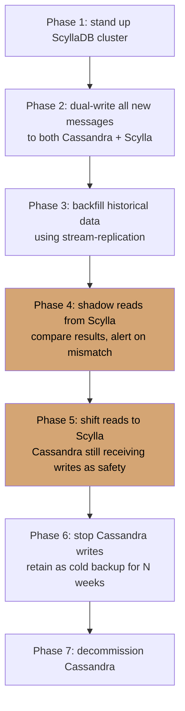

# Case Study: Discord — Migrating from Cassandra to ScyllaDB

> **Date**: 2022 (multi-year migration completed)
> **Type**: Successful proactive migration (no outage), not an incident
> **Primary modules**: 03 (Data at Scale), 08 (Architect's Craft — decision-making)

## The 30-Second Version

Discord ran Apache Cassandra at massive scale: ~120 nodes, ~trillions of messages. Operating it became increasingly painful — frequent garbage collection pauses, hot partitions, expensive node replacements. They migrated to ScyllaDB (a Cassandra-compatible store in C++) and reduced cluster size from 177 to **72 nodes** while serving more traffic, with latencies dropping dramatically.

**The lesson: this is what architectural decision-making looks like in practice. They didn't migrate because it was trendy. They migrated because measured pain crossed the threshold of migration cost.**

## The Context (2018–2022)

Discord chose Cassandra in 2017 for messages, for solid reasons (Module 03 applies): write-heavy workload, simple key-based access pattern, AP consistency acceptable, horizontal scaling.

For years it worked. Then it started to hurt:

- **GC pauses**: JVM heap on Cassandra nodes meant occasional 100ms–1s pauses, visible to users
- **Hot partitions**: certain large servers' messages caused some Cassandra partitions to grow far beyond design point
- **Compaction overhead**: with growing data, compaction consumed more and more CPU
- **Node replacement**: replacing a failed Cassandra node took hours and required careful operator attention
- **Cluster size**: 177 nodes at peak — a substantial operational footprint

These weren't incidents. They were _attrition_. Engineering hours spent on Cassandra ops grew quarter over quarter.

## The Decision Framework Applied

Discord didn't migrate impulsively. They worked through this systematically.

### What was the actual pain?

- ~10 engineer-weeks/year on Cassandra firefighting
- Tail latencies (p99) higher than desired
- Cost: 177 instances of large-class EC2

### What were the alternatives?

1. **Stay on Cassandra, tune harder** — they had been doing this for years; returns were diminishing
2. **Stay on Cassandra, throw more hardware** — linear cost growth, doesn't fix the root cause
3. **Migrate to a different data model** (e.g., a custom solution on top of FoundationDB) — major engineering, high risk
4. **Migrate to ScyllaDB** — Cassandra-compatible, C++ runtime (no GC), proven at similar scale

### How did they choose?

They didn't argue. They **measured**. A months-long parallel deployment compared real production workload performance. The numbers were unambiguous.

Per Discord's published numbers:

- Latency p99: dropped from ~40ms to ~5ms
- Cluster size: 177 → 72 nodes
- Required operator intervention: dropped substantially

## The Migration Pattern

Discord's approach (and what worked):

The interesting phases are 4 and 5: **shadow reads** verified correctness before flipping; **dual-write retention** provided rollback insurance.

This is **strangler fig at the database layer**.

## Lessons Mapped to Course

- **Module 03**: B-Tree vs LSM is not the only axis. **Runtime matters.** Same data model, different runtime (JVM vs C++) = dramatically different operational profile.
- **Module 08 (ADRs)**: This is what [ADR-005 (in this course)](../../examples/adrs/adr-005-scylladb.md) is modeled on. **Decisions decay**; the 2017 Cassandra choice was correct then and wrong by 2022.
- **Module 08 (Career)**: Big migrations are how architects build credibility. They're risky, slow, hard to justify — and the architects who can pull them off get promoted.

## What This Course Models On

[ADR-005](../../examples/adrs/adr-005-scylladb.md) in this course uses the PropertyHub context to walk through the _decision-making_ of a Cassandra → ScyllaDB migration. It's directly inspired by this real case.

## Discussion Questions

1. What architectural decision at your company was correct 3 years ago but you'd make differently today?
2. What's your "attrition pain" — the cost you pay every week from a past architecture decision? Is it growing?
3. If you migrated a critical data store, would your team have the runway and skills to do it without an outage?
4. What's your equivalent of "shadow reads" — a way to validate a new system against an old one with production load?
5. How do you currently quantify the cost of NOT migrating something? Most teams under-measure this.

## References

- Discord engineering blog: https://discord.com/blog/how-discord-stores-trillions-of-messages
- Earlier Discord blog: "How Discord Stores Billions of Messages" (the original Cassandra writeup, useful for contrast)
- ScyllaDB Inc.'s case study (more sales-y but has useful numbers)
- Course material: Module 03, ADR-005

---

> _"Architecture isn't a one-time decision. It's a series of decisions, each correct for its moment. The mark of a good architect is knowing when the moment has passed."_
