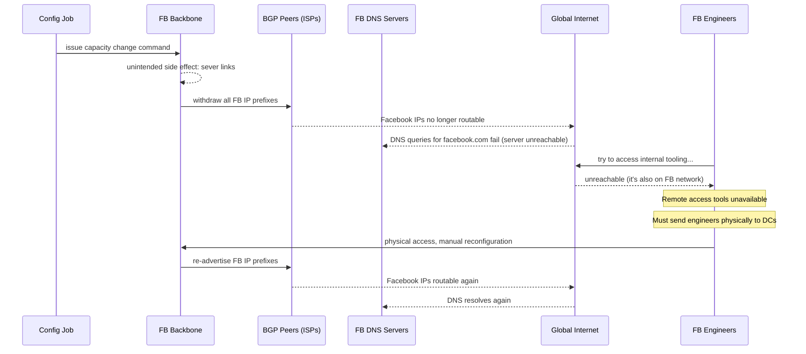

# Case Study: Facebook — Global BGP Outage

> **Date**: October 4, 2021 — approximately 6 hours of total outage
> **Type**: Complete global outage — Facebook, Instagram, WhatsApp, Oculus, Workplace all unreachable
> **Primary modules**: 02 (Distributed Systems Theory), 06 (Reliability Patterns), 08 (The Architect's Craft)

## The 30-Second Version

Facebook's entire family of apps went offline for ~6 hours when a routine BGP configuration update accidentally withdrew all of Facebook's IP address prefixes from the global internet. DNS servers became unreachable (they were on the same network). The internal tooling used to fix the problem was also on the same network — so the engineers who needed to fix it remotely couldn't access the systems they needed to fix. Engineers had to fly to data centres with physical access to undo the change manually.

**The lesson: your recovery tools must not depend on the system being recovered. When your network is down, your ability to fix your network cannot require your network.**

## The Context

Facebook operates its own global backbone network — a private WAN connecting its data centres worldwide. BGP (Border Gateway Protocol) is the routing protocol that tells the rest of the internet how to reach Facebook's IP addresses. Without BGP advertisements, Facebook's IP space is invisible to the global internet.

On the morning of October 4, 2021, a routine maintenance job was issued to change the capacity of backbone routers. The job issued a command that had an unintended side effect: it severed the connection between Facebook's data centres and the rest of its network, and simultaneously withdrew all BGP routes.

Within minutes:
- All BGP advertisements for Facebook's IP prefixes were withdrawn globally
- Facebook's authoritative DNS servers became unreachable (they're hosted on Facebook infrastructure)
- Because DNS was unreachable, clients couldn't resolve `facebook.com`, `instagram.com`, `whatsapp.com`
- Facebook's internal tooling — the systems engineers use to manage the network — was also hosted on Facebook's network

## The Timeline

## Why It Was So Hard to Fix

Three compounding factors extended the outage from minutes to hours:

**1. Self-referential tooling**: Facebook's network management tools were hosted on Facebook's network. When the network went down, the tools went with it. Engineers lost the ability to issue fix commands remotely.

**2. Physical security worked against recovery**: Facebook's data centres have strict physical access controls (this is good). But "strict physical access controls" means "takes hours for engineers to physically reach the right systems."

**3. BGP withdrawal cascaded**: once the BGP routes were withdrawn, not only was the internet unable to reach Facebook — internal Facebook services that communicated across data centres via the backbone also failed. The outage was not just "external users can't connect." Internal systems were also failing, creating additional complexity.

## The Financial and Reputational Impact

- Estimated revenue loss: ~$60–100M (Facebook's revenue at the time was ~$29B/quarter ≈ $318M/day)
- WhatsApp's 2B users lost access to their primary messaging app
- Facebook's market cap dropped ~$7B on the day (Zuckerberg's personal wealth dropped ~$6B)
- DNS queries to other providers spiked 10×+ as billions of clients retried

## What Facebook Changed

Per Facebook's post-mortem:

1. **Out-of-band access**: changes to backbone routers now require verified out-of-band management access. OOB management uses a separate physical network that doesn't transit the primary backbone.

2. **Safer config jobs**: the auditing system for backbone commands now has additional checks that prevent commands that would result in total loss of connectivity from executing.

3. **Staged rollout for network changes**: network configuration changes are now applied to a small subset of the network first, with automatic rollback if connectivity is lost.

4. **Independent recovery path**: recovery tooling has a path that doesn't require the primary network to be functional.

## Lessons for Your Designs

**1. Your management plane must be independent of your data plane.**

If you use AWS, your management plane (IAM, CloudTrail, CloudFormation) is in the same region as your workload. An AZ failure can take out both. Out-of-band access (separate VPC, separate region, physical access procedures) is not paranoia — it's engineering.

**2. BGP is the internet's routing protocol — and it has no authentication by default.**

Any router can announce any prefix. RPKI (Resource Public Key Infrastructure) is the solution, and Facebook now uses it. In your designs, know which external dependencies (DNS, BGP, TLS CAs) have no authentication and plan for their failure.

**3. "The system that fixes the system" is a hidden dependency.**

Draw a dependency graph that includes your monitoring, alerting, runbook tooling, and deployment systems. Are any of these hosted on the service they monitor? If Datadog is hosted on AWS and your AWS is down, you're flying blind.

**4. Blast radius of network changes can be total.**

A single command took down all of Facebook's services globally. Network-layer changes deserve the same caution as database migrations: staged, reversible, with automated rollback on connectivity loss.

**5. Physical access procedures are part of your incident runbook.**

If your digital recovery path fails, what is the physical path? For most companies: "call the data centre NOC." For Facebook-scale, it's "fly engineers to data centres." Know your physical recovery path before you need it.

## What This Changes in Your Thinking

- **Design your control plane to survive data plane failure.** Management systems (deployment tools, configuration systems, monitoring) need a path to function even when the primary network is degraded.
- **Single command, total failure is a red flag.** In your design reviews, ask: what is the most damaging single command that can be issued? Is it possible to make that command require multiple approvals or staged rollout?
- **Test your recovery path, not just your primary path.** Facebook's recovery tools existed; they just required the network they were trying to fix. Test your runbooks for the scenario "the monitoring system is also down."
- **BGP-level decisions (for systems you operate at scale) need staged rollout.** Apply the same principles as application deployment: small percentage first, automated rollback on failure signal.
