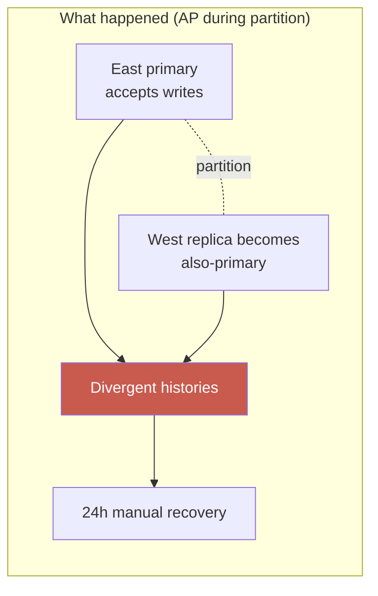
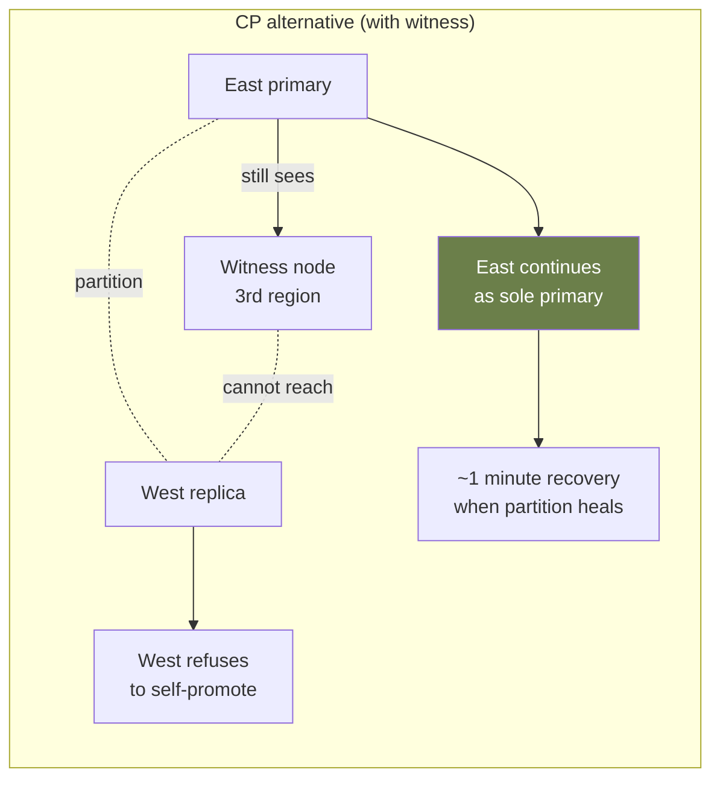

# Case Study: GitHub — 24 Hours of Degraded Service

> **Date**: October 21–22, 2018
> **Duration**: ~24 hours (full impact)
> **Trigger**: 43-second network partition
> **Primary modules**: 02 (Distributed Systems Theory), 06 (Reliability Patterns)

## The 30-Second Version

A 43-second network blip between GitHub's US-East and US-West data centers caused MySQL Orchestrator to fail over to a replica. The replica was behind on writes. When the network recovered, the system tried to reconcile divergent histories — and failed safely by refusing writes. GitHub ran in read-only/degraded mode for 24 hours while engineers manually merged data.

The key lesson: **the immediate cause was the partition. The root cause was a failover that couldn't distinguish "primary unreachable" from "primary unavailable."**

## Timeline

### Pre-incident

GitHub's MySQL setup at the time:

- Primary in US East (Virginia)
- Hot replica in US West (California)
- MySQL Orchestrator running automatic failover
- Replication: semi-synchronous (most writes ack'd by replica before commit)
- Cross-region link: typically a few ms RTT

### October 21, 2018

- **22:52 UTC** — Routine maintenance on the 100G optical transport network connecting east and west coast data centers.
- **22:52:00–22:52:43** — Network partition: 43 seconds where the link is fully down.

During those 43 seconds:

- US East MySQL primary continues to accept writes (it can't see US West to ask for ack).
- US West MySQL Orchestrator detects "primary unreachable" and... **promotes the local US West replica to primary.**
- Now: **two primaries.** "Split brain."

- **22:52:43** — Network recovers.

But by then:

- US East primary has ~954 writes that US West never received.
- US West (newly promoted primary) has its own writes from those 43 seconds.
- The two databases have **divergent histories** that cannot be cleanly merged.

### Recovery

- **22:54** — GitHub engineers detect the issue. Pages firing.
- **23:07** — Decision: enter "maintenance mode." Site goes read-only. Better to be unavailable than to corrupt data.
- **The next 24 hours**: engineers manually reconcile divergent writes. ~954 transactions need careful merging — some are user actions (issue comments), some are internal state.
- **October 22, 23:03 UTC** — Full service restored after manual reconciliation.

## Root Cause Analysis

### 1. Failover automation lacked a quorum / witness

MySQL Orchestrator used a heuristic: "If I can't reach the primary, promote the replica." This is a **leader election without consensus** — the classic split-brain enabler.

What it lacked: a _third_ witness (e.g., from another region or AZ) to confirm that the primary was truly down, not just unreachable from the replica's perspective.

### 2. Semi-synchronous replication doesn't prevent split-brain

Semi-sync replication ensures writes are durable on the replica before ack'd. It does NOT prevent the _primary_ from continuing to accept writes when it can't see the replica.

### 3. No "fence" on the promoted replica

When the network came back, the (formerly demoted) East primary had no mechanism to recognize it was no longer primary. It kept accepting writes briefly.

### 4. Recovery wasn't automated because it can't be

Once you have divergent histories, no automatic reconciliation is safe. **Manual review of every conflicting transaction was required.** This is correct behavior — but it's slow.

## The CAP Theorem Made Concrete

CAP says: during partition, choose **Consistency** or **Availability**.

GitHub's setup chose **A** during partition (both sides kept accepting writes). When partition healed, they had to choose **C** (refuse service until manual reconciliation).

The architecturally cleaner choice would have been **CP** from the start: during partition, refuse writes on at least one side. Yes, that's a brief outage. But it's far better than 24 hours of read-only.

## Architecture Lessons

### Lesson 1: Failure detection ≠ failure confirmation

A node being unreachable from your perspective is not the same as being down. Without an external witness, you cannot distinguish.

### Lesson 2: "Automatic failover" must have a tested manual override

GitHub's automation made the wrong call. Engineers needed manual intervention. Make sure your runbook tells operators: "When in doubt, **don't** failover. Stop writes."

### Lesson 3: Plan for the recovery, not just the failure

A 43-second incident caused 24 hours of recovery. Why? Because the _recovery procedure_ (manual reconciliation) had never been rehearsed or automated.

### Lesson 4: Cross-region writes are fundamentally expensive

The whole multi-region multi-primary design carries this risk. Many teams opt for: writes to one region, async replication to others, accept some data loss on regional failover.

## Lessons Mapped to Course

- **Module 02 — Distributed Systems Theory**: Two-Generals problem made real. Consensus must use a witness or accept these risks.
- **Module 03 — Data at Scale**: Sync vs async replication trade-offs matter. Choosing sync semi-replication isn't enough.
- **Module 06 — Reliability Patterns**: "Failure modes considered but not defended against" should be in your ADR. GitHub's ADR (if it existed) didn't name "split-brain during regional partition" as a defended risk.
- **Module 07 — Design at Scale**: Multi-region designs need explicit consistency model and explicit failure-mode-recovery plans.

## Discussion Questions

1. Does your system have automatic failover? Have you tested it in a way that creates a split-brain scenario?
2. If your primary database became unreachable from your application _but was still up and serving writes from somewhere else_, would your code detect this?
3. If two databases ended up with divergent state for 1 hour, do you have a procedure to reconcile? Have you ever practiced it?
4. What's your equivalent of GitHub's "read-only maintenance mode"? Can you flip a switch and serve degraded vs fail entirely?
5. For your most important data, is the **C** in CAP an acceptable choice over **A**? Have you discussed this explicitly with product/business?

## References

- Official post-mortem: https://github.blog/2018-10-30-oct21-post-incident-analysis/
- A detailed dive: Aphyr's analysis of MySQL Orchestrator behavior
- Course material: Module 02 (CAP, consensus), Module 06 (failure handling)

---

> _"Our automated systems made a tradeoff we wouldn't have made if a human had been in the loop. Our recovery procedure assumed we'd never need it."_
