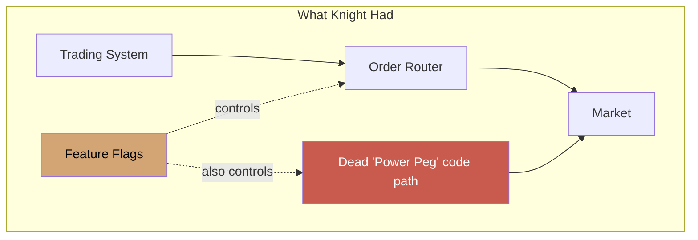
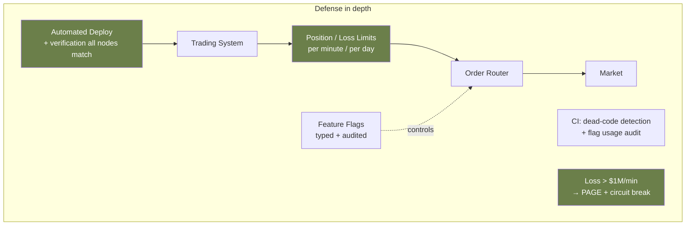

# Case Study: Knight Capital — $440M in 45 Minutes

> **Date**: August 1, 2012
> **Duration**: ~45 minutes of trading activity
> **Impact**: $440 million loss; firm sold to competitor 4 months later
> **Primary modules**: 01 (Thinking in Systems), 04 (Architecture Styles)

## The 30-Second Version

On the morning of August 1, 2012, Knight Capital's automated trading system began executing erratic trades — 4 million orders in 45 minutes, mostly buying high and selling low. By the time the system was shut down, the firm had lost $440 million, more than its total quarterly revenue. The cause: a 9-year-old debug feature, accidentally re-activated during a routine deployment.

## Timeline

### Pre-incident

- 2003: Knight added a feature flag called "Power Peg" to test new order routing. The flag, when enabled, would route orders to a special test handler. Feature was deprecated but **the flag remained in the code**.
- Years 2003–2012: Flag's value defaulted to "off." Code path was dead. Reused for a *different* purpose in subsequent years — toggling a new market-making feature.

### The Deploy

- July 27, 2012: Knight prepared a new deployment to support a new SEC-mandated trading program (Retail Liquidity Program, going live August 1).
- The deployment included code that **repurposed the old "Power Peg" flag** for the new feature.
- Deploy procedure: manual SSH to 8 production servers, copy code, restart.

### August 1, 2012 — go-live morning

- **9:30 AM** — Market opens. Knight's system begins processing orders.
- One server (out of 8) had not received the new code. **The deployment had been incomplete.**
- That server's "Power Peg" flag, when set by the new feature, triggered the **old, deprecated** Power Peg code path.
- The old code path bought and sold rapidly without any limit checks.
- **9:30:33** — First erratic trades appear.
- **9:31** — Knight's monitoring detects unusual activity. Email alerts to senior engineers (NOT pages).
- **9:34** — Engineers see millions of orders. Try to identify cause.
- **9:35–10:05** — Frantic attempts to roll back. **Rollback procedure had been to RE-DEPLOY** the previous version — which means re-running the same buggy deploy. **Rolling back made it worse** on the other 7 servers.
- **10:15** — System shut down by manual intervention.
- **45 minutes elapsed. $440 million lost.**

## Root Causes

This was not a single bug. It was a chain of architectural failures.

### 1. Dead code retained

The 9-year-old Power Peg code was never removed. It was assumed safe because the flag was off. **Dead code is not safe — it's a loaded gun waiting for someone to point it.**

### 2. Flag name reuse

A flag was repurposed to control a new feature, but the old code path still listened to that flag. Name collision in feature flag semantics is a vector for catastrophic bugs.

### 3. Manual deploy process

8 servers, manually SSH'd. No automation. **One server got missed.** No tooling to verify all servers were on the same version.

### 4. No pre-flight check

The new feature's first run was *in production at market open*. No staging environment validation that the flag did what was expected.

### 5. Rollback made it worse

The "rollback" procedure re-ran the deploy script. With a defective deploy script, this *propagated* the bug to more servers. Rollback procedures were never tested.

### 6. Alerts via email, not page

Despite ~$10M/minute being lost, engineers got email alerts, not pages. Monitoring fidelity was wrong for the risk profile.

## The Quality Attribute That Was Missing

Knight optimized for performance, throughput, low latency — typical for high-frequency trading. They did not optimize for:

- **Operability** — clean deploys, verified rollouts
- **Failure containment** — limits on losses per minute
- **Recoverability** — tested rollback procedures
- **Observability** — alerts proportional to impact

**These are architectural choices**, not just engineering hygiene. They appear in your Quality Attribute Ranking (Module 01) or they don't. Knight's ranking didn't include them.

## Architecture Lessons

**Then look at what would have prevented it:**

## Lessons Mapped to Course

- **Module 01 — Thinking in Systems**: Operability and failure containment are quality attributes. Name them or ignore them at your peril.
- **Module 06 — Reliability Patterns**: Circuit breakers and limits *on your own actions*. Don't trust your code to behave; bound its blast radius.
- **Module 08 — The Architect's Craft**: Deployment procedure and rollback procedure are part of architecture, not "ops". Test them like code.

## Discussion Questions

1. In your current system, name two pieces of dead code or unused feature flags. What's your plan to remove them?
2. What's your rollback procedure for a typical deploy? **Have you tested it in production?**
3. If your system started losing money / data at 100× normal rate, would you get paged in under 5 minutes?
4. What's the maximum loss/data loss your system could cause in 1 hour before someone notices? Is that acceptable?
5. Does your team have a "kill switch" — a tested manual procedure to stop all activity? Who has authority to flip it?

## References

- SEC complaint filing (public): https://www.sec.gov/news/press-release/2013-222
- Doug Seven, "Knightmare: A DevOps Cautionary Tale" — the canonical write-up
- Bryan Cantrill, "We're Doomed" (talk) — discusses Knight as exemplar of "engineering decisions causing economic disasters"

---

> *"In the end, the cost of operating sloppy software exceeded the firm's entire ability to absorb losses. Knight was acquired by competitor Getco within months."*
