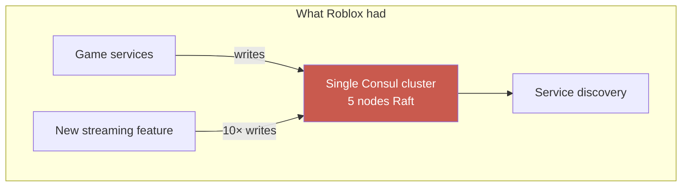
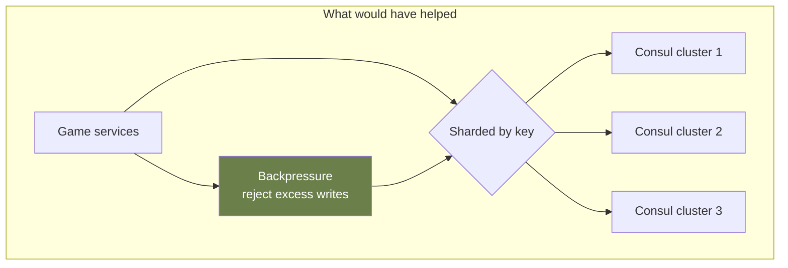

# Case Study: Roblox — 73-Hour Outage

> **Date**: October 28–31, 2021
> **Duration**: 73 hours of full outage
> **Trigger**: Consul cluster degradation
> **Primary modules**: 02 (Distributed Systems), 06 (Reliability Patterns)

## The 30-Second Version

A new streaming feature for in-game chat pushed Consul (Roblox's service discovery, using Raft) beyond its design limits. Consul writes became slow, then queued, then cascaded. The cluster went into a degraded state that took 73 hours of expert intervention (HashiCorp engineers) to recover. **The lesson: consensus systems have capacity ceilings, and the failure mode is not "errors" but "everything slowly stops responding."**

## Timeline (highly compressed)

- **Oct 28, ~17:00 PT** — Symptoms appear. Service discovery queries getting slow.
- **Oct 28–29** — Roblox engineers attempt to recover Consul by removing load, restarting nodes, scaling up. Each attempt seems to help briefly, then degrades again.
- **Oct 30** — HashiCorp engineers (Consul vendor) engaged. Discover Raft transaction queue is at 1M+ pending writes.
- **Oct 31** — Full recovery after careful Consul snapshot restoration with corrected configuration.

## Root Causes

### 1. Streaming feature increased Consul write rate by ~5–10×

Each in-game chat feature update was being written to Consul. Cumulative write rate exceeded what 5-node Raft cluster could commit.

### 2. Raft commit latency cascade

When writes queue up:

- Each Raft round still requires majority ack
- More queue = slower commits = more queue → positive feedback loop
- Cluster never recovers without removing load

### 3. Observability gap

Consul _was_ monitored, but at the wrong granularity. Per-write latency was tracked, but queue depth wasn't alerted. Operators couldn't see the impending cliff.

### 4. No load shedding inside Consul

Consul kept accepting writes when it should have rejected new ones (backpressure). The architectural assumption "Consul will always answer" became false at this scale.

### 5. Recovery procedure not rehearsed

Restoring a Consul cluster from snapshots while preserving data integrity is non-trivial. Roblox had never practiced this at production scale. HashiCorp's expertise was required.

## The Architectural Insight

**Consensus systems have a write-throughput ceiling**, fundamental to the math of "majority ack." Raft, Paxos, Zab — same family. You cannot infinitely scale a single Raft cluster.

Options to handle:

- **Shard the consensus** — multiple Raft groups, each owning a subset
- **Move writes outside** — async writes that don't touch Raft
- **Capacity plan explicitly** — measure peak write rate, leave 50%+ headroom
- **Backpressure** — reject excess load gracefully rather than queueing forever

## Lessons Mapped to Course

- **Module 02**: Raft and Paxos have throughput ceilings. They're not magic.
- **Module 06**: Backpressure is essential at every queueing layer. "It'll buffer" is the failure mode.
- **Module 06**: Recovery procedures must be rehearsed _at scale_, not just in dev environments.

## Discussion Questions

1. What's the write rate of your service discovery / config system? What's its tested ceiling?
2. When a critical infrastructure system gets overloaded, does it reject writes or queue them? Have you verified this?
3. Could you recover your most critical stateful system from a backup in under 4 hours? Have you practiced?
4. What's your "circuit breaker" for _load on your own infrastructure_?

## References

- Roblox post-mortem: https://blog.roblox.com/2022/01/roblox-return-to-service-10-28-10-31-2021/
- HashiCorp's own write-up of the incident
- Aphyr's commentary on Consul failure modes

---

> _"The cluster's failure mode wasn't 'errors.' It was 'increasing latency until everything stops.' That's worse, because operators don't know when to act."_
