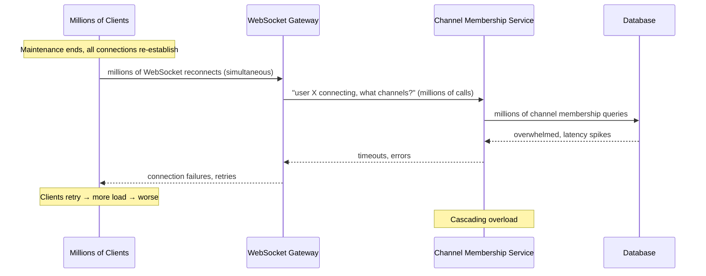

# Case Study: Slack — The Thundering Herd After Maintenance

> **Date**: May 12, 2022 — several hours of degraded service
> **Type**: Self-inflicted thundering herd — planned maintenance triggered unplanned cascading failure
> **Primary modules**: 06 (Reliability Patterns), 07 (Design at Scale)

## The 30-Second Version

Slack performed planned maintenance on its infrastructure. When the maintenance window ended and the infrastructure came back online, millions of Slack clients reconnected simultaneously. The sudden reconnection storm overwhelmed Slack's channel membership service — a dependency that must be consulted every time a client connects. The load spike cascaded into broader degradation that lasted hours.

**The lesson: a planned maintenance window is not the end of your availability risk — it's the beginning. The reconnection storm that follows is often harder to handle than the maintenance itself.**

## The Context

Slack is a real-time messaging platform with millions of concurrent users. When a user's Slack client is connected, it maintains a persistent WebSocket connection to Slack's servers. These connections carry real-time messages, presence updates, and other events.

When Slack takes a maintenance window that causes those WebSocket connections to drop — even briefly — every affected client will attempt to reconnect. In a typical system, reconnection attempts from millions of clients don't arrive uniformly spaced. They arrive simultaneously (or nearly so), because they all lost their connection at the same time and all experience the same "connection closed, reconnect" trigger at the same time.

This is the **thundering herd problem** applied to reconnection.

## The Architecture That Made It Worse

When a Slack client connects, Slack's systems need to determine:
- Which channels is this user a member of?
- What messages have they missed since their last connection?
- What presence state should be broadcast?

The **channel membership service** is a central dependency for the first question. Every connecting client needs to query it. Under normal load (staggered connections, as users open their laptops throughout the morning), this is fine. Under maintenance-window load (every user reconnecting simultaneously), it becomes a bottleneck.



## The Retry Amplification Loop

The initial storm was made worse by client retry behaviour. When a reconnection attempt fails (because the channel membership service is overloaded), the client retries. Without **exponential backoff with jitter**, those retries arrive at the same cadence as the original attempts — sustaining the storm rather than letting the system recover.

```
Without jitter:
  t=0: 1M clients try to connect
  t=5: connection fails for 800K, they retry
  t=10: 800K retry simultaneously again
  → sustained overload wave

With exponential backoff + jitter:
  t=0: 1M clients try
  t=5 ± random(0,5): distributed retries
  t=~10 ± random: smaller, dispersed retry wave
  → load naturally smooths out
```

The retry amplification loop is what turned a spike into a sustained degradation.

## Why This Happens to Well-Engineered Systems

Slack is not a poorly engineered system. The thundering herd after maintenance is a failure mode that is:

1. **Rare in normal operation**: connections stagger naturally when users open apps throughout the morning
2. **Invisible in normal load testing**: you don't typically load test "all users reconnect simultaneously"
3. **Triggered by your own operations**: the failure isn't caused by user behaviour or external attack — it's caused by the act of performing maintenance

The tragedy is that the operations team did exactly what they were supposed to do (planned maintenance, clean execution), and the failure happened anyway — because the reconnection profile is qualitatively different from normal load.

## What Slack Changed

Based on Slack's published post-mortem and engineering blog posts:

1. **Gradual reconnection**: when maintenance ends, the system throttles how quickly it allows clients to reconnect — rather than accepting all connections immediately, it queues them and drains at a controlled rate.

2. **Exponential backoff with jitter in clients**: Slack clients were updated to use full jitter on reconnection delays, spreading the retry load across a wider time window.

3. **Channel membership service hardening**: the channel membership service got additional caching and the ability to serve stale data under load, rather than failing hard when the DB was slow.

4. **Maintenance window tooling**: the tooling that manages maintenance windows was updated to include reconnection rate controls — the system knows "a maintenance window just ended, expect a reconnection storm, throttle."

## The Pattern: Thundering Herd

The thundering herd is a classic distributed systems failure mode. It appears in many forms:

| Trigger | Population | Target |
|---|---|---|
| Cache expiry | All requests for that key | Database |
| Maintenance window end | All connected clients | Reconnection handler |
| Service restart | All upstream callers with circuit breaker open | Service just restarted |
| Cron job trigger (e.g., 00:00 daily) | All scheduled workers | Database / downstream service |

In every case, the problem is **a synchronised population hitting a shared resource simultaneously**. The solution is always some form of **jitter or throttling** to de-synchronise the population.

## Lessons for Your Designs

**1. Model the reconnection storm as a design scenario, not an edge case.**

When you design a system with persistent connections (WebSocket, gRPC streams, long polling), explicitly ask: what happens when 100% of connections drop and reconnect simultaneously? Is your system sized for that? If not, how do you throttle the reconnection rate?

**2. Exponential backoff with jitter is mandatory, not optional.**

"Retry with backoff" without jitter still produces synchronized waves at each retry interval. Full jitter (delay = random(0, base × 2^attempt)) is the standard. AWS's blog post "Exponential Backoff and Jitter" (2015) is the canonical reference.

**3. Maintenance windows create synthetic load spikes.**

When planning maintenance that requires connection draining, include a reconnection phase in your capacity model. The reconnection load may be 10-50× your steady-state connection establishment rate. Can your systems handle it?

**4. Shared bottlenecks under fan-in load are the highest failure risk.**

In Slack's case, the channel membership service was a shared bottleneck under fan-in from the WebSocket gateways. In your design reviews: what is the shared service that every connecting client must consult? Is it sized for a maintenance-window reconnection storm?

**5. Circuit breakers can make thundering herds worse.**

If a service has circuit breakers, they may open during the storm — which means when the service recovers, all callers that had open circuit breakers will attempt to close them simultaneously, creating another wave. Design circuit breaker recovery to use half-open probing, not simultaneous retry.

## What This Changes in Your Thinking

- **Add "maintenance window reconnection" to your failure mode analysis.** Ask: if all clients disconnect simultaneously, what breaks first?
- **Client retry logic is not a detail** — it's part of the system's capacity model. Uncontrolled retry multiplies load; jittered retry smooths it.
- **Caching in the connection path is reliability engineering**, not a performance optimisation. The channel membership service serving stale data under load is better than serving nothing.
- **Gradual drain and gradual restore** should be first-class operations in your deployment tooling. Not "stop → restart" but "stop → drain → wait → restore → ramp."
